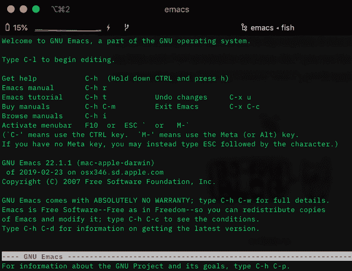
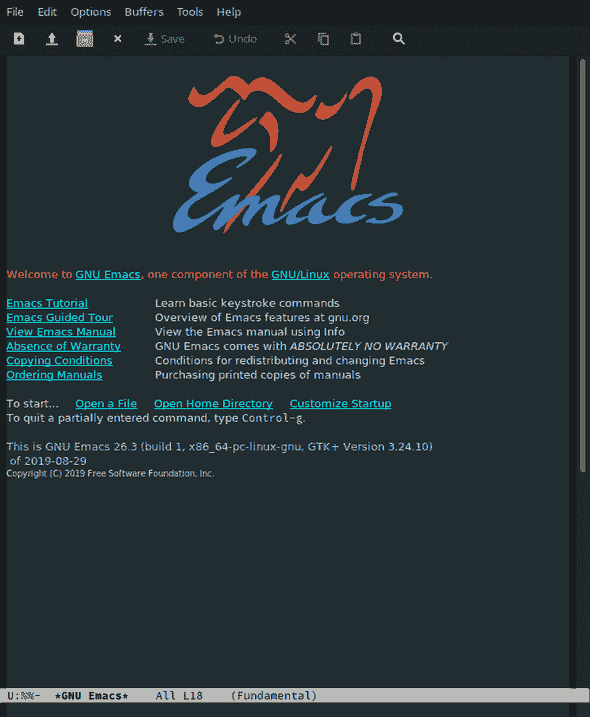
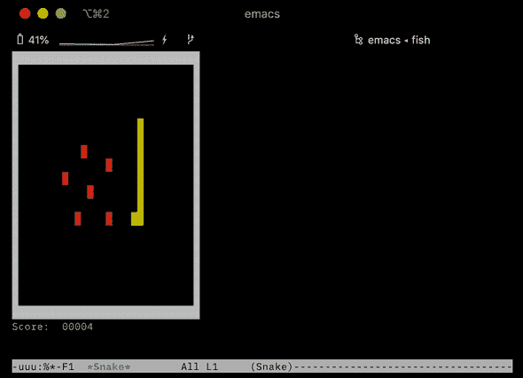
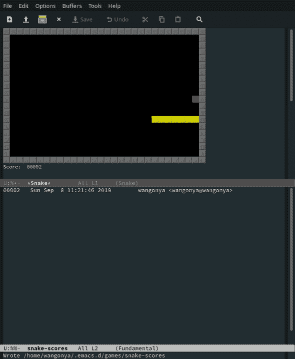

# 使用 emacs 在您的终端上玩游戏

> 原文：<https://dev.to/wangonya/play-games-on-your-terminal-using-emacs-4051>

如果你以前从未打开过 emacs，这是第一次尝试的好机会(像我一样😅).原来，emacs 内置了一些非常不错的老式[游戏](https://www.emacswiki.org/emacs/CategoryGames)。

<small>注意:我假设你使用的是*NIX 系统</small>

要播放，在终端上启动 emacs:

```
$ emacs 
```

Enter fullscreen mode Exit fullscreen mode

我以为我必须在我的 Mac 上安装 emacs，但我的 Linux (Manjaro i3 18.0.4)上已经有了，但令我惊讶的是，它已经在我的 Mac 上了，我必须在 Linux 上安装。因此，如果您运行该命令并看到类似于`Unknow command emacs`的内容，您将需要首先安装它。

如果该命令成功运行，您应该会看到类似下面的屏幕截图。

<figure>[](///static/73f4b9c7236e40fe6fa36d6b3f1b84ec/9288f/emacs.png)

<figcaption>emacs</figcaption>

</figure>

Linux 决定安装一个 GUI🤷🏽‍♂️

<figure>[T3】

<figcaption>emacs GUI</figcaption>](///static/3614c7828d780ef6fd599ce6306f86a2/8d69c/emacs-gtk.png) </figure>

按下 **`escape`** ，然后按下 **`x`** 键，屏幕下方应出现`M-x`。

接下来，输入你想玩的游戏的名字。您可以从[列表中选择](https://www.emacswiki.org/emacs/CategoryGames#toc1)。我喜欢蛇，所以这就是我要输入的。

<figure>[](///static/25c9858ae310f5bd31714f1c4c77515f/df67e/emacs-snake.png) 

<figcaption>在 emacs 上打蛇</figcaption>

</figure>

[](///static/dd0eb3e2d0c1836f5a2f71699a0e6d5d/8d69c/emacs-snake2.png)

按`Ctrl-x Ctrl-c`可以退出 emacs。