# 用于整理、美化您的终端的设置(iTerm2 和 ZSH)

> 原文:[https://dev . to/stefanjudis/settings-to-de clutter-emojify-and-pretify-your-terminal-iterm 2-zsh-f39](https://dev.to/stefanjudis/settings-to-declutter-emojify-and-prettify-your-terminal-iterm2-zsh-f39)

我在 [iTerm2](https://www.iterm2.com/) 和 [Hyper](https://hyper.is/) 之间来回跳了好一阵子。Hyper 很漂亮，JavaScript 可扩展，提供了一个非常简洁的外观。

不幸的是，对我来说，它总是比 iTerm 慢几毫秒，反应也慢一些。这一微小的差异导致我回到 iTerm2，尽管我发现超视觉更有吸引力。

随着 iTerm2 的 [v3.3 的发布(我最近才注意到这个版本混淆了`v2`的`v3`🙈)一个极简紧凑的主题进入了舞台。这促使我美化我的 item 2/ZSH 终端。](https://iterm2.com/downloads/stable/iTerm2-3_3_0.changelog)

今天，我对我的设置非常满意，人们要求我分享我的设置——所以我们来了！

[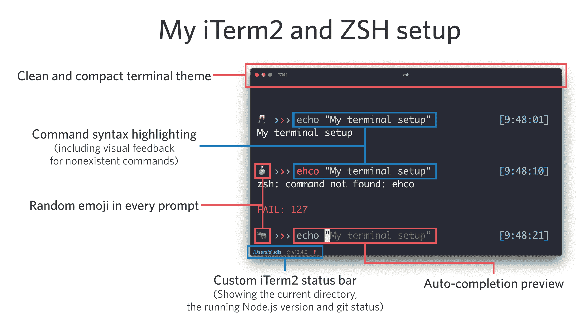T2】](//images.ctfassets.net/f20lfrunubsq/3XCiYkrF2G1IrJlXDtorVv/c2d55431882415c75032d91348c0c12c/Screenshot_2019-09-10_at_14.50.25.png)

**在我们开始之前:我使用最新的 iTerm2、`zsh`和 [oh-my-zsh](https://github.com/robbyrussell/oh-my-zsh) 。大多数但不是所有描述的东西都可以在不同的环境中工作。**

## [](#new-iterm2-themes-raw-compact-endraw-and-raw-minimal-endraw-)新 iTerm2 主题—`Compact`和`Minimal`

你可以在`Settings > Appearance`下找到新的主题选择。

[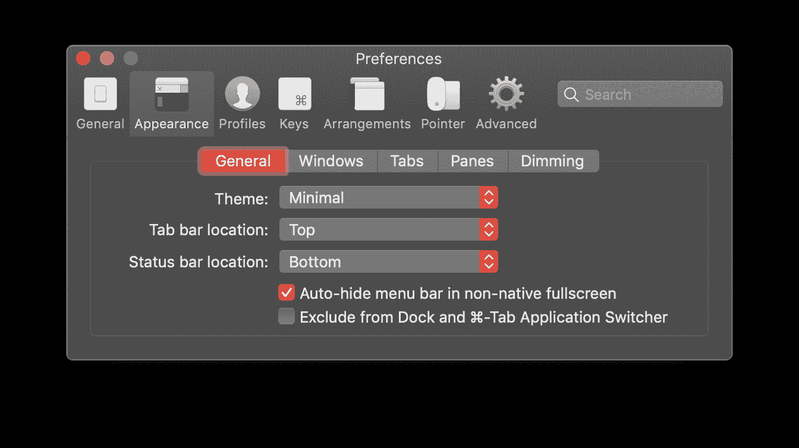T2】](//images.ctfassets.net/f20lfrunubsq/7MiCeibgMcEBcxwPwVPP88/b298cdc339017777ee3e48cd02ef856a/Screenshot_2019-09-08_at_10.38.18.png)

顶部和底部栏的主题不同。👇

[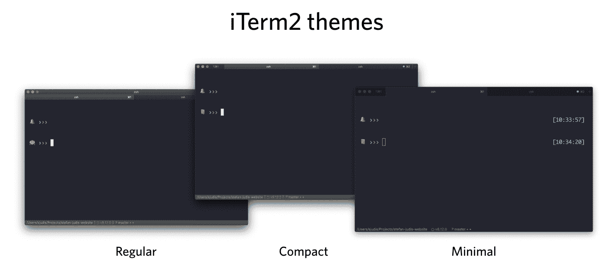T2】](//images.ctfassets.net/f20lfrunubsq/75RfSBWqv3u2svhJURc8ue/d7ff59db53c99cc3a9db49b81a073475/Screenshot_2019-09-08_at_10.39.51.png)

如果您仔细观察，您可能会注意到您还可以配置状态栏的位置，这将在该对话框中出现。我更喜欢在终端底部。

## [](#the-new-custom-iterm2-status-bar)新建自定义 iTerm2 状态栏

您可以在`Profiles > Session`下设置状态栏内的元素，并在底部找到一个“配置状态栏”按钮。

[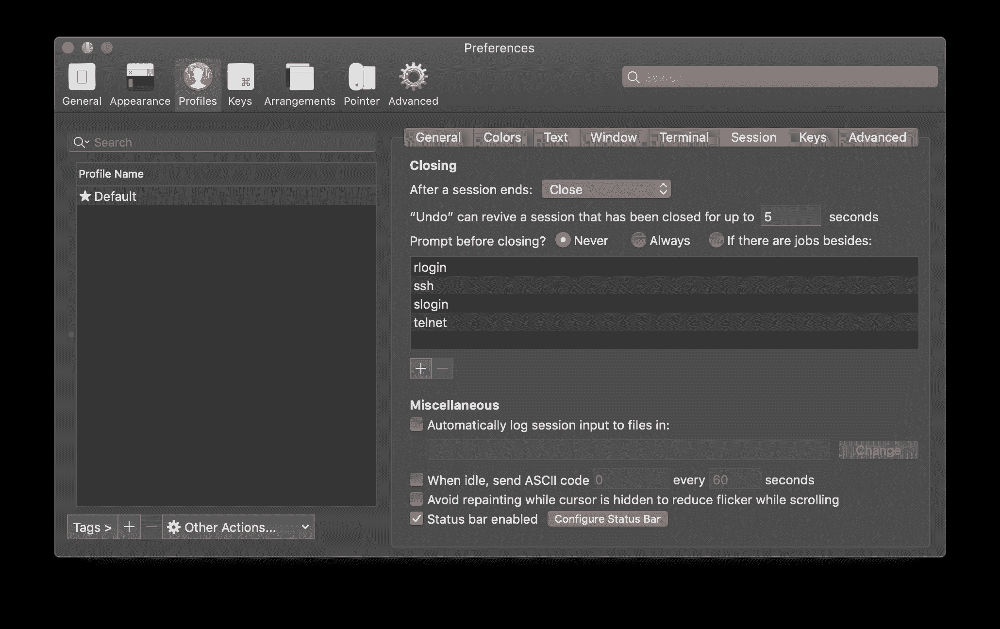T2】](//images.ctfassets.net/f20lfrunubsq/20wW8mLKysby2mbaR6XURI/287b0fb082b254dc92c51cd2c82d29c6/Screenshot_2019-09-08_at_11.58.06.png)

新的状态栏提供了一堆元素来显示电池状态、git 状态和其他有用的东西。

[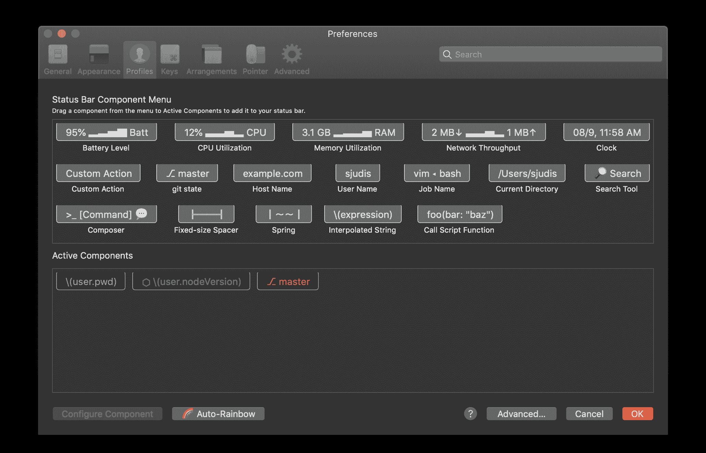T2】](//images.ctfassets.net/f20lfrunubsq/1G6OWqlY6OnWhtRTcSxYYz/4d32b1f3c099bc5a896bcc3df21a2f04/Screenshot_2019-09-08_at_11.58.12.png)

不幸的是，还没有显示当前 Node.js 版本的元素。此外，当您使用`Prefer tight packing to stable positioning`时，`Current Directory`元素会缩短文件路径(它会将所有项目移动到左边)，这可以在高级设置下找到。

要解决这些问题，您可以使用`Interpolated String`元素，它使您能够在状态栏中显示您想要的任何内容。

### [](#custom-variables-in-the-status-bar)自定义状态栏中的变量

要设置自定义 iTerm 可访问变量，请看[本教程](https://www.nicksays.co.uk/iterm-tool-versions-status-bar/)。您必须启用[外壳集成](https://www.iterm2.com/documentation-shell-integration.html)并定义一个`iterm2_print_user_vars`函数。

```
# .zshrc
test -e "${HOME}/.iterm2_shell_integration.zsh" && source "${HOME}/.iterm2_shell_integration.zsh"

iterm2_print_user_vars() {
  # extend this to add whatever
  # you want to have printed out in the status bar
  iterm2_set_user_var nodeVersion $(node -v)
  iterm2_set_user_var pwd $(pwd)
} 
```

<svg width="20px" height="20px" viewBox="0 0 24 24" class="highlight-action crayons-icon highlight-action--fullscreen-on"><title>Enter fullscreen mode</title></svg> <svg width="20px" height="20px" viewBox="0 0 24 24" class="highlight-action crayons-icon highlight-action--fullscreen-off"><title>Exit fullscreen mode</title></svg>

对我来说，这些都是在[我的。zshrc](https://github.com/stefanjudis/.dotfiles/blob/master/.zshrc#L29-L36) 。你可以在上面看到我定义了`pwd`和`nodeVersion`，它们可以在`user`下的`Interpolated String`元素中找到。

[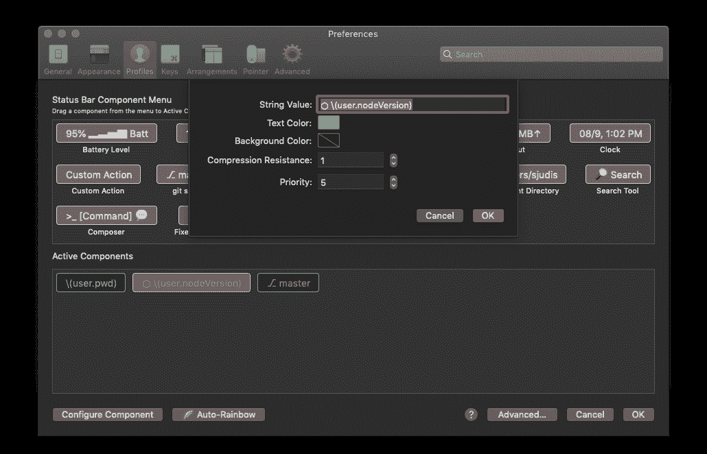T2】](//images.ctfassets.net/f20lfrunubsq/26qQZzeQiydDQLZD6i7Wd0/67ac981b4f8434bec9561f2738e0dd1f/Screenshot_2019-09-08_at_13.05.03.png)

## [](#other-iterm2-settings)其他 iTerm2 设置

这些是我的主要 iTerm 设置。让我分享一些其他的小事情...

### [](#the-color-theme)颜色主题

我使用辛德雷·索胡斯时髦的颜色主题。

[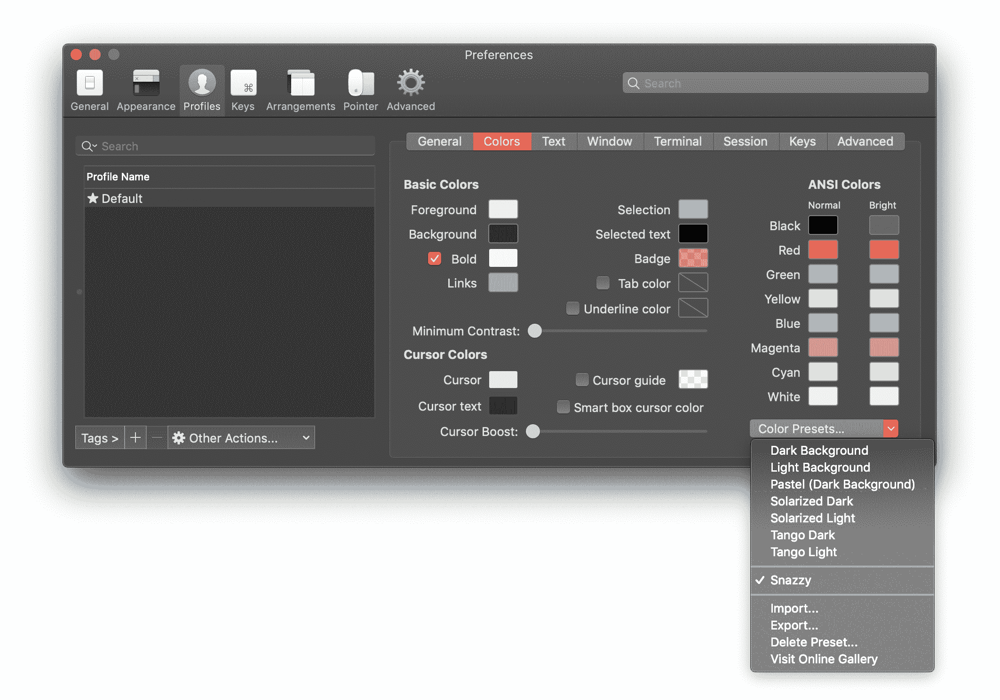T2】](//images.ctfassets.net/f20lfrunubsq/3REHCU7Wk6XDyxar4Ftgz2/1b1619bfe2002f0b5fed7c681802f8a2/Screenshot_2019-09-08_at_12.05.15.png)

### [](#more-space-inside-of-the-terminal-window)终端窗口内的更多空间

我喜欢在我的终端中有一点填充，你可以在搜索`margin`时在高级 iTerm 设置中定义。

[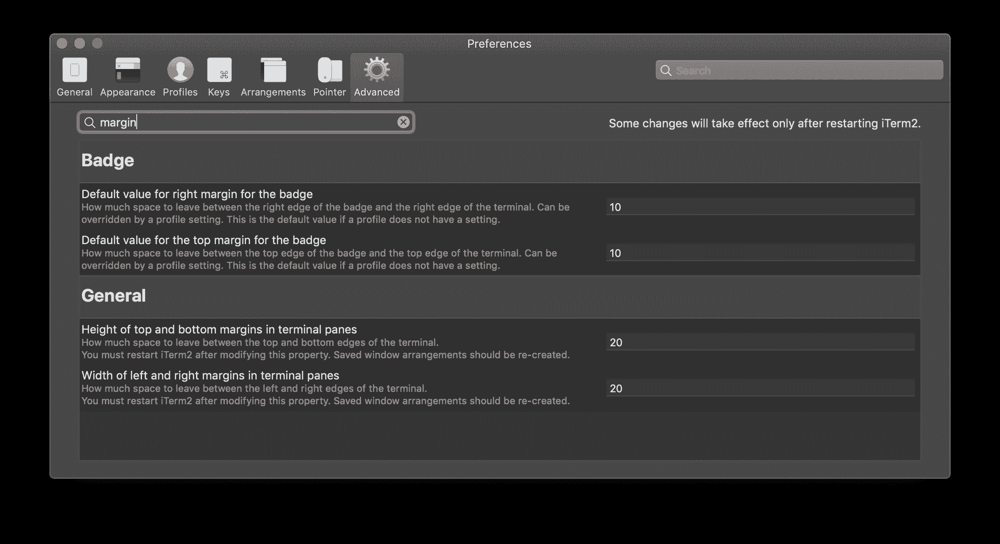T2】](//images.ctfassets.net/f20lfrunubsq/4XT5dywVf7h9Z0sO4A2mYq/18b7c201570a02570c235b26e011d565/Screenshot_2019-09-08_at_12.06.08.png)

## [](#command-syntax-highlighting-and-autocompletion-preview)命令语法高亮显示和自动完成预览

当我使用`oh-my-zsh`时，命令高亮和建议都是现成的。`oh-my-zsh`提供了一堆有用的插件。

这些是我用的:

```
# .zshrc
plugins=(git node npm github zsh-syntax-highlighting zsh-autosuggestions git-open) 
```

<svg width="20px" height="20px" viewBox="0 0 24 24" class="highlight-action crayons-icon highlight-action--fullscreen-on"><title>Enter fullscreen mode</title></svg> <svg width="20px" height="20px" viewBox="0 0 24 24" class="highlight-action crayons-icon highlight-action--fullscreen-off"><title>Exit fullscreen mode</title></svg>

[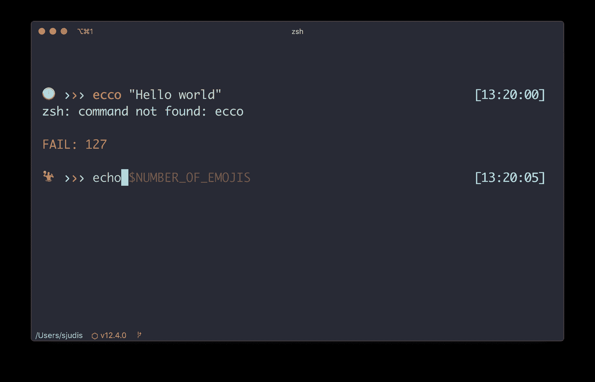T2】](//images.ctfassets.net/f20lfrunubsq/5HtNyftB4TD6bOHzGiiXJG/5b39f78cb29f37425dfb1cb7b9899a38/Screenshot_2019-09-08_at_13.20.11.png)

`zsh-syntax-highlighting`和`zsh-autosuggestions`是内嵌突出显示当前命令的插件，也显示命令历史中的建议。看看[的外挂清单](https://github.com/robbyrussell/oh-my-zsh/wiki/Plugins)；那里有更多好东西。

## [](#my-custom-theme)我的自定义主题

除了表情符号，这个主题没有太多花哨的东西。我抄袭了 Mathias Buus 的想法，他在几年前的一次演讲中展示了他的终端，他非常友好地给了我一个初步的实现。

总的来说，这是一个表情符号的集合，可以在终端提示中随机访问。如果你过去遇到了表情符号的问题...iTerm 不会以相同的宽度呈现所有可用的表情符号。 **是的，我一个一个的检查过，没有一个跳转终端提示。**

这导致了 665 个不同的表情符号出现在我的终端提示中。

```
# stefan-judis.theme
PS1_EMOJIS=("😀" "😃" "😄" "😁" "😆" "😅" "🤣" ...)
NUMBER_OF_EMOJIS=${#PS1_EMOJIS[@]}
THEME_DELIMITER="%{$fg_bold[blue]%}›%{$reset_color%}%{$fg_bold[red]%}›%{$reset_color%}%{$fg_bold[green]%}›%{$reset_color%}"

PROMPT='
%(?, ,%{$fg[red]%}FAIL: $?
%{$reset_color%})
${PS1_EMOJIS[$RANDOM % $NUMBER_OF_EMOJIS]}  $THEME_DELIMITER '

RPROMPT='%{$fg_bold[blue]%}[%*]%{$reset_color%}' 
```

<svg width="20px" height="20px" viewBox="0 0 24 24" class="highlight-action crayons-icon highlight-action--fullscreen-on"><title>Enter fullscreen mode</title></svg> <svg width="20px" height="20px" viewBox="0 0 24 24" class="highlight-action crayons-icon highlight-action--fullscreen-off"><title>Exit fullscreen mode</title></svg>

您可以使用`THEME_DELIMITER`变量更改分隔符。目前，它是三个彩色箭头。

因为我使用的是`oh-my-zsh`，主题还包括提供的颜色处理(例如`$fg_bold`)和功能，比如用`%*`显示当前时间。

我用`PROMPT`来显示表情符号，用`RPROMPT`在右侧显示当前时间。

[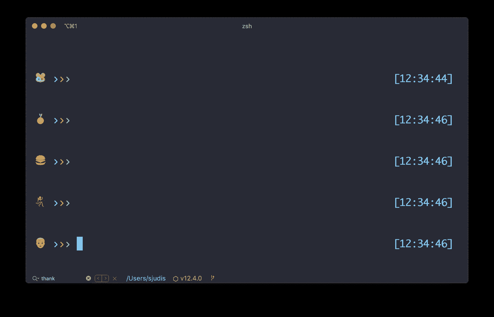T2】](//images.ctfassets.net/f20lfrunubsq/6fMau8l1qday7zUNbOdaP7/9b2b111639733b44620d69c7c177e802/Screenshot_2019-09-08_at_12.34.48.png)

表情符号部分应该在任何 shell 环境下都能正常工作。如果你想看看 GitHub 上的主题，[我们开始吧](https://github.com/stefanjudis/.dotfiles/blob/master/stefanjudis.zsh-theme)。

如果你在复制主题后在你的终端里有奇怪的蓝色三角形，看看这个 GitHub 的问题。

## [](#commands-i-use-daily-and-people-usually-ask-about)我日常使用的和人们通常询问的命令

### [](#a-colorful-list-command)一个彩色列表命令

为了查看目录中的文件，我使用了 [exa](https://github.com/ogham/exa) ，这使得输出更加漂亮，并且比默认的`ls`有更多的设置。我给它起了个别名`ll`。

[T2】](//images.ctfassets.net/f20lfrunubsq/7HrmpwNZbEYcxgNAOAHFa4/a7468ff6e7ca21e2a5fdf72dbacb0b39/Screenshot_2019-09-08_at_12.06.48.png)

### [](#navigate-from-anywhere-to-anywhere)从任何地方导航到任何地方

我很少用完整的路径导航某个地方。虽然许多工具可以让你快速到达某个地方，但我坚持使用[自动跳转](https://github.com/wting/autojump)，它是`j`的别名。

```
# navigate to /Users/stefan/projects/.dotfiles
# using autojump from anywhere
$ j dotfile 
```

<svg width="20px" height="20px" viewBox="0 0 24 24" class="highlight-action crayons-icon highlight-action--fullscreen-on"><title>Enter fullscreen mode</title></svg> <svg width="20px" height="20px" viewBox="0 0 24 24" class="highlight-action crayons-icon highlight-action--fullscreen-off"><title>Exit fullscreen mode</title></svg>

### [](#a-quicker-raw-clone-endraw-)快一点的`clone`

当我从 GitHub 克隆存储库时，我使用定制的`clone`函数。它自动克隆一个存储库，导航到其中，如果有可用的`package.json`，就执行`npm install`。

```
# Usage:
# $ clone git@github.com:random-mdn/random-mdn-serverless.git
clone() {
  git clone $1
  cd $(basename ${1%.*})
  if test -f "./package.json"; then
    echo "..."
    echo "Found package.json... installing dependencies"
    echo "..."
    npm install
  fi
} 
```

<svg width="20px" height="20px" viewBox="0 0 24 24" class="highlight-action crayons-icon highlight-action--fullscreen-on"><title>Enter fullscreen mode</title></svg> <svg width="20px" height="20px" viewBox="0 0 24 24" class="highlight-action crayons-icon highlight-action--fullscreen-off"><title>Exit fullscreen mode</title></svg>

### [](#a-better-raw-cat-endraw-)更好的`cat`

通常可用的`cat`命令被别名为[蝙蝠](https://github.com/sharkdp/bat)，它是“一只长着翅膀的克隆猫”，它是如此的好。它自动突出显示语法并显示 git 修改。我喜欢！

[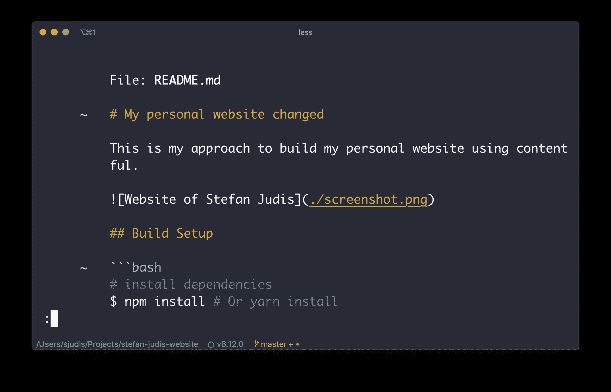T2】](//images.ctfassets.net/f20lfrunubsq/7DCKnxJM6G6i9fM8DWvRH6/b6f50ff4297cef89de98329fb0c284fb/Screenshot_2019-09-08_at_13.14.14.png)

* * *

就是这样，朋友们！

请随意在[我的点文件](https://github.com/stefanjudis/.dotfiles)中窥探更多信息。该存储库不包括正确的自述文件，但通常在命令和定义旁边有注释。

祝你有美好的一天！