# HowTo:我的终端& Shell 设置- Hyper.js + ZSH +星际飞船☄🔥

> 原文:[https://dev . to/netguru/how to-my-terminal-shell-setup-hyper-js-zsh-starship-2j2k](https://dev.to/netguru/howto-my-terminal-shell-setup-hyper-js-zsh-starship-2j2k)

**【2020-07-07 修订】**

很可能，开发者在得到一台新电脑后做的第一件事就是…终端设置。我想和你分享我目前的开发设置——这里是终端设置。

空谈是廉价的，让我们展示一些代码。

## [](#1-terminal-hyperjs)1。终端- Hyper.js

### [](#11-download-and-install-hyper)1.1 下载安装 Hyper。

让我们转到[Hyper](https://hyper.is/#installation)页面，为您的操作系统下载一个版本。

我下载了一个 Mac OS 版本。当我们提取 zip 文件`Hyper-3.0.2-mac.zip`时，我们得到一个`Hyper.app`文件。要安装它，只要把它拖到`Applications`文件夹。现在，通过使用*聚光灯搜索* ( `CMD` + `SPACE`)键入`hyper`，列表上应该有一个超级应用程序。

在我的例子中，Hyper 的窗口是这样的:

[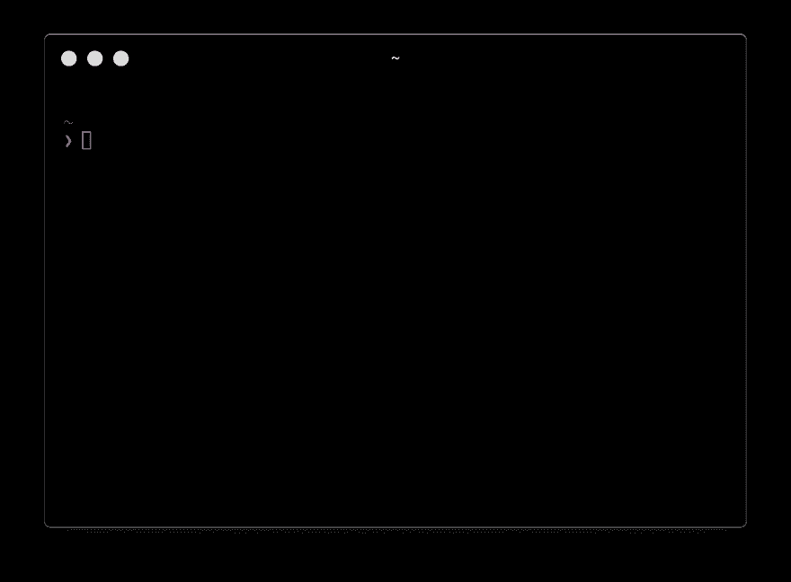T2】](https://res.cloudinary.com/practicaldev/image/fetch/s--GDP_2oOW--/c_limit%2Cf_auto%2Cfl_progressive%2Cq_auto%2Cw_880/https://tjay.dev/conteimg/2019/09/image-5.png)

如果您的提示看起来不一样，请不要担心。我们稍后会处理它。您可能在开始时使用不同的 shell 和配置。

### [](#12-basic-configuration)1.2 基本配置

现在，奇迹发生了。Hyper 的配置被定义为`~/.hyper.js`文件。文件的结构如下:

```
// Future versions of Hyper may add additional config options,
// which will not automatically be merged into this file.
// See https://hyper.is#cfg for all currently supported options.

module.exports = {
  config: {
    // choose either `'stable'` for receiving highly polished,
    // or `'canary'` for less polished but more frequent updates
    updateChannel: 'stable',

    // default font size in pixels for all tabs
    fontSize: 12,

    // font family with optional fallbacks
    fontFamily: 'Menlo, "DejaVu Sans Mono", Consolas, "Lucida Console", monospace',

    // default font weight: 'normal' or 'bold'
    fontWeight: 'normal',

    // rest of the config
  }
  // rest of the file
} 
```

<svg width="20px" height="20px" viewBox="0 0 24 24" class="highlight-action crayons-icon highlight-action--fullscreen-on"><title>Enter fullscreen mode</title></svg> <svg width="20px" height="20px" viewBox="0 0 24 24" class="highlight-action crayons-icon highlight-action--fullscreen-off"><title>Exit fullscreen mode</title></svg>

这是令人敬畏的信息！我们可以完全控制我们的设置。

让我们从基本配置开始。

#### [](#121-font)1.2.1 字体

*   `fontSize` -个人比较喜欢大一点的字体，还是用 13 吧。稍后，您可以使用`CMD` + `+`和`CMD` + `-`键盘快捷键在终端中更改字体大小。
*   `fontFamily` -让我们用一种非常好的字体来连字- [FiraCode](https://github.com/tonsky/FiraCode) 。我在下面附上一个概述:

[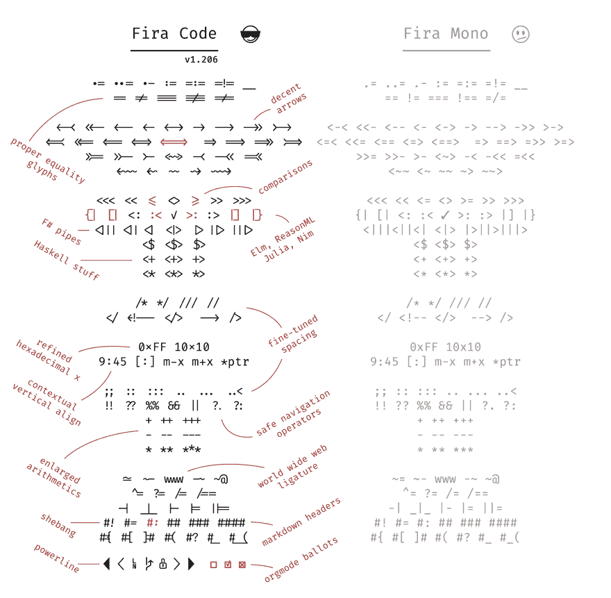T2】](https://res.cloudinary.com/practicaldev/image/fetch/s--hKHOBOh0--/c_limit%2Cf_auto%2Cfl_progressive%2Cq_auto%2Cw_880/https://tjay.dev/conteimg/2019/09/image-6.png)

此处描述了[的安装说明。我更喜欢手动方式(对于 Mac OS):](https://github.com/tonsky/FiraCode/wiki#installing-font)

*   从 Github `releases`标签下载字体最新版本:[发布 tonsky/Fira Code Github](https://github.com/tonsky/FiraCode/releases)——目前来看是 [Fira_Code_v5.2.zip](https://github.com/tonsky/FiraCode/releases/download/5.2/Fira_Code_v5.2.zip) 。
*   解压存档文件并转到`ttf`目录。
*   选择所有字体`.ttf`文件，点击右键，然后点击`Open`并选择`Install Font`

现在，当我们的字体安装好了，让我们在超级终端中设置它。配置文件应该放在主目录中:

```
nano ~/.hyper.js 
```

<svg width="20px" height="20px" viewBox="0 0 24 24" class="highlight-action crayons-icon highlight-action--fullscreen-on"><title>Enter fullscreen mode</title></svg> <svg width="20px" height="20px" viewBox="0 0 24 24" class="highlight-action crayons-icon highlight-action--fullscreen-off"><title>Exit fullscreen mode</title></svg>

```
module.exports = {
  config: {
      fontSize: 13,
    fontFamily: '"Fira Code", Menlo, "DejaVu Sans Mono", Consolas, "Lucida Console", monospace',
      // rest of the config
  }
  // rest of the file
} 
```

<svg width="20px" height="20px" viewBox="0 0 24 24" class="highlight-action crayons-icon highlight-action--fullscreen-on"><title>Enter fullscreen mode</title></svg> <svg width="20px" height="20px" viewBox="0 0 24 24" class="highlight-action crayons-icon highlight-action--fullscreen-off"><title>Exit fullscreen mode</title></svg>

此时，我们在终端中启用了`Fira Code`字体，但是连字仍然没有启用。让我们打开它们。

我们需要安装一个专用插件:`hyper-font-ligatures`:

```
hyper i hyper-font-ligatures 
```

<svg width="20px" height="20px" viewBox="0 0 24 24" class="highlight-action crayons-icon highlight-action--fullscreen-on"><title>Enter fullscreen mode</title></svg> <svg width="20px" height="20px" viewBox="0 0 24 24" class="highlight-action crayons-icon highlight-action--fullscreen-off"><title>Exit fullscreen mode</title></svg>

插件应该立即出现在我们的配置文件中:

```
module.exports = {
  // rest of the file
  plugins: ["hyper-font-ligatures"], 
```

<svg width="20px" height="20px" viewBox="0 0 24 24" class="highlight-action crayons-icon highlight-action--fullscreen-on"><title>Enter fullscreen mode</title></svg> <svg width="20px" height="20px" viewBox="0 0 24 24" class="highlight-action crayons-icon highlight-action--fullscreen-off"><title>Exit fullscreen mode</title></svg>

要启用连字，我们需要在配置中再添加一行(参见[第 8 期](https://github.com/tolbertam/hyper-font-ligatures/issues/8)和 [zeit/hyper#3607](https://github.com/zeit/hyper/issues/3607) 了解更多详情):

```
module.exports = {
  config: {
    // rest of the config
    webGLRenderer: false,
  }
  // rest of the file
} 
```

<svg width="20px" height="20px" viewBox="0 0 24 24" class="highlight-action crayons-icon highlight-action--fullscreen-on"><title>Enter fullscreen mode</title></svg> <svg width="20px" height="20px" viewBox="0 0 24 24" class="highlight-action crayons-icon highlight-action--fullscreen-off"><title>Exit fullscreen mode</title></svg>

现在，一切都应该像预期的那样工作，我们应该在终端中看到带有连字的新字体:

[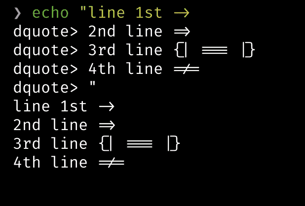T2】](https://res.cloudinary.com/practicaldev/image/fetch/s--HHQQYIQ_--/c_limit%2Cf_auto%2Cfl_progressive%2Cq_auto%2Cw_880/https://tjay.dev/conteimg/2019/09/image-7.png)

#### [](#122-theme)1.2.2 主题

有了 Hyper，我们可以在这里下载多个主题: [Hyper Store - Plugins](https://hyper.is/themes?newest) 。我将使用[超级商店-超级黑暗](https://hyper.is/plugins/hyper-one-dark)主题。要安装它，只需运行:

```
hyper i hyper-one-dark 
```

<svg width="20px" height="20px" viewBox="0 0 24 24" class="highlight-action crayons-icon highlight-action--fullscreen-on"><title>Enter fullscreen mode</title></svg> <svg width="20px" height="20px" viewBox="0 0 24 24" class="highlight-action crayons-icon highlight-action--fullscreen-off"><title>Exit fullscreen mode</title></svg>

对于我当前的 shell，它看起来像这样:

[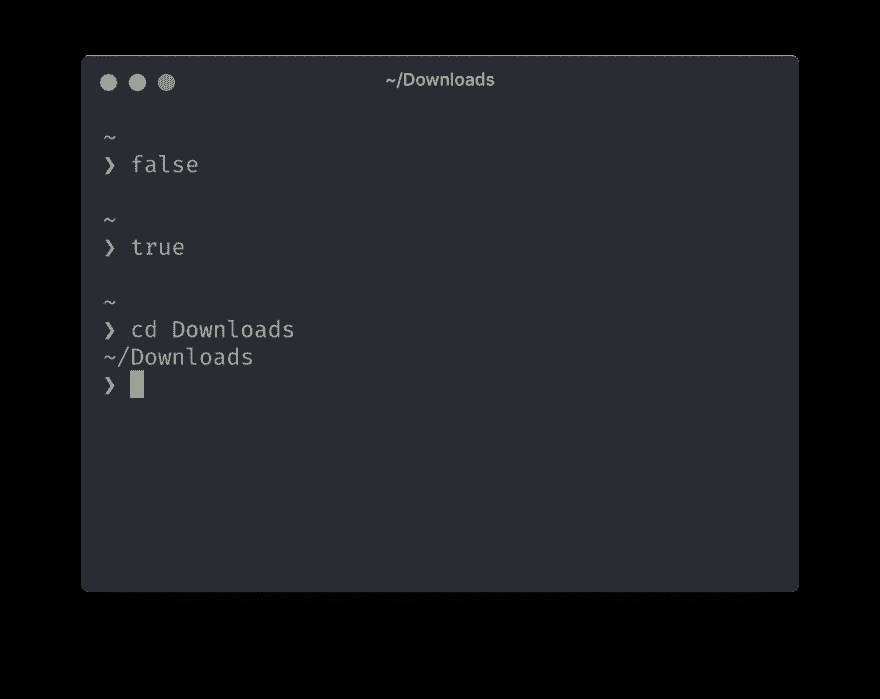T2】](https://res.cloudinary.com/practicaldev/image/fetch/s--lFdZ0_7r--/c_limit%2Cf_auto%2Cfl_progressive%2Cq_auto%2Cw_880/https://tjay.dev/conteimg/2019/09/image-8.png)

#### [](#123-search-plugin)1.2.3 搜索插件

为了能够在终端中搜索关键词，我们需要安装一个专用插件:[超级商店-超级搜索](https://hyper.is/plugins/hyper-search)

```
hyper i hyper-search 
```

<svg width="20px" height="20px" viewBox="0 0 24 24" class="highlight-action crayons-icon highlight-action--fullscreen-on"><title>Enter fullscreen mode</title></svg> <svg width="20px" height="20px" viewBox="0 0 24 24" class="highlight-action crayons-icon highlight-action--fullscreen-off"><title>Exit fullscreen mode</title></svg>

这一次，我们需要重新启动超级完全。重启后，我们可以开始使用我们的插件:

[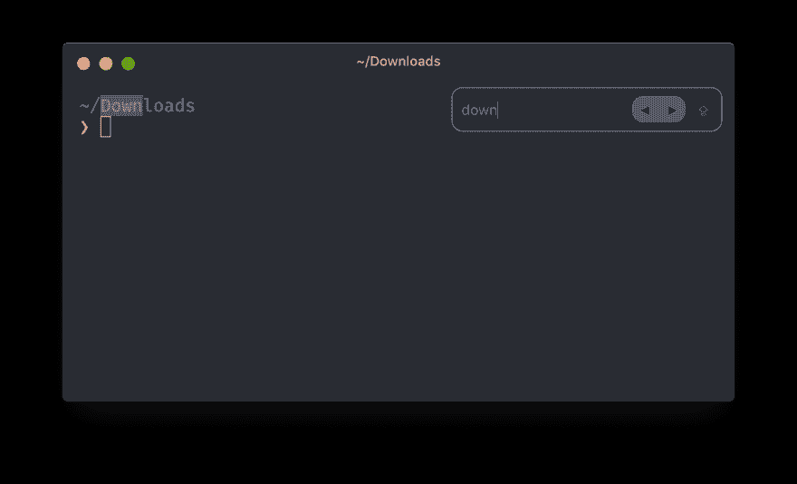T2】](https://res.cloudinary.com/practicaldev/image/fetch/s--ZiU-XuaS--/c_limit%2Cf_auto%2Cfl_progressive%2Cq_auto%2Cw_880/https://tjay.dev/conteimg/2019/09/image-9.png)

#### [](#124-pane-navigation-plugin)1.2.4 窗格导航插件

如果我们想在终端的窗格间跳转，我们需要添加[超级商店-超级窗格](https://hyper.is/plugins/hyper-pane)插件:

```
hyper i hyper-pane 
```

<svg width="20px" height="20px" viewBox="0 0 24 24" class="highlight-action crayons-icon highlight-action--fullscreen-on"><title>Enter fullscreen mode</title></svg> <svg width="20px" height="20px" viewBox="0 0 24 24" class="highlight-action crayons-icon highlight-action--fullscreen-off"><title>Exit fullscreen mode</title></svg>

它是如何工作的？

[T2】](https://res.cloudinary.com/practicaldev/image/fetch/s--eQNgsyYe--/c_limit%2Cf_auto%2Cfl_progressive%2Cq_66%2Cw_880/https://thepracticaldev.s3.amazonaws.com/i/56z06zuoym8pn4l52cz3.gif)

#### [](#125-open-new-tabs-with-the-same-directory)1.2.5 打开同一目录下的新标签页

当打开新标签页时，我经常希望在同一个目录中。为了能够做到这一点，让我们添加 [Hyper Store - hypercwd](https://hyper.is/plugins/hypercwd) :

```
hyper i hypercwd 
```

<svg width="20px" height="20px" viewBox="0 0 24 24" class="highlight-action crayons-icon highlight-action--fullscreen-on"><title>Enter fullscreen mode</title></svg> <svg width="20px" height="20px" viewBox="0 0 24 24" class="highlight-action crayons-icon highlight-action--fullscreen-off"><title>Exit fullscreen mode</title></svg>

#### [](#126-mark-active-tab-by-adding-a-symbol-to-it)1.2.6 通过添加符号来标记活动标签

有时，当我们打开多个标签页时，可能很难注意到哪一个是活动的。让我们的生活更简单，添加[超级商店-超级活跃-标签](https://hyper.is/plugins/hyper-active-tab):

```
hyper i hyper-active-tab 
```

<svg width="20px" height="20px" viewBox="0 0 24 24" class="highlight-action crayons-icon highlight-action--fullscreen-on"><title>Enter fullscreen mode</title></svg> <svg width="20px" height="20px" viewBox="0 0 24 24" class="highlight-action crayons-icon highlight-action--fullscreen-off"><title>Exit fullscreen mode</title></svg>

我将使用一个自定义符号:

```
module.exports = {
  config: {
    // rest of the config
    activeTab: '🚀'
  }
  // rest of the file
} 
```

<svg width="20px" height="20px" viewBox="0 0 24 24" class="highlight-action crayons-icon highlight-action--fullscreen-on"><title>Enter fullscreen mode</title></svg> <svg width="20px" height="20px" viewBox="0 0 24 24" class="highlight-action crayons-icon highlight-action--fullscreen-off"><title>Exit fullscreen mode</title></svg>

现在，它看起来像这样:

[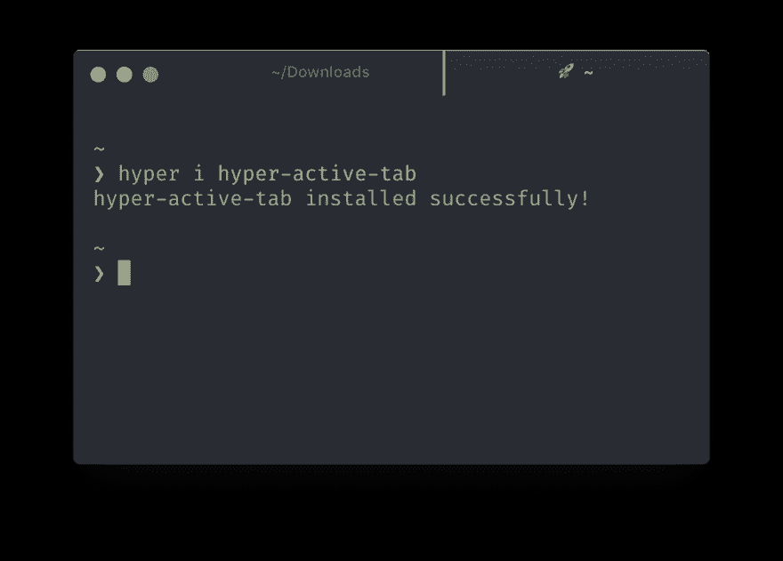T2】](https://res.cloudinary.com/practicaldev/image/fetch/s--4jdkpWNO--/c_limit%2Cf_auto%2Cfl_progressive%2Cq_auto%2Cw_880/https://tjay.dev/conteimg/2019/09/image-11.png)

#### [](#127-showing-cpu-ram-battery-stats)1.2.7 显示 CPU、RAM、电池状态

如果我们想跟踪我们的 CPU、内存、电池资源，我们可以添加:[github-hyperline/hyperline:✨超级✨状态行插件](https://github.com/hyperline/hyperline):

```
hyper i hyperline 
```

<svg width="20px" height="20px" viewBox="0 0 24 24" class="highlight-action crayons-icon highlight-action--fullscreen-on"><title>Enter fullscreen mode</title></svg> <svg width="20px" height="20px" viewBox="0 0 24 24" class="highlight-action crayons-icon highlight-action--fullscreen-off"><title>Exit fullscreen mode</title></svg>

完全重新加载后，将出现新的状态行:

[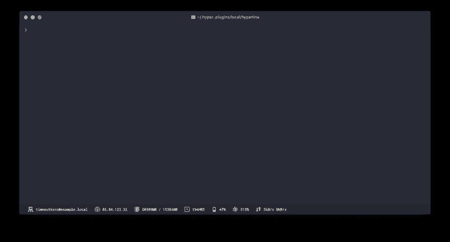T2】](https://res.cloudinary.com/practicaldev/image/fetch/s--rHL6bYYk--/c_limit%2Cf_auto%2Cfl_progressive%2Cq_auto%2Cw_880/https://tjay.dev/conteimg/2019/09/image-12.png)

甚至有一个 Spotify 插件显示当前播放的歌曲。

#### [](#128-bonus-feel-this-power)1.2.8 加成:感受这种力量！

Javascript 让用户几乎可以创建任何东西。让我们看看[超级商店超级力量](https://hyper.is/plugins/hyperpower)能做什么:

```
hyper i hyperpower 
```

<svg width="20px" height="20px" viewBox="0 0 24 24" class="highlight-action crayons-icon highlight-action--fullscreen-on"><title>Enter fullscreen mode</title></svg> <svg width="20px" height="20px" viewBox="0 0 24 24" class="highlight-action crayons-icon highlight-action--fullscreen-off"><title>Exit fullscreen mode</title></svg>

这个很显眼:

[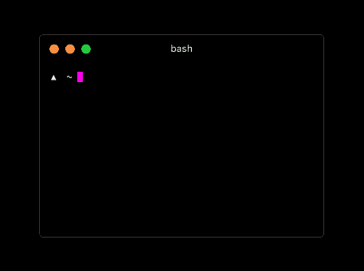T2】](https://res.cloudinary.com/practicaldev/image/fetch/s--55JPSeMj--/c_limit%2Cf_auto%2Cfl_progressive%2Cq_66%2Cw_880/https://cloud.githubusercontent.com/assets/13041/16820268/13c9bfe6-4905-11e6-8fe4-baf8fc8d9293.gif)

还有很多其他的插件，而且这个列表还在快速增长。要获得更多插件，请特别检查以下两个来源:

*   官方插件商店:[超级商店-插件](https://hyper.is/plugins)
*   一个包含超级插件列表的库:[https://github.com/bnb/awesome-hyper](https://github.com/bnb/awesome-hyper)

## [](#2-shell-zsh-starship-prompt)2。壳牌- ZSH +星舰提示

有几个最流行的 Linux shell:

*   Bash Shell - [Bash (Unix shell) -维基百科](https://en.wikipedia.org/wiki/Bash_(Unix_shell))
*   Tcsh/Csh 壳牌-[https://pl.wikipedia.org/wiki/Tcsh](https://pl.wikipedia.org/wiki/Tcsh)
*   Ksh 壳牌-[https://pl.wikipedia.org/wiki/Korn_shell](https://pl.wikipedia.org/wiki/Korn_shell)
*   Zsh 壳牌-[https://pl.wikipedia.org/wiki/Zsh](https://pl.wikipedia.org/wiki/Zsh)
*   鱼-[https://pl.wikipedia.org/wiki/Friendly_interactive_shell](https://pl.wikipedia.org/wiki/Friendly_interactive_shell)

在用一些贝壳做实验后，我决定用 ZSH。

### [](#21-installing-zsh)2.1 安装 ZSH

对于 Mac OS:

```
brew install zsh 
```

<svg width="20px" height="20px" viewBox="0 0 24 24" class="highlight-action crayons-icon highlight-action--fullscreen-on"><title>Enter fullscreen mode</title></svg> <svg width="20px" height="20px" viewBox="0 0 24 24" class="highlight-action crayons-icon highlight-action--fullscreen-off"><title>Exit fullscreen mode</title></svg>

如果你没有安装`homebrew`你可以添加它(官方安装文件[在这里](https://docs.brew.sh/Installation)):

```
/usr/bin/ruby -e "$(curl -fsSL https://raw.githubusercontent.com/Homebrew/install/master/install)" 
```

<svg width="20px" height="20px" viewBox="0 0 24 24" class="highlight-action crayons-icon highlight-action--fullscreen-on"><title>Enter fullscreen mode</title></svg> <svg width="20px" height="20px" viewBox="0 0 24 24" class="highlight-action crayons-icon highlight-action--fullscreen-off"><title>Exit fullscreen mode</title></svg>

家酿是一个 macOS 的软件包管理器。

安装 ZSH 后，检查其版本:

```
❯ zsh --version
zsh 5.7.1 (x86_64-apple-darwin19.0)

❯ which zsh
/usr/local/bin/zsh 
```

<svg width="20px" height="20px" viewBox="0 0 24 24" class="highlight-action crayons-icon highlight-action--fullscreen-on"><title>Enter fullscreen mode</title></svg> <svg width="20px" height="20px" viewBox="0 0 24 24" class="highlight-action crayons-icon highlight-action--fullscreen-off"><title>Exit fullscreen mode</title></svg>

要在 Hyper 中使用 ZSH，我们需要在配置(`~/.hyper.js`)中指定它:

```
module.exports = {
  config: {
    // rest of the config
    shell: '/usr/local/bin/zsh',
  }
  // rest of the file
} 
```

<svg width="20px" height="20px" viewBox="0 0 24 24" class="highlight-action crayons-icon highlight-action--fullscreen-on"><title>Enter fullscreen mode</title></svg> <svg width="20px" height="20px" viewBox="0 0 24 24" class="highlight-action crayons-icon highlight-action--fullscreen-off"><title>Exit fullscreen mode</title></svg>

此时，Hyper 应该以新安装的 ZSH 作为默认 shell 启动。

我们可以继续下一点了。

### [](#22-installing-starship-prompt)2.2 安装星舰提示

[T2】](https://res.cloudinary.com/practicaldev/image/fetch/s--yezP_x8e--/c_limit%2Cf_auto%2Cfl_progressive%2Cq_66%2Cw_880/https://thepracticaldev.s3.amazonaws.com/i/33aexbnaatk0bflj3vz1.gif)

有许多不同的提示可以使用。在测试了其中一些之后，我决定继续使用 GitHub - starship/starship: ☄️🌌️的跨壳提示宇航员。

#### [](#221-install)2.2.1 安装

文档中描述了几种不同的安装*星舰*的方法: [GitHub - starship/starship: ☄️🌌️的跨壳提示宇航员。](https://github.com/starship/starship#-installation)

对于 Mac OS:

```
brew install starship 
```

<svg width="20px" height="20px" viewBox="0 0 24 24" class="highlight-action crayons-icon highlight-action--fullscreen-on"><title>Enter fullscreen mode</title></svg> <svg width="20px" height="20px" viewBox="0 0 24 24" class="highlight-action crayons-icon highlight-action--fullscreen-off"><title>Exit fullscreen mode</title></svg>

检查它是否工作:

```
❯ starship --version
starship 0.44.0 
```

<svg width="20px" height="20px" viewBox="0 0 24 24" class="highlight-action crayons-icon highlight-action--fullscreen-on"><title>Enter fullscreen mode</title></svg> <svg width="20px" height="20px" viewBox="0 0 24 24" class="highlight-action crayons-icon highlight-action--fullscreen-off"><title>Exit fullscreen mode</title></svg>

要启用 *startship* 提示，我们需要将其添加到`~/.zshrc`。将以下代码添加到`~/.zshrc`文件的末尾:

```
echo 'eval "$(starship init zsh)"' >> ~/.zshrc 
```

<svg width="20px" height="20px" viewBox="0 0 24 24" class="highlight-action crayons-icon highlight-action--fullscreen-on"><title>Enter fullscreen mode</title></svg> <svg width="20px" height="20px" viewBox="0 0 24 24" class="highlight-action crayons-icon highlight-action--fullscreen-off"><title>Exit fullscreen mode</title></svg>

重启 Hyper 后，我们的终端应该是这样的:

[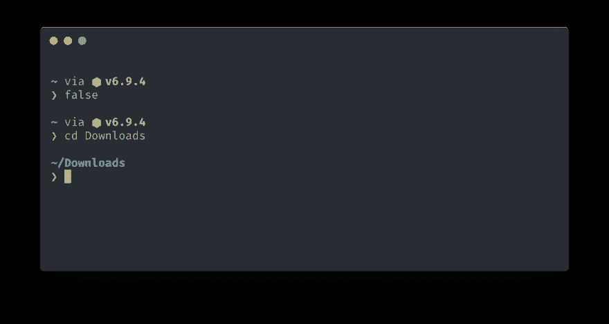T2】](https://res.cloudinary.com/practicaldev/image/fetch/s--GIadjcxU--/c_limit%2Cf_auto%2Cfl_progressive%2Cq_auto%2Cw_880/https://tjay.dev/conteimg/2019/09/image-15.png)

不幸的是，我们没有任何语法高亮，命令完成，历史记录，别名和一些其他的东西。我们需要调整它。

#### [](#222-syntax-highlighting)2.2.2 语法高亮显示

还有另一个很棒的 zsh 插件回购，你应该看看:[GitHub-unixorn/awesome-zsh-plugins:一个 ZSH 框架、插件的集合&主题，灵感来自各种 awesome 列表集合。](https://github.com/unixorn/awesome-zsh-plugins)。我在上面搜索了一个语法高亮插件。

我准备用[GitHub-zdharma/fast-syntax-highlighting:(简称 F-Sy-H)。Zshell 的语法突出显示——细粒度、特性数量、40 个工作时间主题](https://github.com/zdharma/fast-syntax-highlighting)。

我将通过克隆 repo 来安装它(它将允许以后通过拉动主文件来轻松地保持它的最新状态):

```
# Create a `.zsh` directory to store our plugins in one place
mkdir ~/.zsh

# Clone repo to `~/.zsh/` directory
cd ~/.zsh && git clone git@github.com:zdharma/fast-syntax-highlighting.git

# Enable 'fast-syntax-highlighting' plugin in ZSH
echo "source $HOME/.zsh/fast-syntax-highlighting/fast-syntax-highlighting.plugin.zsh" >> ~/.zshrc

# Reload ZSH
source ~/.zshrc 
```

<svg width="20px" height="20px" viewBox="0 0 24 24" class="highlight-action crayons-icon highlight-action--fullscreen-on"><title>Enter fullscreen mode</title></svg> <svg width="20px" height="20px" viewBox="0 0 24 24" class="highlight-action crayons-icon highlight-action--fullscreen-off"><title>Exit fullscreen mode</title></svg>

如果您无法克隆回购，并出现如下错误:

```
git@github.com: Permission denied (publickey) 
```

<svg width="20px" height="20px" viewBox="0 0 24 24" class="highlight-action crayons-icon highlight-action--fullscreen-on"><title>Enter fullscreen mode</title></svg> <svg width="20px" height="20px" viewBox="0 0 24 24" class="highlight-action crayons-icon highlight-action--fullscreen-off"><title>Exit fullscreen mode</title></svg>

然后尝试使用“克隆与 HTTPS”，它会像这样:

```
git clone https://github.com/zdharma/fast-syntax-highlighting.git 
```

<svg width="20px" height="20px" viewBox="0 0 24 24" class="highlight-action crayons-icon highlight-action--fullscreen-on"><title>Enter fullscreen mode</title></svg> <svg width="20px" height="20px" viewBox="0 0 24 24" class="highlight-action crayons-icon highlight-action--fullscreen-off"><title>Exit fullscreen mode</title></svg>

在这几个步骤之后，我们应该已经启用了语法高亮显示:

[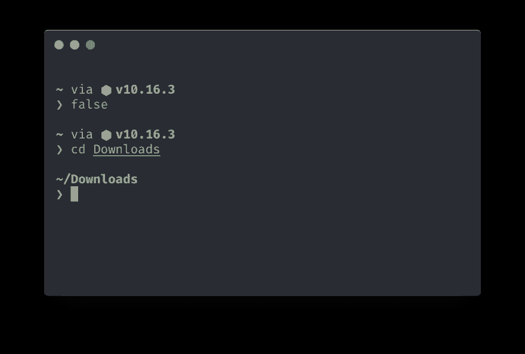T2】](https://res.cloudinary.com/practicaldev/image/fetch/s--HQOKddB1--/c_limit%2Cf_auto%2Cfl_progressive%2Cq_auto%2Cw_880/https://tjay.dev/conteimg/2019/09/image-16.png)

#### [](#223-setting-completion-plugin)2.2.3 设置完成插件

我们将使用已经从[GitHub-robbyrussell/oh-my-zsh](https://github.com/robbyrussell/oh-my-zsh)中定义的`completion.zsh`:

```
# Download completion config
cd ~/.zsh && wget https://raw.githubusercontent.com/robbyrussell/oh-my-zsh/master/lib/completion.zsh

# Enable 'completion' plugin in ZSH
echo "source $HOME/.zsh/completion.zsh" >> ~/.zshrc 
```

<svg width="20px" height="20px" viewBox="0 0 24 24" class="highlight-action crayons-icon highlight-action--fullscreen-on"><title>Enter fullscreen mode</title></svg> <svg width="20px" height="20px" viewBox="0 0 24 24" class="highlight-action crayons-icon highlight-action--fullscreen-off"><title>Exit fullscreen mode</title></svg>

此外，这一次我们需要在`~/.zshrc`文件中增加几行:

```
# rest of the `~/.zshrc` file

# Load completion config
source $HOME/.zsh/completion.zsh

# Initialize the completion system
autoload -Uz compinit

# Cache completion if nothing changed - faster startup time
typeset -i updated_at=$(date +'%j' -r ~/.zcompdump 2>/dev/null || stat -f '%Sm' -t '%j' ~/.zcompdump 2>/dev/null)
if [$(date +'%j') != $updated_at]; then compinit -i
else compinit -C -i
fi

# Enhanced form of menu completion called `menu selection'
zmodload -i zsh/complist 
```

<svg width="20px" height="20px" viewBox="0 0 24 24" class="highlight-action crayons-icon highlight-action--fullscreen-on"><title>Enter fullscreen mode</title></svg> <svg width="20px" height="20px" viewBox="0 0 24 24" class="highlight-action crayons-icon highlight-action--fullscreen-off"><title>Exit fullscreen mode</title></svg>

重启终端，现在应该可以完成了:

[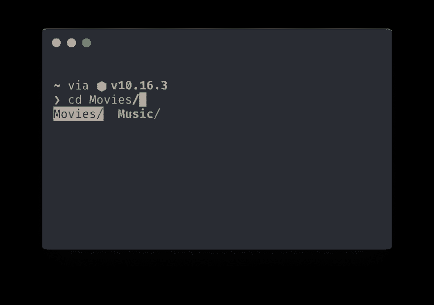T2】](https://res.cloudinary.com/practicaldev/image/fetch/s--Avkiqi3w--/c_limit%2Cf_auto%2Cfl_progressive%2Cq_auto%2Cw_880/https://tjay.dev/conteimg/2019/09/image-17.png)

[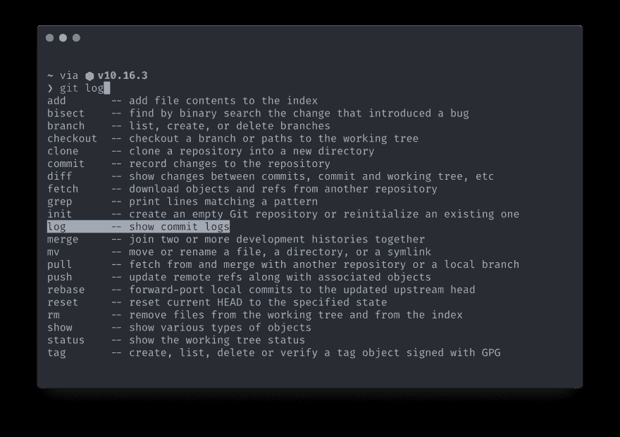T2】](https://res.cloudinary.com/practicaldev/image/fetch/s--l_xfbyyq--/c_limit%2Cf_auto%2Cfl_progressive%2Cq_auto%2Cw_880/https://tjay.dev/conteimg/2019/09/image-18.png)

[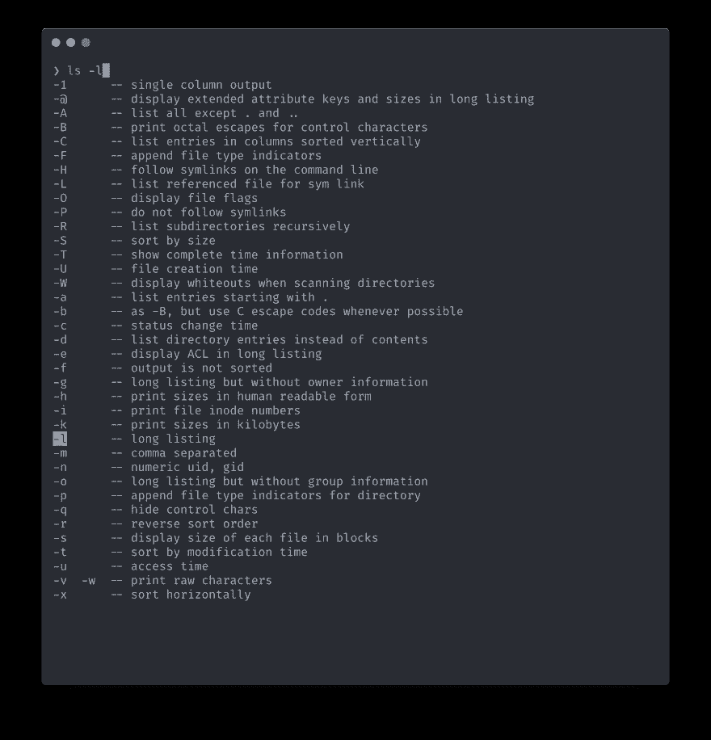T2】](https://res.cloudinary.com/practicaldev/image/fetch/s--Z5_oyZE4--/c_limit%2Cf_auto%2Cfl_progressive%2Cq_auto%2Cw_880/https://tjay.dev/conteimg/2019/09/image-19.png)

你可能会问，为什么我不用哦我的 Zsh？对我来说感觉超载了。我喜欢控制我使用的工具。我更喜欢从小部件开始，然后一步一步地建造更大的东西。

#### [](#224-setting-autosuggestions-plugin)2.2.4 设置自动建议插件

除了完成功能，也很高兴有建议。当您开始键入时，命令行中会显示一个建议。让我们使用[GitHub-zsh-users/zsh-auto suggestions:zsh](https://github.com/zsh-users/zsh-autosuggestions)插件的类似鱼的自动建议。

安装它:

```
# Download 'zsh-autosuggestions' plugin
cd ~/.zsh && git clone git@github.com:zsh-users/zsh-autosuggestions.git

# Enable 'zsh-autosuggestions' plugin in ZSH
echo "source $HOME/.zsh/zsh-autosuggestions/zsh-autosuggestions.zsh" >> ~/.zshrc

# Reload ZSH
source ~/.zshrc 
```

<svg width="20px" height="20px" viewBox="0 0 24 24" class="highlight-action crayons-icon highlight-action--fullscreen-on"><title>Enter fullscreen mode</title></svg> <svg width="20px" height="20px" viewBox="0 0 24 24" class="highlight-action crayons-icon highlight-action--fullscreen-off"><title>Exit fullscreen mode</title></svg>

通过建议命令的其余部分，它工作得非常好，您可以使用箭头来接受建议的命令:

[T2】](https://res.cloudinary.com/practicaldev/image/fetch/s--5ztjcKyy--/c_limit%2Cf_auto%2Cfl_progressive%2Cq_auto%2Cw_880/https://tjay.dev/conteimg/2019/09/image-20.png)

#### [](#225-commands-history-config)2.2.5 命令历史配置

这里，我们将再次使用 oh-my-zsh 中的一个现成配置:

```
# Download history config
cd ~/.zsh && wget https://raw.githubusercontent.com/robbyrussell/oh-my-zsh/master/lib/history.zsh

# Enable 'history' config in ZSH
echo "source $HOME/.zsh/history.zsh" >> ~/.zshrc

# Reload ZSH
source ~/.zshrc 
```

<svg width="20px" height="20px" viewBox="0 0 24 24" class="highlight-action crayons-icon highlight-action--fullscreen-on"><title>Enter fullscreen mode</title></svg> <svg width="20px" height="20px" viewBox="0 0 24 24" class="highlight-action crayons-icon highlight-action--fullscreen-off"><title>Exit fullscreen mode</title></svg>

现在，通过使用向上箭头，我们可以返回到之前的命令。我们也可以通过点击`CTRL` + `R`来使用向后搜索:

[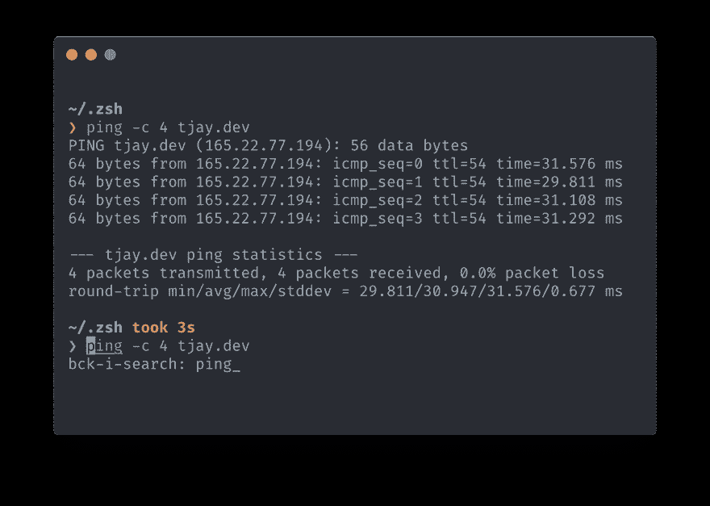T2】](https://res.cloudinary.com/practicaldev/image/fetch/s--FAg7Fefq--/c_limit%2Cf_auto%2Cfl_progressive%2Cq_auto%2Cw_880/https://tjay.dev/conteimg/2019/09/image-21.png)

#### [](#226-colorized-raw-ls-endraw-output)2.2.6 彩色化`ls`输出

现在，当我们想要列出一个目录的内容时，我们有一个原始的灰色列表:

[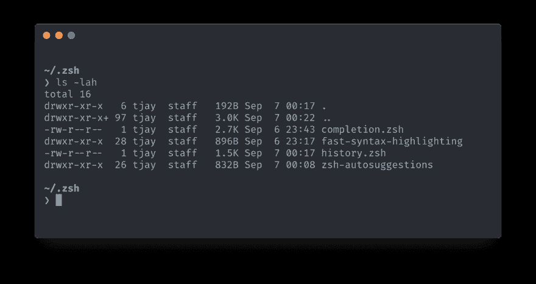T2】](https://res.cloudinary.com/practicaldev/image/fetch/s--N8ir40XJ--/c_limit%2Cf_auto%2Cfl_progressive%2Cq_auto%2Cw_880/https://tjay.dev/conteimg/2019/09/image-22.png)

看起来不太好。让我们用一些颜色使它更具可读性。

当你去`ls`命令的手册有一个`-G`选项:

```
 -G Enable colorized output. This option is equivalent to defining CLICOLOR in the environment. (See below.) 
```

<svg width="20px" height="20px" viewBox="0 0 24 24" class="highlight-action crayons-icon highlight-action--fullscreen-on"><title>Enter fullscreen mode</title></svg> <svg width="20px" height="20px" viewBox="0 0 24 24" class="highlight-action crayons-icon highlight-action--fullscreen-off"><title>Exit fullscreen mode</title></svg>

但是，我们不打算每次使用`ls`命令时都添加`-G`。我们可以为它创建一个别名:

```
# Enable colorized output for `ls` command.
echo "alias ls='ls -G'" >> ~/.zshrc

# Reload ZSH
source ~/.zshrc 
```

<svg width="20px" height="20px" viewBox="0 0 24 24" class="highlight-action crayons-icon highlight-action--fullscreen-on"><title>Enter fullscreen mode</title></svg> <svg width="20px" height="20px" viewBox="0 0 24 24" class="highlight-action crayons-icon highlight-action--fullscreen-off"><title>Exit fullscreen mode</title></svg>

现在看起来好多了:

[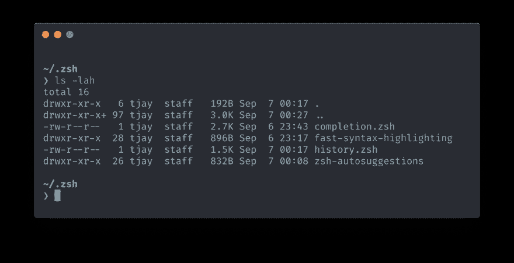T2】](https://res.cloudinary.com/practicaldev/image/fetch/s--kWtMwETA--/c_limit%2Cf_auto%2Cfl_progressive%2Cq_auto%2Cw_880/https://tjay.dev/conteimg/2019/09/image-23.png)

#### [](#227-key-bindings)2.2.7 按键绑定

当每天在终端上工作时，最好启用快捷键。回到行首(`CMD` + `LEFT ARROW`)，还是到行尾(`CMD` + `RIGHT ARROW`)？

让我们安装键绑定:

```
# Download key bindings config
cd ~/.zsh && wget https://raw.githubusercontent.com/robbyrussell/oh-my-zsh/master/lib/key-bindings.zsh

# Enable 'key-bindings' config in ZSH
echo "source $HOME/.zsh/key-bindings.zsh" >> ~/.zshrc

# Reload ZSH
source ~/.zshrc 
```

<svg width="20px" height="20px" viewBox="0 0 24 24" class="highlight-action crayons-icon highlight-action--fullscreen-on"><title>Enter fullscreen mode</title></svg> <svg width="20px" height="20px" viewBox="0 0 24 24" class="highlight-action crayons-icon highlight-action--fullscreen-off"><title>Exit fullscreen mode</title></svg>

#### [](#228-aliases)2.2.8 别名

当使用命令行时，Shell 别名在生产效率中发挥了巨大的作用。如果你有明确定义的快捷方式，它可以让你在开发新的应用程序、脚本等时变得非常高效和快速。

```
touch aliases.zsh 
echo "source $HOME/.zsh/aliases.zsh" >> ~/.zshrc 
```

<svg width="20px" height="20px" viewBox="0 0 24 24" class="highlight-action crayons-icon highlight-action--fullscreen-on"><title>Enter fullscreen mode</title></svg> <svg width="20px" height="20px" viewBox="0 0 24 24" class="highlight-action crayons-icon highlight-action--fullscreen-off"><title>Exit fullscreen mode</title></svg>

我经常使用的几个有用的别名列举如下:

`~/.zsh/aliases.zsh`

```
alias ls='ls -G' # colorize `ls` output
alias zshreload='source ~/.zshrc' # reload ZSH
alias shtop='sudo htop' # run `htop` with root rights
alias grep='grep --color=auto' # colorize `grep` output
alias ..='cd ..'
alias ...='cd ../..'
alias ....='cd ../../..'
alias less='less -R'
alias g='git'

alias rm='rm -i' # confirm removal
alias cp='cp -i' # confirm copy
alias mv='mv -i' # confirm move
alias cal='gcal --starting-day=1' # print simple calendar for current month
alias weather='curl v2.wttr.in' # print weather for current location (https://github.com/chubin/wttr.in) 
```

<svg width="20px" height="20px" viewBox="0 0 24 24" class="highlight-action crayons-icon highlight-action--fullscreen-on"><title>Enter fullscreen mode</title></svg> <svg width="20px" height="20px" viewBox="0 0 24 24" class="highlight-action crayons-icon highlight-action--fullscreen-off"><title>Exit fullscreen mode</title></svg>

另外，我认为共享 git 别名可能对您也有好处。下面的列表可能看起来很宽泛，但是我添加了一些注释来解释它们各自的作用。

`~/.gitconfig`

```
[alias]
  a = add # Add file contents to the index
  ai = add --interactive # Add modified contents in the working tree interactively to the index.
  ##############
  b = branch
  ba = branch --all # List both remote-tracking branches and local branches.
  bav = branch --all --verbose # When in list mode, show sha1 and commit subject line for each head, along with relationship to upstream branch (if any)
  bd = branch --delete # Delete a branch. The branch must be fully merged in its upstream branch, or in HEAD if no upstream was set with --track or --set-upstream-to.
  bdd = branch -D # Shortcut for --delete --force.
  bm = branch --move # Move/rename a branch and the corresponding reflog.
  bmm = branch -M # Shortcut for --move --force.
  br = branch --remotes # List or delete (if used with -d) the remote-tracking branches.
  ##############
  c = commit # Record changes to the repository
  ca = commit --all # Tell the command to automatically stage files that have been modified and deleted, but new files you have not told Git about are not affected.
  cm = commit -m # Use the given <msg> as the commit message.
  cam = commit -am # Shortcut for --all and -m
  cem = commit --allow-empty -m # Allows to create a commit without any files modified
  cd = commit --amend # Replace the tip of the current branch by creating a new commit.
  cad = commit --all --amend # Shortcut for --amend and --all
  cadne = commit --all --amend --no-edit # Amends a commit without changing its commit message.
  ##############
  cl = clone # Clone a repository into a new directory
  cld = clone --depth 1 # Create a shallow clone with a history truncated to the specified number of commits.
  ##############
  cp = cherry-pick # Apply the changes introduced by some existing commits
  cpa = cherry-pick --abort # Cancel the operation and return to the pre-sequence state.
  cpc = cherry-pick --continue # Continue the operation in progress using the information in .git/sequencer. Can be used to continue after resolving conflicts in a failed cherry-pick or revert.
  cps = cherry-pick --skip # Skip the current commit and continue with the rest of the sequence.
  ##############
  d = diff # Show changes between commits, commit and working tree, etc
  di = !"d() { git diff --patch-with-stat HEAD~$1; }; git diff-index --quiet HEAD -- || clear; d" # `git di $number` shows the diff between the state `$number` revisions ago and the current state
  dt = difftool # Show changes using common diff tools
  ##############
  f = fetch # Download objects and refs from another repository
  fo = fetch origin # Update the remote-tracking branches
  fu = fetch upstream # Fetch the branches and their respective commits from the upstream repository.
  ##############
  fk = fsck # Verifies the connectivity and validity of the objects in the database
  ##############
  g = grep -p # Print lines matching a pattern
  ##############
  l = log --oneline # Show commit logs, the commit message is prefixed with this information on the same line.
  lg = log --oneline --graph --decorate # Draw a text-based graphical representation of the commit history on the left hand side of the output.
  lgs = !"git log --pretty=format:"%C(yellow)%h\\ %ad%Cred%d\\ %Creset%s%Cblue\\ [%cn]" --decorate --date=short" # SHA + date + Commit message + author
  lgc = !"git log --pretty=format:"%C(yellow)%h%Cred%d\\ %Creset%s%Cblue\\ [%cn]" --decorate --numstat" # SHA + Commit message + author + changed files
  lgt = !"git log --graph --pretty='%Cred%h%Creset -%C(yellow)%d%Creset %s %Cgreen(%cr) %C(bold blue)<%an>%Creset' --abbrev-commit --all" # As tree: SHA + Commit message + Time ago + author
  ##############
  ls = ls-files # Show information about files in the index and the working tree
  lsm = ls-files --modified # Show modified files in the output
  lss = ls-files --stage # Show staged contents' mode bits, object name and stage number in the output.
  ##############
  m = merge # Join two or more development histories together
  ma = merge --abort # Abort the current conflict resolution process, and try to reconstruct the pre-merge state.
  mc = merge --continue # After a git merge stops due to conflicts you can conclude the merge by running git merge --continue
  mq = merge --quit # Forget about the current merge in progress. Leave the index and the working tree as-is.
  mm = merge master # Merge 'master' branch to the current branch.
  ##############
  o = checkout # Switch branches or restore working tree files.
  om = checkout master # Switch branch to master.
  ob = checkout -b # Create and switch to a new branch
  ##############
  pr = prune --verbose --progress # Prune all unreachable objects from the object database. Report all removed objects. Show progress.
  prn = prune --dry-run # Do not remove anything; just report what it would remove.
  ##############
  ps = push # Update remote refs along with associated objects
  psa = push --all # Push all branches (i.e. refs under refs/heads/); cannot be used with other <refspec>.
  psf = push --force # Usually, the command refuses to update a remote ref that is not an ancestor of the local ref used to overwrite it. This flag disables these checks, and can cause the remote repository to lose commits; use it with care.
  psu = push --set-upstream # For every branch that is up to date or successfully pushed, add upstream (tracking) reference.
  ##############
  pso = push origin # `origin` is an alias in the system for a particular remote repository. Can be checked by running `git remote -v`.
  psao = push --all origin # Same as `push --all` but for origin.
  psfo = push --force origin # Same as `push --force` but for origin.
  psuo = push --set-upstream origin # Same as `push --set-upstream` but for origin.
  #############
  psom = push origin master # Same as `push origin` but for master branch.
  psaom = push --all origin master # Same as `push --all origin` but for master branch.
  psfom = push --force origin master # Same as `push --force origin` but for master branch.
  psuom = push --set-upstream origin master # Same as `push --set-upstream origin` but for master branch.
  #############
  pl = pull # Fetch from and integrate with another repository or a local branch.
  plr = pull --rebase # When true, rebase the current branch on top of the upstream branch after fetching.
  plv = pull --verbose # Pass --verbose to git-fetch and git-merge.
  #############
  plo = pull origin # Same as `pull` but for origin.
  plro = pull --rebase origin # Same as `pull --rebase` but for origin.
  plom = pull origin master # Same as `pull origin` but for master branch.
  #############
  plu = pull upstream # Same as `pull` but for upstream.
  plum = pull upstream master # Same as `pull upstream` but for master branch.
  plrum = pull --rebase upstream master # Same as `pull --rebase` but for upstream and master branch.
  #############
  rb = rebase # Reapply commits on top of another base tip.
  rba = rebase --abort # Abort the rebase operation and reset HEAD to the original branch.
  rbc = rebase --continue # Restart the rebasing process after having resolved a merge conflict.
  rbi = rebase --interactive # Make a list of the commits which are about to be rebased. Let the user edit that list before rebasing. This mode can also be used to split commits.
  rbs = rebase --skip # Restart the rebasing process by skipping the current patch.
  rbin = "!r() { git rebase -i HEAD~$1; }; r" # Interactive rebase with the given number of latest commits.
  #############
  re = reset # Reset current HEAD to the specified state
  rh = reset HEAD # HEAD is defined explicitly
  reh = reset --hard # Resets the index and working tree. Any changes to tracked files in the working tree since <commit> are discarded.
  rem = reset --mixed # Resets the index but not the working tree (i.e., the changed files are preserved but not marked for commit) and reports what has not been updated. This is the default action.
  res = reset --soft # Does not touch the index file or the working tree at all (but resets the head to <commit>, just like all modes do). This leaves all your changed files "Changes to be committed".
  rehh = reset --hard HEAD # HEAD is defined explicitly
  remh = reset --mixed HEAD # HEAD is defined explicitly
  resh = reset --soft HEAD # HEAD is defined explicitly
  rehom = reset --hard origin/master # Throw away all my staged and unstaged changes, forget everything on my current local branch and make it exactly the same as origin/master.
  #############
  r = remote # Manage set of tracked repositories
  ra = remote add # Adds a remote named <name> for the repository at <url>.
  rr = remote remove # Remove the remote named <name>. All remote-tracking branches and configuration settings for the remote are removed.
  rv = remote --verbose # Be a little more verbose and show remote url after name.
  rn = remote rename # Rename the remote named <old> to <new>. All remote-tracking branches and configuration settings for the remote are updated.
  rp = remote prune # Deletes stale references associated with <name>. By default, stale remote-tracking branches under <name> are deleted, but depending on global configuration and the configuration of the remote we might even prune local tags that haven't been pushed there.
  rs = remote show # Gives some information about the remote <name>.
  rao = remote add origin # Add new origin.
  rau = remote add upstream # Add new upstream.
  rro = remote remove origin # Remove origin.
  rru = remote remove upstream # Remove upstream.
  rso = remote show origin # Show current origin.
  rsu = remote show upstream # Show current upstream.
  rpo = remote prune origin # Prune current origin.
  rpu = remote prune upstream # Prune current upstream.
  #############
  rmf = rm -f # Remove files from the working tree and from the index. Override the up-to-date check.
  rmrf = rm -r -f # Same as above + Allow recursive removal when a leading directory name is given.
  #############
  s = status # Show the working tree status
  sb = status -s -b # Same as above + Give the output in the short-format. Show the branch and tracking info even in short-format.
  #############
  sa = stash apply # Like pop, but do not remove the state from the stash list.
  sc = stash clear # Remove all the stash entries. Note that those entries will then be subject to pruning, and may be impossible to recover.
  sd = stash drop # Remove a single stash entry from the list of stash entries. When no <stash> is given, it removes the latest one.
  sl = stash list # List the stash entries that you currently have.
  sp = stash pop # Remove a single stashed state from the stash list and apply it on top of the current working tree state, i.e., do the inverse operation of git stash push.
  sps = stash push # Save your local modifications to a new stash entry and roll them back to HEAD (in the working tree and in the index). The <message> part is optional and gives the description along with the stashed state.
  spsk = stash push -k # All changes already added to the index are left intact.
  sw = stash show # Show the changes recorded in the stash entry as a diff between the stashed contents and the commit back when the stash entry was first created. When no <stash> is given, it shows the latest one.
  st = !git stash list | wc -l 2>/dev/null | grep -oEi '[0-9][0-9]*'
  #############
  t = tag # Create, list, delete or verify a tag object signed with GPG.
  td = tag --delete # Delete existing tags with the given names.
  tl = tag --list # Show verbose output about tags.
  #############
  w = show # Show various types of objects.
  wo = show --oneline # This is a shorthand for "--pretty=oneline --abbrev-commit" used together.
  wf = show --format=fuller # Print more extensive info.
  #############
  aliases = !git config -l | grep alias | cut -c 7- # List git aliases
  branches = branch --all # List both remote-tracking branches and local branches.
  remotes = remote --verbose # Be a little more verbose and show remote url after name.
  contributors = shortlog --summary --numbered  # List contributors with number of commits
  amend = commit --amend --no-edit # Amend the currently staged files to the latest commit.
  go = "!f() { git checkout -b \"$1\" 2> /dev/null || git checkout \"$1\"; }; f"    # Switch to a branch, creating it if necessary
  fb = "!f() { git branch -a --contains $1; }; f" # Find branches containing commit
  ft = "!f() { git describe --always --contains $1; }; f" # Find tags containing commit
  fc = "!f() { git log --pretty=format:'%C(yellow)%h %Cblue%ad %Creset%s%Cgreen [%cn] %Cred%d' --decorate --date=short -S$1; }; f" # Find commits by source code
  fm = "!f() { git log --pretty=format:'%C(yellow)%h %Cblue%ad %Creset%s%Cgreen [%cn] %Cred%d' --decorate --date=short --grep=$1; }; f" # Find commits by commit message
  dm = "!git branch --merged | grep -v '\\*' | xargs -n 1 git branch -d"    # Remove branches that have already been merged with master (a.k.a. ‘delete merged’) 
```

<svg width="20px" height="20px" viewBox="0 0 24 24" class="highlight-action crayons-icon highlight-action--fullscreen-on"><title>Enter fullscreen mode</title></svg> <svg width="20px" height="20px" viewBox="0 0 24 24" class="highlight-action crayons-icon highlight-action--fullscreen-off"><title>Exit fullscreen mode</title></svg>

## [](#summary)总结

我希望您会发现这篇文章很有用，它将帮助您提高命令行的工作效率。这不是一个最终的设置，而是把它作为一个开始或增强您当前的设置。可用工具、插件和配置的数量简直多得令人难以招架。每个用户都有不同的用例，使用不同的技术。我试图专注于任何人都可以使用的共同点。

如果你知道并推荐一些你使用的并且离不开的工具，请在评论中告诉我。

**这篇文章最初发表在我的个人开发博客上:[https://tjay.dev/](https://tjay.dev/howto-my-terminal-shell-setup-hyper-js-zsh-starship/?utm_source=dev.to&utm_medium=footer-link&utm_campaign=reblogging)T3】**

*照片由[至](https://unsplash.com/@niakris?utm_source=unsplash&utm_medium=referral&utm_content=creditCopyText)在[上【不良】](https://unsplash.com/search/photos/shell?utm_source=unsplash&utm_medium=referral&utm_content=creditCopyText)至*拍摄