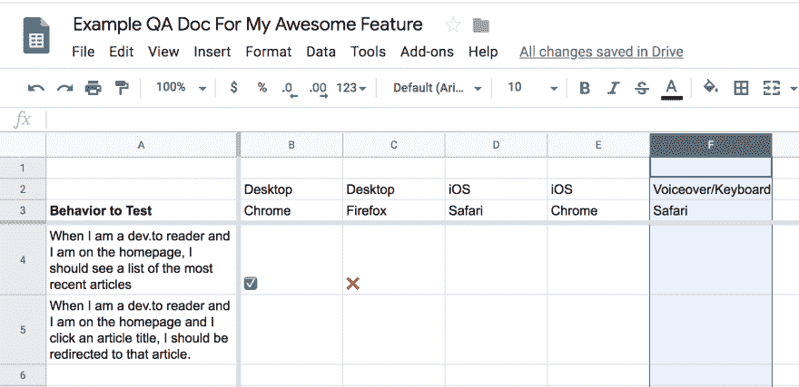

# 让易访问性变得有趣:建设和保证易访问网站的实用技巧。一

> 原文：<https://dev.to/gabioc/making-accessibility-fun-practical-tips-for-building-qa-ing-accessible-websites-pt-1-jei>

嗨！这是我在 dev.to 的第一篇帖子，我很兴奋地开始分享一些我最关心的东西:可访问性。

**简单介绍一下我自己**:我不是可访问性方面的专家，但我有一些经验，并强烈希望让技术更具包容性。

**这篇文章是关于什么的**:我认为可访问性有时会让人感到不知所措(看看[官方指南](https://www.w3.org/TR/WCAG20/)😵)而且好像有很多灰色地带。这篇文章是面向那些想要一些实用和难忘的技巧来使构建和 QA 可访问的应用程序更容易的人的。

## 那么什么是可达性呢？

可访问性就是让你的网站尽可能地为最多的人所用，包括任何范围的人:

*   视觉障碍
*   听力障碍
*   行动障碍
*   认知障碍

## 为什么要关心可达性？

### 1。不要被起诉

可访问性是一个合规性问题。许多国家/地区的法律要求网站和移动应用程序遵守特定的可访问性标准。不这样做可能会导致诉讼。😬

### 2。做一个更严谨的工程师

关注你的站点的可访问性有助于发现你的标记中的错误和真实用户可能会遇到的边缘情况。

但是我们应该关心可访问性的另一个重要原因是因为我们应该想要...

### 3。做好人

 
*又名不要像这家伙(开玩笑，显然家伙李瑞是 v 好看的！)*

仅仅因为某人能力不同并不意味着他们在你的网站上会有更差的体验。

毕竟**如果不是所有人都可用，那就是不可用**。

## 那么如何构建和 QA 易访问 ui 呢？

当我考虑我正在构建的东西是否可访问时，我会想到 3 个主要标准。难道是:

*   功能的
*   可理解的
*   可操纵的

或者首字母缩略词帮你记忆，好玩吗？

让我们深入了解每一项的含义和一些相关提示。

## 1。功能的🔧

*   用户是否可以采取与没有视觉/听觉等的用户相同的动作。减值？
*   他们能有同样的经历吗？

### 提示

1.  如果你正在处理一个有接受标准的用户故事，用屏幕阅读器和键盘导航浏览每一个接受标准。
    *   你能通过键盘动作实现同样的行为吗？
2.  如果您有一个 tirekick 文档，用于在功能启动前跨浏览器和操作系统进行 QA，请添加一个可访问性检查列。
3.  使用语义 HTML
    *   这提供了很多现成的功能，因为它告诉浏览器这个元素应该做什么。

## 2。可理解的💡

*   用户能理解呈现的信息吗？
*   在不需要视觉或听觉帮助的情况下，是否有足够的文本内容供用户使用？
*   HTML 结构是有目的的还是在制造不必要的噪音？

### 提示

1.  使用人类可读的 aria 标签来提供更多的上下文
    *   《出埃及记》“覆盖图中的关闭按钮”
2.  给图像或图标添加描述性的 alt 标签(除非是多余的)
3.  确保[文本对于视力不佳的用户来说清晰可见](https://accessible-colors.com)
4.  使用语义 HTML 来减少不相关的噪音
    *   如果你因为表现的原因不能使用合适的 HTML，例如。你需要使用一个`<table>`来代替`<ul>`对于一个条目列表，应用一个带有“presentation”值的`role`属性，这将允许屏幕阅读器忽略底层结构而不是读出它。

## 3。可操纵的📍

*   键盘用户可以导航到页面的每个部分吗？
*   他们能以正确的顺序导航吗？
*   当他们点击链接上的回车键时，他们被正确地重定向了吗？
*   用户知道他们在页面的什么位置吗？

### 提示

1.  可聚焦的元素应该显示焦点，这样弱视的用户就知道他们在哪里
    *   提示:不要用“none”覆盖 css-outline 属性。这个网站给了我快乐:[http://www.outlinenone.com](http://www.outlinenone.com)
2.  Tab 键顺序应该遵循默认的内容结构，这样用户就不会迷失方向
    *   提示:小心使用 [tab-index](https://developer.mozilla.org/en-US/docs/Web/HTML/Global_attributes/tabindex) 属性，否则就不要使用。如果您发现自己处于需要使用`tab-index`来创建标签的情况，可以考虑使用一个更具语义性的元素，它本身就是标签化的(`<a>`、`<button>`、`<input>`等等)。)
3.  没有键盘陷阱，所以用户不会迷路
    *   《出埃及记》如果用户在他们通过点击按钮触发的覆盖图中，一旦他们关闭覆盖图，该按钮应该重新获得焦点。
4.  使用语义 HTML(你感觉到主题了吗？)
    *   提示:不要使用带有点击处理程序的``或`
`来代替`<button>`或`<a>`这样的元素，因为它不能与键盘一起工作。

## 总结起来

暂时就这样吧！

这绝对不是一个详尽的提示列表，也不是增加网站可访问性的唯一方法，但这是一个起点。希望这三个主题——功能性、可理解性和可导航性——能让你在构建和评估功能时更容易记住可访问性。

请继续关注第 2 部分，在那里我们将探索如何使用各种工具来测试网站的可访问性，并亲自尝试一下！

感谢你阅读❤️