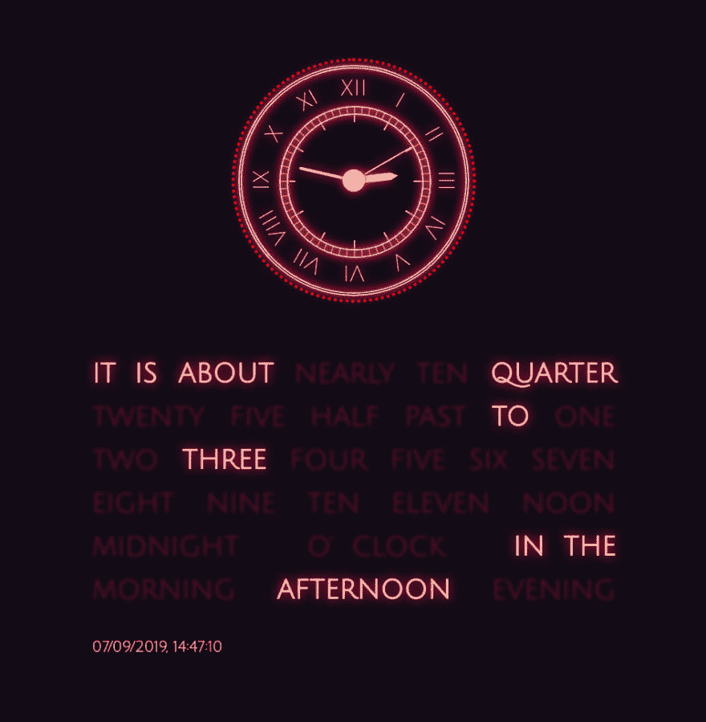

# 使用 React 挂钩制作霓虹灯时钟

> 原文：<https://dev.to/gnsp/making-a-neon-clock-using-react-hooks-mei>

### 一点点背景故事

**TL；DR；一些相当黑色幽默的东西促使我做了这个钟**

大约两年前，也就是 2017 年 9 月，当我还是 NCR 德里[佐马托](https://zomato.com)的一名软件工程师时，我感染了严重的戊型病毒性肝炎。然后我不得不辞去工作，回到奥里萨邦(我的家乡)一个鲜为人知的沿海小镇的父母家中休息和康复。从像戊型肝炎这样的疾病中康复是一个相当漫长和痛苦的过程，我花了 20 天。当时，我所在地区的网络覆盖不是很好，网速低得令人沮丧(略好于 2G)，电视上只有少数几个频道(其中大部分是当地新闻频道)。因此，在长达 20 天的时间里，我呆在家里，几乎与外界隔绝，除了休息和恢复之外，没有更多的事情要担心。当然，我的房间里有一些好书(大部分是小说)，但是一个人可以反复阅读某本书的次数是有限的。总而言之，生活尽可能远离大都市快速发展的初创企业的喧嚣。

我花了 20 天时间，阅读，看钟，再阅读，再看钟，检查是否该吃药了，再阅读，再看钟，等等...有一句谚语说，当你想让时间过得更快时，它会走得更慢，这就是其中的一个时代。

最终，在我恢复/隔离的几天里，我想如果我不得不花半辈子的时间看着时钟，告诉自己这是一天中的某某钟，为什么不改变一下，写一个小时钟呢？我可以用老式的 HTML、CSS 和普通的 JS 来写，而不用访问互联网，用 npm 把所有东西的一半都拿出来。我做到了。

两年后，也就是 2019 年 9 月，**我重访了我的那个小时钟，并用 React Hooks** 重写了它。所以让我们跳进来看看霓虹灯的**制作。**

## 时钟制作

下面是它的样子(我们将在本文中构建的时钟)

[](https://res.cloudinary.com/practicaldev/image/fetch/s--50I_h2Xm--/c_limit%2Cf_auto%2Cfl_progressive%2Cq_auto%2Cw_880/https://thepracticaldev.s3.amazonaws.com/i/z46kdigs0x6hr5zh38kn.png)

### 要求

1.  它应该与系统时钟同步，每秒滴答一次。
2.  它应该将当前时间转换为一个指定如何用标准英语读出它的对象。
3.  它应该突出显示单词列表中的相关短语，这些短语将组合起来读出当前时间。
4.  它应该每隔 15 分钟报时一次。
5.  时钟应该是活动的。

### 在帕格身上搭起了书页

因为我们将使用 React 来呈现我们的时钟，所以我们现在真的不需要写很多 HTML 相反，我们将链接我们的 JS 库和样式表，并创建一个 id 为`root`的容器`div`，React 将在其中呈现我们的应用程序。让我们在帕格里迅速地写那件事。

我们将使用[谷歌字体](https://fonts.google.com/?query=julius+sans+one)中的`Julius Sans One`字体，因为这很酷。

```
html
  head
    title Neon Clock (Using React Hooks)
    meta(name='viewport', content='initial-scale=2.0')
    link(rel='stylesheet', href='https://fonts.googleapis.com/css?family=Julius+Sans+One')
    link(rel='styleheet', href='/style.css')

  body
    #root
    script(type='text/javascript', src='https://cdnjs.cloudflare.com/ajax/libs/react/16.8.6/umd/react.production.min.js')
    script(type='text/javascript', src='https://cdnjs.cloudflare.com/ajax/libs/react-dom/16.8.6/umd/react-dom.production.min.js') 
```

Enter fullscreen mode Exit fullscreen mode

### 用 Javascript 编写应用程序

#### 获取时间并读出

让我们从短语开始，我们需要读出时间。以下是几个以 24 小时格式给出时间以及读取方式的示例:

*   午夜了
*   已经过了午夜五点了
*   已经过了午夜 10 点了
*   现在是凌晨一点钟
*   现在是凌晨一点一刻
*   现在是下午一点半
*   现在是中午差一刻
*   现在是下午六点差五分
*   现在是晚上八点二十五分
*   大约是晚上八点二十五分
*   将近晚上八点二十五分了
*   ...等等

如果我们查看所有遵循这种格式的可能字符串，很明显它们可以按顺序从下面的短语列表中构造出来:

```
const phrases = [
  'IT IS',
  'ABOUT',
  'NEARLY',
  'TEN',
  'QUARTER',
  'TWENTY',
  'FIVE',
  'HALF',
  'PAST',
  'TO',
  'ONE',
  'TWO',
  'THREE',
  'FOUR',
  'FIVE',
  'SIX',
  'SEVEN',
  'EIGHT',
  'NINE',
  'TEN',
  'ELEVEN',
  'NOON',
  'MIDNIGHT',
  'O\' CLOCK',
  'IN THE',
  'MORNING',
  'AFTERNOON',
  'EVENING',
]; 
```

Enter fullscreen mode Exit fullscreen mode

注意，`five`和`ten`在列表中出现了两次。这是因为这些短语可以在一次读出的时间中出现两次(一次在分钟部分，一次在小时部分，考虑 17:25 或 04:55 或 10:10 等)

现在让我们编写一个函数，它将获取当前时间并提取小时、分钟和秒的值，以及描述当前日期和当前时间的区域设置字符串。

```
function getNow () {
  const now = new Date(Date.now());
  const hour = now.getHours();
  const minute = now.getMinutes();
  const second = now.getSeconds();
  const display = now.toLocaleString();

  return {
    hour,
    minute,
    second,
    display,
  };
} 
```

Enter fullscreen mode Exit fullscreen mode

现在我们有了一个函数来获取当前时间作为一个简单的对象，让我们编写一个函数来分析当前时间对象，并找出如何读取它。

我们可以分两步完成:

1.  创建一个配置对象，描述任何给定时间的读出过程的某些方面。
2.  生成实际时间读出字符串。

对于步骤 1，在决定如何读出给定的时间值之前，让我们考虑几个需要回答的问题。

1.  我们需要秒值吗？(这是一个明确的否定)
2.  **分钟**值是**5**的整数倍吗？换句话说，分针是直接指向钟表表盘上的一个数字吗？
3.  分钟值**是否略小于 5** 的倍数？换句话说，分针是不是稍微在表盘上的一个数字之前？
4.  分钟值**是否略大于 5** 的倍数？换句话说，分针是不是稍微在钟表表盘上的一个数字之后？
5.  离分针最近的 5 的倍数是多少？
6.  这是确切的时间吗？是点钟、中午还是午夜？
7.  是某个小时过了几分钟吗？
8.  是不是某个小时前不到 30 分钟？
9.  时钟表盘上最接近时针的数值是多少？
10.  是早上还是下午还是晚上？

我们现在可以编写一个函数，它接受一个包含小时和分钟值的简单时间对象，并为我们回答这些问题。

```
function getReadoutConfig ({ hour, minute }) {
  const lastMinuteMark = Math.floor(minute / 5) * 5;
  const distFromLast = minute - lastMinuteMark;
  const isExact = distFromLast === 0;
  const isNearly = !isExact && distFromLast > 2;
  const isAbout = !isExact && !isNearly;
  const nearestMinuteMark = isNearly
    ? (lastMinuteMark + 5) % 60
    : lastMinuteMark;
  const isOClock = nearestMinuteMark === 0;
  const isPast = !isOClock && nearestMinuteMark <= 30;
  const isTo = !isOClock && !isPast;
  const minuteMark = (isPast || isOClock)
    ? nearestMinuteMark
    : 60 - nearestMinuteMark;

  const nearestHour = (isTo || (isOClock && isNearly)) ? (hour + 1) % 24 : hour;
  const nearestHour12 = nearestHour > 12
    ? nearestHour - 12
    : nearestHour;
  const isNoon = nearestHour === 12;
  const isMidnight = nearestHour === 0;
  const isMorning = !isMidnight && nearestHour < 12;
  const isAfternoon = nearestHour > 12 && nearestHour <= 18;
  const isEvening = nearestHour > 18;

  return {
    isExact,
    isAbout,
    isNearly,

    minute: minuteMark,
    isOClock: isOClock && !isNoon && !isMidnight,
    isPast,
    isTo,

    hour: nearestHour12,
    isNoon,
    isMidnight,
    isMorning,
    isAfternoon,
    isEvening,
  };
} 
```

Enter fullscreen mode Exit fullscreen mode

在步骤 2 中，我们获取从上面的函数返回的配置对象，并检查需要突出显示哪些短语来读出给定的时间。我们将简单地返回一个布尔值数组(true 或 false ),指示短语数组中的短语是否要突出显示。

```
function getHighlights (config) {
  return [
    true, // IT IS
    config.isAbout, // ABOUT
    config.isNearly, // NEARLY
    config.minute === 10, // TEN
    config.minute === 15, // QUARTER
    config.minute === 20 || config.minute === 25, // TWENTY
    config.minute === 5 || config.minute === 25, // FIVE
    config.minute === 30, // HALF
    config.isPast, // PAST
    config.isTo, // TO
    config.hour === 1, // ONE
    config.hour === 2, // TWO
    config.hour === 3, // THREE
    config.hour === 4, // FOUR
    config.hour === 5, // FIVE
    config.hour === 6, // SIX
    config.hour === 7, // SEVEN
    config.hour === 8, // EIGHT
    config.hour === 9, // NINE
    config.hour === 10, // TEN
    config.hour === 11, // ELEVEN
    config.isNoon, // NOON
    config.isMidnight, // MIDNIGHT
    config.isOClock, // O' CLOCK
    config.isMorning || config.isAfternoon || config.isEvening, // IN THE
    config.isMorning, // MORNING
    config.isAfternoon, // AFTERNOON
    config.isEvening, // EVENING
  ];
} 
```

Enter fullscreen mode Exit fullscreen mode

现在，我们可以通过连接短语数组中突出显示的短语来获得实际的时间读出字符串:

```
const readoutConfig = getReadoutConfig(time);
const highlighted = getHighlights(readoutConfig);
const readoutString = phrases.filter((phrase, index) => highlighted[index]).join('  '); 
```

Enter fullscreen mode Exit fullscreen mode

#### `useClock`劫

现在我们有了获取当前时间并读取它的函数，我们需要一些方法来确保这些函数每秒钟都与系统时钟同步使用。我们可以通过以下方式做到这一点

1.  现在检查时间
2.  决定下一秒什么时候开始
3.  当下一秒开始时，记录 1000 毫秒(1 秒)的间隔。
4.  每当间隔滴答，更新我们的应用程序中的当前时间。

让我们为它写一个[反应钩子](https://reactjs.org/docs/hooks-intro.html)，并把它叫做`useClock`。首先，我们需要一个名为`time`的状态值来跟踪当前时间。我们需要另一个名为`timer`的状态值来记录我们是否设置了时间间隔。

我们的钩子将检查是否已经设置了`timer`或间隔，如果没有，它将设置间隔。这个逻辑位可以使用`useEffect`编写，当应用程序第一次渲染时运行一次。这个效果不需要在每个后续的渲染中运行，除非我们清除间隔并将`timer`设置为`null`。

每次间隔滴答，我们将把状态`time`设置为当前时间。

因为`useClock`钩子的用户不应该自己设置`time`值，并且只能读取它，所以我们将只从`useClock`钩子返回`time`。

```
function useClock () {
  const [timer, setTimer] = React.useState(null);
  const [time, setTime] = React.useState(getNow());

  // this effect will run when our app renders for the first time
  React.useEffect(() => {
    // When this effect runs, initialize the timer / interval
    if (!timer) initTimer();

    // This returned function will clear the interval when our app unmounts
    return (() => (timer && window.clearInterval(timer) && setTimer(null));

  }, [timer]); // This hook will run only when the value of timer is set or unset

  function initTimer () {
    const now = Date.now();
    const nextSec = (Math.floor(now / 1000) + 1) * 1000;
    const timeLeft = nextSec - now;

    // Register an interval beginning next second
    window.setTimeout(() => {
      // on each second update the state time
      const interval = window.setInterval(() => setTime(getNow()), 1000);

      // now our timer / interval is set
      setTimer(interval);
    }, timeLeft);
  }

  return time;
} 
```

Enter fullscreen mode Exit fullscreen mode

#### 渲染时钟并读出组件

现在我们几乎一切就绪，让我们编写一些组件来呈现我们的应用程序。首先，我们需要一个应用程序组件，它将在我们在 Pug 文件中创建的`root div`中呈现。它将包含一个标准模拟时钟组件和一个时间读出组件。

```
function NeonClock () {
  const time = useClock();
  return (
    <div className='clock'>
      <StandardClock time={time} />
      <TimeReadout time={time} />
    </div>
  );
}

const root = document.getElementById('root');
ReactDOM.render(<NeonClock />, root); 
```

Enter fullscreen mode Exit fullscreen mode

让我们首先构建`StandardClock`组件。它将看起来像一个模拟时钟，并将动画。为了看起来像一个模拟时钟，它将有一个表盘，它将有 12 个罗马数字和 60 个小线段。这 60 个小线段中的每个第 5 线段需要稍微长一些。为简单起见，我们称这些小线段为`ticks`。当然，时钟有三根指针，它们会以各自的速度旋转。

可以看出，这只钟唯一的运动部件是三根指针。我们可以通过设置 CSS `transform: rotate(xx.x deg)`来设置它们的旋转运动。

```
function StandardClock ({ time }) {
  const clockMarks = [ 'XII', 'I', 'II', 'III', 'IV', 'V', 'VI', 'VII', 'VIII', 'IX', 'X', 'XI' ];

  // Calculate the angles of rotation of each hand (in degrees)
  const hourAngle = ((time.hour % 12) * 60 + time.minute) / 2;
  const minuteAngle = (time.minute * 60 + time.second) / 10;
  const secondAngle = time.second * 6;

  return (
    <div className='standard-clock'>
      <div>
        { clockMarks.map(mark => <span className='mark'>{mark}</span>)  }
      </div>
      <div>
        { Array(60).fill(1).map(tick => <span className='tick' />) }
      </div>
      <div className='inner-circle' />
      <div className='inner-circle-2' />
      <div className='hour-hand' style={{ transform: `rotate(${hourAngle}deg)` }} />
      <div className='minute-hand' style={{ transform: `rotate(${minuteAngle}deg)` }} />
      <div className='second-hand' style={{ transform: `rotate(${secondAngle}deg)` }} />
      <div className='center' />
    </div>
  );
} 
```

Enter fullscreen mode Exit fullscreen mode

接下来，让我们构建时间读出组件。这当然会有短语，其中一些会被强调。这也将有一个扬声器组件，它将使用 [`window.speechSynthesis` API](https://developer.mozilla.org/en-US/docs/Web/API/SpeechSynthesis) 每隔 15 分钟说出时间。

为了以一种酷的方式显示读出的文本，我们将以静音的方式显示所有的短语，并为应该突出显示的短语添加一个`glow`类。

```
function TimeReadout ({ time }) {
  // get the highlighted phrases and the readout string
  const readoutConfig = getReadoutConfig(time);
  const highlighted = getHighlights(readoutConfig);
  const timeText = phrases.filter((phrase, index) => highlighted[index]).join('  ') + '.';

  // speak out the time only on the first second of each 15 minutes
  const shouldSpeak = time.second === 0 && time.minute % 15 === 0;

  return (
    <div className='readout'>
      <p className='phrases'>
        { phrases.map((phrase, index) => (
          <span className={highlighted[index] ? 'glow' : ''}>
            {phrase}
          </span>
        ))}
      </p>
      <p className='timer'>{time.display}</p>
      <Speaker active={shouldSpeak} text={timeText} />
    </div>
  );
} 
```

Enter fullscreen mode Exit fullscreen mode

完成后，让我们构建我们的`Speaker`组件。首先，我们需要一个功能，将说出任何给定的文本在适当的英国口音(因为英国人说英语，因为它应该说，这是幽默。显然是他们首先发明了英语，祝福他们！)

要朗读文本，首先我们需要为文本创建一个话语对象，并设置语速(它应该讲多快)、音调(声音的)、音量和声音模板(我们将使用第一个朗读`en-GB`的声音)。然后，我们可以将这个话语对象传递给`speechSynthesis.speak`函数，实际上让它说出来。

```
function speak (text) {
  const synth = window.speechSynthesis;
  const rate = 0.7;
  const pitch = 0.6;
  const voice = synth.getVoices().filter(v => v.lang === 'en-GB')[0];
  const utterance = new SpeechSynthesisUtterance(text);
  utterance.voice = voice;
  utterance.pitch = pitch;
  utterance.rate = rate;
  synth.speak(utterance);
} 
```

Enter fullscreen mode Exit fullscreen mode

现在我们可以创建一个`Speaker`组件，它不会渲染任何东西，但是当属性`active`被设置为`true`时，使用一个`useEffect`钩子来调用 speak 函数。

```
function Speaker ({ active, text }) {
  React.useEffect (() => {
    if (active) speak(text);
  });
  return null;
} 
```

Enter fullscreen mode Exit fullscreen mode

### 设计我们的组件

有了所有的组件和逻辑，让我们用更少的代码来设计我们的组件。在本节中，我将简要提及造型中的一些主要/重要点，具体请参考本文的中的[笔。](https://codepen.io/gnsp/pen/YzKraoa)

#### 柔和而发光的乐句

柔和的文本效果是通过在文本上使用柔和且较暗的红色阴影和 2px 模糊来创建的。光晕效果是通过使用一种更亮(几乎是白色)的红色和一种 20px 范围的红色`text-shadow`创建的。此外，发光文本的`font-weight`被设置为`bold`，以使其看起来更大胆、更明亮。

```
span {
  color: @muted-red;
  margin: 0 10px;
  transition: all 0.5s cubic-bezier(0.6, -0.51, 0.5, 1.51);
  vertical-align: middle;
  filter: blur(2px);

  &.glow {
    color: @glowing-red;
    text-shadow: 0 0 20px @shadow-red;
    font-weight: bold;
    filter: none;
  }
} 
```

Enter fullscreen mode Exit fullscreen mode

#### 表盘上的罗马数字

时钟的表盘(圆圈)的尺寸为`300px * 300px`。每个罗马数字都绝对定位，`10px`在外圆内，相对于外圆水平居中。包含数字的跨度的`transform-origin`被设置为与圆心重合。

```
.mark {
  position: absolute;
  display: inline-block;
  top: 10px;
  left: 115px;
  width: 50px;
  height: 30px;
  font-size: 30px;
  text-align: center;
  color: @glowing-red;
  filter: none;
  transform-origin: 25px 140px;
} 
```

Enter fullscreen mode Exit fullscreen mode

然后，包含数字的这些跨度中的每一个以 30 度的增量旋转。我们使用了一个不太递归的混合来生成旋转，并用`nth-child`选择器将它们应用到`span`中。

```
.generate-mark-rotation (@n) when (@n = 13) {}
.generate-mark-rotation (@n) when (@n < 13) {
  span.mark:nth-child(@{n}) {
    transform: rotate((@n - 1) * 30deg);
  }
  .generate-mark-rotation(@n + 1);
}
.generate-mark-rotation(2); 
```

Enter fullscreen mode Exit fullscreen mode

同样的方法用于将表盘上的 60 条线段放置到位。

#### 放置并旋转双手

首先将手放在`00:00:00`位置，使用绝对定位，每只手的底部与圆心重合。然后将指针的`transform-origin`设置为与圆心重合。

当`transform:rotate(xx.x deg)`由指针`div` s 上的 React 组件设置时，它们相对于时钟中心旋转。

#### 使其反应灵敏

为了简单起见，我们将小屏幕设备的上限设置为`960px`。对于较小的屏幕，我们使用较小的`font sizes`和较小尺寸的时钟组件。这使得它在所有设备上都能做出合理的响应。

**这是一支包含本文所述一切的笔**

[https://codepen.io/gnsp/embed/YzKraoa?height=600&default-tab=result&embed-version=2](https://codepen.io/gnsp/embed/YzKraoa?height=600&default-tab=result&embed-version=2)

希望你喜欢阅读这个小项目，并从中学习到一些东西。你可以在的 [gnsp .找到更多关于我的信息。](https://gnsp.in)

**感谢阅读！**