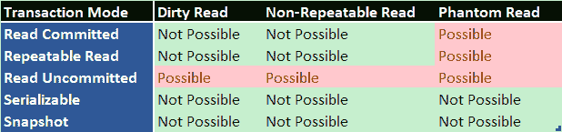

# SQL Server 事务和隔离级别

> 原文：<https://dev.to/techelevator/sql-server-transactions-read-modes-locks-and-deadlocks-4kgj>

作为开发人员，我们并不总是深入考虑数据库的内部结构，这可能会导致糟糕的性能和意外的并发问题。

本文介绍了我在深入研究 SQL Server 并发特性方面的学习进展。

在本文中，我们将讨论:

*   处理
*   读取模式

# 交易

默认情况下，当您编写 SQL 时，它在一个*自动提交事务*中运行，这意味着每条语句在执行后都会被提交到数据库。

这在许多情况下是没问题的，但是如果您有一个复杂的操作，您想要一次修改多个表，并且这些修改必须一起进行或者根本不进行，以防止数据完整性问题，该怎么办呢？虽然[约束](https://dev.to/integerman/name-your-constraints-4n10)可以帮助加强数据完整性，但有时您需要更多。

交易在此提供帮助。

根据 SQL Server 的文档

> 事务是一个工作单元。如果事务成功，事务期间所做的所有数据修改都会被提交，并成为数据库的永久部分。如果事务遇到错误，必须取消或回滚，则所有数据修改都将被擦除。

一个事务看起来如下:

```
BEGIN TRANSACTION

   INSERT INTO 
       dbo.Resumes (FirstName, LastName, Url) 
   VALUES 
       ('Matt', 'Eland', 'SomeActualUrl');
   GO

   UPDATE
       dbo.ResumeCounts
   SET
       ResumeCount = ResumeCount + 1
   WHERE
       ResumeType in ('Awesome', 'Code Monkey', 'Manager', 'Mentor')
   GO

COMMIT TRANSACTION 
```

Enter fullscreen mode Exit fullscreen mode

这里我们想插入到`Resumes`表中，并在一个事务中更新`ResumeCounts`表。如果第二条语句出错，我们需要回滚事务，并从 Resumes 表中删除 Matt Eland。这项交易为我们解决了这个问题。

此外，如果您只想查看一个语句是否执行并了解有多少行被更新，您可以使用一个`ROLLBACK TRANSACTION`语句。我经常推荐在`ROLLBACK TRANSACTION`中运行语句来检查错误，并在将事务更改为`COMMIT TRANSACTION`之前作为健全性检查。

# 读取模式

事务有一种叫做*读取模式*的东西，控制它们使用什么类型的锁定策略。

[](https://res.cloudinary.com/practicaldev/image/fetch/s--xxxdnWt_--/c_limit%2Cf_auto%2Cfl_progressive%2Cq_auto%2Cw_880/https://thepracticaldev.s3.amazonaws.com/i/88wrjng7hwe1o8omlf6k.png)

## 读犯

默认情况下，SQL Server 将以这种模式运行，并且只读取已提交的数据(非*脏*——当前正被另一个查询修改)。这可以防止所谓的*脏读*。

要激活此模式，请执行以下语句:

`SET TRANSACTION ISOLATION LEVEL READ COMMITTED`

## 读取未提交

Read Uncommitted 取消了数据必须处于完全提交状态的限制。这意味着 read uncommitted 绕过一些锁，以便读取当前可能具有中间值的行。

要激活此模式，请执行以下语句:

`SET TRANSACTION ISOLATION LEVEL READ UNCOMMITTED`

## 可重复读取

`Repeatable Read`为`Read Uncommitted`增加了一层额外的安全保障。除了读取尚未提交的内容之外，`Repeatable Read`还在相关的行上获取一个共享锁，以防止它们在事务结束之前被进一步更新。这意味着在事务期间对这些行的任何后续读取都将产生相同的结果。这个用`Read Uncommitted`就不一定了。

一般来说，共享锁的额外开销会让`Repeatable Read`变得不那么令人满意，但是在某些情况下使用它们可能会有好处。

要激活此模式，请执行以下语句:

`SET TRANSACTION ISOLATION LEVEL REPEATABLE READ`

## 可序列化

Serializable 是一种极端的措施，要求完全控制被修改的行的范围。它不会读取未提交的数据，也不允许其他事务读取它正在修改的数据。因此，它需要独占锁，导致其他事务等待它完成。这也防止其他行被添加到记录集中，防止所谓的*幻像读取*。

这以牺牲性能为代价，具有很高的数据完整性和安全性。

要激活此模式，请执行以下语句:

`SET TRANSACTION ISOLATION LEVEL SERIALIZABLE`

## 快照

Snapshot 是 SQL Server 的一个特定选项，它可以在事务开始时有效地获取正在评估的行的快照。

这将绕过数据库上的其他锁定操作，但是事务期间发生的任何更新都将对该事务不可用。此外，数据库必须通过`ALLOW_SNAPSHOT_ISOLATION`选项启用快照。

要激活此模式，请执行以下语句:

`SET TRANSACTION ISOLATION LEVEL SNAPSHOT`

* * *

事务是在更新和插入脚本期间管理数据完整性的一个很好的工具，这些脚本经常涉及多个表。

接下来，我们将讨论[锁定](https://dev.to/integerman/sql-server-locking-4beo)。

[](/techelevator) [## SQL Server 锁定

### matt Eland for Tech Elevator 2019 年 9 月 10 日 3 分钟阅读

#sql #sqlserver #performance #database](/techelevator/sql-server-locking-4beo)