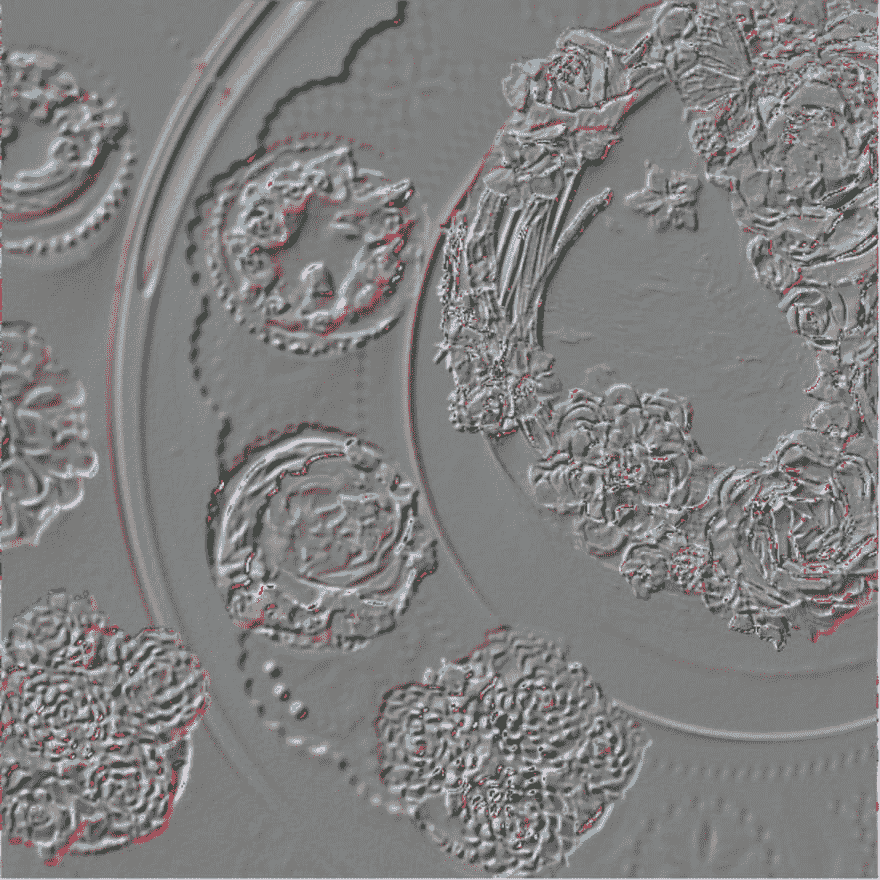

# AssemblyScript 简介:如何让 JavaScript 程式设计人员更轻松地建立 web 组件

> 原文:[https://dev . to/gonzaloruizdevilla/web assembly-para-JavaScript ers-472 l](https://dev.to/gonzaloruizdevilla/webassembly-para-javascripters-472l)

*TL；dr assembly y script 简介:我解释了 WebAssembly 是什么，为什么 assembly y script 是 JavaScript 程序员的一个有趣的 web set 构建替代方案，并评论了一个简单的图像处理项目，该项目允许比较 JavaScript 和 assembly y script 实现。*

WebAssembly 是一项重大的网络革命，但它既不是 web，也不是程序集。WebAssembly(也称为 Wasm)是一种高效、安全、低阶的 Web 字节代码。

也就是说，一方面不是汇编语言，而是字节码。虽然两者都是相似的，但它们虽然不是高级语言，但可以合理地理解，而机器代码却不是这样。这将它们置于高级语言和机器代码之间的中间语言类别中。汇编语言和字节代码的主要区别在于前者是为 CPU 创建的，后者是为虚拟机创建的，即一个用于硬件，另一个用于软件。

顺便说一下，有一个位元组码的文字版本叫做 web assembly text format(web assembly text format)或 wat(wat)。

此外，虽然它被称为 Web，但它不仅适用于 Web，因为它可以用于桌面应用程序、无服务器应用程序，甚至用于加密和 Smart contracts。

# [](#efficiente)效率

WebAssembly 的设计具有非常紧凑的二进制文件格式，可快速下载和编译计算机代码。因此，它甚至允许您在下载代码的同时编译代码。此功能称为流编译。

从 JavaScript 使用 wam 模块就像:
一样简单

```
async function run() {
  const {instance} = await WebAssembly.instantiateStreaming(
    fetch("./add.wasm"),
    env: { abort: () => console.log("Abort!") }
  );
  const r = instance.exports.add(1, 2);
  console.log(r);
}
run(); 
```

surma[【https://dassaur . ma/things/raw-Wasm/](https://dassur.ma/things/raw-wasm/)提出的以下装入 wasm 模块的方法将使您能够有力地使用流编译。即使“T0”未正确设置为 application/wam(例如导致 Firefox 崩溃)或使用 Safari(仍不支持即时浏览)时仍能正常工作]

```
async function maybeInstantiateStreaming(path, ...opts) {
  // Start the download asap.
  const f = fetch(path);
  try {
    // This will throw either if `instantiateStreaming` is
    // undefined or the `Content-Type` header is wrong.
    return WebAssembly.instantiateStreaming(
      f,
      ...opts
    );
  } catch(_e) {
    // If it fails for any reason, fall back to downloading
    // the entire module as an ArrayBuffer.
    return WebAssembly.instantiate(
      await f.then(f => f.arrayBuffer()),
      ...opts
     );
  }
} 
```

# [](#seguro)保险

为了提供一个保护我们免受恶意攻击的安全环境，我们在网络上做了大量工作，wam 也在继续这样做。例如，JavaScript 在安全沙箱中运行，该沙箱将 JavaScript 与生产环境隔离开来。因此，必须像在 JavaScript 中一样使用 Web 文件 Api 来访问文件系统。

# [](#bytecode)字节码

wam 设计的主要目标是将其编码为二进制格式，这种格式在大小和加载时间方面非常有效，能够以本机速度运行，并且能够利用各种平台的通用硬件功能。

这些目标迫使您构建新的东西(使用 asm.js 作为起点)，而不是使用 LLVM、Java 字节代码或. Net。这样，就设计了一种新的二进制指令格式，它是 c、C++或 Rust 等高级语言的编译目标。

# [](#-raw-wat-endraw-should-i-do-if-i-want-to-program-webassembly)`Wat`想编程 WebAssembly 应该怎么做？

知识没有地位，所以如果你想学 wat！，尽管检查以下代码，但如果您精通 JavaScript，您可能会喜欢一些更简单的替代方法:

```
(;
  Filename: add.wat
  This is a block comment.
;)
(module
  (func $add (param $p1 i32) (param $p2 i32) (result i32)
    local.get $p1 ;; Push parameter $p1 onto the stack
    local.get $p2 ;; Push parameter $p2 onto the stack
    i32.add ;; Pop two values off the stack and push their sum
    ;; The top of the stack is the return value
  )
  (export "add" (func $add))
) 
```

如果你的是 JavaScript，那么 c、C++、拉斯特和类似的语言也可能对你没有吸引力，尽管这种情况可能需要很长时间才能改变。幸运的是，与此同时，还有一个选择适合你:AssemblyScript

# [](#assemblyscript)汇编脚本

AssemblyScript (AS)是 TypeScript 的子集，而 type script 又是包含类型的 JavaScript。TypeScript 的这一子集可以方便地编译到 wam 中，使我们能够利用 JavaScript 知识开发 wam。

为了说明 JavaScript 和 TypeScript 的相似性，我准备了这个小项目，在其中我使用 JavaScript 和 TypeScript 处理图像。你可以在这里找到它:[https://github . com/gonzaluzdevilla/image-manipulation-assembly sys script](https://github.com/gonzaloruizdevilla/image-manipulation-assemblyscript)

专案会显示载入到画布和数个按钮中的影像，这些按钮会将不同的筛选套用至影像。这些按钮将使用 JavaScript 或由 AssemblyScript 生成的 wam 运行过滤器:

[T2】](https://res.cloudinary.com/practicaldev/image/fetch/s--7ZtOiyAu--/c_limit%2Cf_auto%2Cfl_progressive%2Cq_auto%2Cw_880/https://github.com/gonzaloruizdevilla/image-manipulation-assemblyscript/blob/master/article_images/1.png%3Fraw%3Dtrue)

通过应用过滤器，我们将得到如下图像:

[T2】](https://res.cloudinary.com/practicaldev/image/fetch/s--DzUy6Iib--/c_limit%2Cf_auto%2Cfl_progressive%2Cq_auto%2Cw_880/https://github.com/gonzaloruizdevilla/image-manipulation-assemblyscript/blob/master/article_images/2.png%3Fraw%3Dtrue)

[T2】](https://res.cloudinary.com/practicaldev/image/fetch/s--aAAZxCoU--/c_limit%2Cf_auto%2Cfl_progressive%2Cq_auto%2Cw_880/https://github.com/gonzaloruizdevilla/image-manipulation-assemblyscript/blob/master/article_images/3.png%3Fraw%3Dtrue)

[T2】](https://res.cloudinary.com/practicaldev/image/fetch/s--Ne99KwZm--/c_limit%2Cf_auto%2Cfl_progressive%2Cq_auto%2Cw_880/https://github.com/gonzaloruizdevilla/image-manipulation-assemblyscript/blob/master/article_images/4.png%3Fraw%3Dtrue)

要使用该项目，在从 Github 克隆后，可以安装 AssemblyScript 依赖项，并使用以下语句编译 AssemblyScript index.ts 文件:

```
npm install npm run asbuild 
```

有趣的是，从 JavaScript 调用 wam 函数时，调用参数只能是以下类型:

*   i32: 32 位整数
*   i64: 64 位整数
*   f32: 32 位浮点型
*   f64: 64 位浮点

显然，我们不能通过呼叫 wam 的参数传递图像。因此，若要将影像资讯传送至 wam，您必须先将影像资讯放在 JavaScript 与 wam 之间的共用记忆体区域中，这个共用记忆体区域是借由建立 WebAssembly.Memory 类别所建立的。然后在建立 wam 模组时会使用此实体，如下所示:

```
//A memory created by JavaScript or in WebAssembly code will be accessible and mutable from both JavaScript and WebAssembly.

const memory = new WebAssembly.Memory({ initial:initial * 2 });

//Instantiating Wasm module

const importObject = { env: { memory, abort: () => console.log("Abort!") }};
const {instance} = await WebAssembly.instantiateStreaming(
    fetch("./build/untouched.wasm"),
    importObject
);

//Creating a typed array reference to write into the memory buffer
const mem = new Uint8Array(memory.buffer); 
```

在调用 wam 之前，我们将画布图像数据复制到共享内存中。然后，我们调用 wam 过滤器，阅读响应并将其保存在 imageData 中，最后，我们将 imageData 发送到画布的上下文中，以便重新绘制图像。

```
//retrieve image pixels (4 bytes per pixel: RBGA)
const data = imageData.data;
//copy to bytes to shared memory
mem.set(data);

//invoque 'fn'  Wasm filter. We need to inform of the image byte size
const byteSize = data.length;
instance.exports[fn](byteSize, ...args);

//copy the response from the shared memory into the canvas imageData
data.set(mem.slice(byteSize, 2*byteSize))
//update canvas
ctx.putImageData(imageData, 0, 0); 
```

在项目中，JavaScript 和 AssemblyScript 都有四个处理函数:reverse、grayscale、sepia 和 como(后者用于应用 blur、edge detection 和 emboss 滤镜)。如我们所见，它们非常相似:

```
function invert(data) {
    for (var i = 0; i < data.length; i += 4) {
        data[i]     = 255 - data[i];     
        data[i + 1] = 255 - data[i + 1]; 
        data[i + 2] = 255 - data[i + 2]; 
    }
};

function grayscale(data){
    for (var i = 0; i < data.length; i += 4) {
        const avg = 0.3  * data[i] + 0.59 * data[i + 1] + 0.11 * data[i + 2];
        data[i]     = avg;  
        data[i + 1] = avg; 
        data[i + 2] = avg; 
    }
}

function sepia(data){
    for (var i = 0; i < data.length; i += 4) {
        const avg = 0.3  * data[i] + 0.59 * data[i + 1] + 0.11 * data[i + 2];
        data[i]     = avg + 100;  
        data[i + 1] = avg + 50; 
        data[i + 2] = avg; 
    }
}

function addConvolveValue(pos, i, data, length){
    return pos >= 0 && pos < length ? data[pos] : data[i];
}

function convolve(data, w, offset, v00, v01, v02, v10, v11, v12, v20, v21, v22){
    console.log( w, offset, v00, v01, v02, v10, v11, v12, v20, v21, v22)
    const divisor = (v00 + v01 + v02 + v10 + v11 + v12 + v20 + v21 + v22) || 1;
    const length = data.length;
    let res = 0;
    let newData = new Uint8Array(length)
    for(let i = 0; i < length; i++){
        if ((i + 1) % 4 === 0) {
            newData[i] = data[i];
            continue;
        }
        let res = v00 * addConvolveValue(i - w * 4 - 4, i, data, length) +
                    v01 * addConvolveValue(i - w * 4, i, data, length) +
                    v02 * addConvolveValue(i - w * 4 + 4, i, data, length) +
                    v10 * addConvolveValue(i - 4, i, data, length) +
                    v11 * data[i] +
                    v12 * addConvolveValue(i + 4, i, data, length) +
                    v20 * addConvolveValue(i + w * 4 - 4, i, data, length) +
                    v21 * addConvolveValue(i + w * 4 , i, data, length) +
                    v22 * addConvolveValue(i + w * 4 + 4, i, data, length);
        res /= divisor;
        res += offset;
        newData[i] = res;
    }
    data.set(newData)
} 
```

现在是 AssemblyScript 版本:

```
/// <reference path="../node_modules/assemblyscript/dist/assemblyscript.d.ts" />

export function invert(byteSize: i32): i32 {
  for (var i = 0; i < byteSize; i += 4) {
    let pos = i + byteSize; 
    store<u8>(pos, 255 - load<u8>(i));
    store<u8>(pos + 1, 255 - load<u8>(i + 1));
    store<u8>(pos + 2, 255 - load<u8>(i + 2));
    store<u8>(pos + 3, 255);
  }
  return 0;
}

export function grayscale(byteSize: i32): i32 {
  for (var i = 0; i < byteSize; i += 4) {
    let pos = i+byteSize;
    const avg = u8(0.3  *  load<u8>(i) + 0.59 * load<u8>(i + 1) + 0.11 * load<u8>(i + 2));
    store<u8>(pos, avg);
    store<u8>(pos + 1, avg);
    store<u8>(pos + 2, avg);
    store<u8>(pos + 3, 255);
  }
  return 0;
}

export function sepia(byteSize: i32): i32 {
  for (var i = 0; i < byteSize; i += 4) {
    let pos = i+byteSize;
    const avg = 0.3  *  load<u8>(i) + 0.59 * load<u8>(i + 1) + 0.11 * load<u8>(i + 2);
    store<u8>(pos, u8(min(avg + 100, 255)));
    store<u8>(pos + 1, u8(min(avg + 50, 255)));
    store<u8>(pos + 2, u8(avg));
    store<u8>(pos + 3, 255);
  }
  return 0;
}

@inline
function addConvolveValue(pos:i32, oldValue:u8, length:i32): i32 {
  return pos >= 0 && pos < length ? load<u8>(pos) : oldValue;
}

export function convolve(byteSize:i32, w:i32, offset:i32, v00:i32, v01:i32, v02:i32, v10:i32, v11:i32, v12:i32, v20:i32, v21:i32, v22:i32): i32 {
  let divisor = (v00 + v01 + v02 + v10 + v11 + v12 + v20 + v21 + v22) || 0;
  if (divisor === 0) {
    divisor = 1;
  }
  for(let i = 0; i < byteSize; i++){
      if ((i + 1) % 4 === 0) {
        store<u8>(i+byteSize, load<u8>(i));

      } else {
        let oldValue = load<u8>(i);
        let prev = i - w * 4;
        let next = i + w * 4;
        let res = v00 * addConvolveValue(prev - 4, oldValue, byteSize)  +
                  v01 * addConvolveValue(prev, oldValue, byteSize)      +
                  v02 * addConvolveValue(prev + 4, oldValue, byteSize)  +
                  v10 * addConvolveValue(i - 4, oldValue, byteSize)     +
                  v11 * oldValue +
                  v12 * addConvolveValue(i + 4, oldValue, byteSize)     +
                  v20 * addConvolveValue(next - 4, oldValue, byteSize)  +
                  v21 * addConvolveValue(next , oldValue, byteSize)     +
                  v22 * addConvolveValue(next + 4, oldValue, byteSize);
        res /= divisor;
        res += offset;
        store<u8>(i+byteSize, u8(res));
      }
  }
  return 0;
} 
```

你可以看到，代码非常相似，但与类型和工作水平稍低，这使我们能够充分利用 wam 的潜力。于是，∞只需振作起来，开始玩 AssemblyScript，并对 wam 技术抱有信心，这将成为未来几年网络中日益重要的一部分。

# 参考文献

网络大会[https://webassembly.org/](https://webassembly.org/)

WebAssembly:既不是 Web，也不是 Assembly，而是革命性的[https://www . JavaScript January . com/blog/Web Assembly-not-Web-not-Assembly-but-Revolutionary](https://www.javascriptjanuary.com/blog/webassembly-neither-web-nor-assembly-but-revolutionary)

raw web assembly[https://dassur.ma/things/raw-wasm/](https://dassur.ma/things/raw-wasm/)
了解文本格式[https://developer . Mozilla . org/en-US/docs/web assembly/Understanding _ the _ Text _ Format](https://developer.mozilla.org/en-US/docs/WebAssembly/Understanding_the_text_format)

手动编写 web assembly[https://blog . Scott logic . com/2018/04/26/web assembly-by-Hand . html](https://blog.scottlogic.com/2018/04/26/webassembly-by-hand.html)

WebAssembly 文本格式[https://webassembly.github.io/spec/core/text/index.html](https://webassembly.github.io/spec/core/text/index.html)

让 WebAssembly 更快:Firefox 新的流和分层编译器[https://hacks . Mozilla . org/2018/01/making-web assembly-even-faster-Firefox-new-streaming-and-tiering-compiler/](https://hacks.mozilla.org/2018/01/making-webassembly-even-faster-firefoxs-new-streaming-and-tiering-compiler/)

WebAssembly，浏览器字节码[https://www.scriptol.com/programming/wasm.php](https://www.scriptol.com/programming/wasm.php)T2】ASM . js 规范工作草案[http://asmjs.org/spec/latest/](http://asmjs.org/spec/latest/)

WebAssemblyMemory()[https://developer . Mozilla . org/en-US/docs/Web/JavaScript/Reference/Global _ Objects/Web assembly/Memory](https://developer.mozilla.org/en-US/docs/Web/JavaScript/Reference/Global_Objects/WebAssembly/Memory)

画布中的像素操作[http://www.phpied.com/pixel-manipulation-in-canvas/](http://www.phpied.com/pixel-manipulation-in-canvas/)

画布像素#2:卷积矩阵[https://www.phpied.com/canvas-pixels-2-convolution-matrix/](https://www.phpied.com/canvas-pixels-2-convolution-matrix/)