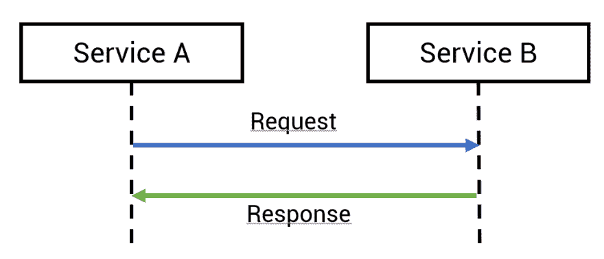
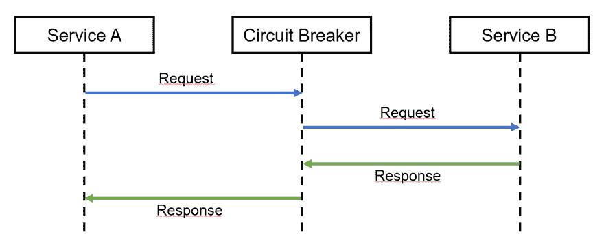
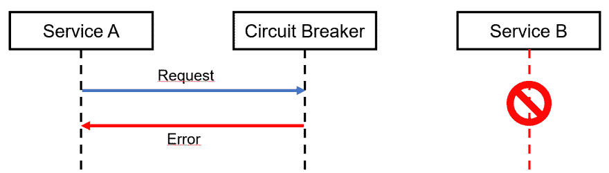
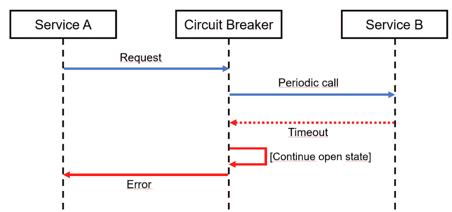
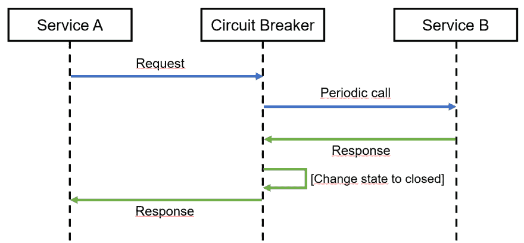

# 使系统更有弹性(1) -断路器

> 原文：<https://dev.to/ikrnic/making-systems-more-resilient-1-circuit-breaker-477e>

事情发生了变化。通常在生产中。在这一系列文章中，我们将介绍各种使您的系统更具弹性的机制，以便您的用户永远不会经历真正的中断，尽管在您的引擎盖下可能存在问题。

**断路器**有一个有趣的名字，来源于物理电气世界中的类比。每个正派的电工都认识到玩电是危险的，她必须安装安全机制，以便在一个设备出现故障时保护电网的其他部分。电工是做什么的？他们安装**保险丝**。如果一个设备(比如烤面包机！)发生故障并产生短路时，强电流将流过网络，导致损坏、过热并可能引发火灾。**除非网络中有保险丝！**如果有强电流流过，保险丝将会熔化或断开电路，停止电流并保护网络的其余部分。

软件中的断路器机制非常像现实世界中的保险丝。假设您的一个服务正在调用另一个服务:

如果服务 B 停止响应，服务 A 将耐心等待直到超时，然后抛出异常或返回可疑的结果。这些都是不可接受的。我们需要一个更好的解决方案来防止整个系统崩溃。这就是断路器发挥作用的地方。

断路器位于两个服务之间，服务呼叫通过它。如果一切正常，断路器只是让电话通过。服务 B 不响应会怎样？

断路器将检测到这种情况，并返回一个错误或替代响应。用电气术语来说，断路器会**“打开电路”**。此外，断路器会记住服务 B 已关闭，无论谁调用服务 B，都会立即得到一个错误，断路器甚至不会将请求传递给服务 B。断路器会定期将其中一个请求传递给服务 B，只是为了检查服务 B 是否仍然关闭。如果是这样，断路器将继续返回一个错误，甚至不会将请求传递给服务 b。

另一方面，如果服务 B 恢复并返回有效结果，断路器将检测到该情况，将结果返回给调用者(服务 A)并再次**“闭合电路”**，即继续将所有请求传递给服务 B。

当断路器检测到被叫服务关闭时，它可以做各种事情。它可以向调用者返回一个有意义的错误，但也可以返回一个“足够好”的结果，为用户提供一些价值。

让我们以一个银行应用程序为例，它显示了通过单独的服务获取的账户余额。如果服务中断，断路器可以从缓存中返回最后一次已知余额。昨天的平衡在今天可能不再有效，但伴随着适当的信息，总比什么都没有好。

*“尊敬的客户，目前我们在获取您的余额时遇到一些问题，但您 3 小时前的余额是 234.55 欧元”*比*“您的余额在任何时候都是零”*。当然，断路器返回什么，需要从商业角度仔细思考。

断路器真的很酷。在本系列的第 2 部分中，我们将揭开盖子，展示具体的断路器实现。

—照片由 Pexels 的 rawpixel.com 拍摄。