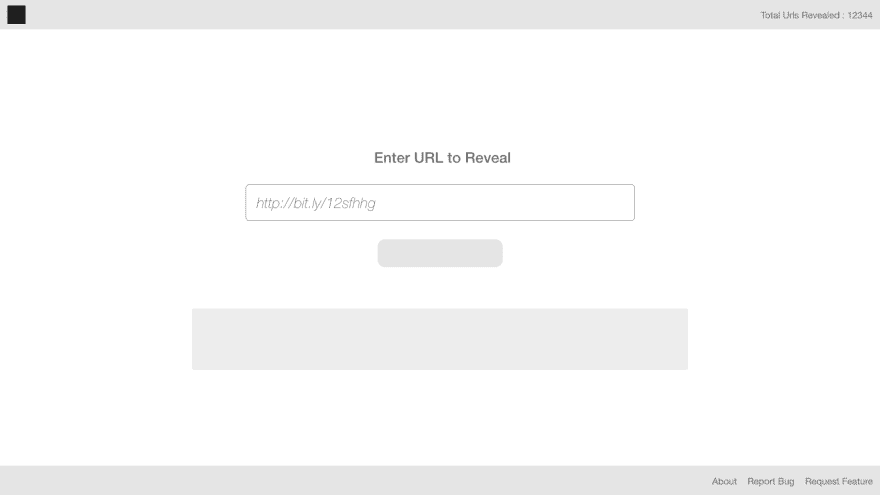
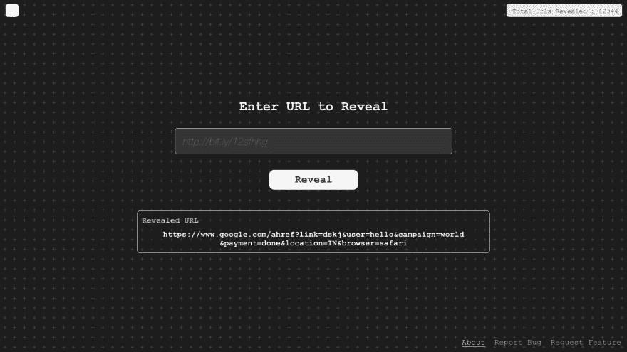
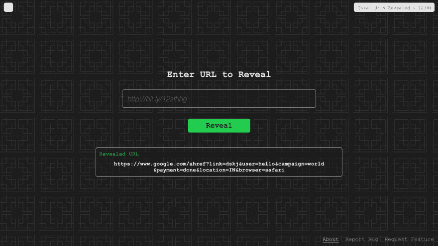
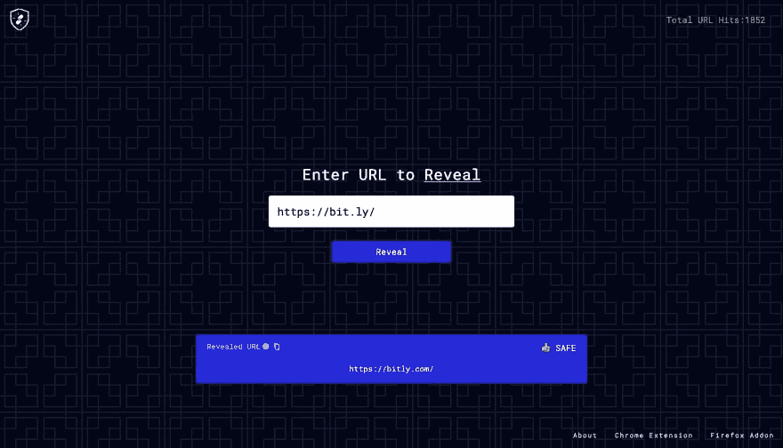
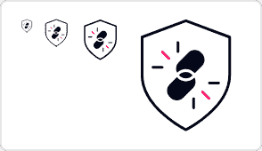

# 嗯，我们做了一个工具——RevealURL，并从中受益。

> 原文:[https://dev . to/sarathsantoshdamaraju/well-we-made-a-tool-revealurl-and-benefit-gb7](https://dev.to/sarathsantoshdamaraju/well-we-made-a-tool-revealurl-and-benefited-from-it-gb7)

[T2】](https://res.cloudinary.com/practicaldev/image/fetch/s--IHNJHs-T--/c_limit%2Cf_auto%2Cfl_progressive%2Cq_auto%2Cw_880/https://cdn-images-1.medium.com/max/2600/1%2AOvsBkULvtggh2f9_-G9bCw.jpeg)

TLDR；我设计了我的第一个应用程序，我纠正了我作为开发者的错误，我使用了一些令人惊叹的分析工具，我们在 PH 上发布了应用程序，我们为 OSS 做出了贡献😍

* * *

一个随意的想法变成了一个工具- **RevealUrl** ，它可以帮助你在任何页面上找到垃圾链接。从最初的讨论到这篇博客，我有一些心得想与社区分享，简单来说。

所以，这个想法的幕后推手和负责后端工作的人是[高拉夫·尚卡尔](https://grvsh.xyz)和[我是](https://krishnasarath.xyz)负责网页设计、开发和浏览器插件的人。因此，这篇博文将涵盖我的贡献。

为了便于理解，本文分为三个部分- **设计**、**开发**和**出版**。

## 🎨设计

虽然我尝试设计，但我并不完全是设计出身。我在空闲时间探索设计工具，这次是它的 [Adobe XD](https://www.adobe.com/products/xd.html) -一个免费的，几乎类似 SketchApp 的替代品，它内置的原型令人惊叹。

### App 设计

从设计师的角度来看，我对 UX 一无所知，所以理想情况下，我制作了一个我喜欢使用的页面——一个单页应用程序。我更喜欢简单易用的应用程序。它从一个简单的线框开始-

[T2】](https://res.cloudinary.com/practicaldev/image/fetch/s--t06pn2iK--/c_limit%2Cf_auto%2Cfl_progressive%2Cq_auto%2Cw_880/https://miro.medium.com/max/3840/1%2ACk2BmvbDonBCF1eHBAZrJA.png)

接下来是上色

[T6】](https://res.cloudinary.com/practicaldev/image/fetch/s--nnkm5Gyb--/c_limit%2Cf_auto%2Cfl_progressive%2Cq_auto%2Cw_880/https://miro.medium.com/max/3840/1%2AJuioBcPIRlBWS2f2IBGLyQ.png)

在这个过程中，一个想法出现了——“为什么我不能让它变得更有活力一点？”结果是每次你加载应用程序时，下面的原色之间的迭代。

[T2】](https://res.cloudinary.com/practicaldev/image/fetch/s--eDLx_nmT--/c_limit%2Cf_auto%2Cfl_progressive%2Cq_auto%2Cw_880/https://miro.medium.com/max/2200/1%2AR9ilePgYIjM76XXpV_oaCw.png)

最后的结果是下面的界面-

[T2】](https://res.cloudinary.com/practicaldev/image/fetch/s--uNI7MqzT--/c_limit%2Cf_auto%2Cfl_progressive%2Cq_auto%2Cw_880/https://miro.medium.com/max/5760/1%2AGQra8zoEZULtO8xRCzBNbA.png)

### 标志制作

我必须说，标志制作是整个过程中最难的部分，为什么-太多的想法，adobe XD 的可能性越来越小，需要太多的创造力。解决方案是，下载一个免费的 SVG 并编辑🤷‍♂

[T2】](https://res.cloudinary.com/practicaldev/image/fetch/s--Btr1kil0--/c_limit%2Cf_auto%2Cfl_progressive%2Cq_auto%2Cw_880/https://miro.medium.com/max/588/1%2A_mk-7JT-4jzYbLjlv1sWvw.png)

### 使用的工具

[英雄模式](https://www.heropatterns.com)
[Flaticon](https://www.flaticon.com)
[酷派](https://projects.coolors.co)

* * *

## 👨‍💻发展

我有时觉得框架让我们变得懒惰&不好，这次就是这样。你可能不同意，但是感情不是相互的。原因是，像编辑器配置、林挺和分发这样的基本要求在我编码时从未出现过。

用普通的 HTML 编码，做决定的唯一时间是

*   `reboot.css`或`normalize`
*   `jQuery`还是没有以`reboot and jquery`结束。让我们试试它只是一个简单的工具！！

开发过程中唯一的挑战是浏览器插件的制作。从 Chrome 插件开始，我想对 Firefox 也使用相同的代码。经过一点阅读，对于我的使用(**存储、通知和活动标签**)，我只需要用`window.browser`替换`window.chrome` API 就可以让 firefox 工作了。这就是我的第一个半交叉浏览器插件😄

可以在这里下载-  | 

### 使用的工具

[语义版本](https://semver.org)
[编辑配置](https://editorconfig.org)
[咕哝](https://gruntjs.com)

* * *

## 出版

当你在浏览器商店发布插件时，你需要为 Chrome 商店和 T2 火狐浏览器一次性支付 5 美元的费用🦊永远是自由友好的。提交花了很少时间，而且 Chrome 和 Firefox 中有太多关于插件用户安全的政策，他们只需要你的代码。简单吧？

作为一个简单的工具，它不会从访问者那里收集任何个人或敏感信息，我们很想了解访问者在应用程序中的互动。因此，在这个过程中，我们学习了以下工具的基本用法-

[堆](https://heap.io)
堆[堆](https://analytics.google.com)堆
堆[堆](https://freshmarketer.com)

最后，我们推出的首选平台是[产品搜索](https://www.producthunt.com/posts/revealurl)(显然😁)连同我们社交手柄上的小鼓声🥁。 **PH 在 PST** 上工作，如果你在一天的晚些时候发布一个产品，它将自动被安排在第二天发布。在 PH 上，白天的活动比晚上多，所以 PH 这样做是为了吸引更多的观众。谢谢🙌PH 值。

最后，这是当天的第三个产品。

所以，最后的想法。

> 任何开发人员都非常需要助手。通过他们有可能学到一些新东西。

我们❤️ OSS 并公开了[代码([https://github.com/team-underscore](https://github.com/team-underscore))。一定要分享拥抱或虫子。

干杯，KD🤘

-最初在此发布