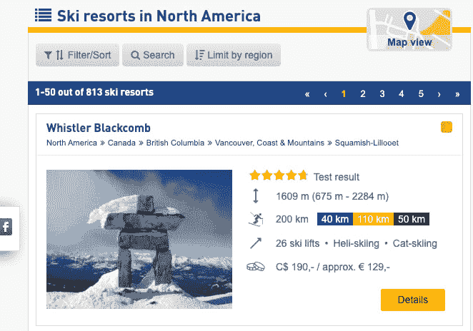
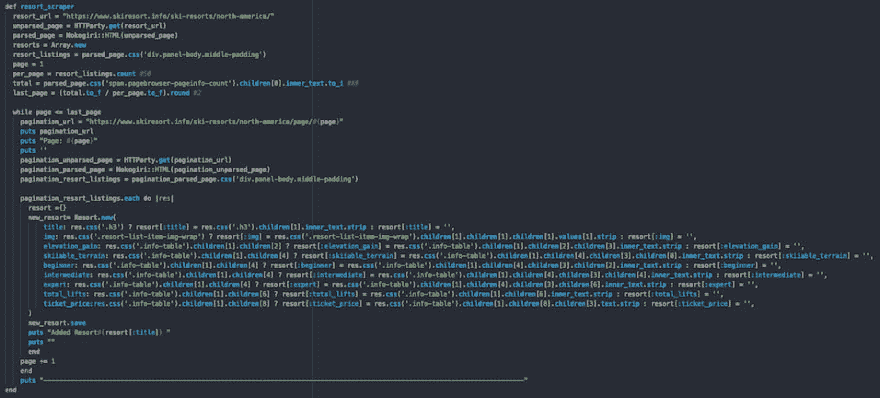

# 自定义 API 的 Web 抓取

> 原文:[https://dev.to/sofiajonsson/web-scraping-for-custom-api-6dp](https://dev.to/sofiajonsson/web-scraping-for-custom-api-6dp)

### [T1】简介](#intro)

对于我在熨斗学校的最后一个项目，我决定要建立一个定制的**滑雪** *度假村**预报*和*雪情报告*跟踪应用程序。在科罗拉多州一个偏远的滑雪小镇呆了四年后，我最近搬回了西雅图地区，并决定建造一些我真正想要使用的东西。

这个想法源于我在计划周末活动时对西雅图附近不同城市天气的痴迷。我在哪里可以找到最温暖的天气？哪里有最多的阳光？最重要的是，哪里可以避雨？我在 iPhone 上的天气应用程序中跟踪这些信息，并根据收到的信息决定我的计划。

在冬天，我也喜欢做同样的事情，但是我会浏览各种网站，查看降雪报告、滑雪场门票价格和天气预报。我决定创建一个应用程序，整合我作为用户所重视的所有信息点，然后我可以在自己的个人页面上“收藏”它们并跟踪它们。

在计划好细节之后，我开始寻找免费和付费的在线 API。我很快意识到，没有任何在线资源能给我提供我想要的准确数据，更不用说得到一半的数据和一个合适的价格，所以我决定自学如何创建一个 web scraper。

### 刮削

我偶然发现了一个很棒的在线资源，它指导开发人员(你和我)利用 Ruby、Nokogiri 和 HTTParty 创建一个干净高效的抓取工具。我的项目的后端是用 Ruby on Rails 编写的，我强烈推荐观看这个 30 分钟的视频来创建一个基本而有效的 scraper。
 
[链接到 YouTube 视频](https://www.youtube.com/watch?v=b3CLEUBdWwQ)

### 数据来源

我的信息来源于一个公共网站，因为我的项目只是为了好玩和我的投资组合，我不会遇到任何版权问题。我决定从 *skiresort.info* 上刮下 3 个不同的页面，并将我的数据限制在北美的度假胜地。

[T2】](https://res.cloudinary.com/practicaldev/image/fetch/s--suVC-OL6--/c_limit%2Cf_auto%2Cfl_progressive%2Cq_auto%2Cw_880/https://thepracticaldev.s3.amazonaws.com/i/jrcmto3zaa955a39l4la.png)

我已经在底部链接了我的项目，如果有人有兴趣查看我的抓取文件。它位于*back _ end _ final/scraper . Rb*我相信我为我的项目收集了将近 90 份降雪报告、500 份左右的预报报告和将近 1300 个度假胜地。通过检查网站并瞄准我想要抓取的元素的特定 id，我可以在终端中四处玩，直到我有了每一点数据，在我的数据库中找到当天正确的天气图标。

### 潜水深

如果你看代码，你会注意到我的最后一个函数 **resort scraper** 充满了三元语句。
 
我在这个过程中遇到的最困难的事情之一就是处理不完整的数据。skiresort.info 在他们的网站上托管了如此多的数据，以至于他们无法保持每个度假村制服的可用数量。加拿大的一些小滑雪场根本没有惠斯勒或维尔那么多的信息。我通过利用三元语句并深入到第 n 个子元素来处理这个问题，以便为我的应用程序找到我想要的确切数据点。

它看起来很粗糙，我可能应该重构它，但是，嘿，它工作了！为一个项目提取我自己的数据是一件非常有趣的事情，我肯定会为我即将到来的项目使用 Web Scraper。我意识到 **Pow Tracker** *只*从你运行抓取功能的那一天开始抓取数据。由于这使得数据跟踪效率非常低，我想为自己设定一个扩展目标，使刮刀自动化，这样我就可以处理实时数据。

##  [索菲娅·约翰逊](https://github.com/sofiajonsson) / [ back_end_final](https://github.com/sofiajonsson/back_end_final)

### 熨斗学校后端电源跟踪器最终项目

<article class="markdown-body entry-content container-lg" itemprop="text">

# 欢迎来到战俘追踪器！

## 什么是能量追踪器？

这个应用程序是为滑雪爱好者或滑雪度假者创建的，用于查看北美不同滑雪胜地的统计数据、预测和积雪报告。想象一下，你正在盐湖城游览，想要充分利用你的滑雪之旅..你去哪里条件最好？你可以使用几个应用程序，或者用谷歌搜索几页，或者你可以使用战俘追踪器！Pow Tracker 从互联网上获取实时数据，为用户提供当前天气、降雪、度假村的地形以及每个度假村的费用等数据。作为该网站的访问者，您可以访问所有这些功能，但作为用户，您将能够“喜爱”一个度假胜地、预报和降雪报告，并将这些统计数据呈现在您的个性化网站上…

</article>

[View on GitHub](https://github.com/sofiajonsson/back_end_final)