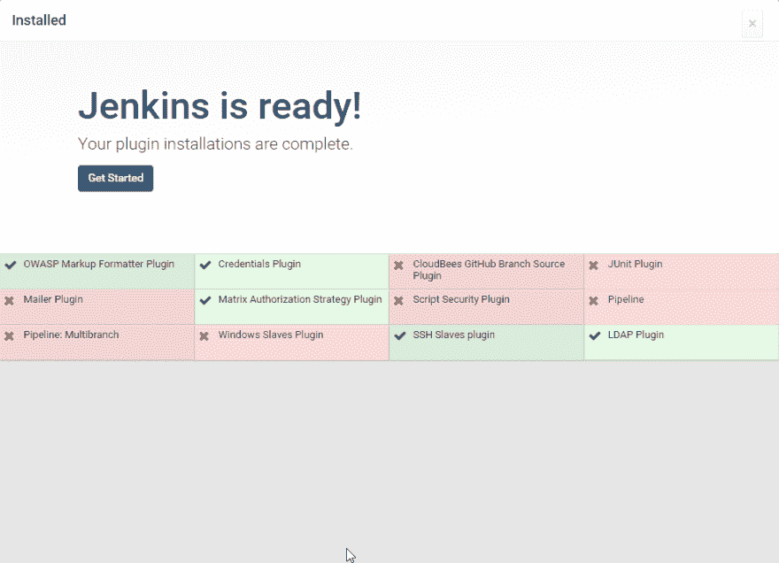

# 预装插件的自定义 jenkins 映像

> 原文:[https://dev . to/Rubin/custom-Jenkins-images-with-plugins-pre-installed-1 pok](https://dev.to/rubiin/custom-jenkins-images-with-plugins-pre-installed-1pok)

如果你在做持续交付或者持续集成，你可能会经常遇到 jenkins。
Jenkins 是我们持续集成和持续部署(CI/CD)渠道的核心部分。以下是我们喜欢詹金斯的三大理由:

*   这是一个开放的系统，它不受平台、语言和方法的限制，允许我们用一个非专有的 CI/CD 平台来支持我们多样化的客户群。
*   它是 CI / CD 系统的行业参考实现，拥有超过 1，100 个插件的丰富生态系统，使客户能够添加各种功能，并将 Jenkins 与从 Active Directory 到 GitHub 再到 OpenShift PaaS 的所有产品集成
*   它专注于 CI/CD，并不试图成为它不是的东西(Git 存储库、聊天客户端、Docker 存储等)。)使用 Jenkins 的好处在于，您不会被任何专有供应商所束缚。它在业界有很大的支持，许多工程师已经熟悉它。
*   此外，它提供了大量现成的功能，所以你不必搜索谷歌的黑客

然而，在使用 jenkins 的一段时间里，有一件事很痛苦，那就是最初的设置主要是在插件安装期间。我的意思是:

[T2】](https://res.cloudinary.com/practicaldev/image/fetch/s--G3GXmbL4--/c_limit%2Cf_auto%2Cfl_progressive%2Cq_auto%2Cw_880/https://i.imgur.com/i09ODkv.png)

[T2】](https://i.giphy.com/media/VbnUQpnihPSIgIXuZv/giphy.gif)

所以我写了一个定制的 jenkins 镜像，预装了所有的插件，一个默认用户，docker 和 docker-compose，安装给那些想不用配置
的人

```
FROM jenkins/jenkins

ENV JENKINS_USER admin
ENV JENKINS_PASS admin

# Skip initial setup
ENV JAVA_OPTS -Djenkins.install.runSetupWizard=false

COPY plugins.txt /usr/share/jenkins/plugins.txt
RUN /usr/local/bin/install-plugins.sh < /usr/share/jenkins/plugins.txt
USER root
RUN apt-get update \
    && apt-get install -qqy apt-transport-https ca-certificates curl gnupg2 software-properties-common 
RUN curl -fsSL https://download.docker.com/linux/debian/gpg | apt-key add -
RUN add-apt-repository \
   "deb [arch=amd64] https://download.docker.com/linux/debian \
  $(lsb_release -cs)  \
 stable"
RUN apt-get update  -qq \
    && apt-get install docker-ce -y
RUN usermod -aG docker jenkins
RUN apt-get clean
RUN curl -L "https://github.com/docker/compose/releases/download/1.24.0/docker-compose-$(uname -s)-$(uname -m)" -o /usr/local/bin/docker-compose && chmod +x /usr/local/bin/docker-compose
USER jenkins 
```

担心图像尺寸？别担心，我会掩护你的。我也碰巧为那些保守的:D 人写了另一张阿尔卑斯山的照片

```
FROM jenkins/jenkins:alpine

ENV JENKINS_USER admin
ENV JENKINS_PASS admin

# Skip initial setup
ENV JAVA_OPTS -Djenkins.install.runSetupWizard=false COPY plugins.txt /usr/share/jenkins/plugins.txt
RUN /usr/local/bin/install-plugins.sh < /usr/share/jenkins/plugins.txt
USER root
RUN apk add docker
RUN apk add py-pip
RUN apk add python-dev libffi-dev openssl-dev gcc libc-dev make
RUN pip install docker-compose
USER jenkins 
```

对于完整的源代码和 plugins.txt 文件，你可以在[https://github.com/rubiin/jenkins](https://github.com/rubiin/jenkins)查看我的回购

> 注意:我专门为一个项目写了这些图像，在这个项目中，我使用 docker-compose 来管理我的容器堆栈，所以可以随意省略 docker 和 compose 设置

[T2】](https://i.giphy.com/media/7XuPYJXaF1CBAmbwQQ/giphy.gif)