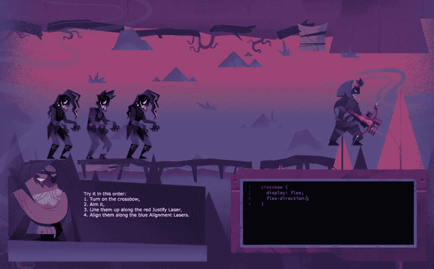
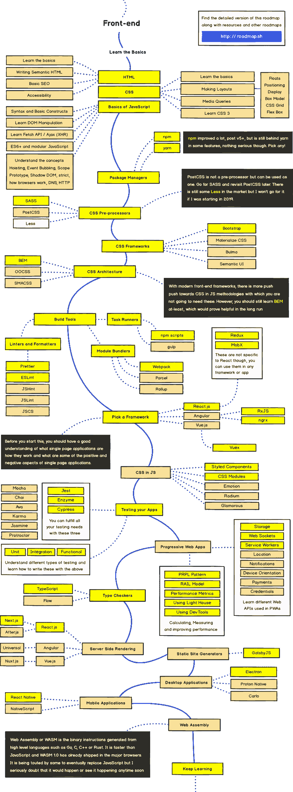
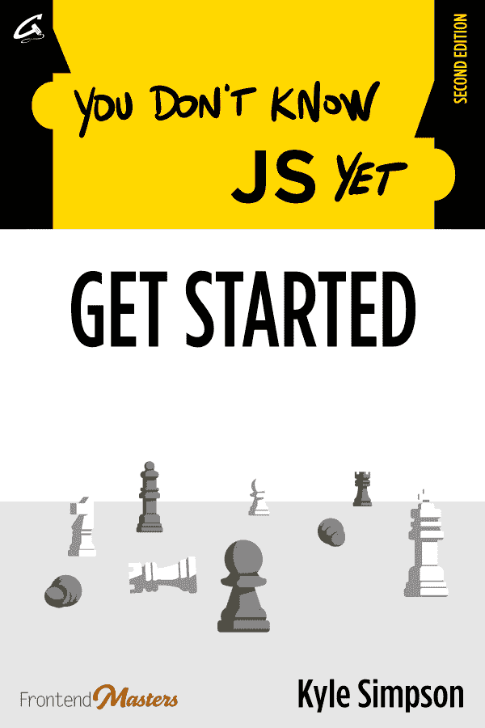
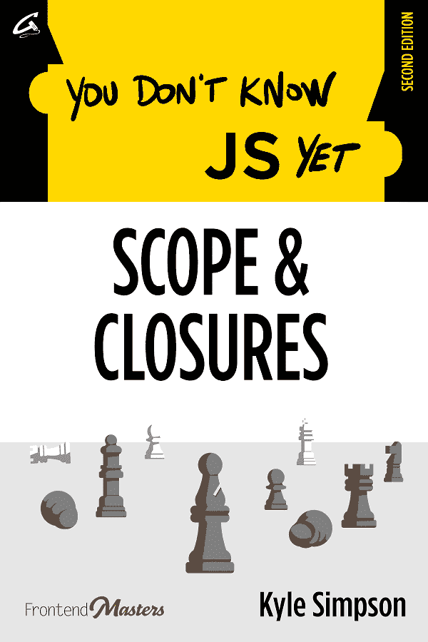

# 🌟🆓2019 年我们最喜欢的学习 web 开发的免费资源

> 原文:[https://dev . to/bytesizedcode/our-favorite-free-resources-for-learning-web-development-in-2019-4l 33](https://dev.to/bytesizedcode/our-favorite-free-resources-for-learning-web-development-in-2019-4l33)

所以，你决定学习网页开发。不错！坏消息是:网上有一百万种不同的学习 HTML、CSS 和 JavaScript 的资源，很难知道从哪里开始。

我们收集了一些我们喜欢的免费网络开发资源，包括一些视频、书籍和课程，以满足不同的学习风格和速度。我们错过了什么你从中学到了很多的东西吗？在推特上告诉我们吧！

> 克里斯蒂安[@ signalnerase](https://dev.to/signalnerve)这里有一个简短的列表，列出了一些学习和提升 javascript 的很好的资源...免费🆓🆓
> T15】📺“学习 JavaScript”三小时(！)vid 来自@ carnes beau[@ freeCodeCamp](https://twitter.com/freeCodeCamp)-[youtube.com/watch?v=PkZNo7…](https://t.co/DHWyCJruoo)
> 
> 💌 [#Javascript30](https://twitter.com/hashtag/Javascript30) 邮件课程来自[@ wesbos](https://twitter.com/wesbos)-[javascript30.com](https://t.co/57lsH9PMh1)
> 
> 更有⬇️2019 年 9 月 17:34pm-051013

## 📺录像

### [学习 JavaScript - freeCodeCamp](https://www.youtube.com/watch?v=PkZNo7MFNFg)

这个免费的，三个小时(！)JavaScript 课程是从 freeCodeCamp 编写 JavaScript 的精彩介绍。在撰写本文时，它已经有了近 200 万的浏览量，这是一个明显的成功，也是一个很好的起点。

[https://www.youtube.com/embed/PkZNo7MFNFg](https://www.youtube.com/embed/PkZNo7MFNFg)

### [2019 前端开发者速成班-设计课程](https://www.youtube.com/watch?v=8gNrZ4lAnAw)

在你的 web 开发职业生涯中，你会花很多时间将 HTML、CSS 和 JavaScript 结合在一起。这个来自 DesignCourse 的三小时的 HTML 和 CSS 之旅是一个很棒的介绍。

[https://www.youtube.com/embed/8gNrZ4lAnAw](https://www.youtube.com/embed/8gNrZ4lAnAw)

## 🍏课程

### [JavaScript 30-wes Bos](https://javascript30.com/)

永远伟大的 Wes Bos 有一个伟大的 30 天香草 JS(纯 JavaScript，没有框架，插件或扩展)课程，以帮助您了解您可以只用 JavaScript 构建什么。

> 韦斯博斯[@韦斯博斯](https://dev.to/wesbos)🔥宣布[# JavaScript 30](https://twitter.com/hashtag/JavaScript30)—30 天普通 JS 编码挑战。完全免费！
> 
> 👉【JavaScript30.com】2016 年 12 月 08 日下午 16:5511401629

### [Flexbox 僵尸-戴夫·格迪斯](https://mastery.games/p/flexbox-zombies)

Dave Geddes 开发了一个很棒的课程，通过一个基于网络的游戏来学习 CSS Flexbox 布局。)鼓励您通过超级互动和有趣的方式学习 Flexbox。这是学习如何编码的一个超级有趣的方法——我希望看到更多这种风格的游戏！

> <video loop="" controls=""><source src="https://video.twimg.com/ext_tw_video/859047079569747969/pu/vid/1162x720/NcXrMbUBdsWK1XnM.mp4" type="video/mp4"></video>戴夫·格迪斯@格迪斯基Flexbox 僵尸现已直播！狩猎愉快！
> 
> 2017 年 5 月 01 日下午 14:10212454

### [网络开发路线图- Kamran Ahmed](https://roadmap.sh/frontend)

这不完全是一门课程，但在更大范围内查看推荐的资源会很有用。如果您有兴趣查看普通开发人员在日常工作中使用的所有不同的工具、概念和理论，Kamran Ahmed 广受欢迎的路线图网站是一个很好的方式，可以从高层次了解您的 webdev 学习进度。

[T2】](https://roadmap.sh/frontend)

## 📚书

### [JavaScript 语法- JS 老师](http://www.javascriptgrammar.com/)

JS Teacher 的 JavaScript Grammar 是一个免费的、受社区支持的电子书，它教授许多新的 JavaScript 特性和语法的基础知识——这是一个很好的资源，特别是对于那些想要自信地使用该语言中最新的 JavaScript 特性的开发人员来说。

### [你不知道的 JavaScript——凯尔·辛普森](https://github.com/getify/You-Dont-Know-JS)

Kyle Simpson 是一名多产的 JavaScript 教师，他的免费书籍《你不知道的 JavaScript》由于其在 GitHub 上的共享而有了自己的生命。YDKJS 是一个非常受欢迎的文本，用于教授世界各地的开发人员(我在自己的教学中使用了它的许多图表——它太棒了！)，如果您想深入了解 JS 作为一种语言的一些特殊之处，这是适合您的文本。

## [getify](https://github.com/getify)/[You-don-Know-JS](https://github.com/getify/You-Dont-Know-JS)

### JavaScript 系列丛书。推特上的@YDKJS。

<article class="markdown-body entry-content container-lg" itemprop="text">

# 你还不知道 JS(丛书)-第二版

这是一系列深入探讨 JavaScript 语言核心机制的书籍。这是该书系列的第**第二版**:

 [ ...](https://leanpub.com/ydkjsy-scope-closures)

要阅读更多关于这本书背后的动机和观点，请查看[前言](https://raw.githubusercontent.com/getify/You-Dont-Know-JS/2nd-ed/preface.md)。

如果你在找以前的**初版**书，[可以在这里找到](https://github.com/getify/You-Dont-Know-JS/blob/1st-ed/README.md)。

## 首要赞助商

本版 **YDKJS** 丛书由[前端大师](https://frontendmasters.com)独家赞助。

Frontend Masters 是面向前端的软件开发中顶级专家培训材料的黄金标准。有超过 150 门关于前端的课程，这应该是你第一次也是唯一一次关于 HTML、CSS、JS 和相关技术的高质量视频培训。

* * *

我通过前端大师教授我所有的工作坊。如果你喜欢这本书的内容，请查看我的视频培训课程。

我想要…

</article>

[View on GitHub](https://github.com/getify/You-Dont-Know-JS)

* * *

嗨！欢迎来到 Bytesized Code，这是一个开发者社区，提供免费的在线聚会( [Byteconf](https://www.byteconf.com) )、视频教程([查看我们的 YouTube 频道](https://youtube.com/c/bytesizedcode))等等。

[**加入我们的简讯，每周在您的收件箱中获得最新的教程、技巧和 webdev 职业策略！**T3】](https://www.bytesized.xyz/newsletter/)

查看我们新成立的脸书团队“令人敬畏的网络开发”！

> 克里斯蒂安[@ signal nerve](https://dev.to/signalnerve)顺便说一句，我开始为其他语言和框架列出更多的这些列表——加入我的时事通讯，先听听它们吧！我每周都分享这类东西，还有来自 [@bytesizedcode](https://twitter.com/bytesizedcode) 和 [@byteconf](https://twitter.com/byteconf) 的新教程和在线聚会！😍
> 
> 2019 年 9 月 05 日下午 17:3412