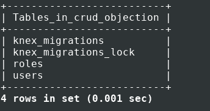
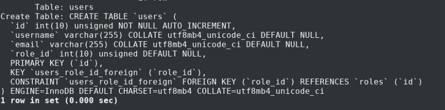

# NodeJS 中 SQL 的权威指南 with Objection.js + Knex —第 1 部分

> 原文：<https://dev.to/mrscx/a-definitive-guide-to-sql-in-nodejs-with-objection-js-knex-part-1-4c2e>

# 背景

我已经用了一段时间了。这是我在 NodeJS 应用程序中对 SQL 的介绍。它非常好，有一个非常好的界面，那些来自 MongoDB 和 mongoose 背景的人会喜欢类似的界面。

但是它也有问题。它太抽象了。有时候感觉 SQL 和 Sequelize 之间没有联系。它会生成意想不到的查询，与您实际想要做的相差甚远。即使简单的连接查询也会变得非常复杂。

此外，医生也帮不上忙，这是最糟糕的情况之一，它没有清楚地说明任何事情。

建立关系可能是一件痛苦的事情，很难理解到底发生了什么。当关联开始变得复杂时，一切都乱套了，你会想为什么你决定使用序列。这导致了各种“加载”错误。因此，出于极度的沮丧，我开始寻找不同的东西。这时候我发现了 Knex 和 Objection.js。

# Knex 是什么？

Knex 是一个查询构建器，不是一个完整的 ORM。您可以使用 Knex 来创建迁移、播种和查询数据库。它有各种你能想到的查询方法。从子查询到连接，它使它们变得简单明了。它生成预期的 SQL 查询。你写的就是你得到的。它还支持事务。这个 API 有一个 promise 接口，所以你可以同时使用 promises 和 async/await。

与 ORM 不同，您不需要在这里创建模型。您只需创建迁移，它会创建表并构建您的模式。在迁移运行之后，您可以使用 Knex 实例直接开始查询您的数据库。

# 什么是 Objection.js？

Objection.js 就是 ORM。它构建在 Knex 之上，并在 Knex 之上提供了一点抽象。您可以在这里定义模型，您可以使用这些模型在您的数据库表上运行查询。您可以定义各种 getter、setter，并在模型之间创建关系。Objection 使得定义模型和之间的关系变得容易，使用“EagerLoading”和其他一些辅助方法获取相关的数据。这也使得处理事务变得更加简单。

# 设置

在本指南中，我们将使用 MySQL 数据库。我们需要安装一些依赖项。首先，在你的系统中安装 NodeJS 和 NPM。

现在，在你的桌面或任何你想命名为“objection_crud”或任何你想命名的地方创建一个文件夹，这将是我们的项目文件夹，我们的代码将存放在这里。从控制台导航到该文件夹，并键入以下命令来初始化项目目录

```
npm init -y 
```

<svg width="20px" height="20px" viewBox="0 0 24 24" class="highlight-action crayons-icon highlight-action--fullscreen-on"><title>Enter fullscreen mode</title></svg> <svg width="20px" height="20px" viewBox="0 0 24 24" class="highlight-action crayons-icon highlight-action--fullscreen-off"><title>Exit fullscreen mode</title></svg>

然后使用 npm
安装依赖项

```
npm install --save mysql mysql2 knex objection 
```

<svg width="20px" height="20px" viewBox="0 0 24 24" class="highlight-action crayons-icon highlight-action--fullscreen-on"><title>Enter fullscreen mode</title></svg> <svg width="20px" height="20px" viewBox="0 0 24 24" class="highlight-action crayons-icon highlight-action--fullscreen-off"><title>Exit fullscreen mode</title></svg>

安装完成后，在 MySQL 中创建一个名为“objection_crud”或任何您想命名的名称的数据库。您可以通过 CLI 登录 MySQL 来创建它。很明显，你需要在你的电脑上安装 MySQL 来实现这个功能。您可以在网上找到各种关于如何为您的特定操作系统安装 MySQL 的指南。

然后从控制台
运行项目文件夹中的以下命令

```
knex init 
```

<svg width="20px" height="20px" viewBox="0 0 24 24" class="highlight-action crayons-icon highlight-action--fullscreen-on"><title>Enter fullscreen mode</title></svg> <svg width="20px" height="20px" viewBox="0 0 24 24" class="highlight-action crayons-icon highlight-action--fullscreen-off"><title>Exit fullscreen mode</title></svg>

这将使用 knex 初始化项目，并将生成一个名为 knexfile.js 的文件，该文件包含数据库连接配置。

用下面的代码替换该文件的内容

```
module.exports = {
  development: {
      client: ‘mysql’,
      connection: {
      host: ‘127.0.0.1’,
      user: ‘root’, // replace with your mysql username
      password: ‘123456’, // replace with your mysql password
      database: ‘objection_crud’
    },
    debug: true
  }
}; 
```

<svg width="20px" height="20px" viewBox="0 0 24 24" class="highlight-action crayons-icon highlight-action--fullscreen-on"><title>Enter fullscreen mode</title></svg> <svg width="20px" height="20px" viewBox="0 0 24 24" class="highlight-action crayons-icon highlight-action--fullscreen-off"><title>Exit fullscreen mode</title></svg>

见增加的选项**【调试:真】**。这将把 knex 生成的 SQL 和 Objection 打印到控制台。knex 将使用这些配置来创建与数据库的连接。

此外，您可以为数据库池添加选项。如果你不熟悉池的概念，你可以看看这个= >[https://stack overflow . com/questions/4041114/what-is-database-pooling](https://stackoverflow.com/questions/4041114/what-is-database-pooling)

基本上，它所做的是重用已经建立的数据库连接，而不是每次查询时都创建一个新的连接。要更改 knex 的默认池选项，您可以在调试选项
后添加以下选项

```
pool: { min: 2, max: 5 } 
```

<svg width="20px" height="20px" viewBox="0 0 24 24" class="highlight-action crayons-icon highlight-action--fullscreen-on"><title>Enter fullscreen mode</title></svg> <svg width="20px" height="20px" viewBox="0 0 24 24" class="highlight-action crayons-icon highlight-action--fullscreen-off"><title>Exit fullscreen mode</title></svg>

# 使用 Knex 创建迁移

我们将使用 knex 迁移来创建数据库表，并跟踪数据库模式中的变化。迁移允许我们在已经创建了所有表之后轻松地修改表。

我们希望使用 knex 而不是编写原始 SQL 来创建下面的表。在普通的 SQL 中，模式的代码如下所示

```
CREATE TABLE IF NOT EXISTS roles (
    id INT PRIMARY KEY AUTO_INCREMENT,
    role_name VARCHAR(45) NOT NULL
);

CREATE TABLE IF NOT EXISTS users (
    id INT PRIMARY KEY AUTO_INCREMENT,
    username VARCHAR(45) NOT NULL,
    email VARCHAR(255) NOT NULL,
    role_id INT,
    FOREIGN KEY (role_id)
      REFERENCES roles (id)
      ON DELETE SET NULL
      ON UPDATE CASCADE
); 
```

<svg width="20px" height="20px" viewBox="0 0 24 24" class="highlight-action crayons-icon highlight-action--fullscreen-on"><title>Enter fullscreen mode</title></svg> <svg width="20px" height="20px" viewBox="0 0 24 24" class="highlight-action crayons-icon highlight-action--fullscreen-off"><title>Exit fullscreen mode</title></svg>

这是一个非常简单的模式。这些表之间有一个非常简单的关系。每个用户都有一个角色。并且一个角色可以由许多用户担任。该关系是通过在 users 表上放置一个外键约束来创建的。这也确保了如果角色不存在，就不能将其分配给用户。

在下面的命令中创建一个迁移类型的项目文件夹

```
knex migrate:make roles 
```

<svg width="20px" height="20px" viewBox="0 0 24 24" class="highlight-action crayons-icon highlight-action--fullscreen-on"><title>Enter fullscreen mode</title></svg> <svg width="20px" height="20px" viewBox="0 0 24 24" class="highlight-action crayons-icon highlight-action--fullscreen-off"><title>Exit fullscreen mode</title></svg>

这将在项目目录中生成一个 **migrations** 文件夹，其中包含一个迁移文件。该文件将被命名为类似于 **20190818160634_roles.js** 的名称。请注意文件名中的长数字。这是文件创建时的时间戳。这是必要且重要的，因为 knex 使用它来知道首先运行哪些迁移。我们需要首先创建**角色**表，然后创建**用户**表，因为用户包含对角色表的引用。这就是为什么角色迁移需要首先运行的原因。它由最初创建时的时间戳表示。

现在创建另一个迁移，这将是用户迁移

```
knex migrate:make users 
```

<svg width="20px" height="20px" viewBox="0 0 24 24" class="highlight-action crayons-icon highlight-action--fullscreen-on"><title>Enter fullscreen mode</title></svg> <svg width="20px" height="20px" viewBox="0 0 24 24" class="highlight-action crayons-icon highlight-action--fullscreen-off"><title>Exit fullscreen mode</title></svg>

这将在 migrations 文件夹中为用户迁移创建另一个文件。打开角色迁移文件。您会注意到，除了一些样板代码之外，这两个迁移文件几乎都是空的。这里定义了两个功能**上升**和**下降**。我们将为这两个函数编写代码。我们将在 up 函数中编写的代码将在数据库中创建表。我们在 down 函数中写的代码会删除这个表。你也可以在那里写一些不同的东西，不一定只是创建/删除，这取决于你的需要。

当我们运行迁移时，将运行 **up** 函数中的代码。如果我们认为我们犯了一个错误，或者我们只想回滚到运行迁移之前的状态，我们可以运行 **down** 功能。

现在，让我们首先在角色迁移文件中编写代码。打开该文件并编写以下代码

```
exports.up = function(knex) {
    return knex.schema.createTable("roles", table => {
        table.increments("id").primary();
        table.string("role_name", 45).notNullable();
    });
};

exports.down = function(knex) {
    return knex.schema.dropTable("roles");
}; 
```

<svg width="20px" height="20px" viewBox="0 0 24 24" class="highlight-action crayons-icon highlight-action--fullscreen-on"><title>Enter fullscreen mode</title></svg> <svg width="20px" height="20px" viewBox="0 0 24 24" class="highlight-action crayons-icon highlight-action--fullscreen-off"><title>Exit fullscreen mode</title></svg>

首先，无论是从**上**还是从**下**，你都需要回一个承诺。我们可以使用 knex 提供的方法=>**knex . schema . create table()**在数据库中创建一个表。createTable 返回一个承诺，因此它负责返回一个承诺。它需要两个参数。一个是表名，另一个是回调函数。Knex 将一个对象传递给回调函数，我们将其命名为 table。我们可以使用 table 对象来定义表格结构。这里我们用表对象中的方法定义 id 和 role_name 字段。我们可以在这里链接各种向列添加属性的方法。与 role_name 一样，我们链接了一个方法 **notNullable()** ，这相当于在 SQL 中编写了 **NOT NULL** 约束。对于 id 列，我们链接了两个方法 **increments()** 和 **primary()** 。它将该列标记为主键并自动递增。

在 down 函数中，我们有一行代码，它删除了使用 **dropTable()** 方法指定的表。我们可以根据需要在这里做其他事情。

模式构建可用方法的完整列表= >[https://knexjs.org/#Schema-Building](https://knexjs.org/#Schema-Building)

让我们继续讨论用户表迁移文件。打开并添加这些代码

```
exports.up = function(knex) {
    return knex.schema.createTable("users", table => {
        table.increments("id").primary();
        table.string("username");
        table.string("email");
        table.integer("role_id").unsigned();
    });
};

exports.down = function(knex) {
    return knex.schema.dropTable("users");
}; 
```

<svg width="20px" height="20px" viewBox="0 0 24 24" class="highlight-action crayons-icon highlight-action--fullscreen-on"><title>Enter fullscreen mode</title></svg> <svg width="20px" height="20px" viewBox="0 0 24 24" class="highlight-action crayons-icon highlight-action--fullscreen-off"><title>Exit fullscreen mode</title></svg>

对于 down 函数，我们正在做和以前一样的事情。只是放下桌子。并在 up 函数中定义用户表的列。注意我们定义 role_id 的那一行，它是 roles 和 users 表之间的连接。在这里，我们指定 **unsigned()** 。这将为该列创建一个无符号属性。因为默认情况下，knex 创建所有带有无符号属性的整数字段。在 roles 表中，我们的 id 是一个整数，所以 knex 将向它添加无符号属性。因为这是两个表之间的连接，所以它们需要相同。从而将 unsigned()添加到 users 表中的 role_id。

# 运行迁移

因此，我们已经完成了迁移的创建。但是到目前为止，这些表只是驻留在这些 javascript 文件中。它们实际上并不是在 MySQL 服务器内部创建的。为此，我们需要运行我们刚刚创建的迁移文件。为此，在项目文件夹
中运行以下命令

```
knex migrate:latest 
```

<svg width="20px" height="20px" viewBox="0 0 24 24" class="highlight-action crayons-icon highlight-action--fullscreen-on"><title>Enter fullscreen mode</title></svg> <svg width="20px" height="20px" viewBox="0 0 24 24" class="highlight-action crayons-icon highlight-action--fullscreen-off"><title>Exit fullscreen mode</title></svg>

它将运行迁移并在数据库中创建表。请注意命令键“最新”。它执行它所暗示的操作，只运行尚未运行的最新迁移，也就是新的迁移。它不运行之前已经运行过的迁移。这一点很重要，这意味着如果我们犯了一个错误或希望改变表，我们将永远不会编辑迁移文件和插入更改。因为 knex 再也不会运行这些文件了。

这是我有意为之的地方。请注意上一节中的原始 SQL 代码。用户和角色表通过外键连接。但是我们从未在用户迁移文件中定义外键。那么我们现在如何添加外键呢？很简单，我们将创建另一个迁移。

运行项目文件夹
中的命令

```
knex migrate:make users_add_foreign 
```

<svg width="20px" height="20px" viewBox="0 0 24 24" class="highlight-action crayons-icon highlight-action--fullscreen-on"><title>Enter fullscreen mode</title></svg> <svg width="20px" height="20px" viewBox="0 0 24 24" class="highlight-action crayons-icon highlight-action--fullscreen-off"><title>Exit fullscreen mode</title></svg>

这将创建迁移文件。打开文件，在
下面写代码

```
exports.up = function(knex) {
    return knex.schema.table("users", table => {
        table.foreign("role_id").references("roles.id");
    });
};

exports.down = function(knex) {
    return knex.schema.table("users", table => {
        table.dropForeign("role_id");
    });
}; 
```

<svg width="20px" height="20px" viewBox="0 0 24 24" class="highlight-action crayons-icon highlight-action--fullscreen-on"><title>Enter fullscreen mode</title></svg> <svg width="20px" height="20px" viewBox="0 0 24 24" class="highlight-action crayons-icon highlight-action--fullscreen-off"><title>Exit fullscreen mode</title></svg>

由于该表已经存在，up 中的代码将选择用户数据库并对其进行修改，向 role_id 列添加一个新的外键约束。在 down 函数中，我们只是通过删除外键约束进行回滚。

让我们再次运行迁移

```
knex migrate:latest 
```

<svg width="20px" height="20px" viewBox="0 0 24 24" class="highlight-action crayons-icon highlight-action--fullscreen-on"><title>Enter fullscreen mode</title></svg> <svg width="20px" height="20px" viewBox="0 0 24 24" class="highlight-action crayons-icon highlight-action--fullscreen-off"><title>Exit fullscreen mode</title></svg>

注意，这只运行了 **users_add_foreign** 迁移。而不是角色和用户迁移。因为它们已经运行过了，knex 不会再运行它们，除非我们回滚到以前的状态。

您可以登录 MySQL CLI，检查表是否已经创建，外键约束是否已经添加。

[](https://res.cloudinary.com/practicaldev/image/fetch/s--u5jkH7j_--/c_limit%2Cf_auto%2Cfl_progressive%2Cq_auto%2Cw_880/https://images2.imgbox.com/c6/82/jXmt4VrY_o.png)
[T6】](https://res.cloudinary.com/practicaldev/image/fetch/s--zbvnwMjJ--/c_limit%2Cf_auto%2Cfl_progressive%2Cq_auto%2Cw_880/https://images2.imgbox.com/a4/37/mhCrOl6M_o.png)

注意两个额外的表， **knex_migrations** 和 **knex_migrations_lock** 。这些是由 knex 创建的，用于跟踪已经运行的迁移。最好不要弄乱它们，但是如果你感兴趣的话，你可以看看它们的内部，它们的结构非常简单。

如果您希望撤销您到目前为止所做的操作，运行此命令

```
knex migrate:rollback 
```

<svg width="20px" height="20px" viewBox="0 0 24 24" class="highlight-action crayons-icon highlight-action--fullscreen-on"><title>Enter fullscreen mode</title></svg> <svg width="20px" height="20px" viewBox="0 0 24 24" class="highlight-action crayons-icon highlight-action--fullscreen-off"><title>Exit fullscreen mode</title></svg>

这将通过运行 down 函数中的代码回滚所有迁移。这意味着它将删除那里指定的表和外键。回滚向后运行。最后创建的文件将首先运行，然后向后运行。所以执行的顺序是

```
users_add_foreign > users > roles 
```

<svg width="20px" height="20px" viewBox="0 0 24 24" class="highlight-action crayons-icon highlight-action--fullscreen-on"><title>Enter fullscreen mode</title></svg> <svg width="20px" height="20px" viewBox="0 0 24 24" class="highlight-action crayons-icon highlight-action--fullscreen-off"><title>Exit fullscreen mode</title></svg>

# 添加时间戳

时间戳在某种程度上是添加到所有数据库表中的重要内容。用于记录和监控更改。用 knex 添加时间戳非常容易。让我们向用户表添加时间戳。为此，我们将创建另一个迁移

```
knex migrate:make add_user_timestamp 
```

<svg width="20px" height="20px" viewBox="0 0 24 24" class="highlight-action crayons-icon highlight-action--fullscreen-on"><title>Enter fullscreen mode</title></svg> <svg width="20px" height="20px" viewBox="0 0 24 24" class="highlight-action crayons-icon highlight-action--fullscreen-off"><title>Exit fullscreen mode</title></svg>

之后，打开迁移文件并添加以下代码

```
exports.up = function(knex) {
    return knex.schema.table("users", table => {
        table.timestamps(false, true);
    });
};

exports.down = function(knex) {
    return knex.schema.table("users", table => {
        table.dropTimestamps();
    });
}; 
```

<svg width="20px" height="20px" viewBox="0 0 24 24" class="highlight-action crayons-icon highlight-action--fullscreen-on"><title>Enter fullscreen mode</title></svg> <svg width="20px" height="20px" viewBox="0 0 24 24" class="highlight-action crayons-icon highlight-action--fullscreen-off"><title>Exit fullscreen mode</title></svg>

**timestamps()** 方法将 created_at 和 updated_at 字段添加到 users 表中。请注意传递给该方法的两个布尔参数。第一个，如果传递 true，它将使**的数据类型在**创建，而**的数据类型在**更新为 MySQL 时间戳。将其设置为 false 将使其保持在**日期时间**。第二个参数将默认值设置为 MySQL**current _ timestamp()**。所以在插入时，它会自动设置为 current_timestamp()的值。现在运行迁移会将时间戳字段添加到表中。

# 播种数据库

播种意味着用一些初始值设置数据库表。Knex 使得植入数据库变得很容易。我们将在角色表中植入一些初始值。通常，您需要为数据库设定一些预定义的值或用于测试目的。您可以使用 faker.js 生成假数据，并植入数据库。不过，我们会保持简单。播种类似于迁移。让我们运行下面的命令开始

```
knex seed:make seed_roles 
```

<svg width="20px" height="20px" viewBox="0 0 24 24" class="highlight-action crayons-icon highlight-action--fullscreen-on"><title>Enter fullscreen mode</title></svg> <svg width="20px" height="20px" viewBox="0 0 24 24" class="highlight-action crayons-icon highlight-action--fullscreen-off"><title>Exit fullscreen mode</title></svg>

它将创建一个名为 seeds 的新文件夹，并在其中创建一个名为 seed_roles 的新文件。在文件里面转储下面的代码

```
exports.seed = function (knex) {

    return knex("roles").del()
        .then(function() {

            return knex("roles").insert([
                { role_name: "User" },
                { role_name: "Admin" },
                { role_name: "Staff" }
            ]);
        });
}; 
```

<svg width="20px" height="20px" viewBox="0 0 24 24" class="highlight-action crayons-icon highlight-action--fullscreen-on"><title>Enter fullscreen mode</title></svg> <svg width="20px" height="20px" viewBox="0 0 24 24" class="highlight-action crayons-icon highlight-action--fullscreen-off"><title>Exit fullscreen mode</title></svg>

我们在这里使用 insert()方法插入 3 行。您可以称之为批量插入。我们传递给它一个对象数组，这些对象将作为行插入。注意，我们在插入之前调用了 del()。这是不必要的，但你可以这样做。它在插入之前清除/删除表格。所以一笔勾销。

# 结论

这比我想要的长了一点，所以我决定把它分成两部分。这些部分总结了 knex 的一切。在下一部分中，我们将研究 Objection.js 并使用模型查询数据库。

Github 回购链接= >[https://github.com/MrScX/knex_objection_crud_example](https://github.com/MrScX/knex_objection_crud_example)