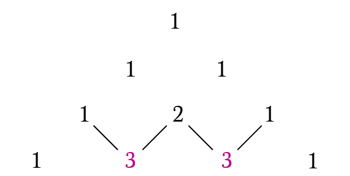
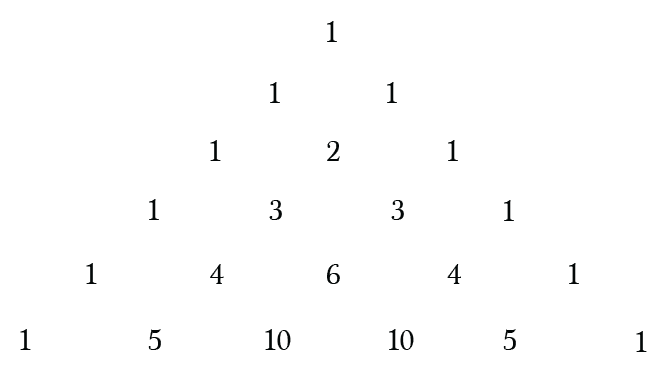
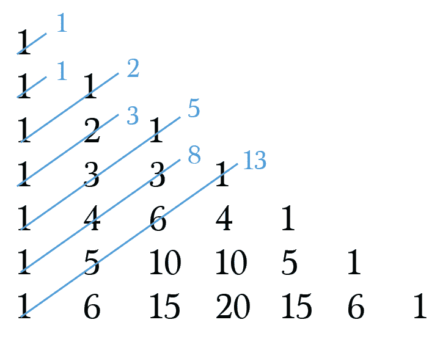
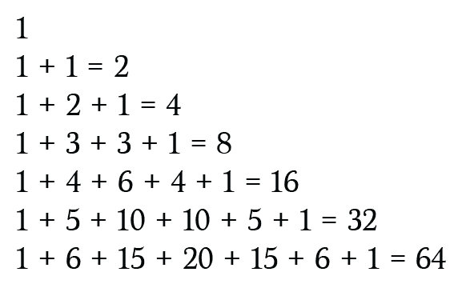
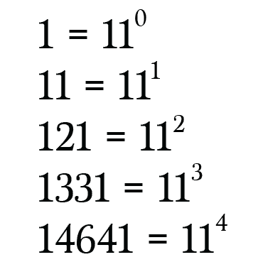
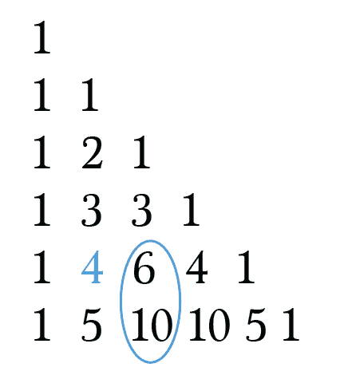
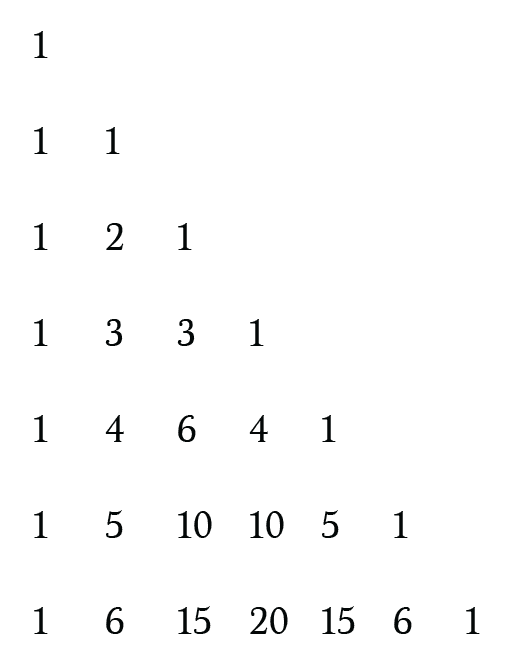

# 帕斯卡的三角在红宝石的乐趣

> 原文:[https://dev . to/alebian/Pascal-s-triangle-in-ruby-for-fun-3h 65](https://dev.to/alebian/pascal-s-triangle-in-ruby-for-fun-3h65)

前几天，我偶然看到一篇关于帕斯卡三角形及其所有有趣特性的博客文章，我认为用 Ruby 实现它会很有趣。

帕斯卡三角形是二项式系数的三角形数组，但您不必为了创建三角形而计算它们，因为每一行都可以使用前一行来构建，如下所示:

[T2】](https://res.cloudinary.com/practicaldev/image/fetch/s--kg0x7OGz--/c_limit%2Cf_auto%2Cfl_progressive%2Cq_auto%2Cw_880/http://alebian.github.io/asseimg/pascal/1_building.png)

形成这样的东西:

[T2】](https://res.cloudinary.com/practicaldev/image/fetch/s--czxDHO9z--/c_limit%2Cf_auto%2Cfl_progressive%2Cq_auto%2Cw_880/http://alebian.github.io/asseimg/pascal/2_example.png)

让我感到惊奇的是，这个简单的构造可以用来计算很多有趣的东西。即使有更有效的方法来做同样的计算，我认为这样做很有趣。

## [](#pascals-triangle-itself)帕斯卡的三角形本身

首先，我们需要一些计算三角形的东西，让我们为此创建一个类:

```
class PascalTriangle
  def initialize
    @triangle = [[1]]
  end

  def get_file(param)
    return @triangle[param] if @triangle[param]

    previous_file = get_file(param - 1)
    @triangle << calculate_new(previous_file)

    @triangle[param]
  end

  private

  def calculate_new(previous_file)
    current_file = [1]
    (0..(previous_file.size - 1)).each do |idx|
      next if idx == previous_file.size - 1

      current_file << previous_file[idx] + previous_file[idx + 1]
    end
    current_file << 1

    current_file
  end
end 
```

我使用递归函数在需要时创建每一行，并使用动态编程来存储中间结果，以使后续调用更快。

## [](#fibonacci)斐波那契

让我们从我最喜欢的三角形应用斐波那契数列开始。基本上你可以得到序列的元素:

[T2】](https://res.cloudinary.com/practicaldev/image/fetch/s--fupTMBQG--/c_limit%2Cf_auto%2Cfl_progressive%2Cq_auto%2Cw_880/http://alebian.github.io/asseimg/pascal/3_fibonacci.png)

我们可以实现这样一个方法:

```
@triangle = PascalTriangle.new

def fibonacci(n)
  return 0 if n <= 1
  return 1 if n == 2

  result = 0
  (0..n).reverse_each.with_index do |n, idx|
    coefficients = @triangle.get_file(n - 2)
    next unless coefficients[idx]

    result += coefficients[idx]
  end
  result
end

(1..20).map { |n| fibonacci(n) } #=> [0, 1, 1, 2, 3, 5, 8, 13, 21, 34, 55, 89, 144, 233, 377, 610, 987, 1597, 2584, 4181] 
```

## [](#binomial-coefficient)二项式系数

三角形的每个元素对应一个二项式系数:

[T2】](https://res.cloudinary.com/practicaldev/image/fetch/s--OpPbOqNi--/c_limit%2Cf_auto%2Cfl_progressive%2Cq_auto%2Cw_880/http://alebian.github.io/asseimg/pascal/4_binomial.png)

所以得到值超级容易:

```
def binomial_coefficient(n, k)
  file = @triangle.get_file(n)
  file[k]
end 
```

## [](#binomial-expansions)二项式展开

将二项式展开为正整数 N 的系数出现在帕斯卡三角形的第 N 行:

```
(x + y)^2 = x^2 + 2xy + y^2 = 1*x^2 + 2*xy + 1*y^2 
```

这样不仅可以得到系数，还可以计算出`(x+y)^n` :

```
def binomial_power(a, b, n)
  coefficients = @triangle.get_file(n)

  result = 0
  coefficients.each_with_index do |coefficient, idx|
    result += coefficient * a**(n - idx) * b**idx
  end

  result
end 
```

## 2 的幂

如果我们对三角形第 n 行的每个数字求和，我们得到`2^n`！

[](https://res.cloudinary.com/practicaldev/image/fetch/s--vctugZUA--/c_limit%2Cf_auto%2Cfl_progressive%2Cq_auto%2Cw_880/http://alebian.github.io/asseimg/pascal/5_2n.png)T3】

```
def power_of_2(n)
  coefficients = @triangle.get_file(n)
  coefficients.sum
end 
```

## 11 的次方

这里有一个更复杂的。我们可以建立 11 的幂，将一行中的每个数字连接起来。

[T2】](https://res.cloudinary.com/practicaldev/image/fetch/s--_jsvxWTO--/c_limit%2Cf_auto%2Cfl_progressive%2Cq_auto%2Cw_880/http://alebian.github.io/asseimg/pascal/6_11n.png)

当数字开始变大时，事情变得更加复杂。所以我们需要把十位数移到它左边的数字:

```
def power_of_11(param)
  coefficients = @triangle.get_file(param)

  if param <= 4
    coefficients.join.to_i
  else
    coefficients_with_carry = [0]
    coefficients.reverse_each.with_index do |coefficient, idx|
      coefficient_with_carry = coefficient + coefficients_with_carry[idx]

      if coefficient_with_carry < 10
        coefficients_with_carry[idx] = coefficient_with_carry
        coefficients_with_carry[idx + 1] = 0
      else
        coefficients_with_carry[idx] = coefficient_with_carry % 10
        coefficients_with_carry[idx + 1] = (coefficient_with_carry / 10.0).floor
      end
    end
    coefficients_with_carry.reverse.join.to_i
  end
end 
```

## [](#series)系列

我们可以在三角形中找到一些数列

### [](#perfect-squares)完美的正方形

完美的平方是可以表示为两个相等整数的乘积的数字，例如 4 是完美的平方，因为你可以像`2^2 = 4`那样表示它。完美的正方形出现在三角形的第三列，诀窍是你必须对前一行的元素求和:

[T2】](https://res.cloudinary.com/practicaldev/image/fetch/s--JrHBJFmr--/c_limit%2Cf_auto%2Cfl_progressive%2Cq_auto%2Cw_880/http://alebian.github.io/asseimg/pascal/7_series.png)

我们可以创建一个类，一个接一个地返回所有完美的方块:

```
class PerfectSquaresSeries
  def initialize(triangle)
    @triangle = triangle
    @current_file = 3
  end

  def next
    previous_file = @triangle.get_file(@current_file - 1)
    file = @triangle.get_file(@current_file)
    @current_file += 1

    file[2] + previous_file[2]
  end
end

series = PerfectSquaresSeries.new(@triangle)
series.next #=> 4
series.next #=> 9
series.next #=> 16
series.next #=> 25
series.next #=> 36
series.next #=> 49
series.next #=> 64
series.next #=> 81 
```

### [](#natural-numbers)自然数

如果我们看一下第二列，我们会看到自然数出现了:

[T2】](https://res.cloudinary.com/practicaldev/image/fetch/s--QQlXL85y--/c_limit%2Cf_auto%2Cfl_progressive%2Cq_auto%2Cw_880/http://alebian.github.io/asseimg/pascal/8_natural.png)

这不是什么非常有趣的事情，但是如果我们看到连续的列，我们会观察到三角形、四面体、五角形数等等(我将其概括为 N 面体数)。

### [](#nhedral-numbers)N 面体数

所有的数列都可以在三角形的第 n 列找到，我们可以这样得到:

```
class NHedralSeries
  def initialize(triangle, n)
    @triangle = triangle
    @current_file = n - 1
    @n = n
  end

  def next
    file = @triangle.get_file(@current_file)
    @current_file += 1
    file[@n - 1]
  end
end

natural = NHedralSeries.new(@triangle, 2)
(0..10).map { natural.next } #=> [1, 2, 3, 4, 5, 6, 7, 8, 9, 10, 11]

triangular = NHedralSeries.new(@triangle, 3)
(0..10).map { triangular.next } #=> [1, 3, 6, 10, 15, 21, 28, 36, 45, 55, 66]

tetrahedral = NHedralSeries.new(@triangle, 4)
(0..10).map { tetrahedral.next } #=> [1, 4, 10, 20, 35, 56, 84, 120, 165, 220, 286]

pentalope = NHedralSeries.new(@triangle, 5)
(0..10).map { pentalope.next } #=> [1, 5, 15, 35, 70, 126, 210, 330, 495, 715, 1001] 
```

我希望你和我一样喜欢这个练习！你可以在这里找到我的完整实现。

[T2】](https://www.buymeacoffee.com/alebian)