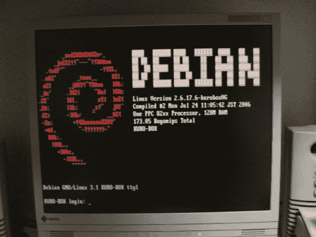

# 以前制作的签名供奉 VGA 的 Linux 内核补丁

> 原文:[https://dev.to/shiena/vga-linux-40d](https://dev.to/shiena/vga-linux-40d)

# 前言

很久以前，有 NAS 组装工具包的[玄箱 HG](https://www.kuroutoshikou.com/product/old_series/old_case/old_case_kurobako/old_case_kurobako_select/kuro-box_hg/) ，在有志的 Debian 化工具包中作为普通的 Linux 工作。 玄箱 HG 由于没有显示器输出端子，只能远程连接，但同一时期出现了将 USB 转换为 VGA 输出的[信号是 VGA](http://www.kairen.co.jp/japanese/usbvga/usb20svgawh.html) ，所以将这两个信号组合起来，以实现台式 PC 化为目标。

# 出了什么问题

信号出现 VGA 时，sisusb 已经有 Linux 驱动程序，但由于以下问题无法正常工作。

1.  不支持多个设备 ID
2.  大端字节序未対応

第一个是产品颜色变化，设备 ID 不同，无法识别驱动程序中未定义的内容。
第二，玄箱 HG 的 CPU 是 ppc，是 big endian，所以数据的保存顺序不同，无法正常显示在显示器上。

第二个是我忘记了是怎么找到的，因为是显卡驱动程序，所以我记得只在内核日志上查过`printk`。

# 贴片主体

要修补的内核是 Debian/etch 的 2.6.18-rc4。
现在控制台和 X Window System 已经显示出来了，但是部分颜色模式下显示很奇怪，所以可能是不完整或者 x 的驱动程序也有问题。

```
diff -ru a/drivers/usb/misc/sisusbvga/sisusb.c b/drivers/usb/misc/sisusbvga/sisusb.c --- a/drivers/usb/misc/sisusbvga/sisusb.c   2006-07-30 15:15:36.000000000 +0900 +++ b/drivers/usb/misc/sisusbvga/sisusb.c   2006-07-31 00:08:10.000000000 +0900 @@ -76,6 +76,16 @@

 DEFINE_MUTEX(disconnect_mutex);

+#ifdef __BIG_ENDIAN
+static void
+correct_endianness_buffer(u16* data, const int length)
+{
+   int i;
+   for (i = 0; i < length; i++)
+       *(data+i) = cpu_to_le16(*(data+i));
+}
+#endif
+
 static void
 sisusb_free_buffers(struct sisusb_usb_data *sisusb)
 {
@@ -411,6 +421,10 @@
            memcpy(buffer, kernbuffer, passsize);
            kernbuffer += passsize;

+#ifdef __BIG_ENDIAN
+           if ((len & 3) == 0)
+               correct_endianness_buffer((u16 *)buffer, thispass/2);
+#endif
        }

        retry = 5;
@@ -906,9 +920,13 @@
            if (userbuffer) {
                if (get_user(swap32, (u32 __user *)userbuffer))
                    return -EFAULT;
-           } else +           } else {
                swap32 = *((u32 *)kernbuffer);

+#ifdef __BIG_ENDIAN
+               swap32 = ((swap32 << 16) & 0xffff0000) | ((swap32 >> 16) & 0xffff);
+#endif
+           }
            ret = sisusb_write_memio_long(sisusb,
                            SISUSB_TYPE_MEM,
                            addr,
@@ -1259,7 +1277,11 @@

                    userbuffer += 4;
                } else {
+#ifdef __BIG_ENDIAN
+                   *((u32 *)kernbuffer) = ((swap32 << 16) & 0xffff0000) | ((swap32 >> 16) & 0xffff);
+#else
                    *((u32 *)kernbuffer) = swap32;
+#endif
                    kernbuffer += 4;
                }
                addr += 4;
@@ -3435,6 +3457,9 @@

 static struct usb_device_id sisusb_table [] = {
    { USB_DEVICE(0x0711, 0x0900) },
+   { USB_DEVICE(0x0711, 0x0901) },
+   { USB_DEVICE(0x0711, 0x0902) },
+   { USB_DEVICE(0x0711, 0x0920) },
    { USB_DEVICE(0x182d, 0x021c) },
    { USB_DEVICE(0x182d, 0x0269) },
    { } 
```

玄箱 HG 和信号通过 VGA 在控制台上输出
[](https://res.cloudinary.com/practicaldev/image/fetch/s--4zt9Vunv--/c_limit%2Cf_auto%2Cfl_progressive%2Cq_auto%2Cw_880/https://dev-to-uploads.s3.amazonaws.com/i/x7xo780bsmxh2cjtbnso.jpeg)

# 链接

*   [Xuanxiang HG 【T1]](https://www.kuroutoshikou.com/product/old_series/old_case/old_case_kurobako/old_case_kurobako_select/kuro-box_hg/)
*   [签名为 VGA](http://www.kairen.co.jp/japanese/usbvga/usb20svgawh.html)
*   [错误 7000 -修补 sisusb 的正确字节顺序](https://bugzilla.kernel.org/show_bug.cgi?id=7000)