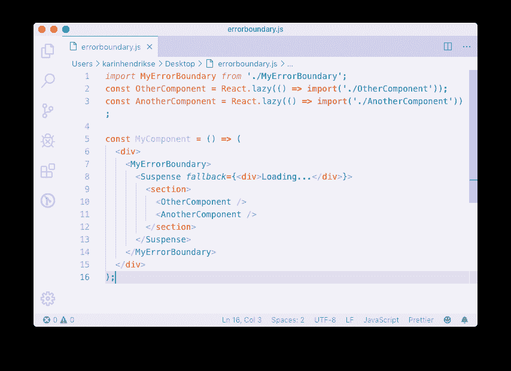
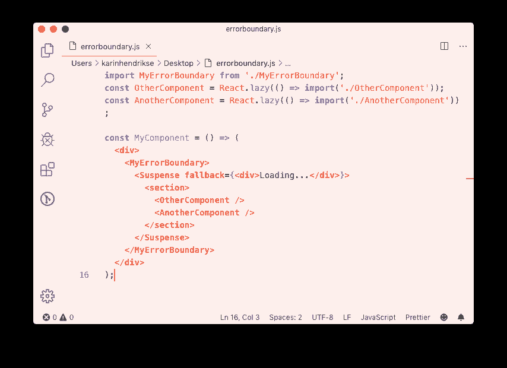
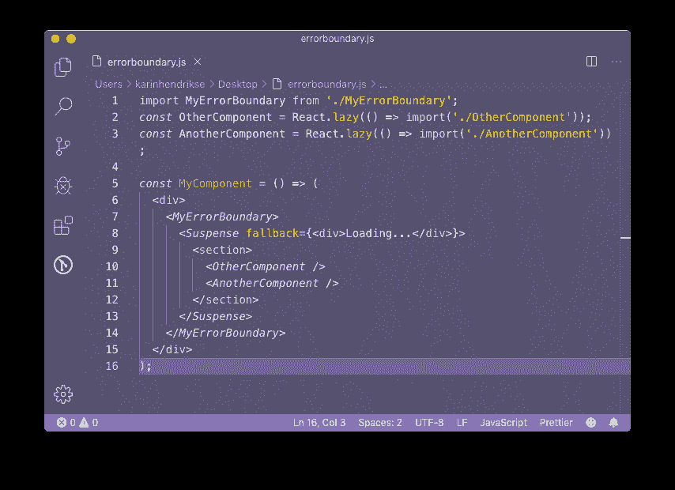
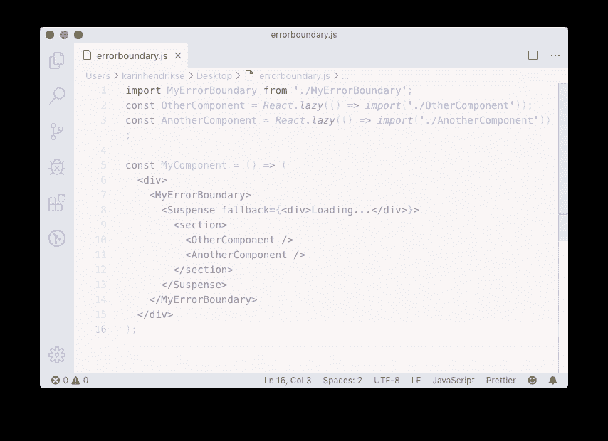
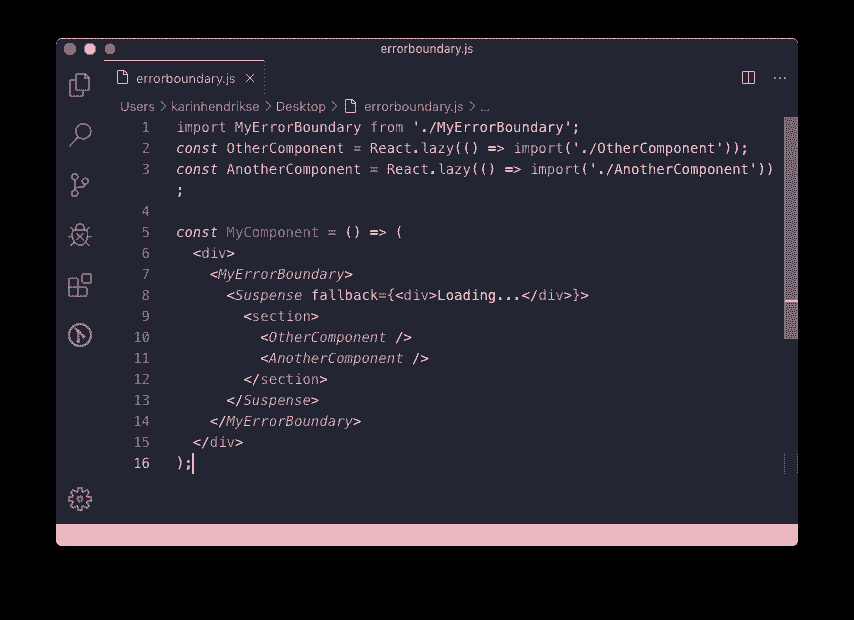
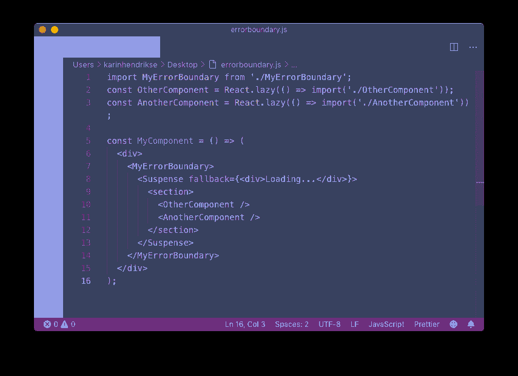
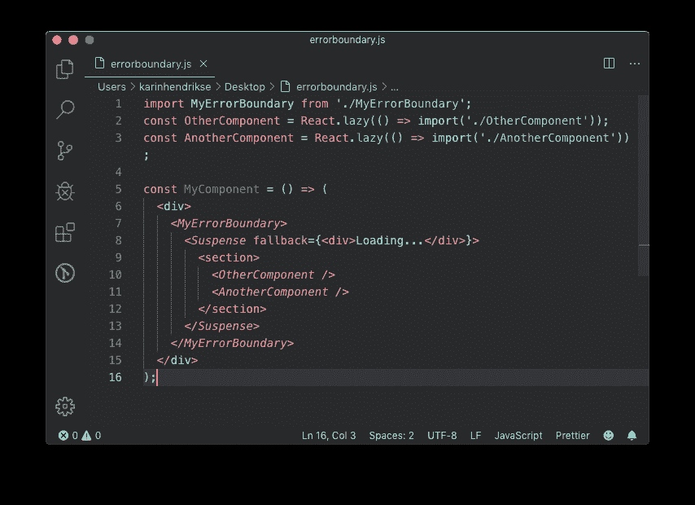
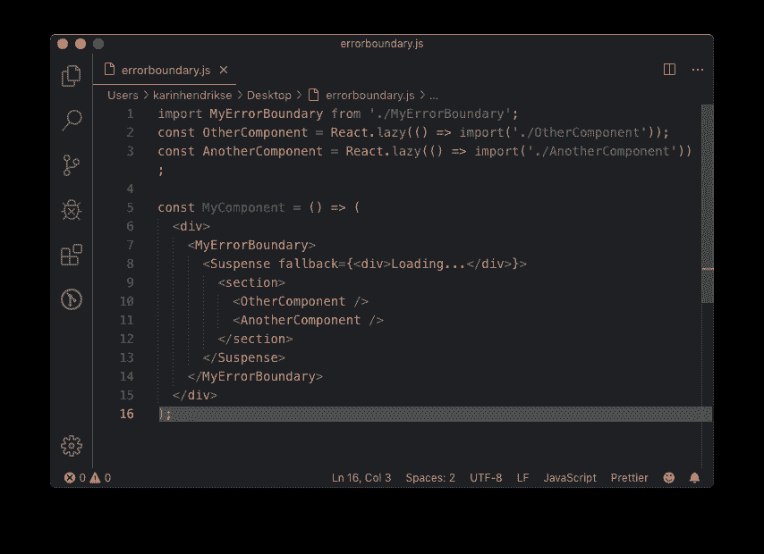

# 8 个令人敬畏的柔软、通风和蓬松的 VSC 主题

> 原文：<https://dev.to/khenhey/awesome-soft-airy-and-fluffy-vsc-themes-570c>

编写代码时，我有时觉得需要改变我工作空间的美学。为什么？我不知道。也许是因为它让我对我的代码有了新的认识。也许是因为随着季节的变化，我觉得有必要让我的工作空间颜色变亮或变暗。不管怎样，对于那些寻找新鲜空气的人来说。这里有一个美妙的 Visual Studio 代码主题列表，它们具有舒适、柔和或蓬松的美感。

### **1。[夜啼](https://marketplace.visualstudio.com/items?itemName=liviuschera.noctis)T5】**

Noctis 是一个明暗主题的集合，具有柔和的颜色混合，有足够的不同对比度选择。

我非常喜欢这个主题的不同配色方案。有足够的明暗混合选择，但它们都有一个非常宽容的外观，不会过度疲劳眼睛。

## **2。[地平线](https://marketplace.visualstudio.com/items?itemName=jolaleye.horizon-theme-vscode)T5】**

Horizon 有六个选项可供选择，三个亮选项和三个暗选项。我最喜欢明亮大胆的那种，因为我最喜欢这种明亮的对比。

## **3。[童话牙线](https://marketplace.visualstudio.com/items?itemName=nopjmp.fairyfloss)T5】**

弗洛斯主题确实是我最喜欢的一个。对于那些喜欢高度饱和的紫色主题但想要更柔和一点的紫色爱好者来说，这是一个好主意。

## **4。[软时代](https://marketplace.visualstudio.com/items?itemName=soft-aesthetic.soft-era-theme)T5】**

你愿意看着一个几乎是白色的屏幕吗？那是你的事吗？那么软时代一定是最适合你的主题。我一直用这个主题，主要是在我生活中真正需要更多光明的时候。但是它的对比度非常低，所以对我来说效率不高。

## **5。[粉红猫嘘](https://marketplace.visualstudio.com/items?itemName=ftsamoyed.theme-pink-cat-boo)T5】**

粉红猫 Boo 是一个非常柔和的粉红色/栗色暗主题，适合那些在编码生活中寻找更多玫瑰般颜色的人。主题描述称它非常适合“程序员女孩”,但说实话，任何人都可以摇滚这个主题，如果他们喜欢它❤️.

## **6。[粉彩像素](https://marketplace.visualstudio.com/items?itemName=quangogage.pastel-pixels)T5】**

我最喜欢这个主题的编辑器颜色，但是边栏和标签的颜色对我日常使用来说太多了。但是对于那些不在乎的人来说，也许你的编辑看起来很棒！

## **7。[熊猫语法](https://marketplace.visualstudio.com/items?itemName=tinkertrain.theme-panda)T5】**

这是我一年来最喜欢的黑暗主题。它有柔和但对比度很好的颜色，我有很多同事问我是哪一种。

## **8。[熊](https://marketplace.visualstudio.com/items?itemName=dahong.theme-bear)T5】**

熊是一个单一的黑色主题，秋天的颜色很好看。

希望这个列表可以帮助你度过更多的季节变化。你最喜欢的主题是什么？为什么呢？在下面的评论中分享它们吧！