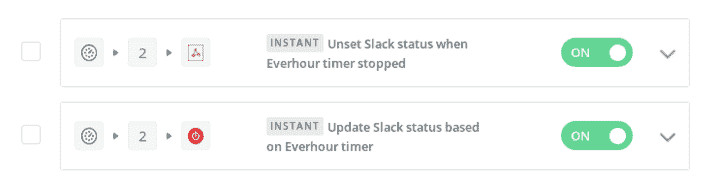
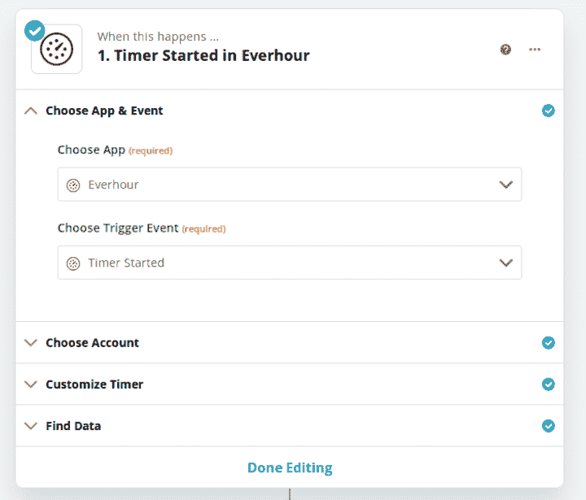
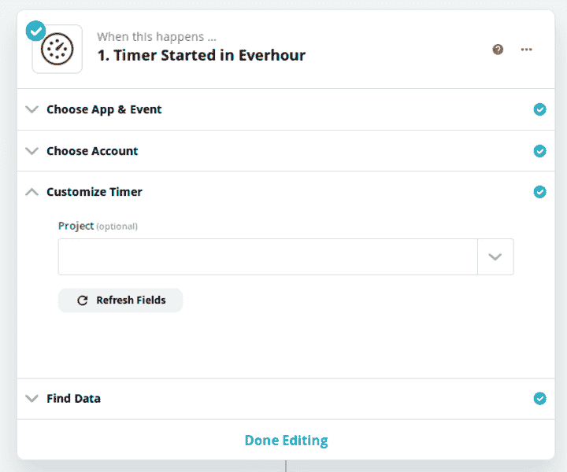
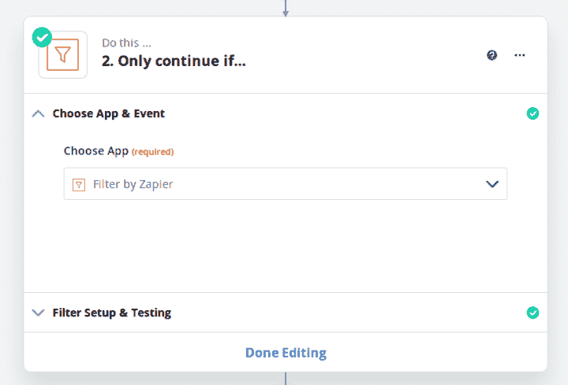
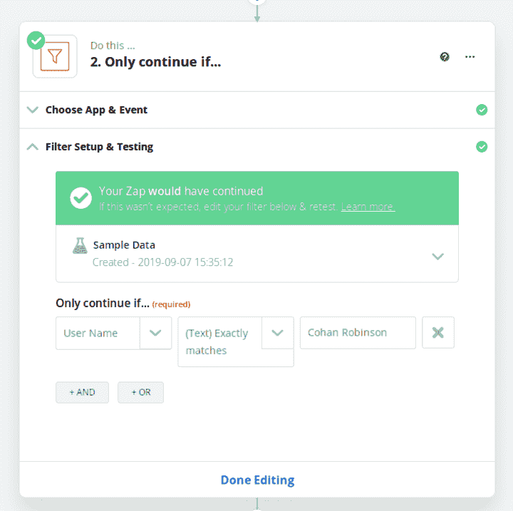
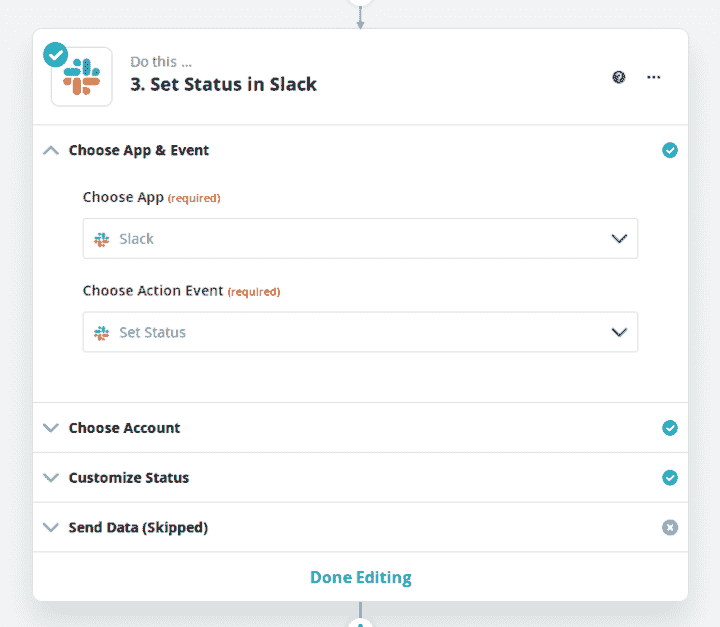
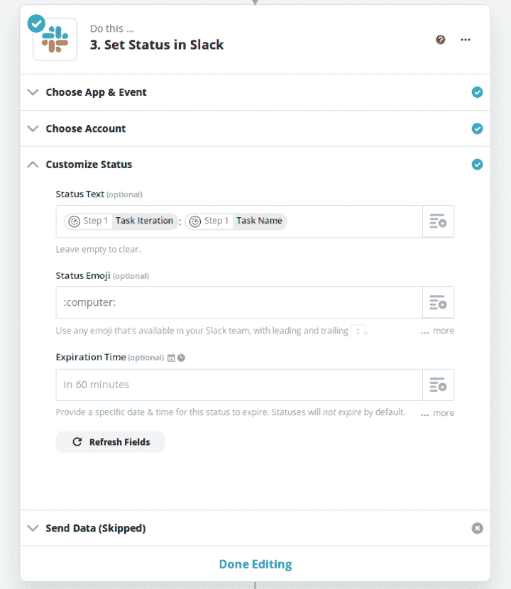
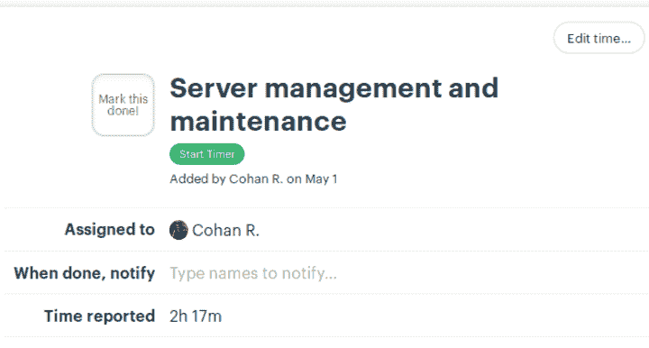
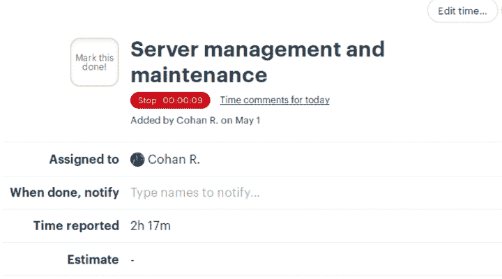
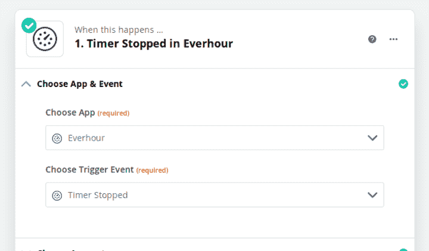

# 自动化你的空闲状态

> 原文:[https://dev.to/cohan/automate-your-slack-status-1abk](https://dev.to/cohan/automate-your-slack-status-1abk)

自动化你的懈怠状态。你为什么要这么做？首先，它让人们不再问你在做什么。事实上，这是做这件事的唯一原因。

我最近去了偏远的地方，在家工作，所有的一切。很好。

然而，我们发现的第一个问题是，根本不可能看到我在做什么。不是每 5 分钟一张的微操作截图，而是一个大概的要点。我解决这个问题的方法是结合我的空闲状态来展示我正在做的事情。让我们跳进来吧！

## 你将需要

*   扎皮尔
*   每小时..或收割，或 Toggl，或某种形式的时间跟踪与集成；
*   大本营..或阿萨纳，或吉拉，或其他与你选择的时间跟踪器相结合的东西
*   松弛(咄)

# 设置它

## 时间跟踪器集成(在我的例子中是 Everhour 和 Basecamp)

这次我帮不上什么忙。我个人用 Everhour 和 Basecamp。你使用你正在使用的任何东西，关键是你需要能够启动和停止定时器，包括你正在工作的任务的标题。

## 扎皮尔设置

如果你是一个聪明的 cookie，你只需要这个截图来设置它。这就是了。开始吧冠军。

[T2】](https://res.cloudinary.com/practicaldev/image/fetch/s--bPdjtqkG--/c_limit%2Cf_auto%2Cfl_progressive%2Cq_auto%2Cw_880/https://cohan.img/automateslackstatus/zapier-home.png)

是的。你需要一个付费的 Zapier 账户。让你的雇主支付它或什么的。不，我还没有想出一个体面的方法，使它没有多步 zaps 工作。

如果你想出了一个免费的方法，请把它写在博客上，并把链接发给我——我会在这里给你一些建议！

选择 Everhour 作为启动触发器，计时器的触发事件开始

[T2】](https://res.cloudinary.com/practicaldev/image/fetch/s--LY_Y29KM--/c_limit%2Cf_auto%2Cfl_progressive%2Cq_auto%2Cw_880/https://cohan.img/automateslackstatus/zapier-everhour-1.png)

如果你想让它为所有事情服务，就把项目部分留空吧！

[T2】](https://res.cloudinary.com/practicaldev/image/fetch/s--NUNjchsw--/c_limit%2Cf_auto%2Cfl_progressive%2Cq_auto%2Cw_880/https://cohan.img/automateslackstatus/zapier-everhour-2.png)

接下来，我们需要确保我们在确立自己的地位，而不是对别人的工作邀功

[T2】](https://res.cloudinary.com/practicaldev/image/fetch/s--fB1_Na3Q--/c_limit%2Cf_auto%2Cfl_progressive%2Cq_auto%2Cw_880/https://cohan.img/automateslackstatus/zapier-everhour-3.png)

[T2】](https://res.cloudinary.com/practicaldev/image/fetch/s--hpy0-J7e--/c_limit%2Cf_auto%2Cfl_progressive%2Cq_auto%2Cw_880/https://cohan.img/automateslackstatus/zapier-everhour-4.png)

现在我们做的是更新时差的部分

[T2】](https://res.cloudinary.com/practicaldev/image/fetch/s--lS5Ks3Tr--/c_limit%2Cf_auto%2Cfl_progressive%2Cq_auto%2Cw_880/https://cohan.img/automateslackstatus/zapier-slack-1.png)

[T2】](https://res.cloudinary.com/practicaldev/image/fetch/s--awLe36p2--/c_limit%2Cf_auto%2Cfl_progressive%2Cq_auto%2Cw_880/https://cohan.img/automateslackstatus/zapier-slack-2.png)

## 测试出来

去 Basecamp(或者你用的任何东西，等等)

[T2】](https://res.cloudinary.com/practicaldev/image/fetch/s--YFLoGItL--/c_limit%2Cf_auto%2Cfl_progressive%2Cq_auto%2Cw_880/https://cohan.img/automateslackstatus/zapier-basecamp-1.png)

boop

[T2】](https://res.cloudinary.com/practicaldev/image/fetch/s--M5Q_wiOx--/c_limit%2Cf_auto%2Cfl_progressive%2Cq_auto%2Cw_880/https://cohan.img/automateslackstatus/zapier-basecamp-2.png)

看那松弛的部分，这是什么

[T2】](https://res.cloudinary.com/practicaldev/image/fetch/s--vD3E8dRr--/c_limit%2Cf_auto%2Cfl_progressive%2Cq_auto%2Cw_880/https://cohan.img/automateslackstatus/zapier-slack-3.png)

将鼠标悬停在计算机图标上

[T2】](https://res.cloudinary.com/practicaldev/image/fetch/s--3vRgjJcW--/c_limit%2Cf_auto%2Cfl_progressive%2Cq_auto%2Cw_880/https://cohan.img/automateslackstatus/zapier-slack-4.png)

波什！

# 完成后取消设置

同样的真的，设置所有相同的除了触发计时器停止事件，并让松弛状态为空，这将取消您的状态。

保持唯一的继续，否则每当有人停止计时，你就会停止工作。

[T2】](https://res.cloudinary.com/practicaldev/image/fetch/s--NQp5oV-V--/c_limit%2Cf_auto%2Cfl_progressive%2Cq_auto%2Cw_880/https://cohan.img/automateslackstatus/zapier-everhour-5.png)

[T2】](https://res.cloudinary.com/practicaldev/image/fetch/s--jKa_JDFK--/c_limit%2Cf_auto%2Cfl_progressive%2Cq_auto%2Cw_880/https://cohan.img/automateslackstatus/zapier-everhour-6.png)

在 Slack 上不再有“你忙吗”的消息，noice！