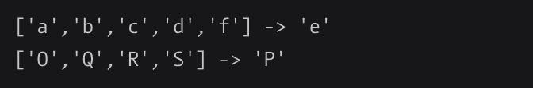

# 每日挑战#60 -找到丢失的字母

> 原文：<https://dev.to/thepracticaldev/daily-challenge-60-find-the-missing-letter-49bn>

编写一个方法，将一个由连续(递增)字母组成的数组作为输入，并返回数组中缺少的字母。

你总是会得到一个有效的数组。总会少一个字母。数组的长度总是至少为 2。该数组将总是只包含一种情况下的字母。

示例:

祝你好运！

* * *

*今天的挑战来自 [CodeWars](https://codewars.com/) 上的用户 5036852，他在[双条款 BSD 许可](https://opensource.org/licenses/BSD-2-Clause)下获得了这个挑战的再分发许可！*

想为未来的帖子提出一个挑战性的想法吗？发送电子邮件给**[yo+challenge @ dev . to](mailto:yo+challenge@dev.to)**提出您的建议！