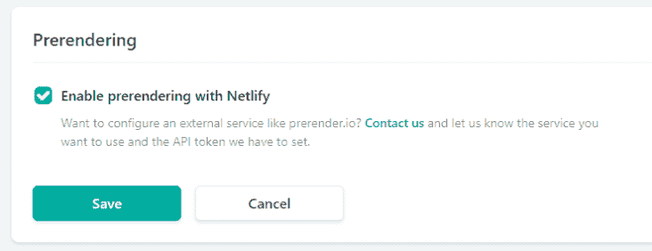
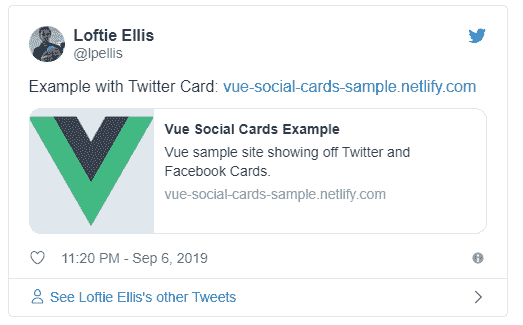

# 如何将 Twitter 和脸书卡添加到您的 vue 应用程序

> 原文：<https://dev.to/lpellis/how-to-add-twitter-and-facebook-cards-to-your-vue-app-47kl>

添加推特/脸书卡片是改善人们分享你的网站的体验的一个很好的方式，并且只需要几分钟就可以添加到你的 vue 网站。

### 什么是推特卡？

你有没有注意到一些链接在 Twitter 或脸书上显示时是如何很好地展开的？该功能由 Twitter cards 提供，参见下面的示例:

> NASA 航海家@ nasavoyagerdyno mite！旅行者 2 号在 1979 年最接近 OTD 时抓拍了这张照片。[go.nasa.gov/2KMHThe](https://t.co/ae7P1qjdlj)2018 年 7 月 10 日上午 00:18[](https://twitter.com/intent/tweet?in_reply_to=1016476808638656521)[](https://twitter.com/intent/retweet?tweet_id=1016476808638656521)406[](https://twitter.com/intent/like?tweet_id=1016476808638656521)1387

内容丰富的推文

### 在你的网站上展示推特/脸书卡片

Twitter 和脸书卡只是特殊的元标签，你必须把它们放在你的网站上。当有人分享你的页面时，Twitter 会看到这些标签，并使用它来很好地格式化文章。

**推特**

twitter 标签列表见[这里](https://developer.twitter.com/en/docs/tweets/optimize-with-cards/overview/abouts-cards)，下面我列出了最常用的标签。

```
<meta name="twitter:card" content="summary">
<meta name="twitter:url" content="https://loftie.com">
<meta name="twitter:title" content="Vue Social Cards Example">
<meta name="twitter:description" content="Vue sample site showing off Twitter and Facebook Cards.">
<meta name="twitter:image" content="http://dev.to/social_previews/user/139093.png"> 
```

**脸书**

脸书使用 [opengraph 协议](https://ogp.me/)，你可以在下面看到最常用的标签。

```
<meta property="og:type" content="website">
<meta property="og:title" content="Vue Social Cards Example">
<meta property="og:description" content="Vue sample site showing off Twitter and Facebook Cards.">
<meta property="og:image" content="http://dev.to/social_previews/user/139093.png"> 
```

### 用途在望

为了了解我们如何在 vue 中进行设置，让我们首先使用 [<u>vue CLI</u>](https://cli.vuejs.org/) 和所有默认设置创建一个基本的 Vue 站点。

```
vue create vue-sample 
```

> 有关如何创建 vue 站点并将其部署到 Netlify 的详细示例，请查看[https://loft ie . com/post/deploying-vue-with-Netlify-from-scratch](https://loftie.com/post/deploying-vue-with-netlify-from-scratch)

我已经在这里部署了网站的基本版本:[https://v1-vue-social-cards-sample.netlify.com/](https://v1--vue-social-cards-sample.netlify.com/)，让我们看看如果我们把它分享到 Twitter 上会发生什么:

> Loftie Ellis[@ lpellis](https://dev.to/lpellis)无 twitter 卡示例站点:
> [……-vue-social-cards-sample.netlify.com](https://t.co/5f4nqHjmbE)21:04PM-06 Sep 2019[](https://twitter.com/intent/tweet?in_reply_to=1170080375835676672)[](https://twitter.com/intent/retweet?tweet_id=1170080375835676672)0[](https://twitter.com/intent/like?tweet_id=1170080375835676672)0

不太令人兴奋

要在 vue 中启用卡片，我们需要一些方法来更新 meta 标签。最流行的方法是使用 [vue-meta](https://vue-meta.nuxtjs.org/) 包。

```
npm install vue-meta 
```

然后将其加载到您的`main.js`文件
中

```
import Vue from 'vue';
...
import Meta from 'vue-meta';
Vue.use(Meta);
... 
```

为了真正包含相关的元标签，我们必须将它们添加到`metaInfo`中。还要注意，图像路径必须是绝对路径，而不是相对路径。

在这个例子中，我使用 logo.png 作为图像，由于 vue 预处理所有的资源，我们必须得到路径，它最终使用`require('./assets/logo.png')`

```
let ROOT_PATH = 'https://your-site-here.com'
export default {
  data() {
    return {
      logo: ROOT_PATH + require('./assets/logo.png')
    }
  },
  metaInfo() {
    return {
      meta: [
          // Twitter Card
          {name: 'twitter:card', content: 'summary'},
          {name: 'twitter:title', content: 'Vue Social Cards Example'},
          {name: 'twitter:description', content: 'Vue sample site showing off Twitter and Facebook Cards.'},
          // image must be an absolute path
          {name: 'twitter:image', content: this.logo},
          // Facebook OpenGraph
          {property: 'og:title', content: 'Vue Social Cards Example'},
          {property: 'og:site_name', content: 'Vue Example'},
          {property: 'og:type', content: 'website'},
          {property: 'og:image', content:  this.logo},
          {property: 'og:description', content: 'Vue sample site showing off Twitter and Facebook Cards.'}
      ]
    }
  }
} 
```

### 最后一步，预渲染

目前 meta 标签是使用 javascript 添加的，这有点问题，因为 Twitter bot 不执行 javascript。幸运的是，如果您使用 Netlify，修复方法很简单，只需单击一个复选框。

如果您不使用 Netlify，那么您将不得不寻找其他方法来预呈现，例如 [prerender.io](https://prerender.io/)

在您的 Netlify 帐户中，转到*站点设置->构建和部署->预渲染*

<figure>[](https://res.cloudinary.com/practicaldev/image/fetch/s--MHv0lhkr--/c_limit%2Cf_auto%2Cfl_progressive%2Cq_auto%2Cw_880/https://res.cloudinary.com/ximg/image/upload/w_732%2Ch_500%2Cc_limit/f_auto/whoami/4a595384/post/tCG9Uvcv1bbmXvnc.png) 

<figcaption>预渲染允许推特和脸书看到元标签</figcaption>

</figure>

让我们看看现在是什么样子

<figure>[](https://res.cloudinary.com/practicaldev/image/fetch/s--WMvv5ekK--/c_limit%2Cf_auto%2Cfl_progressive%2Cq_auto%2Cw_880/https://res.cloudinary.com/ximg/image/upload/w_732%2Ch_500%2Cc_limit/f_auto/whoami/8e65b3bb/post/zpdInhkpIMl1C3Z4.png) 

<figcaption>好多了</figcaption>

</figure>

这个例子的代码可以在[https://github.com/lpellis/vue-social-cards-sample](https://github.com/lpellis/vue-social-cards-sample)获得。

<small>最初发表于[https://loft ie . com/post/how-to-add-Twitter-and-Facebook-cards-to-your-vue-app](https://loftie.com/post/how-to-add-twitter-and-facebook-cards-to-your-vue-app)</small>