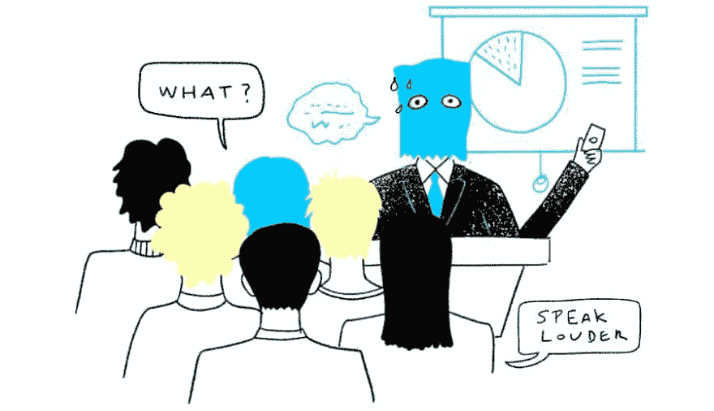
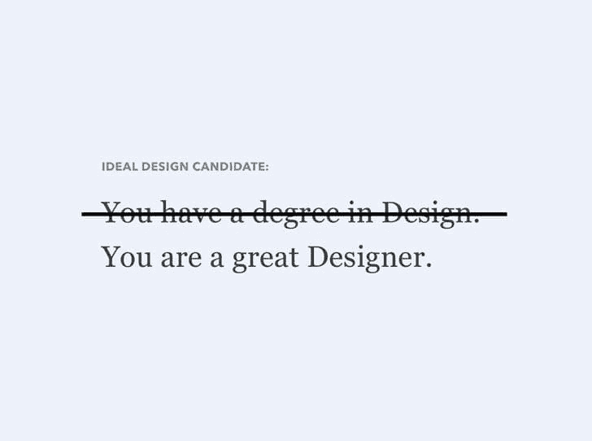
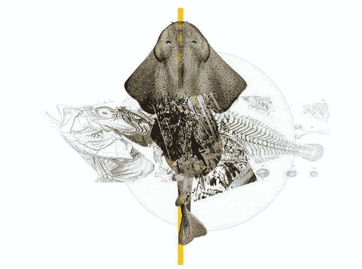
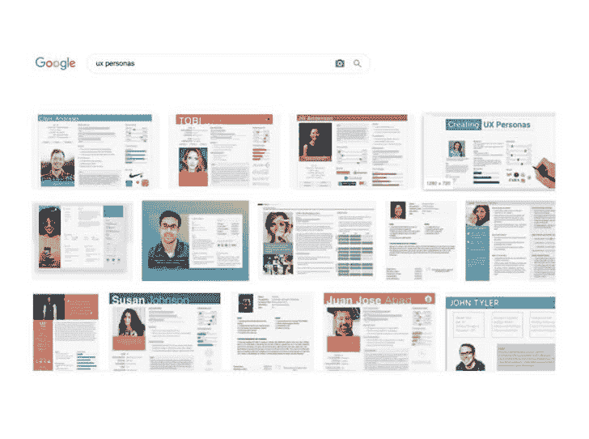

# 设置你的演示，多疑的设计师，推送通知——本周还有更多 UX

> 原文:[https://dev . to/UX collective/setting-up-your-presentations-suspective-designers-push-notifications-and-more-UX-this-week-5g2a](https://dev.to/uxcollective/setting-up-your-presentations-skeptical-designers-push-notifications-and-more-ux-this-week-5g2a)

#### 每周精选的设计链接，由你在 UX 集体的朋友带给你。

[T2】](https://res.cloudinary.com/practicaldev/image/fetch/s--2q3EscOO--/c_limit%2Cf_auto%2Cfl_progressive%2Cq_auto%2Cw_880/https://cdn-images-1.medium.com/max/900/0%2AlxORebAt7-l3LNZp.jpg)

**→**

 **成功的设计评审与你提出的具体设计决策关系不大，更多的是与同事*认为*他们将会看到的和他们*实际上*在那个会议中看到的之间的一致期望有关。

*   [**有害 HCI**](https://www.jussipasanen.com/human-centred-design-considered-harmful/) →人性化设计什么时候有害？
*   [**比较 UX**](https://baymard.com/blog/user-friendly-comparison-tools) →用户友好的“比较”工具的 3 个设计技巧。
*   [**位置:绝对**](https://marinaaisa.com/blog/designing-web-absolute-position/) →用 web UI 工具优化设计开发。

《UX 集体通讯》是一份自筹资金的通讯，每周有 111，000 多人阅读。支持它的最好方式是[与你的设计师朋友](https://newsletter.uxdesign.cc/)分享。

### 来自社区的故事

[T2】](https://res.cloudinary.com/practicaldev/image/fetch/s--I8b_CXkj--/c_limit%2Cf_auto%2Cfl_progressive%2Cq_auto%2Cw_880/https://cdn-images-1.medium.com/max/728/0%2ATu0mCQ6j-abCMgcM.jpg)

[**为什么脸书、Medium 等公司不问你的设计学位**](https://uxdesign.cc/designer-jobs-why-do-you-still-require-a-degree-in-design-fedd73cfc150?source=friends_link&sk=53829dd792fba03e2d532952ad4be555) →

By [斯坦·瑞姆根](https://medium.com/u/84122a64a17f)

[T2】](https://res.cloudinary.com/practicaldev/image/fetch/s--nBTSL0TW--/c_limit%2Cf_auto%2Cfl_progressive%2Cq_auto%2Cw_880/https://cdn-images-1.medium.com/max/728/0%2A6aVXLE8ZKQh_gU-H.jpg)

[**持怀疑态度的设计师是好设计师**](https://uxdesign.cc/skeptical-designers-are-good-designers-b1077c0ad75a?source=friends_link&sk=30d4cb62454930bf3c399a586d99d07d) →

作者[迈克尔·麦克沃特斯](https://medium.com/u/4e0bea5561d9)

[T2】](https://res.cloudinary.com/practicaldev/image/fetch/s--Zp6aymv8--/c_limit%2Cf_auto%2Cfl_progressive%2Cq_auto%2Cw_880/https://cdn-images-1.medium.com/max/728/0%2ATasuKd4vJ-TasgVw.jpg)

[**停止过度复杂化你的人物角色，开始原型化更多的**](https://uxdesign.cc/stop-overcomplicating-your-personas-and-start-prototyping-more-1b9a3fca35c9?source=friends_link&sk=b662c08c8efd2cd0e8c78944205dfdb4) →

由[UX·迪尔](https://medium.com/u/cac8380969b)

更多头条新闻:

*   [**雇佣设计师时要注意的五件事**](https://uxdesign.cc/five-things-to-look-out-for-when-hiring-a-designer-eb288879cca8?source=friends_link&sk=2bad9bca560161792bf54d71917bf7f7) →作者[雷诺兹·舒杰斯](https://medium.com/u/e0848b675f5)
*   [**避免产品设计过程中的收益递减**](https://uxdesign.cc/avoiding-diminishing-returns-in-the-product-design-process-54a5929b1a96?source=friends_link&sk=76686a63f9a976e902fd69ed98ca76cc) →作者[大卫·波特利](https://medium.com/u/bf18b5a41f40)
*   [**教室里的菲格玛**](https://uxdesign.cc/figma-in-the-classroom-439814cd9e6d?source=friends_link&sk=03c20f32430283efd197c7097543dcb0) → By [梅琳·拜尔亚马利](https://medium.com/u/1f5088684cf3)
*   [**Mailchimp 用来在情感上吸引顾客的微妙技巧**](https://uxdesign.cc/the-subtle-technique-that-mailchimp-uses-to-emotionally-hook-customers-719acffbb27f?source=friends_link&sk=ceb09b13c2a01e8b685485d9cec35a41) → By [Sumit Hegde](https://medium.com/u/161ab0b0bc28)
*   [**设计验证数学**](https://uxdesign.cc/design-validation-mathematics-47da1c92b07f?source=friends_link&sk=e32fea11c4f940d0b1600bc1bdf51a49)→By[Dzmitry basen ka](https://medium.com/u/7d33a75bc85)
*   [**别难受，用户测试你的竞争对手**](https://uxdesign.cc/dont-feel-bad-user-test-your-competitors-1efbaf662c1?source=friends_link&sk=3b757e2c7742f3ebe24e094ac47d0198) → By [丹尼尔·德·维特](https://medium.com/u/9d393a295b)
*   [**运动设计指南是否应该出现在设计系统中？**](https://uxdesign.cc/should-motion-design-guidelines-appear-in-design-systems-yes-9afa36efbc21?source=friends_link&sk=c83da5974842538cd0a70f7e0a82183c) → By [Adir SL](https://medium.com/u/33e023e403b)

### 新闻&观点

*   [**产品与功能**](https://svpg.com/product-vs-feature-teams/) →一篇关于产品与功能团队的深思熟虑的文章。
*   [**大型设备**](https://www.nngroup.com/articles/large-devices-important-tasks/) →为什么用户要在更大的屏幕上做重要的任务。
*   [**哑密码**](https://twitter.com/dumb_pw_rules) →一个报告哑密码规则的 twitter 账号。
*   [**数据少也不错**](https://timkadlec.com/remembers/2019-08-30-less-data-doesnt-mean-a-lesser-experience/) →启用了保存数据功能的用户不配拥有更少的 UX。

### 工具&资源

*   Figma 中的 [**徽标**](https://www.brandfetch.io/extension/plugin-figma/) →将公司徽标引入 Figma 的插件。
*   [**用力过猛**](https://stephaniewalter.design/blog/the-ultimate-guide-to-not-fck-up-push-notifications/) →一个不 f#的指南！@打开推送通知。作者[斯蒂芬妮·沃特](https://medium.com/u/10705d7f3221)
*   [**Eagle**](https://eagle.cool/) →一个设计库，让你 10 倍更有条理。
*   [**你的节奏**](https://www.yourtempo.co/) →另一个电子邮件客户端声称可以帮助你集中注意力。

* * ***