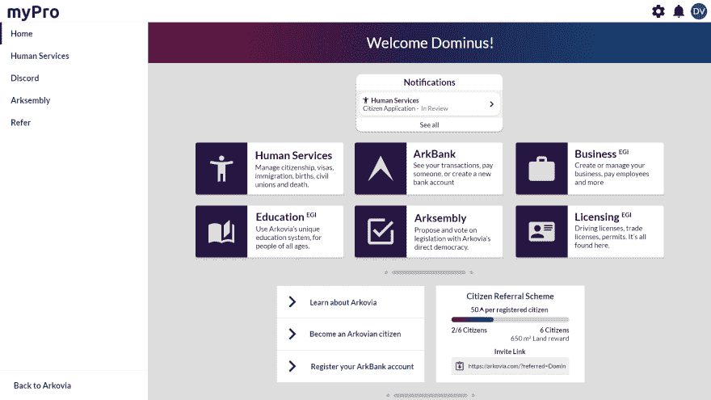
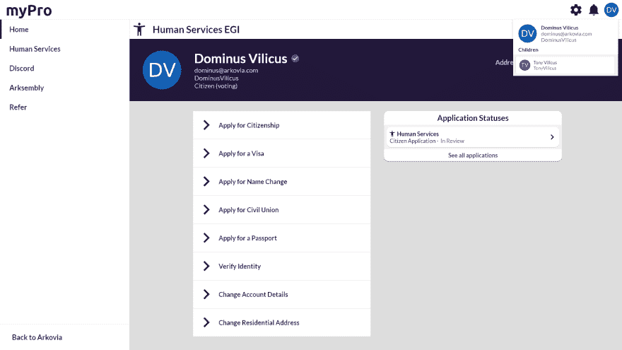
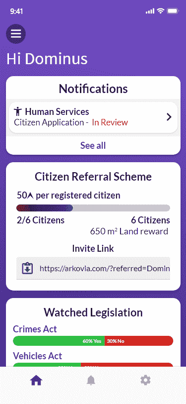
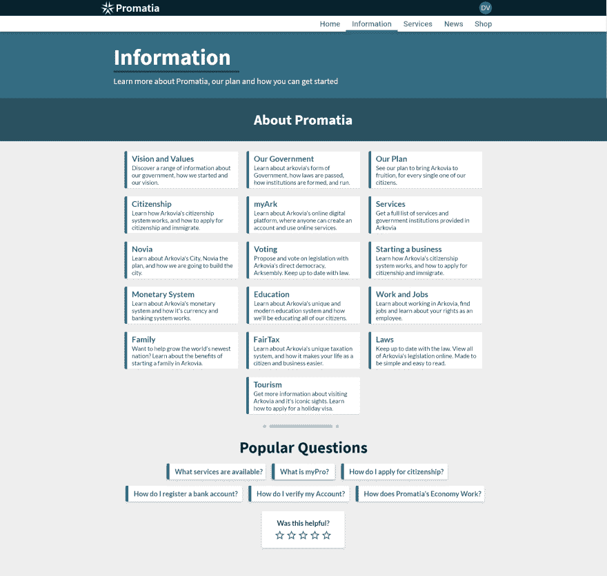
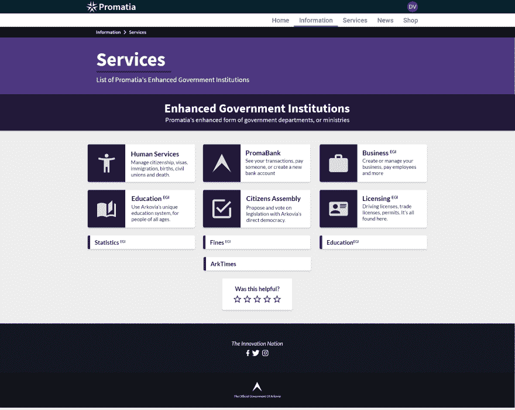

# Promatia 的数字政府

> 原文:[https://dev . to/albertmarashi/proma TIA-s-digital-government-24f 7](https://dev.to/albertmarashi/promatia-s-digital-government-24f7)

Promatia 正在建立一个数字政府/微型国家，作为一项政治实验。

我们将使用 NodeJS 作为服务器后端，VueJS 作为前端。

我们还使用[https://futureaus.github.io/servue/](https://futureaus.github.io/servue/)进行服务器端渲染。

**全栈**

*   VueJS
*   MongoDB
*   NodeJS
*   网络包
*   GraphQL
*   moon graph(MongoDB 的自定义 ORM)

**这里是我们政府门户网站的一些模型:**

下面是主要场地设计的图片:

[T6】](https://res.cloudinary.com/practicaldev/image/fetch/s--q0aOlJJE--/c_limit%2Cf_auto%2Cfl_progressive%2Cq_auto%2Cw_880/https://thepracticaldev.s3.amazonaws.com/i/osqej2zeapb182br9g03.png)

我们将在 Promatia 的 Twitch 频道或 https://www.twitch.tv/promatiagov 的 T2 直播视频