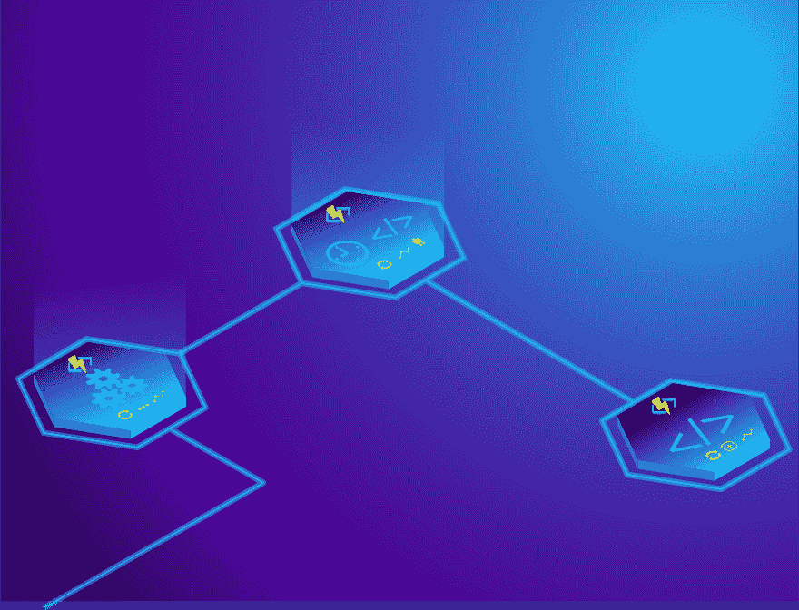
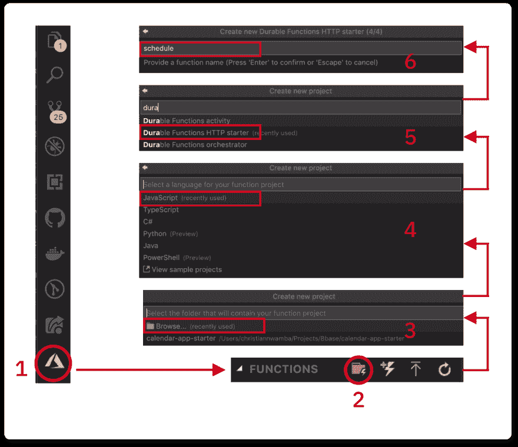
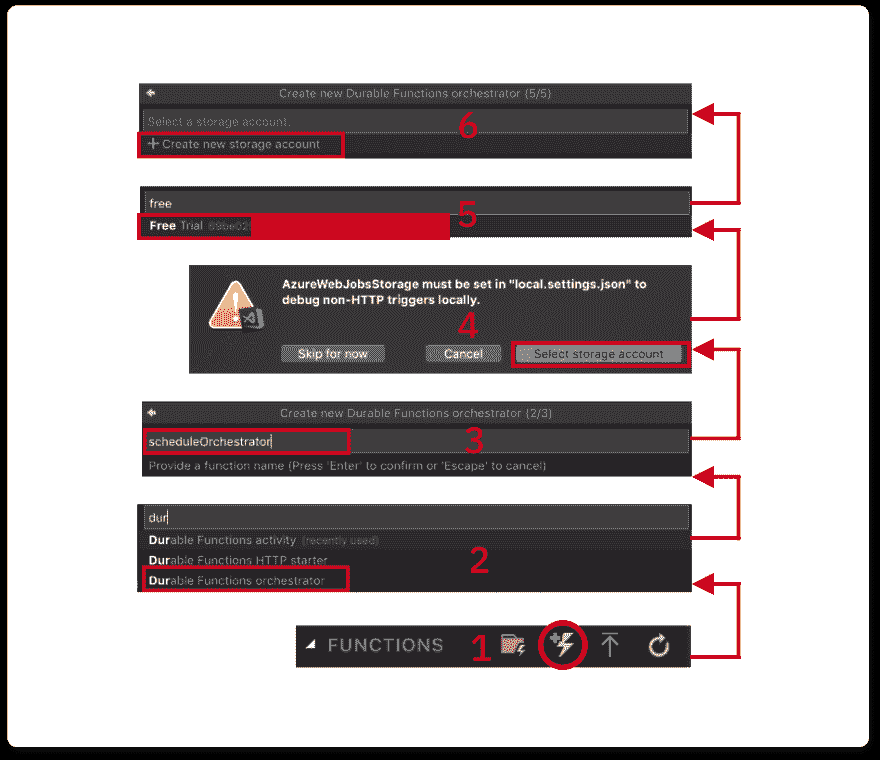
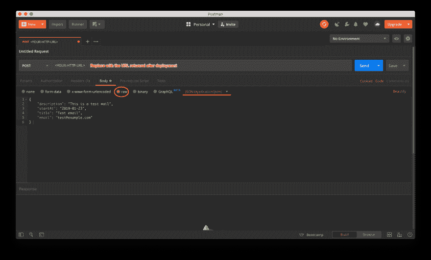

# 具有持久功能的有状态无服务器

> 原文：<https://dev.to/azure/stateful-serverless-with-durable-functions-2jff>

本文是 [#ServerlessSeptember](https://dev.to/azure/serverless-september-content-collection-2fhb) 的一部分。在这个无服务器的内容集合中，您可以找到其他有用的文章、详细的教程和视频。9 月份，每天都有来自社区成员和云倡导者的新文章发布，没错，每天都有。

在[https://docs.microsoft.com/azure/azure-functions/](https://docs.microsoft.com/azure/azure-functions/?WT.mc_id=servsept_devto-blog-cxa)了解更多关于微软 Azure 如何实现你的无服务器功能。

Azure 持久功能的强大之处在于，即使在请求结束后，它们也能保持 API 的状态。这样做的好处是，您可以在以后回到 API 并跟踪状态是如何演变的。这解释了我们所说的**有状态**的含义，而术语[无服务器](https://en.wikipedia.org/wiki/Serverless_computing)解释了云提供商何时管理资源的分配和服务器架构的供应。Azure 持久功能的一个很好的用例是构建定时器和通知。

那么什么是持久功能呢？持久功能由不同类型的 Azure 功能组成，这些功能可以一起使用来解决无服务器架构中的编排挑战。

在我们能够理解持久功能提供什么之前，我们需要先避开两个词— **编排**和**持久**。

***编排*** 最初用于描述协调良好的事件和动作的集合。它在计算中被大量借用来描述计算机系统的平稳协调。关键词是*坐标*。我们需要以一种协调的方式将一个系统的两个或更多单元放在一起。

*用来形容经得起时间考验的东西。系统协调性和耐用性的结合为您带来持久的功能。它是 Azure 无服务器功能的最佳产品之一。基于我们现在所知的持久功能有这两个特征:*

 *1.  它们可以用来组合两个或更多功能的执行并协调它们，这样就不会出现竞争情况(编排)。

2.  持久的功能记住事情。这就是它如此强大的原因。它打破了 HTTP 的头号规则:无状态。持久函数保持它们的状态不变，不管它们要等待多长时间。创建一个未来 100 万年的时间表，一个持久的函数在 100 万年后执行，同时记住在触发当天传递给它的参数。这意味着持久函数是有状态的。

无服务器功能可以有效地随时间保持其状态的事实提供了一个机会范围。在本文中，我们将利用其中的一个特性来发送通知。

如果你正在寻找 Azure 持久功能提供的更直观的表示，我会推荐 Sarah 关于持久功能的文章。

我还对我们今天将要编写的持久函数的行为进行了可视化表示:

[](https://res.cloudinary.com/practicaldev/image/fetch/s--LNLV4CgK--/c_limit%2Cf_auto%2Cfl_progressive%2Cq_auto%2Cw_880/https://css-tricks.com/wp-content/uploads/2019/06/Illustration2code.svg)

典型的持久函数符合以下流程:

1.  来自外部系统的数据修改使用 **HTTP 触发器**触发编排。
2.  然后触发器调用**编排函数**，该函数调度一个事件。
3.  当执行时间到期时，再次调用编排函数，但是这一次，它跳过编排并调用**活动函数**。活动功能是行动执行者。这就是神奇的地方，例如“发送电子邮件通知”。##创建协调的持久功能

让我带您看一下如何使用 VS 代码创建函数。你需要两样东西:

1.  一个 Azure 账户
2.  [VS 代码](https://code.visualstudio.com/?WT.mc_id=servsept_devto-blog-cxa)

一旦你有两个设置，我们需要他们一起工作。您可以使用 VS 代码扩展和节点 CLI 工具来实现这一点。从安装 CLI 工具开始:

```
npm install -g azure-functions-core-tools

# OR

brew tap azure/functions
brew install azure-functions-core-tools 
```

<svg width="20px" height="20px" viewBox="0 0 24 24" class="highlight-action crayons-icon highlight-action--fullscreen-on"><title>Enter fullscreen mode</title></svg> <svg width="20px" height="20px" viewBox="0 0 24 24" class="highlight-action crayons-icon highlight-action--fullscreen-off"><title>Exit fullscreen mode</title></svg>

一旦安装完成，弹出打开你的 VSCode 编辑器，安装 [Azure Functions 扩展](https://marketplace.visualstudio.com/items?itemName=ms-azuretools.vscode-azurefunctions&WT.mc_id=csstricks-article-chnwamba)。如果你觉得可以的话，请阅读我之前的文章中关于[设置 Azure 功能](https://scotch.io/tutorials/getting-started-with-azure-functions-using-vs-code-zero-to-deploy)的更多内容。

* * *

现在您已经完成了所有的设置，让我们开始创建这些函数。我们将创建的函数将映射到以下文件夹。

| 文件夹 | 功能 |
| --- | --- |
| `schedule` | 持久 HTTP 触发器 |
| `scheduleOrchestrator` | 持久编排 |
| `sendEmail` | 持久活动 |

创建一个名为 **serverless** 的文件夹，使用 VSCode 编辑器打开该文件夹，并遵循以下说明:

我们将从创建触发器开始:

1.  点击 Azure 扩展图标，按照下图创建`schedule`功能
    [](https://res.cloudinary.com/practicaldev/image/fetch/s--gDe-zrGJ--/c_limit%2Cf_auto%2Cfl_progressive%2Cq_auto%2Cw_880/https://css-tricks.com/wp-content/uploads/2019/06/s_59155945058476A0D168340B7B6BF2D6E28F7836F022B841C4BDC57A3C56C0E5_1558866261319_setup-function.png)

2.  由于这是第一个函数，我们选择了文件夹图标来创建一个函数项目。后面的图标创建一个功能(不是一个项目)。

3.  选择`serverless`文件夹。

4.  选择 JavaScript 作为语言。如果愿意，您可以选择任何其他首选语言。

5.  选择`Durable Functions HTTP starter`。这是导火索。

6.  将第一个函数命名为`schedule`

接下来，创建 orchestrator。不要创建函数项目，而是创建一个函数。

1.  点击功能图标:
    [](https://res.cloudinary.com/practicaldev/image/fetch/s--b6RkEvSn--/c_limit%2Cf_auto%2Cfl_progressive%2Cq_auto%2Cw_880/https://css-tricks.com/wp-content/uploads/2019/06/s_59155945058476A0D168340B7B6BF2D6E28F7836F022B841C4BDC57A3C56C0E5_1558867946556_create-orch-function.png)

2.  选择`Durable Functions orchestrator`。

3.  将其命名为`scheduleOrchestrator`,然后按回车键。

4.  选择一个存储帐户当被要求时，Orchestrator 使用存储来维护一个*功能正在运行*的状态。

5.  在你的 Azure 帐户中选择一个订阅。就我而言，我选择了免费试用订阅。

6.  按照剩下的几个步骤创建存储帐户。

最后，重复上一步来创建一个活动。这一次，以下应该有所不同:

*   选择`Durable Functions activity`。
*   命名为`sendEmail`。
*   不需要存储帐户。

## 用持久 HTTP 触发器调度

我们将在`serverless/schedule/index.js`文件中维护引导代码。该文件的内容应该类似于下面的代码片段:

```
const df = require("durable-functions");
module.exports = async function (context, req) {
  const client = df.getClient(context);
  const instanceId = await client.startNew(req.params.functionName, undefined, req.body);
  context.log(`Started orchestration with ID = '${instanceId}'.`);
  return client.createCheckStatusResponse(context.bindingData.req, instanceId);
}; 
```

<svg width="20px" height="20px" viewBox="0 0 24 24" class="highlight-action crayons-icon highlight-action--fullscreen-on"><title>Enter fullscreen mode</title></svg> <svg width="20px" height="20px" viewBox="0 0 24 24" class="highlight-action crayons-icon highlight-action--fullscreen-off"><title>Exit fullscreen mode</title></svg>

让我们浏览一下文件的内容:

1.  我们正在客户端创建一个基于请求上下文的持久函数。
2.  我们使用客户端的`startNew()`函数调用 orchestrator。orchestrator 函数名作为第一个参数通过`params`对象传递给`startNew()`。一个`req.body`也被传递给`startNew()`作为第三个参数，该参数被转发给编排器。
3.  最后，我们返回一组数据，用于检查 orchestrator 函数的状态，甚至在进程完成前取消它。

调用上述函数的 URL 如下所示:

```
http://localhost:7071/api/orchestrators/{functionName} 
```

<svg width="20px" height="20px" viewBox="0 0 24 24" class="highlight-action crayons-icon highlight-action--fullscreen-on"><title>Enter fullscreen mode</title></svg> <svg width="20px" height="20px" viewBox="0 0 24 24" class="highlight-action crayons-icon highlight-action--fullscreen-off"><title>Exit fullscreen mode</title></svg>

其中`functionName`是传递给`startNew`的名称。在我们的例子中，应该是:

```
//localhost:7071/api/orchestrators/scheduleOrchestrator 
```

<svg width="20px" height="20px" viewBox="0 0 24 24" class="highlight-action crayons-icon highlight-action--fullscreen-on"><title>Enter fullscreen mode</title></svg> <svg width="20px" height="20px" viewBox="0 0 24 24" class="highlight-action crayons-icon highlight-action--fullscreen-off"><title>Exit fullscreen mode</title></svg>

知道您可以更改这个 [URL 的外观](https://github.com/christiannwamba/calendar-app/blob/master/serverless/schedule/function.json#L8)也很好。

## 用耐用的编制器编制

HTTP trigger `startNew`调用根据我们传递给它的名字调用一个函数。该名称对应于保存编排逻辑的功能和文件夹的名称。`serverless/scheduleOrchestrator/index.js`文件导出一个持久函数。将内容改为:

```
const df = require("durable-functions");
module.exports = df.orchestrator(function* (context) {
  const input = context.df.getInput()
  // TODO -- 1

  // TODO -- 2
}); 
```

<svg width="20px" height="20px" viewBox="0 0 24 24" class="highlight-action crayons-icon highlight-action--fullscreen-on"><title>Enter fullscreen mode</title></svg> <svg width="20px" height="20px" viewBox="0 0 24 24" class="highlight-action crayons-icon highlight-action--fullscreen-off"><title>Exit fullscreen mode</title></svg>

orchestrator 函数使用`context.df.getInput()`从 HTTP 触发器中检索请求体。

用下面一行代码替换`TODO -- 1`，这可能是整个演示中最重要的事情:

```
yield context.df.createTimer(new Date(input.startAt)) 
```

<svg width="20px" height="20px" viewBox="0 0 24 24" class="highlight-action crayons-icon highlight-action--fullscreen-on"><title>Enter fullscreen mode</title></svg> <svg width="20px" height="20px" viewBox="0 0 24 24" class="highlight-action crayons-icon highlight-action--fullscreen-off"><title>Exit fullscreen mode</title></svg>

在这一行中，我们根据从 HTTP 触发器接收的请求正文中提供的开始日期创建一个计时器。

在到达这一行时，执行会在创建计时器后暂时中止。当设置的计时器停止计时时，它会返回，跳过这一行并执行下一行。用下面的代码行替换`TODO -- 2`注释:

```
return yield context.df.callActivity('sendEmail', input); 
```

<svg width="20px" height="20px" viewBox="0 0 24 24" class="highlight-action crayons-icon highlight-action--fullscreen-on"><title>Enter fullscreen mode</title></svg> <svg width="20px" height="20px" viewBox="0 0 24 24" class="highlight-action crayons-icon highlight-action--fullscreen-off"><title>Exit fullscreen mode</title></svg>

该函数将调用活动函数来发送电子邮件。我们还将有效载荷作为第二个参数传递。

有效负载的主体看起来应该是这样的:

```
{  "description":  "This is a test mail",  "startAt":  "2019-01-23",  "title":  "Test email",  "email":  "test@example.com"  } 
```

<svg width="20px" height="20px" viewBox="0 0 24 24" class="highlight-action crayons-icon highlight-action--fullscreen-on"><title>Enter fullscreen mode</title></svg> <svg width="20px" height="20px" viewBox="0 0 24 24" class="highlight-action crayons-icon highlight-action--fullscreen-off"><title>Exit fullscreen mode</title></svg>

这是完成的函数的样子:

```
const df = require("durable-functions");

module.exports = df.orchestrator(function* (context) {
  const input = context.df.getInput()

  yield context.df.createTimer(new Date(input.startAt))

  return yield context.df.callActivity('sendEmail', input);
}); 
```

<svg width="20px" height="20px" viewBox="0 0 24 24" class="highlight-action crayons-icon highlight-action--fullscreen-on"><title>Enter fullscreen mode</title></svg> <svg width="20px" height="20px" viewBox="0 0 24 24" class="highlight-action crayons-icon highlight-action--fullscreen-off"><title>Exit fullscreen mode</title></svg>

## 发送带有持久活动的电子邮件

当时间表到期时，orchestrator 会回来调用活动。活动文件驻留在`serverless/sendEmail/index.js`中。用以下内容替换其中的内容:

```
const sgMail = require('@sendgrid/mail');
sgMail.setApiKey(process.env['SENDGRID_API_KEY']);

module.exports = async function(context) {
  // TODO -- 1
  const msg = {}
  // TODO -- 2
  return msg;
}; 
```

<svg width="20px" height="20px" viewBox="0 0 24 24" class="highlight-action crayons-icon highlight-action--fullscreen-on"><title>Enter fullscreen mode</title></svg> <svg width="20px" height="20px" viewBox="0 0 24 24" class="highlight-action crayons-icon highlight-action--fullscreen-off"><title>Exit fullscreen mode</title></svg>

它当前导入 SendGrid 的邮件程序并设置 API 密钥。你可以通过遵循这些指令来获得一个 API 密匙。

我将密钥设置在一个环境变量中，以保证我的凭证安全。您可以通过在`serverless/local.settings.json`中创建一个`SENDGRID_API_KEY`键，将您的 SendGrid 键作为值:
，以同样的方式安全地存储您的密钥

```
{  "IsEncrypted":  false,  "Values":  {  "AzureWebJobsStorage":  "<<AzureWebJobsStorage>",  "FUNCTIONS_WORKER_RUNTIME":  "node",  "SENDGRID_API_KEY":  "<<SENDGRID_API_KEY>"  }  } 
```

<svg width="20px" height="20px" viewBox="0 0 24 24" class="highlight-action crayons-icon highlight-action--fullscreen-on"><title>Enter fullscreen mode</title></svg> <svg width="20px" height="20px" viewBox="0 0 24 24" class="highlight-action crayons-icon highlight-action--fullscreen-off"><title>Exit fullscreen mode</title></svg>

将`TODO -- 1`替换为下面一行:

```
const { email, title, startAt, description } = context.bindings.payload; 
```

<svg width="20px" height="20px" viewBox="0 0 24 24" class="highlight-action crayons-icon highlight-action--fullscreen-on"><title>Enter fullscreen mode</title></svg> <svg width="20px" height="20px" viewBox="0 0 24 24" class="highlight-action crayons-icon highlight-action--fullscreen-off"><title>Exit fullscreen mode</title></svg>

这使用对象析构从 orchestrator 函数的输入中提取事件信息。附加到输入的名称`context.bindings.payload`可以是任何东西，所以转到`serverless/sendEmail/function.json`并将`name`字段的值更改为`payload` :

```
{  "bindings":  [  {  "name":  "payload",  "type":  "activityTrigger",  "direction":  "in"  }  ]  } 
```

<svg width="20px" height="20px" viewBox="0 0 24 24" class="highlight-action crayons-icon highlight-action--fullscreen-on"><title>Enter fullscreen mode</title></svg> <svg width="20px" height="20px" viewBox="0 0 24 24" class="highlight-action crayons-icon highlight-action--fullscreen-off"><title>Exit fullscreen mode</title></svg>

接下来，用下面的代码块更新`TODO -- 2`来发送一封电子邮件:

```
const msg = {
    to: email,
    from: { email: 'chris@codebeast.dev', name: 'Codebeast Durable Functions' },
    subject: `Test: ${title}`,
    html: `<h4>${title} @ ${startAt}</h4> <p>${description}</p>`
  };
sgMail.send(msg);

return msg; 
```

<svg width="20px" height="20px" viewBox="0 0 24 24" class="highlight-action crayons-icon highlight-action--fullscreen-on"><title>Enter fullscreen mode</title></svg> <svg width="20px" height="20px" viewBox="0 0 24 24" class="highlight-action crayons-icon highlight-action--fullscreen-off"><title>Exit fullscreen mode</title></svg>

以下是完整版:

```
const sgMail = require('@sendgrid/mail');
sgMail.setApiKey(process.env['SENDGRID_API_KEY']);

module.exports = async function(context) {
  const { email, title, startAt, description } = context.bindings.payload;
  const msg = {
    to: email,
    from: { email: 'chris@codebeast.dev', name: 'Codebeast Durable Functions' },
    subject: `Test: ${title}`,
    html: `<h4>${title} @ ${startAt}</h4> <p>${description}</p>`
  };
  sgMail.send(msg);

  return msg;
}; 
```

<svg width="20px" height="20px" viewBox="0 0 24 24" class="highlight-action crayons-icon highlight-action--fullscreen-on"><title>Enter fullscreen mode</title></svg> <svg width="20px" height="20px" viewBox="0 0 24 24" class="highlight-action crayons-icon highlight-action--fullscreen-off"><title>Exit fullscreen mode</title></svg>

## 向 Azure 部署功能

将功能部署到 Azure 很容易。只需点击一下 VS 代码编辑器。单击带圆圈的图标进行部署。

[](https://res.cloudinary.com/practicaldev/image/fetch/s--xGsCEcwL--/c_limit%2Cf_auto%2Cfl_progressive%2Cq_auto%2Cw_880/https://css-tricks.com/wp-content/uploads/2019/06/s_59155945058476A0D168340B7B6BF2D6E28F7836F022B841C4BDC57A3C56C0E5_1558939907948_image.png)

部署成功后，应该会得到一个 URL 安全地存储该 URL，因为对该函数的所有请求都将通过该 URL。

## 测试

为了测试该功能，我们可以利用 cURL 或 Postman 向部署该功能后返回的触发器 URL 发送 HTTP 请求。首先，我们将使用 cURL 测试这个函数，在终端中运行下面的命令:

```
curl -d '{"description": "This is a test mail","startAt": "2019-01-23","title": "Test email","email": "test@example.com"}' -H "Content-Type: application/json" -X POST '<http://YOUR_HTTP_TRIGGER_URL>' 
```

<svg width="20px" height="20px" viewBox="0 0 24 24" class="highlight-action crayons-icon highlight-action--fullscreen-on"><title>Enter fullscreen mode</title></svg> <svg width="20px" height="20px" viewBox="0 0 24 24" class="highlight-action crayons-icon highlight-action--fullscreen-off"><title>Exit fullscreen mode</title></svg>

一个示例响应应该是这样的:

```
{  "id":  "a14af5b16c6a4817af5484ac6c6dbeaf",  "statusQueryGetUri":  "",  "sendEventPostUri":  "",  "terminatePostUri":  "",  "rewindPostUri":  "",  "purgeHistoryDeleteUri":  ""  } 
```

<svg width="20px" height="20px" viewBox="0 0 24 24" class="highlight-action crayons-icon highlight-action--fullscreen-on"><title>Enter fullscreen mode</title></svg> <svg width="20px" height="20px" viewBox="0 0 24 24" class="highlight-action crayons-icon highlight-action--fullscreen-off"><title>Exit fullscreen mode</title></svg>

如果你想用 Postman 测试它，你可以遵循下面的注释截图:

[](https://res.cloudinary.com/practicaldev/image/fetch/s--Rc0Z63m---/c_limit%2Cf_auto%2Cfl_progressive%2Cq_auto%2Cw_880/https://paper-attachments.dropbox.com/s_660E771D9AFE50A7A394D22B688BFB717F1E80D550013551F820E5EF625778C3_1567530187262_functions-shot.png)

在地址栏中输入最后一部分返回的 URL。点击**机身**标签，选择`raw`选项，从右边的下拉菜单中选择`JSON(application/json)`。

填写一个 JSON 格式的请求体，然后点击 **Send** 来运行请求。努力使用功能正常的电子邮件地址进行测试。*