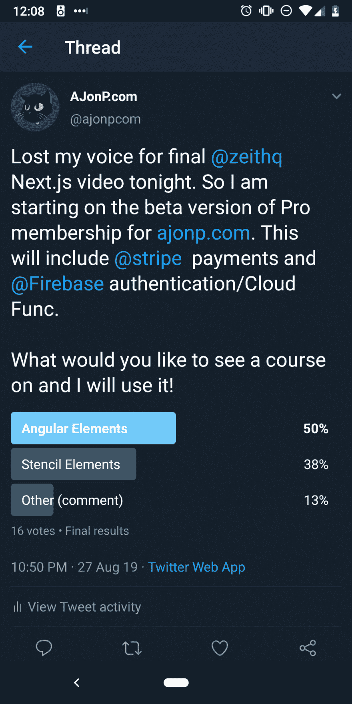

# Hugo 静态站点生成器中的角度元素

> 原文:[https://dev . to/codingcatdev/angular-elements-in-Hugo-static-site-generator-1 PCM](https://dev.to/codingcatdev/angular-elements-in-hugo-static-site-generator-1pcm)

[https://www.youtube.com/embed/iyvVtOsMThI](https://www.youtube.com/embed/iyvVtOsMThI)

# 给静态站点添加动态特性。

## 为什么

我需要增加对 https://AJonP.com 的付款，这样我们就可以开始支持更长的课程教程。所以我在 Twitter 上发起了一个投票，看看我们应该用什么来构建 web 组件。

[T2】](https://res.cloudinary.com/practicaldev/image/fetch/s--EGfDxo56--/c_limit%2Cf_auto%2Cfl_progressive%2Cq_auto%2Cw_880/https://thepracticaldev.s3.amazonaws.com/i/xfjzcgib93wjghj5a5a6.png)

我计划分享一个关于如何构建所有这些的更深入的课程！现在，我认为看着这一切发生会很酷。请注意，在站点加载后，Firebase 会启动并检查您是否是专业会员，然后使用理解用户状态的 webcomponent 动态隐藏项目。

使用`<ajonp-allow-if>`环绕任何元素，然后在该组件中使用 display none，这很简单。

让我知道你的想法！