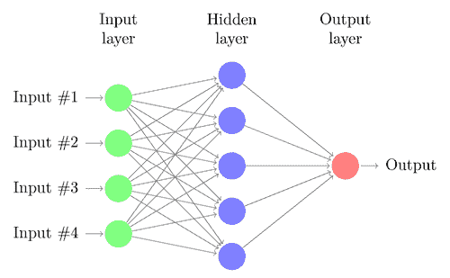
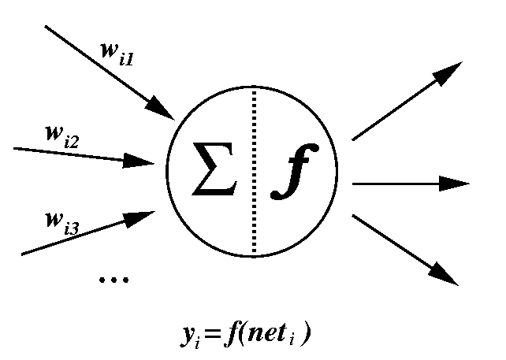

# C#与 F#中的神经网络

> 原文:[https://dev.to/integerman/neural-nets-in-c-vs-f-1322](https://dev.to/integerman/neural-nets-in-c-vs-f-1322)

这是一个 C#和 F#实现的比较，编程一个简单的[神经网络](https://en.wikipedia.org/wiki/Artificial_neural_network)库，我写这个库是为了在一个副业项目中使用。

# [](#what-is-a-neural-net)什么是神经网络？

神经网络本质上是一个计算器，它接受一个或多个数字输入，并计算一个或多个数字输出。

[T2】](https://res.cloudinary.com/practicaldev/image/fetch/s--kakYFNCR--/c_limit%2Cf_auto%2Cfl_progressive%2Cq_auto%2Cw_880/https://thepracticaldev.s3.amazonaws.com/i/j4igfbcbeafcuwmthyoy.png)

神经网络可以实现广泛的功能，但它们擅长的是在给定各种输入的情况下找到最佳输出。

输入保存在*输入层*中，该层连接到另一层——或者是*输出层*或者是*隐藏层*。包括输入层在内的每一层都由一个或多个神经元组成。每个神经元都与下一层中的每个神经元相连，并被赋予一个正或负的权重，以指示该连接的重要性。

单个神经元通过对来自前一层的所有输入执行求和函数来计算它们的值，其中每个输入乘以神经元连接的权重。这然后作为输入馈入下一层，直到它们到达*输出层*。

输出层是神经网络的调用者用来评估网络结果的层。这可以代表任何事情，从是否购买一只股票，到游戏中一步棋的吸引力，到图像中的主色调是什么，或者一张脸看起来有多开心。

神经网络通过其相互连接的特性实现这些计算，允许
灵活地表示问题的创新解决方案，但神经网络很难仅通过读取它们来解释。

神经网络通常有一个用于训练的反向传播机制，或者由一些其他因素训练，如[遗传算法](https://en.wikipedia.org/wiki/Genetic_algorithm)，但这两者都超出了本文的范围。

# [T1。净实施](#net-implementation)

## [](#neuron)神经元

神经元汇总并存储来自其他输入的值。

[T2】](https://res.cloudinary.com/practicaldev/image/fetch/s--RNWK4_An--/c_limit%2Cf_auto%2Cfl_progressive%2Cq_66%2Cw_880/https://thepracticaldev.s3.amazonaws.com/i/chb41xjrt9cncqxjw0r9.gif)

### [](#c-neuron)C#神经元

在 C#实现中，有许多用于维护字段和属性以及连接到其他节点和层的模板代码。核心评估逻辑出现在`Evaluate`方法中，并且相当少，但是由支持方法中建立的连接支持。

```
 /// <summary>
    /// Represents a Neuron in a layer of a Neural Network.
    /// </summary>
    public class Neuron
    {
        /// <summary>
        /// Gets or sets the value of the Neuron.
        /// </summary>
        public decimal Value { get; set; }

        /// <summary>
        /// Creates a new instance of a <see cref="Neuron"/>.
        /// </summary>
        public Neuron()
        {
            OutgoingConnections = new List<NeuronConnection>();
        }

        /// <summary>
        /// Connects this Neuron to the <paramref name="nextNeuron" />
        /// </summary>
        /// <param name="nextNeuron">The Neuron to connect to.</param>
        internal void ConnectTo([NotNull] Neuron nextNeuron)
        {
            if (nextNeuron == null) throw new ArgumentNullException(nameof(nextNeuron));

            OutgoingConnections.Add(new NeuronConnection(nextNeuron));
        }

        private decimal _sum;
        private int _numInputs;

        /// <summary>
        /// Evaluates the values from the incoming connections, averages them by the count of connections,
        /// and calculates the Neuron's Value, which is then passed on to any outgoing connections.
        /// </summary>
        internal void Evaluate()
        {
            if (_numInputs > 0)
            {
                Value = _sum / _numInputs;
                _sum = 0;
            }

            OutgoingConnections.Each(c => c.Fire(Value));
        }

        /// <summary>
        /// The list of outgoing Neuron connections
        /// </summary>
        [NotNull, ItemNotNull]
        public IList<NeuronConnection> OutgoingConnections { get; }

        /// <summary>
        /// Receives a value from a connection.
        /// </summary>
        /// <param name="value">The value to receive</param>
        internal void Receive(decimal value) => _sum += value;

        /// <summary>
        /// Registers an incoming connection from another neuron.
        /// </summary>
        /// <param name="neuronConnection">The connection</param>
        internal void RegisterIncomingConnection([NotNull] NeuronConnection neuronConnection)
        {
            if (neuronConnection == null) throw new ArgumentNullException(nameof(neuronConnection));

            _numInputs++;
        }
    } 
```

<svg width="20px" height="20px" viewBox="0 0 24 24" class="highlight-action crayons-icon highlight-action--fullscreen-on"><title>Enter fullscreen mode</title></svg> <svg width="20px" height="20px" viewBox="0 0 24 24" class="highlight-action crayons-icon highlight-action--fullscreen-off"><title>Exit fullscreen mode</title></svg>

### [](#f-neuron)F#神经元

相比之下，F#实现是最小的，它提供了一些简单的属性存储和一些简单的`Connect`和`Evaluate`方法。

```
/// Represents a node in a Neural Network
and Neuron ([<Optional>] ?initialValue: decimal) =
  let mutable value = defaultArg initialValue 0M;
  let mutable inputs: NeuronConnection seq = Seq.empty;

  /// Exposes the current calculated amount of the Neuron
  member this.Value
    with get () = value
    and set (newValue) = value <- newValue

  /// Incoming connections from other Neurons (if any)
  member this.Inputs: NeuronConnection seq = inputs;

  /// Adds an incoming connection from another Neuron
  member this.AddIncomingConnection c = inputs <- Seq.append this.Inputs [c];

  /// Adds all connections together, stores the result in Value, and returns the value
  member this.Evaluate(): decimal =
    if not (Seq.isEmpty this.Inputs) then do
      let numInputs = Seq.length this.Inputs |> decimal
      value <- Seq.sumBy (fun (c:NeuronConnection) -> c.Evaluate()) this.Inputs / numInputs;
    value;

  /// Connects this neuron to another and returns the connection
  member this.Connect(target: Neuron) =
    let connection = new NeuronConnection(this);
    target.AddIncomingConnection(connection);
    connection; 
```

<svg width="20px" height="20px" viewBox="0 0 24 24" class="highlight-action crayons-icon highlight-action--fullscreen-on"><title>Enter fullscreen mode</title></svg> <svg width="20px" height="20px" viewBox="0 0 24 24" class="highlight-action crayons-icon highlight-action--fullscreen-off"><title>Exit fullscreen mode</title></svg>

我喜欢它的一点是，它没有很多无意义的语法、空格或不相关的逻辑。这样做的缺点是，在扫描代码时，函数语法可能更难阅读。

## [](#layers)层

层只是同一层中神经元的集合。层代码用于管理不同层中节点之间的互连。

### [](#c-layer)C#层

老实说,`NeuralNetLayer`相当无聊。它充当不同节点之间的粘合剂，但实现需要 100 行代码。

```
 /// <summary>
    /// Represents a layer in a neural network. This could be an input, output, or hidden layer.
    /// </summary>
    public class NeuralNetLayer : IEnumerable<Neuron>
    {
        private readonly IList<Neuron> _neurons;

        [CanBeNull]
        private NeuralNetLayer _nextLayer;

        /// <summary>
        /// Creates a new neural network layer with the given count of neurons.
        /// </summary>
        /// <param name="numNeurons">The number of neurons in the layer</param>
        /// <exception cref="ArgumentOutOfRangeException">
        /// Thrown if <paramref name="numNeurons" /> was less than 1
        /// </exception>
        public NeuralNetLayer(int numNeurons)
        {
            if (numNeurons <= 0)
            {
                throw new ArgumentOutOfRangeException(nameof(numNeurons), "Each layer must have at least one Neuron");
            }

            _neurons = new List<Neuron>(numNeurons);

            numNeurons.Each(n => _neurons.Add(new Neuron()));
        }

        /// <summary>
        /// Gets the Neurons belonging to this layer.
        /// </summary>
        public IEnumerable<Neuron> Neurons => _neurons;

        /// <summary>
        /// Sets the values of the layer to the given values set. One value will be used for each neuron in the layer.
        /// </summary>
        /// <param name="values">The values to use.</param>
        /// <exception cref="ArgumentException">Thrown if <paramref name="values"/> did not have an expected values count.</exception>
        internal void SetValues([NotNull] IEnumerable<decimal> values)
        {
            if (values == null) throw new ArgumentNullException(nameof(values));
            if (values.Count() != _neurons.Count) throw new ArgumentException("The number of inputs must match the number of neurons in a layer", nameof(values));

            int i = 0;
            values.Each(v => _neurons[i++].Value = v);
        }

        /// <inheritdoc />
        public IEnumerator<Neuron> GetEnumerator() => _neurons.GetEnumerator();

        /// <inheritdoc />
        IEnumerator IEnumerable.GetEnumerator() => GetEnumerator();

        /// <summary>
        /// Evaluates each node in the layer, as well as the next layer if one is present.
        /// </summary>
        /// <returns>The outputs from the Output layer</returns>
        internal IEnumerable<decimal> Evaluate()
        {
            // Calculate all neurons.
            _neurons.Each(n => n.Evaluate());

            // If this is the last layer, return its values, otherwise delegate to the next layer and return its results
            return _nextLayer == null 
                ? _neurons.Select(n => n.Value) 
                : _nextLayer.Evaluate();
        }

        /// <summary>
        /// Connects this layer to the <paramref name="nextLayer"/>, forming connections between each node in this
        /// layer and each node in the next layer.
        /// </summary>
        /// <param name="nextLayer">The layer to connect to</param>
        internal void ConnectTo([NotNull] NeuralNetLayer nextLayer)
        {
            _nextLayer = nextLayer ?? throw new ArgumentNullException(nameof(nextLayer));

            _neurons.Each(source => nextLayer.Each(source.ConnectTo));
        }

        /// <summary>
        /// Sets the weights in the layer to the values provided
        /// </summary>
        /// <param name="weights">The weights to use to set in the connections</param>
        [UsedImplicitly]
        public void SetWeights(IList<decimal> weights)
        {
            int weightIndex = 0;
            _neurons.Each(neuron => neuron.OutgoingConnections.Each(c => c.Weight = weights[weightIndex++]));
        }
    } 
```

<svg width="20px" height="20px" viewBox="0 0 24 24" class="highlight-action crayons-icon highlight-action--fullscreen-on"><title>Enter fullscreen mode</title></svg> <svg width="20px" height="20px" viewBox="0 0 24 24" class="highlight-action crayons-icon highlight-action--fullscreen-off"><title>Exit fullscreen mode</title></svg>

### [](#f-layer)F#层

F#版本更短，它使用`Seq`(序列)方法将责任委派给单个神经元。

```
/// A layer is just a series of Neurons in parallel that will link to every Neuron in the next layer (if any is present)
and NeuralNetLayer(numNeurons: int) =
  do if numNeurons <= 0 then invalidArg "numNeurons" "There must be at least one neuron in each layer";

  let neurons: Neuron seq = seq [ for i in 1 .. numNeurons -> new Neuron 0M]
  /// Layers should start with an empty collection of neurons
  member this.Neurons: Neuron seq = neurons;

  /// Sets the value of every neuron in the sequence to the corresponding ordered value provided
  member this.SetValues (values: decimal seq) = 
    let assignValue (n:Neuron) (v:decimal) = n.Value <- v;
    Seq.iter2 assignValue this.Neurons values

  /// Evaluates the layer and returns the value of each node
  member this.Evaluate(): decimal seq =
    for n in this.Neurons do n.Evaluate() |> ignore;
    Seq.map (fun (n:Neuron) -> n.Value) this.Neurons;

  /// Connects every node in this layer to the target layer
  member this.Connect(layer: NeuralNetLayer): unit = 
    for nSource in neurons do
      for nTarget in layer.Neurons do
        nSource.Connect(nTarget) |> ignore; 
```

<svg width="20px" height="20px" viewBox="0 0 24 24" class="highlight-action crayons-icon highlight-action--fullscreen-on"><title>Enter fullscreen mode</title></svg> <svg width="20px" height="20px" viewBox="0 0 24 24" class="highlight-action crayons-icon highlight-action--fullscreen-off"><title>Exit fullscreen mode</title></svg>

## [](#neural-net)神经网络

神经网络将所有东西都捆绑到一个包装器中。它安排层，公开输入和输出，并为呼叫者提供一种将网络配置成预定安排的方式。

### [](#c-neural-net)C#神经网络

按照惯例，C#实现做一些基本的迭代和枚举，但是有大量的额外空间专门用于语法。

```
 /// <summary>
    /// Represent a neural network consisting of an input layer, an output layer, and 0 to many hidden layers.
    /// Neural networks can compute values and return a set of output values, allowing for computation to occur
    /// between layers.
    /// </summary>
    public class NeuralNet
    {
        private readonly IList<NeuralNetLayer> _hiddenLayers = new List<NeuralNetLayer>();

        /// <summary>
        /// Creates a new instance of a <see cref="NeuralNet"/>
        /// </summary>
        /// <param name="numInputs">The number of nodes in the input layer</param>
        /// <param name="numOutputs">The number of nodes in the output layer</param>
        public NeuralNet(int numInputs, int numOutputs)
        {
            if (numInputs <= 0) throw new ArgumentOutOfRangeException(nameof(numInputs), "You must have at least one input node");
            if (numOutputs <= 0) throw new ArgumentOutOfRangeException(nameof(numOutputs), "You must have at least one output node");

            Inputs = new NeuralNetLayer(numInputs);
            Outputs = new NeuralNetLayer(numOutputs);
        }

        /// <summary>
        /// Adds a hidden layer to the neural net and returns the new layer.
        /// </summary>
        /// <param name="numNeurons">The number of neurons in the layer</param>
        public void AddHiddenLayer(int numNeurons)
        {
            if (numNeurons <= 0) throw new ArgumentOutOfRangeException(nameof(numNeurons), "You cannot add a hidden layer without any nodes");
            if (IsConnected) throw new InvalidOperationException("Cannot add a new layer after the network has been evaluated.");

            var layer = new NeuralNetLayer(numNeurons);

            _hiddenLayers.Add(layer);
        }

        /// <summary>
        /// Evaluates the result of the neural network given the specified set of <paramref name="inputs"/>.
        /// </summary>
        /// <param name="inputs">The inputs to evaluate.</param>
        /// <returns>The values outputted from the output layer</returns>
        public IEnumerable<decimal> Evaluate(IEnumerable<decimal> inputs)
        {
            // Don't force people to explicitly connect
            EnsureConnected();

            // Pipe the inputs into the network and evaluate the results
            Inputs.SetValues(inputs);

            return Inputs.Evaluate();
        }

        /// <summary>
        /// Declares that the network is now complete and that connections should be created.
        /// </summary>
        public void Connect()
        {
            if (IsConnected) throw new InvalidOperationException("The Network has already been connected");

            if (_hiddenLayers.Any())
            {
                // Connect input to the first hidden layer
                Inputs.ConnectTo(_hiddenLayers.First());

                // Connect hidden layers to each other
                if (_hiddenLayers.Count > 1)
                {
                    for (int i = 0; i < _hiddenLayers.Count - 1; i++)
                    {
                        _hiddenLayers[i].ConnectTo(_hiddenLayers[i + 1]);
                    }
                }

                // Connect the last hidden layer to the output layer
                _hiddenLayers.Last().ConnectTo(Outputs);
            }
            else
            {
                // No hidden layers, connect the input layer to the output layer
                Inputs.ConnectTo(Outputs);
            }

            IsConnected = true;
        }

        /// <summary>
        /// Determines whether or not the nodes in the network have been connected.
        /// </summary>
        public bool IsConnected { get; private set; }

        /// <summary>
        /// The input layer
        /// </summary>
        public NeuralNetLayer Inputs { get; }

        /// <summary>
        /// The output layer
        /// </summary>
        public NeuralNetLayer Outputs { get; }

        /// <summary>
        /// Gets all layers in the network, in order from first to last, including the Input layer,
        /// output layer, and any hidden layers.
        /// </summary>
        public IEnumerable<NeuralNetLayer> Layers
        {
            get
            {
                yield return Inputs;

                foreach (var layer in _hiddenLayers)
                {
                    yield return layer;
                }

                yield return Outputs;
            }
        }

        /// <summary>
        /// Sets the weights of all connections in the network. This is a convenience method for loading
        /// weight values from JSON and restoring them into the network.
        /// This will connect the network if it is not currently connected.
        /// </summary>
        /// <param name="weights">The weight values from -1 to 1 for every connector in the network.</param>
        [UsedImplicitly]
        public void SetWeights(IList<decimal> weights)
        {
            // Setting weights makes no sense unless the network is connected, so ensure we're connected
            EnsureConnected();

            ConnectorCount = 0;

            int weightIndex = 0;

            foreach (var layer in Layers)
            {
                foreach (var neuron in layer.Neurons)
                {
                    foreach (var connection in neuron.OutgoingConnections)
                    {
                        // Early exit if we've run out of weights to go around
                        if (weightIndex >= weights.Count)
                        {
                            break;
                        }

                        connection.Weight = weights[weightIndex++];
                        ConnectorCount++;
                    }
                }
            }
        }

        /// <summary>
        /// Connects the neural net if it has not yet been connected
        /// </summary>
        private void EnsureConnected()
        {
            if (IsConnected) return;

            Connect();
        }

        /// <summary>
        /// Gets the total connector count in the neural net.
        /// </summary>
        public int ConnectorCount { get; private set; }
    } 
```

<svg width="20px" height="20px" viewBox="0 0 24 24" class="highlight-action crayons-icon highlight-action--fullscreen-on"><title>Enter fullscreen mode</title></svg> <svg width="20px" height="20px" viewBox="0 0 24 24" class="highlight-action crayons-icon highlight-action--fullscreen-off"><title>Exit fullscreen mode</title></svg>

### [](#f-neural-net)F#神经网络

F#版本是最大的 F#类，但是它的逻辑仍然相当简洁，使用了小而集中的方法。

```
/// A high-level encapsulation of a neural net
and NeuralNet(numInputs: int, numOutputs: int) =
  do 
    if numInputs <= 0 then invalidArg "numInputs" "There must be at least one neuron in the input layer";
    if numOutputs <= 0 then invalidArg "numOutputs" "There must be at least one neuron in the output layer";

  let inputLayer: NeuralNetLayer = new NeuralNetLayer(numInputs);
  let outputLayer: NeuralNetLayer = new NeuralNetLayer(numOutputs);
  let mutable hiddenLayers: NeuralNetLayer seq = Seq.empty;
  let mutable isConnected: bool = false;

  let connectLayers (n1:NeuralNetLayer) (n2:NeuralNetLayer) = n1.Connect(n2);

  let layersMinusInput: NeuralNetLayer seq =
    seq {
      for layer in hiddenLayers do yield layer;
      yield outputLayer;
    }

  let layersMinusOutput: NeuralNetLayer seq =
    seq {
      yield inputLayer;
      for layer in hiddenLayers do yield layer;
    }

  /// Yields all connections to nodes inside of the network
  let connections = Seq.collect (fun (l:NeuralNetLayer) -> l.Neurons) layersMinusInput 
                 |> Seq.collect (fun (n:Neuron) -> n.Inputs); 

  /// Gets the layers of the neural network, in sequential order
  member this.Layers: NeuralNetLayer seq =
    seq {
      yield inputLayer;
      for layer in hiddenLayers do
        yield layer;
      yield outputLayer;
    }

  /// Represents the input layer for the network which take in values from another system
  member this.InputLayer = inputLayer;

  /// Represents the last layer in the network which has the values that will be taken out of the network
  member this.OutputLayer = outputLayer;    

  /// Connects the various layers of the neural network
  member this.Connect() =
    if isConnected then invalidOp "The Neural Network has already been connected";

    Seq.iter2 (fun l lNext -> connectLayers l lNext) layersMinusOutput layersMinusInput 
    isConnected <- true;

  /// Determines whether or not the network has been connected. After the network is connected, it can no longer be added to
  member this.IsConnected = isConnected;

  /// Adds a hidden layer to the middle of the neural net
  member this.AddHiddenLayer(layer: NeuralNetLayer) = 
    if isConnected then invalidOp "Hidden layers cannot be added after the network has been connected.";
    hiddenLayers <- Seq.append hiddenLayers [layer];

  /// Sets the weights on all connections in the neural network
  member this.SetWeights(weights: decimal seq) = 
    if isConnected = false then do this.Connect();
    Seq.iter2 (fun (w:decimal) (c:NeuronConnection) -> c.Weight <- w) weights connections;      

  /// Evaluates the entire neural network and yields the result of the output layer
  member this.Evaluate(): decimal seq = 
    if not isConnected then do this.Connect();

    // Iterate through the layers and run calculations
    let mutable result: decimal seq = Seq.empty;
    for layer in this.Layers do
      result <- layer.Evaluate();
    result; 
```

<svg width="20px" height="20px" viewBox="0 0 24 24" class="highlight-action crayons-icon highlight-action--fullscreen-on"><title>Enter fullscreen mode</title></svg> <svg width="20px" height="20px" viewBox="0 0 24 24" class="highlight-action crayons-icon highlight-action--fullscreen-off"><title>Exit fullscreen mode</title></svg>

# [](#conclusion)结论

## [](#closing-thoughts)关闭思绪

虽然 F#语法更简洁，但是应该注意，这是一个对于函数式语言来说几乎是理想的例子。这是 C#代码可以在其他项目中使用的组件的一个重要示例。

如果你想把 F#加入到一个项目中，我建议从你的应用程序的一小部分开始，其他领域的计算或其他类型的转换逻辑都依赖于它。

我个人觉得函数式编程，或者至少是那些语言中的核心概念，可以极大地提高软件质量，所以这是一个值得探索的想法。

[](/integerman) [## 使缺陷成为不可能

### matt Eland Aug 31 ' 195min read

#testing #dotnet #javascript #codequality](/integerman/making-defects-impossible-16c)

## [](#where-can-i-find-this-code)在哪里可以找到这个代码？

这些例子中的所有代码都托管在 GitHub 上。

##  [德国](https://github.com/IntegerMan) / [马特兰德。艾](https://github.com/IntegerMan/MattEland.AI)

### 。NET 人工智能库不依赖于特定的项目

<article class="markdown-body entry-content container-lg" itemprop="text">

# MattEland.AI

不依赖于特定项目的人工智能相关库。

</article>

[View on GitHub](https://github.com/IntegerMan/MattEland.AI)

如果你对马特兰德感兴趣。AI，它在 https://www.nuget.org/packages/MattEland.AI.Neural/有一个 NuGet 包