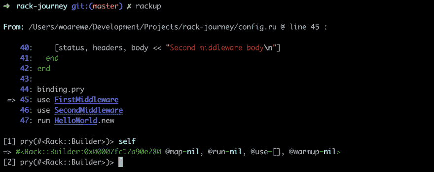
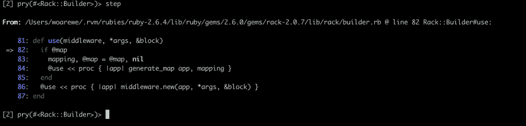
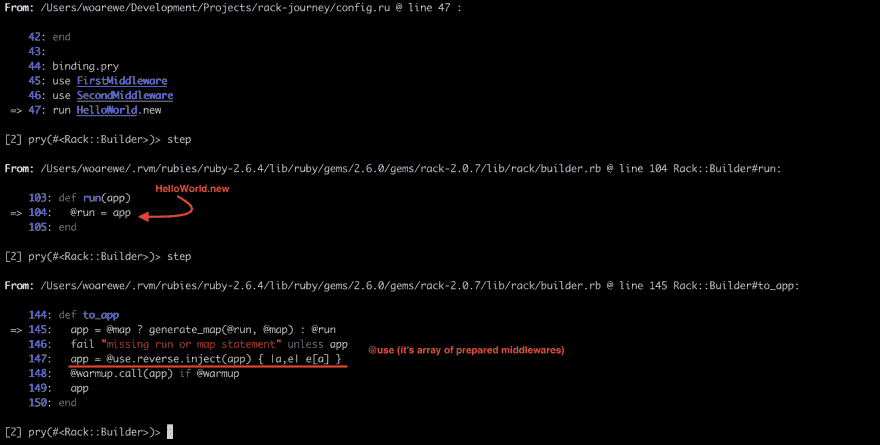

# rack 如何预处理你的中间件？

> 原文:[https://dev . to/woare we/how-do-rack-preprocess-your-middleware-28cl](https://dev.to/woarewe/how-does-rack-preprocess-your-middlewares-28cl)

# [](#tiny-introduction)微型游戏攻略

你有没有想过当你启动你的 rails 服务器时会发生什么？
如果没有，我非常推荐你多了解一下[架](http://rack.github.io/)。如果你喜欢视频资源，来自[思维机器人](https://thoughtbot.com/)的家伙们有一个特别为你准备的[视频](https://thoughtbot.com/upcase/videos/rack)。

# [](#so-but-how-do-rack-middlewares-work-underhood)那么，但是 rack middlewares 是如何在幕后工作的呢？

只是一个简单的例子，config.ru 有两个中间件:

```
# frozen_string_literal: true

class HelloWorld
  def call(env)
    [200, { 'Content-Type' => 'text/plain' }, ["Hello World\n"]]
  end
end

module Middleware
  class Base
    attr_reader :app

    def initialize(app)
      @app = app
    end

    def call(_env)
      raise NotImplementedError
    end
  end
end

class FirstMiddleware < Middleware::Base
  def call(env)
    status, headers, body = app.call(env)
    [status, headers, body << "First middleware body\n"]
  end
end

class SecondMiddleware < Middleware::Base
  def call(env)
    status, headers, body = app.call(env)
    [status, headers, body << "Second middleware body\n"]
  end
end

use FirstMiddleware
use SecondMiddleware
run HelloWorld.new 
```

我们开始潜水吧！

当 **rack** 处理 **config.ru** 时，它将你运行的代码与 **Rack::Builder** 的实例绑定。
[](https://res.cloudinary.com/practicaldev/image/fetch/s--h-qlLgzd--/c_limit%2Cf_auto%2Cfl_progressive%2Cq_auto%2Cw_880/https://thepracticaldev.s3.amazonaws.com/i/psey1idnq592a7kadwnh.png) 
然后每次 rack 遇到 **use AnyMiddlewareClass** 时，构建器就准备好中间件类并放入实例变量**@ use**
[](https://res.cloudinary.com/practicaldev/image/fetch/s--UV3MEOZd--/c_limit%2Cf_auto%2Cfl_progressive%2Cq_auto%2Cw_880/https://thepracticaldev.s3.amazonaws.com/i/y3gumink1yw6603ke805.png)
最后，构建器运行我们的应用程序对象，但事先将它包装在所有中间件上
[](https://res.cloudinary.com/practicaldev/image/fetch/s--SqZspGtE--/c_limit%2Cf_auto%2Cfl_progressive%2Cq_auto%2Cw_880/https://thepracticaldev.s3.amazonaws.com/i/erqpaabxacfbz9i43h98.png)

非常感谢您的关注，有用链接:

*   [图像中的机架](https://github.com/JoelQ/intro-rack-notes)
*   [我的回购与代码示例](https://github.com/woarewe/rack-jorney)