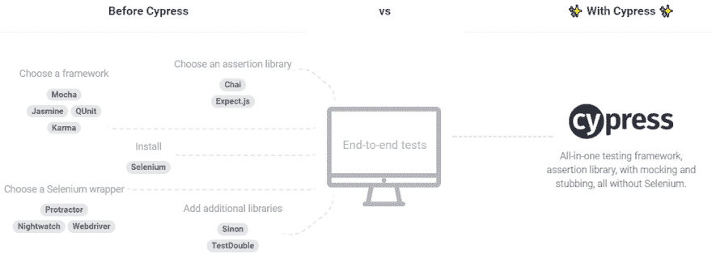
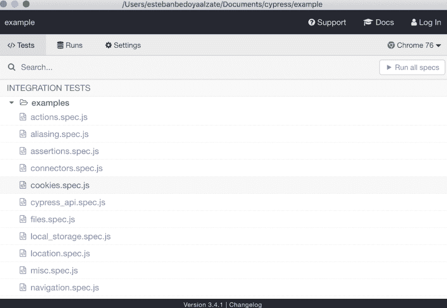
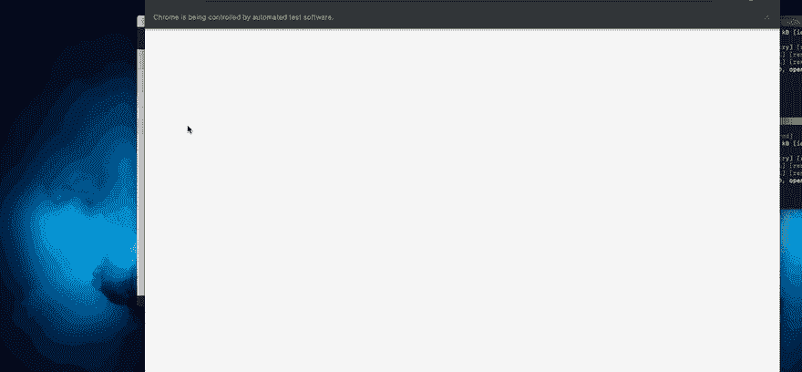
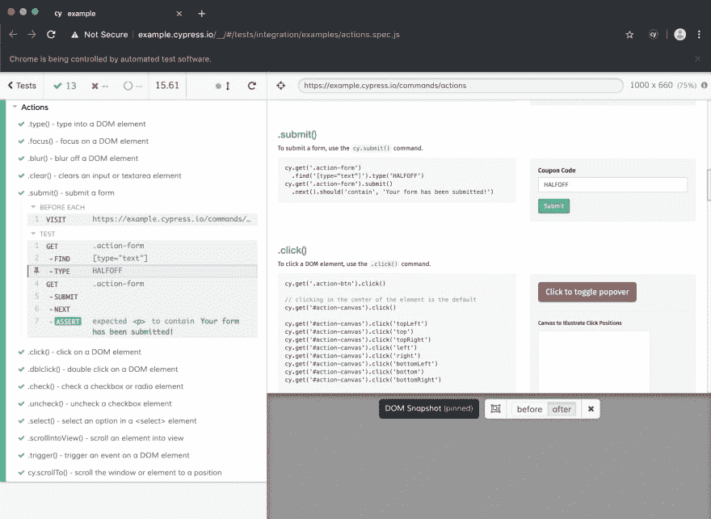
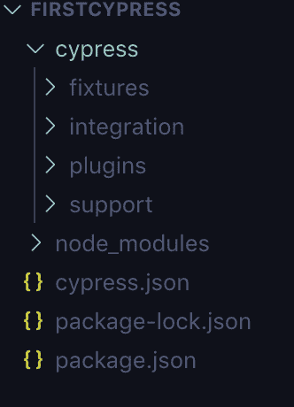
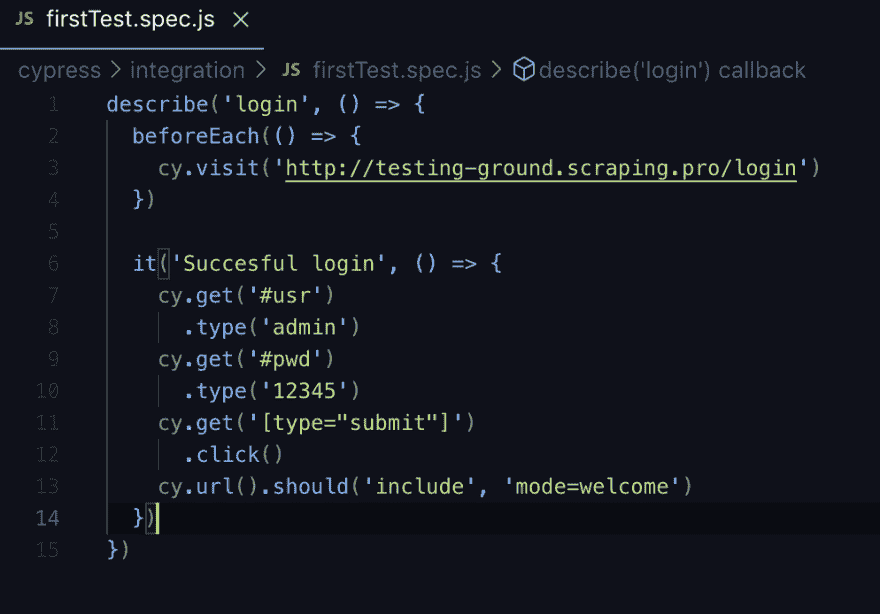
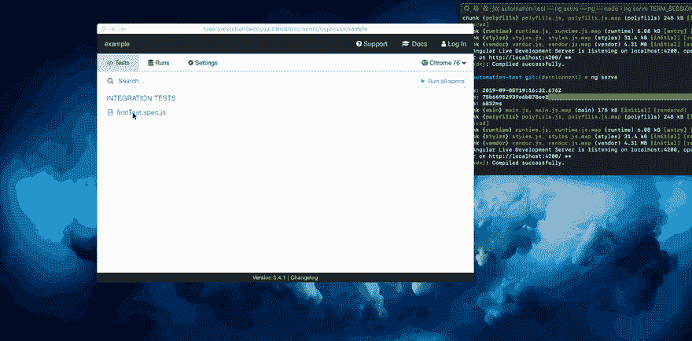

# Cypress 简介

> 原文:[https://dev.to/tebanwolox/introduccion-a-cypress-1m60](https://dev.to/tebanwolox/introduccion-a-cypress-1m60)

Cypress 是所谓的基于自动化测试的一部分，这是新一代的测试框架，旨在为人们熟知的 selenium 提供一种替代品，从而避免它所面临的各种问题。虽然此工具更侧重于 e2e 测试，但它被认为是一体式的，因为除了使用 chrome 进行全面测试外，它还具有用于执行 mocks 和单元测试的库。

[T2】](https://res.cloudinary.com/practicaldev/image/fetch/s--u_BUt7Rv--/c_limit%2Cf_auto%2Cfl_progressive%2Cq_auto%2Cw_880/https://www.paradigmadigital.com/wp-content/uploads/2018/03/Cypress-1.png)

此工具专为角、无功或 esta 等现代前端技术而设计。但它同时适用于渲染到服务器(SSD)的网页。

## 安装:

Cypress 可以通过多种方式进行安装，从官方页面下载安装程序，并通过软件包管理器(如 npm 或 yar)进行安装，这种做法需要安装 npm 和 node。在此之前，我们将创建一个文件夹，并使用以下命令在 node 上创建一个项目:

*   mkdir 示例
*   cd 示例
*   npm init(我们接受所有默认设置)
*   npm i 柏树-保存-开发

我们现在已安装 cypress，但必须启动它才能使用以下命令工作并编写测试代码:

*   node_modules/。箱子/柏树开口

这将打开 cypress 的图形界面，按下 *Ok* 按钮，并向我们展示 cypress 最初创建的所有测试作为示例。

[T2】](https://res.cloudinary.com/practicaldev/image/fetch/s--pR-DocDl--/c_limit%2Cf_auto%2Cfl_progressive%2Cq_auto%2Cw_880/https://i.ibb.co/kgNNG7d/testing-Ex.png)

双击其中任何一个 specs 将开始测试。

[T2】](https://res.cloudinary.com/practicaldev/image/fetch/s--DRRv3IB---/c_limit%2Cf_auto%2Cfl_progressive%2Cq_66%2Cw_880/https://i.ibb.co/VWC8JH3/testExam.gif)

如您所见，action.spec.js 中包含的每个测试案例都会被执行，在结束时，我们会看到每个案例的详细资料。在任何步骤中按下都会显示 cypress 在运行测试时获取的屏幕截图的页面状态。

[T2】](https://res.cloudinary.com/practicaldev/image/fetch/s--gX0S2hLA--/c_limit%2Cf_auto%2Cfl_progressive%2Cq_auto%2Cw_880/https://i.ibb.co/hZFz0Rd/Screen-Shot-2019-09-05-at-16-18-51.png)

在本例中，打开了 test case . submit()的详细信息，并注意到在 DOM 输入中插入文本的“TYPE”步骤，您可以看到的另一个工具是“before”和“after”按钮，您可以使用这些按钮查看页面在特定步骤之前和之后的位置。

接下来，我们在代码编辑器(如 visual code)中打开 example 目录，并应显示以下文件和文件夹:

[T2】](https://res.cloudinary.com/practicaldev/image/fetch/s--muYfnmEt--/c_limit%2Cf_auto%2Cfl_progressive%2Cq_auto%2Cw_880/https://b.imge.to/2019/09/12/vjKOGC.png)

cypress 专用文件夹及其功能如下:

*   **扣件:**用来存放磨煤机中使用的文件的地方，可以是图片、视频、txt 等。
*   **插件:**在此文件夹中，我们可以修改 Cypress 的内部功能。
*   **specs:t1】这里是我们保存 e2e 测试的地方。**
*   **支援:**我们可以储存有用功能的地方，例如处理认证的功能。

若要查看与先前运行的示例测试关联的代码，我们必须返回到代码编辑器，actions.spec.js 文件位于 cypress/integration/examples 路径中的项目根目录下，在此我们可以看到 cypress 创建的所有示例，我们可以删除此文件夹。

## 创建证据:

要执行此测试，我们将使用一个专门用于测试的页面，该页面位于以下 URL:[【http://testing-ground . scraping . pro/log in】](http://testing-ground.scraping.pro/login)这包含一个简单登录，并在同一页面上向我们显示以下身份证明:对于用户和密码，如果登录成功，将重定向到 mode = welcome，对于本练习，我们将测试此登录，并使其正确发送到欢迎页面。

让我们转到 integration 文件夹并创建文件*first test . spec . js*，然后在此处创建我们的第一个测试，其结构如下:

[T2】](https://res.cloudinary.com/practicaldev/image/fetch/s--w5IeTnL7--/c_limit%2Cf_auto%2Cfl_progressive%2Cq_auto%2Cw_880/https://i.ibb.co/DryJwVD/test.png)

我们最初创建了一种方法 **describe** ，在此方法中，您可以对一个或多个测试进行分组，它包含两个参数，即:一个描述将对其进行的测试(在本例中我们将其定义为】，另一个包含一个函数，其中包含我们的测试。

接下来，我们看到使用了一种方法 **beforeEach** ，在此我们定义了在创建每一个测试之前要执行的一系列步骤，该方法是可选的，在此例中，它只有一个步骤*【cy . visit()】、 **cy** 是一个全局变量*

接下来，我们来回顾一下用 **it** 方法定义的测试，就像他**得到描述一样**作为测试的第二个参数，这次将执行**方法**)或其类型。在本例中，对于行，我们捕获与用户写入的输入相对应的 id 为的对象，因为获取对象后，我们可以对其执行更多操作，如‘T6’type，使用此方法，我们可以在某些输入中写入，如本例中发送给它的输入之后，我们执行相同的操作，但对于密码，使用 id≤并键入□只需点击登录按钮的动作，因为这个对象没有类或 id，我们可以用下面的行*来引用它的类型，然后我们就开始使用**方法，用它发送数据。为了确认登录是否成功，我们会用 **url** 进行检查，用它我们会有地址，并核实它是否把我们送到欢迎 url**我们会询问 URL 是否包括☆如果这是真的，测试是否通过了。*****

 *****再次运行命令*，在 cypress 界面中选择了我们创建的文件*，测试将开始运行，如果一切都正确，将显示以下结果:**

 **[T2】](https://res.cloudinary.com/practicaldev/image/fetch/s--aeIg1H6Z--/c_limit%2Cf_auto%2Cfl_progressive%2Cq_66%2Cw_880/https://i.ibb.co/wyBdwrj/Secondtest.gif)

所以我们用 cypress 完成了我们的第一个测试，你可以看到它非常简单，代码非常容易阅读。此工具还为我们提供了更多的选项，例如测试视频记录、后台测试、直接集成到项目中、与此强大的框架(主要是 e2e 测试的替代方案)管理的其他选项无缝集成。

测试示例的存储库位于以下链接:[https://github . com/tebanwolox/cypress-example](https://github.com/tebanwolox/cypress-example)

我还留下了其他有趣的链接:

*   [柏树](https://www.cypress.io)
*   [测试它应该的方式](https://www.youtube.com/watch?v=pJ349YntoIs&t=1900s)
*   [如何用 Cypress.io 框架测试你的前端](https://medium.com/free-code-camp/how-to-test-your-frontend-with-the-cypress-io-framework-f048070f4330)
*   [为什么现代网络测试应该改用 Cypress？](https://medium.com/@shivambharadwaj/https-medium-com-shivambharadwaj-why-you-should-switch-to-cypress-for-modern-web-testing-5d3739a19e6)*******