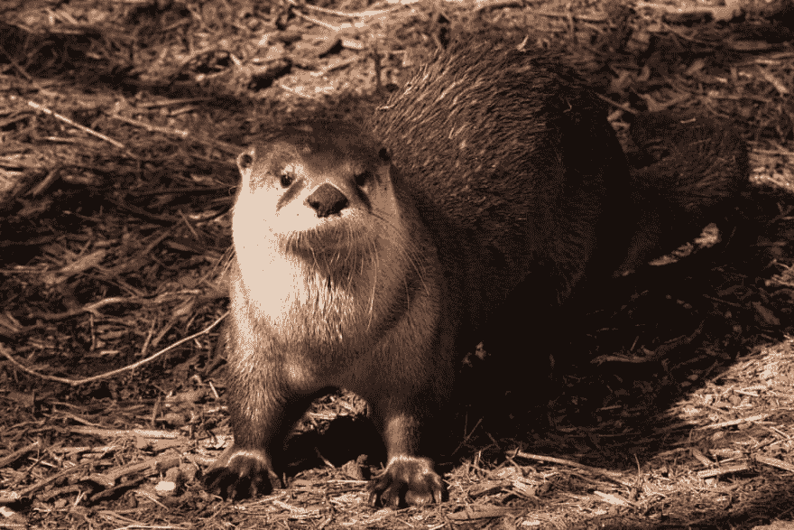
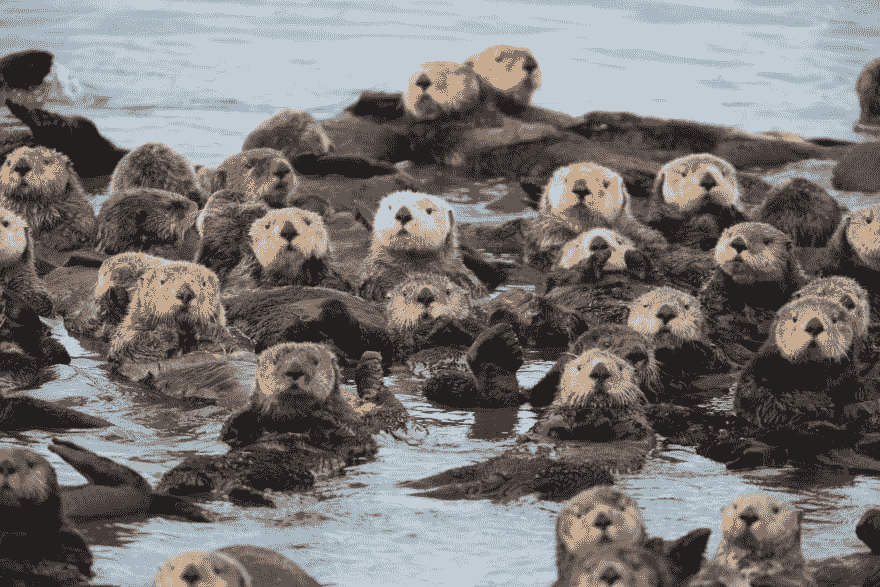
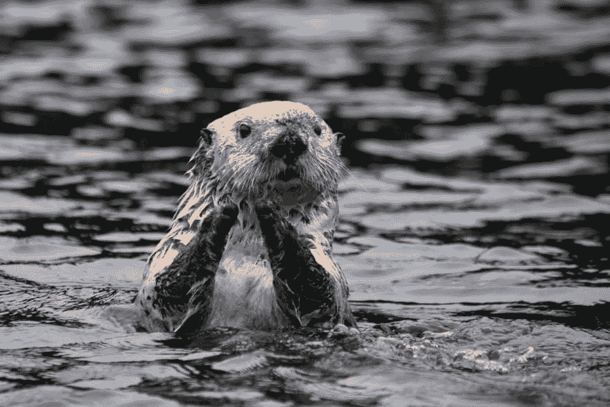
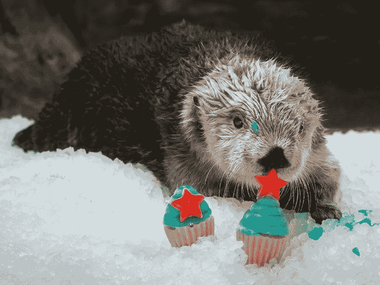

# 成为另一个

> 原文:[https://dev.to/dealeron/be-an-otter-209k](https://dev.to/dealeron/be-an-otter-209k)

[T2】](https://res.cloudinary.com/practicaldev/image/fetch/s--YhykucIi--/c_limit%2Cf_auto%2Cfl_progressive%2Cq_auto%2Cw_880/https://thepracticaldev.s3.amazonaws.com/i/8m9zawbq76nqjsyozoen.jpg)

开发人员可以采用多种方法来完成工作。他们可以用足够的努力让自己的头露出水面，懒洋洋地漂浮着，或者他们可以抓住已知的东西，漂浮一段时间。有很多方法，但我想说的是像水獭一样。

水獭快速、敏捷，看起来很有趣。总是期待着他们的下一个挑战-他们热切地以一种嬉戏的心态对待生活。天生好奇，他们研究解决问题的方法。它们是群居动物，成群生活和工作，被称为嬉戏者(如果它们在水里，就是筏子)。据观察，水獭会把石头当作工具，甚至只是为了让自己有事可做。他们甚至会在睡觉的时候紧紧抓住对方，这样他们就不会分开。

[T2】](https://res.cloudinary.com/practicaldev/image/fetch/s--jS_0reqM--/c_limit%2Cf_auto%2Cfl_progressive%2Cq_auto%2Cw_880/https://thepracticaldev.s3.amazonaws.com/i/6dlp39j6jior94bbfak7.jpg)

* * *

## 像水獭一样快乐

[T2】](https://res.cloudinary.com/practicaldev/image/fetch/s--66QVbyi8--/c_limit%2Cf_auto%2Cfl_progressive%2Cq_auto%2Cw_880/https://thepracticaldev.s3.amazonaws.com/i/w97j7iclsn77e2iqy16u.jpg)

作为开发者，我们应该以水獭为榜样。如果你不能愉快地处理你的问题，至少试着玩一玩。你的精神状态很重要，它对你的团队成员的影响比你意识到的要大。

* * *

## 像水獭一样古怪

[T2】](https://res.cloudinary.com/practicaldev/image/fetch/s--ObhFszFF--/c_limit%2Cf_auto%2Cfl_progressive%2Cq_auto%2Cw_880/https://thepracticaldev.s3.amazonaws.com/i/45crys1ble2xwx30x7q3.png)

问题只是等待被发现的解决方案。研究新的模式和解决方案。像水獭一样保持精干和敏捷，找到新的方法去做你已经知道怎么做的事情。

* * *

## 像水獭一样社交

[T2】](https://res.cloudinary.com/practicaldev/image/fetch/s--lFgfQ4VE--/c_limit%2Cf_auto%2Cfl_progressive%2Cq_auto%2Cw_880/https://thepracticaldev.s3.amazonaws.com/i/54ypz93lxznoo4tcgnl3.jpg)

利用你的团队。他们可以帮助你实现个人和职业目标。作为一名开发人员，有大量的资源可供您使用。Slack、Discord、Twitter 和其他网络和网站上的整个社区都在你的指尖，你会发现人们非常愿意帮助你学习或谈论你所涉足的任何技术。如果你住在大都市，可能有人正在组织科技聚会。如果没有(或者即使有)，你可以开始自己的。你可以参加附近的黑客马拉松。这给了你机会去推动自己去做一些你平时不会做的事情，比如和陌生人或者你平时不会做的人一起工作。它还让你看到其他参与者和团队的能力，并通过与各种各样的人互动和倾听，让你接触到新的想法。

* * *

## 像水獭一样巧妙

[T2】](https://res.cloudinary.com/practicaldev/image/fetch/s--rlRsUPBy--/c_limit%2Cf_auto%2Cfl_progressive%2Cq_66%2Cw_880/https://thepracticaldev.s3.amazonaws.com/i/46udjpa3v7fazux6ipae.gif)

利用你所掌握的工具。自由开放源码软件比以往任何时候都要大。这意味着您也可以使用这些工具。也不要害怕享受乐趣。通过玩耍，你可以学到很多东西。如果你想学习一门新的语言或者如何使用一个新的框架，开始一个项目。宠物项目几乎具有内在价值。

* * *

## 做一只水獭

[T2】](https://res.cloudinary.com/practicaldev/image/fetch/s--y0XpY7mT--/c_limit%2Cf_auto%2Cfl_progressive%2Cq_auto%2Cw_880/https://thepracticaldev.s3.amazonaws.com/i/z56klv2f8zj1np0rv6j2.jpg)

没有模型，很难决定在生活中如何行动。如果你的目标是作为一名开发人员磨练自己的技能，那么遵循 otter 的模式可以让你在职业和个人追求方面走得更远。另一个模型可能更适合你个人，但至少现在你知道如何像一只水獭。

[T2】](https://res.cloudinary.com/practicaldev/image/fetch/s--wo4ivwQD--/c_limit%2Cf_auto%2Cfl_progressive%2Cq_auto%2Cw_880/https://thepracticaldev.s3.amazonaws.com/i/mleh5ugiax0ng183zvkw.jpg)