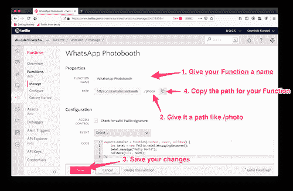
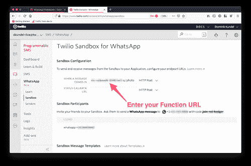
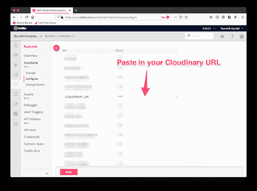
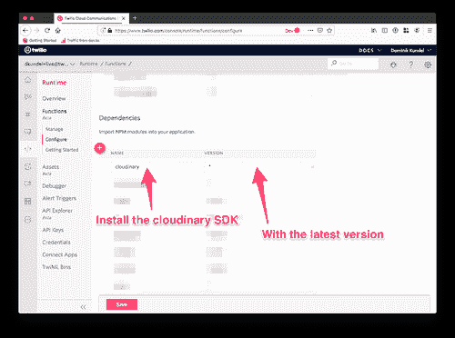
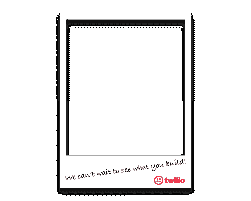
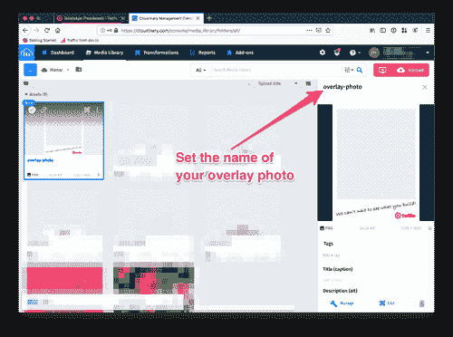
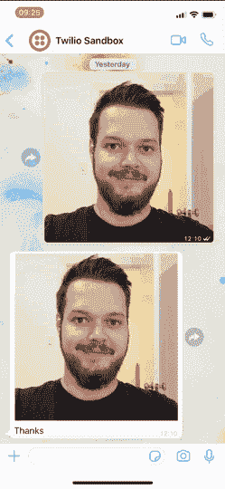

# 使用 Twilio、WhatsApp 和 Cloudinary 创建虚拟照片亭

> 原文:[https://dev . to/twilio/creating-a-virtual-photo-booth-using-twilio-whatsapp-cloud inary-300m](https://dev.to/twilio/creating-a-virtual-photo-booth-using-twilio-whatsapp-cloudinary-3o0m)

如果你去过柏林，你很有可能在酒吧和街道上看到很多照相亭。柏林和照相亭属于同一个地方。今年的 JSConf EU 我们想建立我们自己的虚拟照片亭，由 WhatsApp 的 [Twilio 提供支持。在本帖中，我们将看看我们是如何使用](https://www.twilio.com/whatsapp) [Twilio](https://www.twilio.com/) 和 [Cloudinary](https://cloudinary.com/) 构建照片亭的数字部分的。

让我们建立一个纯数字版本的照相亭，当一个人发送一张图片时，我们会对图片进行一些处理，然后发送回来。

## [](#prerequisites)先决条件

在我们开始之前，请确保您具备以下条件:

*   Twilio 账户([免费注册](https://www.twilio.com/try-twilio))
*   WhatsApp 沙盒频道已安装([了解如何激活您的 WhatsApp 沙盒](https://www.twilio.com/docs/sms/whatsapp/api))
*   [一个免费的云账户](https://cloudinary.com/signup)

如果您喜欢将接下来的步骤作为视频来观看，请确保[在 YouTube](https://www.youtube.com/watch?v=Rjh_b7MsB4Q) 上查看该视频:

[https://www.youtube.com/embed/Rjh_b7MsB4Q](https://www.youtube.com/embed/Rjh_b7MsB4Q)

## [](#setting-up-your-whatsapp-number)设置您的 WhatsApp 号码

当一个人向我们的 WhatsApp 号码(或沙盒)发送图片时，Twilio 将触发一个 [webhook 请求](https://www.youtube.com/watch?v=aLjSNfoJCYc)，我们必须接收这个请求。我们可以为此使用任何 HTTP 服务器，但是在我们的例子中，我们将使用一个 [Twilio 函数](https://www.twilio.com/functions)。这允许我们使用 Node.js 托管一个无服务器的 HTTP 端点。

在 [Twilio 控制台](https://www.twilio.com/console/runtime/functions/manage)中，进入[功能区](https://www.twilio.com/console/runtime/functions/manage)，用“你好短信”模板创建一个新的 Twilio 功能。

[T2】](https://res.cloudinary.com/practicaldev/image/fetch/s--zbVYhDKn--/c_limit%2Cf_auto%2Cfl_progressive%2Cq_auto%2Cw_880/https://s3.amazonaws.com/com.twilio.prod.twilio-doimg/f0R0eYtrR0gO9TzL_Zmur8UgLr3fQ7yFkWf31JfjF5nRc5.width-500.png)

一旦你创建了你的新函数，给它起一个名字，比如“WhatsApp Photobooth”和一个路径，比如`/photo`。确保保存更改并将路径复制到 Twilio 函数。

[T2】](https://res.cloudinary.com/practicaldev/image/fetch/s--US2pD7Jw--/c_limit%2Cf_auto%2Cfl_progressive%2Cq_auto%2Cw_880/https://s3.amazonaws.com/com.twilio.prod.twilio-doimg/dQGLYaSbdPhMySFGWlrkj8fCxDAqPotzAM1ryebBtWdi5c.width-500.png)

在一个新的标签中，前往 [WhatsApp 沙盒配置屏幕](https://www.twilio.com/console/sms/whatsapp/sandbox)，将“当有消息进来时”的 URL 设置为 Twilio 函数的路径。一直滚动到底部以保存更改。

[T2】](https://res.cloudinary.com/practicaldev/image/fetch/s--Hhtczlv3--/c_limit%2Cf_auto%2Cfl_progressive%2Cq_auto%2Cw_880/https://s3.amazonaws.com/com.twilio.prod.twilio-doimg/3Z8cjgqvwU0uM_FIZ5Lz6LCFw5wvgLpYs0ddBMJTsImCHk.width-500.png)

你可以通过向你的 WhatsApp 沙箱发送任何消息来测试一切是否设置正确。回应应该总是“你好，世界”。

## [](#receiving-the-picture)接收图片

现在我们已经建立了 Twilio 函数，让我们看看如何在发送图像时检索图像。

当 Twilio 向您的 webhook 发出 HTTP 请求时，它会在您的消息周围发送一组信息作为请求的一部分。在 Twilio 函数中，我们可以通过传递给我们函数的`event`对象来访问它们。

具体来说，在我们的例子中,`event.MediaUrl0`是我们感兴趣的，因为它将包含我们的图像的 URL，如果它已经与消息一起发送的话。如果发送了更多的图像，我们也可能有`event.MediaUrl1`到`event.MediaUrl9`可用，但在我们的情况下，我们将专注于第一个。

现在，我们将只记录 URL，相应地修改您的 Twilio 函数并点击 save:

```
exports.handler = function(context, event, callback) {
    console.log(event.MediaUrl0);
    let twiml = new Twilio.twiml.MessagingResponse();
    twiml.message("Hello World");
    callback(null, twiml);
}; 
```

之后，发送一张图片到沙盒中，并检查函数底部的日志。您应该会看到一个记录的 URL。按“复制”按钮复制网址，并在另一个标签中打开它，你可以看到你发送的图像。

[T2】](https://res.cloudinary.com/practicaldev/image/fetch/s--7NtpIjFL--/c_limit%2Cf_auto%2Cfl_progressive%2Cq_auto%2Cw_880/https://s3.amazonaws.com/com.twilio.prod.twilio-doimg/JVi-Id6B3LNazMWgGZWDIj6yuDvIKAhoCDf8JHiVKXlpnl.width-500.png)

现在我们可以访问发送的图像了。让我们看看如何使用 Cloudinary 修改它。

## [](#manipulating-the-picture)操纵画面

Cloudinary 是一个用于图像管理和操作的平台。这对我们的用例来说很好，因为我们想在我们的图片上做一些图像处理。我们还需要一个 URL，我们可以给 Twilio 发送结果图像。Cloudinary 将这两者结合在一个平台中。

首先安装 [`cloudinary`](https://npm.im/cloudinary) SDK 作为依赖项，并设置您的 Cloudinary 凭据。转到 Twilio 函数的*配置*页面，在*环境变量*部分，从 [Cloudinary 仪表板](https://cloudinary.com/console)添加您的`CLOUDINARY_URL`。

[T2】](https://res.cloudinary.com/practicaldev/image/fetch/s--AezZWiYl--/c_limit%2Cf_auto%2Cfl_progressive%2Cq_auto%2Cw_880/https://s3.amazonaws.com/com.twilio.prod.twilio-doimg/NfrB7Cn78OL6SH3al86EtiB5royRgauMt95-zSHWo8ZD-Q.width-500.png)

[T2】](https://res.cloudinary.com/practicaldev/image/fetch/s---GocuflI--/c_limit%2Cf_auto%2Cfl_progressive%2Cq_auto%2Cw_880/https://s3.amazonaws.com/com.twilio.prod.twilio-doimg/OL5hSEsHB9WepXT-mh7BqNABur8Sy6saapXqDlnGBK6Zj-.width-500.png)

之后，滚动到*依赖项*部分，添加版本`*`的`cloudinary`，安装最新版本。

[T2】](https://res.cloudinary.com/practicaldev/image/fetch/s--AYSmCXTO--/c_limit%2Cf_auto%2Cfl_progressive%2Cq_auto%2Cw_880/https://s3.amazonaws.com/com.twilio.prod.twilio-doimg/DQYD0RK0NcfJg_39R4vLxZtD5LCf5LiZfllq70v5CVgKmV.width-500.png)

完成这两项操作后，点击保存以应用更改。

现在我们已经设置好了 Cloudinary SDK，是时候进行图像处理了。在我们的例子中，我们想对图片做如下操作:

1.  将纵横比更改为 3x4 图片。
2.  将高度调整为 1600 像素
3.  在顶部应用叠加。在我们的例子中，这将是[这个覆盖图](https://i.imgur.com/cS1zGMO.png)

[T2】](https://res.cloudinary.com/practicaldev/image/fetch/s--s-eWpAtt--/c_limit%2Cf_auto%2Cfl_progressive%2Cq_auto%2Cw_880/https://s3.amazonaws.com/com.twilio.prod.twilio-doimg/jZMCGeg4IrrPAV5Kl3PFMRsu9mlaKxRX1dLNDZmhfjyTNi.width-500.png)

在我们开始图像处理之前，你必须将覆盖图上传到你的 Cloudinary 媒体库。你可以用你自己的 1200 像素宽乘 1600 像素高的或者[在这里](https://i.imgur.com/cS1zGMO.png)下载一个。

上传到 Cloudinary 媒体库，命名为`overlay-photo`。

[T2】](https://res.cloudinary.com/practicaldev/image/fetch/s--qsPe5llv--/c_limit%2Cf_auto%2Cfl_progressive%2Cq_auto%2Cw_880/https://s3.amazonaws.com/com.twilio.prod.twilio-doimg/nt7PrcYmIRlz-v2F2JxqdbPsW7SUSQMp2TTPXqEMQ9wlh-.width-500.png)

Cloudinary 使用[转换](https://cloudinary.com/documentation/image_transformations)的概念来操作图像，并提供了各种各样的选项。它还支持*急切转换*。这意味着我们可以在图像上传期间传递一组转换给它，告诉它哪些转换应该已经被缓存了。您可以在 Cloudinary 文档中了解各种可用的[转换。](https://cloudinary.com/documentation/image_transformations)

在我们的情况下，JavaScript 中的转换转换为以下内容:

```
const cloudinaryTransforms = {
  transformation: [
        { aspect_ratio: 0.75, crop: "crop" },
        { height: 1600, crop: "scale" },
        {
          overlay: "overlay-photo",
          flags: "relative",
          height: "1.0",
          width: "1.0"
        }
  ]
}; 
```

因为 Cloudinary API 是基于回调的，所以我们将使用内置的`promisify`方法来支持这个 API 使用 async/await。

在上传过程中，我们还需要给照片分配一个公共 ID 作为名字。我们将使用您发送的邮件的 ID(`MessageSid`)，因为它是一个很好的唯一标识符。

作为上传的结果，我们将能够检索到`eager`转换的 URL。然后，我们可以使用它在我们的响应消息 TwiML 上设置 [`media`](https://www.twilio.com/docs/sms/twiml/message?code-sample=code-sending-of-an-message-with-media-mms-3&code-language=Node.js&code-sdk-version=3.x) 。

更新您的 Twilio 函数以包含以下内容:

```
const cloudinary = require("cloudinary").v2;
const { promisify } = require("util");
const uploadImage = promisify(cloudinary.uploader.upload);
const cloudinaryTransforms = {
  transformation: [
        { aspect_ratio: 0.75, crop: "crop" },
        { height: 1600, crop: "scale" },
        {
          overlay: "overlay-photo",
          flags: "relative",
          height: "1.0",
          width: "1.0"
        }
  ]
};

exports.handler = async function(context, event, callback) {
  let twiml = new Twilio.twiml.MessagingResponse();

  if (!event.MediaUrl0) {
    twiml.message('Please send an image');
    callback(null, twiml);
    return;
  }

  const res = await uploadImage(event.MediaUrl0, {
        public_id: event.MessageSid,
        eager: [cloudinaryTransforms]
  });
  const url = res.eager[0].secure_url;

  twiml.message("Thanks").media(url);
  callback(null, twiml);
}; 
```

按下*保存*以部署您的更改。

现在您已经部署了更改，向您的 WhatsApp 沙盒号码中发送一张图片，您应该会得到一个包含转换后的图片的响应。

[T2】](https://res.cloudinary.com/practicaldev/image/fetch/s--KF8lcZSS--/c_limit%2Cf_auto%2Cfl_progressive%2Cq_auto%2Cw_880/https://s3.amazonaws.com/com.twilio.prod.twilio-docs/original_images/Qb5UdYA7N3VHeku8Uyjx4AskrcwPb1VDrC81gjsrkdToSnS3yrQeZlOFJ_hzFdXCWGjHTWeE2v57g9)

## [](#whats-next)接下来是什么？

恭喜你，你已经建立了自己的由 Twilio、WhatsApp 和 Cloudinary 支持的数码照片亭。但是你和特维里奥的旅程并没有结束。你为什么不去看看:

*   [了解如何使用 Twilio Autopilot 构建 WhatsApp 机器人](https://dev.to/twilio/build-whatsapp-bots-with-twilio-autopilot-3b5o-temp-slug-5367350)
*   [如何用 Twilio 和 WhatsApp 搭建 npm 搜索机器人](https://www.twilio.com/blog/2018/08/build-npm-search-bot-whatsapp-twilio.html)
*   [投入你自己的 TwilioQuest 冒险，在互动游戏中学习如何使用 Twilio 的 API](https://www.twilio.com/quest/)

如果您有任何问题或想向我展示您的成果，请随时联系我:

*   推特: [@dkundel](https://twitter.com/dkundel?lang=en)
*   电子邮件:[dkundel@twilio.com](//mailto:dkundel@twilio.com)
*   GitHub: [dkundel](https://github.com/dkundel)
*   [dkundel.com](https://dkundel.com/)