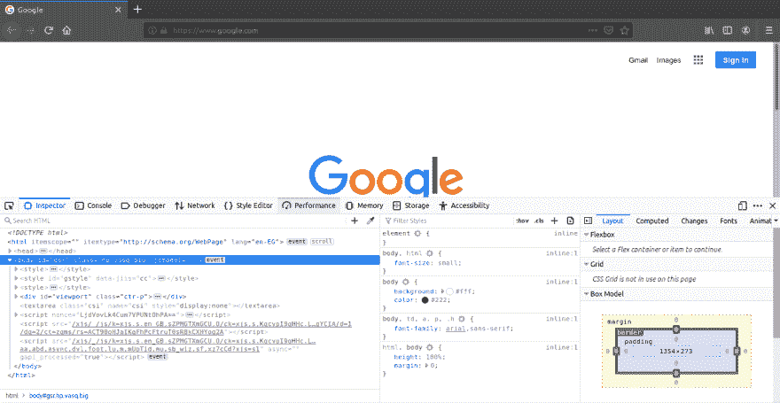
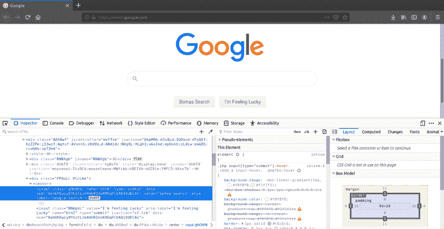
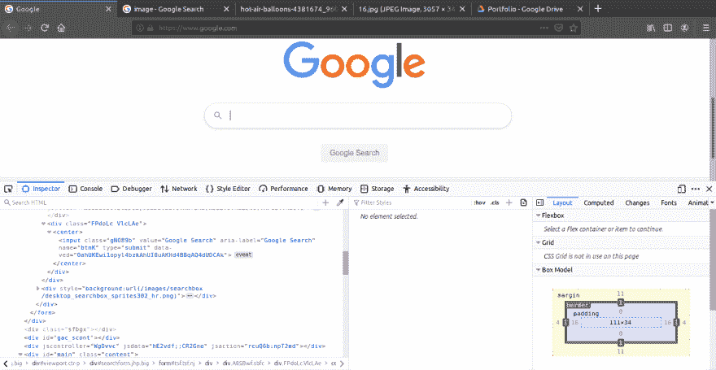
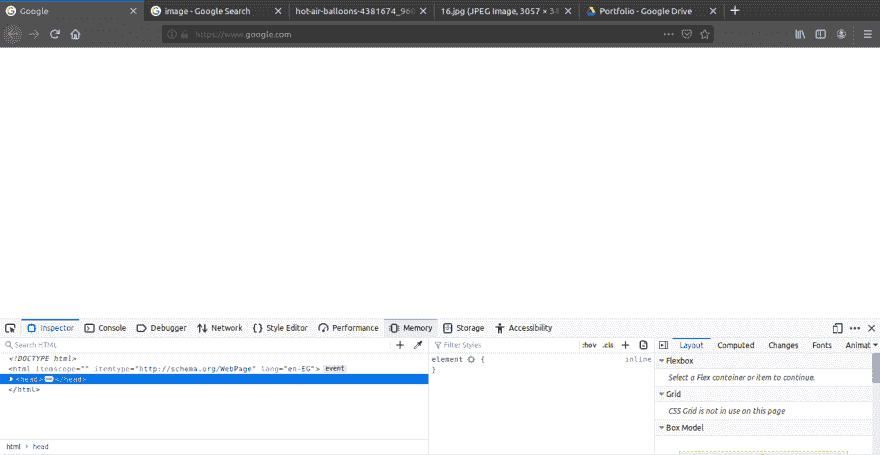
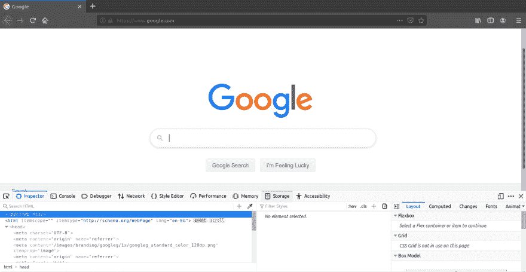
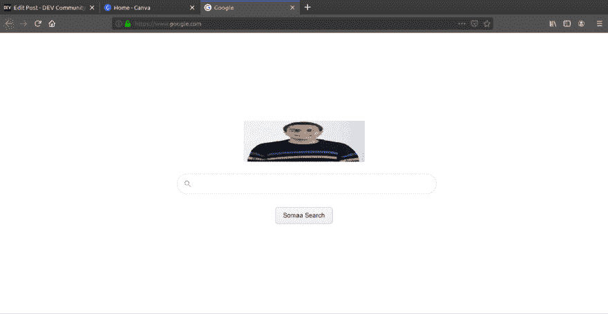

# 互联网是如何工作的？第 2 部分:破坏网站

> 原文：<https://dev.to/ahmedsomaa/how-does-the-internet-work-part-2-breaking-a-website-5e59>

这部分的标题可能有点欺骗性；你可能会认为这是入侵网站，并关闭它。抱歉让你失望了，但这不是标题所放大的。本系列的第一部分[在网站的 web 服务器上完成，它将必要的 **HTML、CSS & JS** 文件回复给你的浏览器，以便浏览器可以呈现网站。这个标题表明的是将网站分解成组件(HMTL，CSS & JS)，并从中获得一些乐趣。为了这样做，我们需要打开一个浏览器(firefox...例如)，导航到 google.com 或任何其他网站并打开开发者的工具。](https://dev.to/ahmedsomaa/how-does-the-internet-works-part-1-behind-the-scenes-4d6m)

重要的事情先来。我将首先对每个组件进行简单的解释。

##### [T1](#html)[HTML](https://www.w3schools.com/html/html_intro.asp)

```
* stands for hyper text markup language.
* responsible for the structure of a web page.
* consists of elements represented in it by tags. 
```

<svg width="20px" height="20px" viewBox="0 0 24 24" class="highlight-action crayons-icon highlight-action--fullscreen-on"><title>Enter fullscreen mode</title></svg> <svg width="20px" height="20px" viewBox="0 0 24 24" class="highlight-action crayons-icon highlight-action--fullscreen-off"><title>Exit fullscreen mode</title></svg>

##### [CSS](https://www.w3schools.com/css/)

```
* stands for cascading style sheet.
* from the name, it describes the style of a HTML page and 
  how HTML elements should be displayed. 
```

<svg width="20px" height="20px" viewBox="0 0 24 24" class="highlight-action crayons-icon highlight-action--fullscreen-on"><title>Enter fullscreen mode</title></svg> <svg width="20px" height="20px" viewBox="0 0 24 24" class="highlight-action crayons-icon highlight-action--fullscreen-off"><title>Exit fullscreen mode</title></svg>

##### [T2](#javascript)JavaScript

```
* the programming language of HTML and the web.
* used in writing the elements' handlers to interact with the backend. 
```

<svg width="20px" height="20px" viewBox="0 0 24 24" class="highlight-action crayons-icon highlight-action--fullscreen-on"><title>Enter fullscreen mode</title></svg> <svg width="20px" height="20px" viewBox="0 0 24 24" class="highlight-action crayons-icon highlight-action--fullscreen-off"><title>Exit fullscreen mode</title></svg>

让我们开始有趣的部分。

为了打开开发者工具，你需要点击设置菜单图标，它通常看起来像三条垂直线或点，然后选择 **Web Developer** (Firefox)，并检查**切换工具**选项卡，你应该会得到这样的结果。
[](https://res.cloudinary.com/practicaldev/image/fetch/s--IpGgVxgx--/c_limit%2Cf_auto%2Cfl_progressive%2Cq_auto%2Cw_880/https://thepracticaldev.s3.amazonaws.com/i/4wjazpctzjkl806uo871.png)

从图片中，你可以看到谷歌的主页 HTML 位于图片的左边，紧挨着它的是 CSS。现在，我们将使用 HTML 代码，并尝试执行以下操作:

*   将谷歌搜索按钮改为你的名字搜索
*   删除我觉得幸运的按钮
*   删除整个 html 代码

#### 先说第一个:

为了做到这一点，我们需要激活**从页面**按钮中选择一个元素，该按钮位于检查器选项卡的左侧，方法是单击它或者从键盘上单击 **Ctrl+Shift+C** 。然后，我们选择我们想要编辑的元素，因此我们将为这个元素选择**谷歌搜索**。工具会立即突出显示这个按钮的 html 代码。我们要做的是将**值属性**改为你的名字，而不是谷歌，按下回车键，瞧，你有了自己的搜索按钮😃。
[](https://res.cloudinary.com/practicaldev/image/fetch/s--fA3WBp0k--/c_limit%2Cf_auto%2Cfl_progressive%2Cq_auto%2Cw_880/https://thepracticaldev.s3.amazonaws.com/i/9dnn9jqtf2gipdomkpyo.png)

#### 第二个:

我们将遵循与中相同的步骤，但是我们将删除下面的行，而不是更改属性值:

```
<input class="RNmpXc" value="I'm Feeling Lucky" 
aria-label="I'm Feeling Lucky" name="btnI" type="submit" jsaction="sf.lck" 
data-ved="0ahUKEwi1opyl4bzkAhUI0uAKHd4BBqAQ19QECAo"> 
```

<svg width="20px" height="20px" viewBox="0 0 24 24" class="highlight-action crayons-icon highlight-action--fullscreen-on"><title>Enter fullscreen mode</title></svg> <svg width="20px" height="20px" viewBox="0 0 24 24" class="highlight-action crayons-icon highlight-action--fullscreen-off"><title>Exit fullscreen mode</title></svg>

[](https://res.cloudinary.com/practicaldev/image/fetch/s--T0C4-__X--/c_limit%2Cf_auto%2Cfl_progressive%2Cq_auto%2Cw_880/https://thepracticaldev.s3.amazonaws.com/i/20vu0k1ziyz5l52byp7p.png) 
如图所示，我们成功删除了按钮。我们能对整个页面做同样的事情吗？

#### 第三个:

我们将分两步执行相同的步骤，但这一次，我们将删除整个 **body 标签**代码，看看会发生什么。
[](https://res.cloudinary.com/practicaldev/image/fetch/s--OMibReMW--/c_limit%2Cf_auto%2Cfl_progressive%2Cq_auto%2Cw_880/https://thepracticaldev.s3.amazonaws.com/i/8kurq3th9qv3oidvc2g6.png) 
从图像中我们可以看到，页面完全是白色的；没有谷歌标志图像，没有按钮，没有标签，什么都没有。这主要是因为 **body 标签**里面的代码就是页面的结构。那么，这是否意味着你永远删除了谷歌，你可能会因此入狱？！😟。绝对不行！你刚才所做的只是删除了你的浏览器为你之前发送的请求从谷歌的网络服务器上获得的 HTML 代码的副本。如果你在浏览器的地址栏中再次输入 google.com 并点击 go，我们在第一部分中讨论过的过程再次发生，你从谷歌的网络服务器中获得 HTML 代码的另一个副本，这样你的浏览器就会呈现它，整个页面再次出现，就像什么也没发生一样。
T12T14】

这是我玩了一会儿后做的，我把它完全改成了 Somaa 的搜索引擎😂
[T3】](https://res.cloudinary.com/practicaldev/image/fetch/s--EPL2TnWy--/c_limit%2Cf_auto%2Cfl_progressive%2Cq_auto%2Cw_880/https://thepracticaldev.s3.amazonaws.com/i/xkw21iuwxefgpktd867h.png)

封面图片图标许可: [icons8](https://icons8.com/) 免费许可。