# 宁静项目:开发博客 0；挑选发动机

> 原文:[https://dev . to/corey js/project-serenity-dev-blog-0-picking-an-engine-4d ef](https://dev.to/coreyjs/project-serenity-dev-blog-0-picking-an-engine-4def)

宁静计划是我花了一年半时间开发的一款游戏。虽然大部分时间花在学习不同的引擎、3d 建模、写作和计划上。我将使用这个 dev 博客来深入了解我一路上学到的不同东西，作为帮助他人和让自己保持正轨的一种方式！

当我最初开始原型制作时，我使用的是 Unity2018。在我前进的过程中，引擎中需要一些概念和技术，比如地形工具，一个不错的照明系统，以及一个不太陡峭的学习曲线来获得一些想法。我选择 Unity 是因为从 Unity3 开始我就一直用它做简单的原型。因此，立即开始开发是显而易见的。

[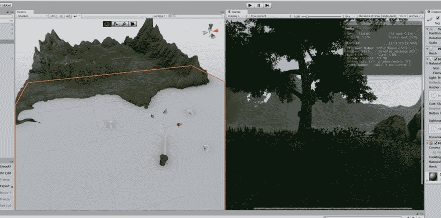T4】](https://res.cloudinary.com/practicaldev/image/fetch/s--iNmWf8qT--/c_limit%2Cf_auto%2Cfl_progressive%2Cq_auto%2Cw_880/https://thepracticaldev.s3.amazonaws.com/i/3nxq8sm2mylf9op5x673.png)

宁静的核心是探索不同的风景。我想建造独一无二的区域，从岛屿到红树林到荒凉衰败的山谷。我遇到的第一个问题是，我一直需要购买资产来帮助这一发展。比如 Gaia 帮助构建地形，Amplify 构建着色器。我最终遇到了一个工具更新的问题，这个问题导致我的地形中所有的纹理都被删除了。即使有了源代码控制，这也让我去探索其他的选择。

Unity2018 早期原型的一些屏幕

[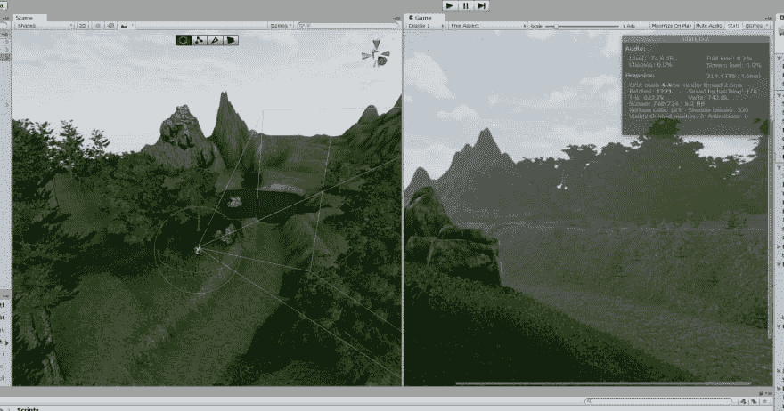](https://res.cloudinary.com/practicaldev/image/fetch/s--nltuUHXX--/c_limit%2Cf_auto%2Cfl_progressive%2Cq_auto%2Cw_880/https://thepracticaldev.s3.amazonaws.com/i/pfqiwgxrdhd9cxr4w67e.png)
[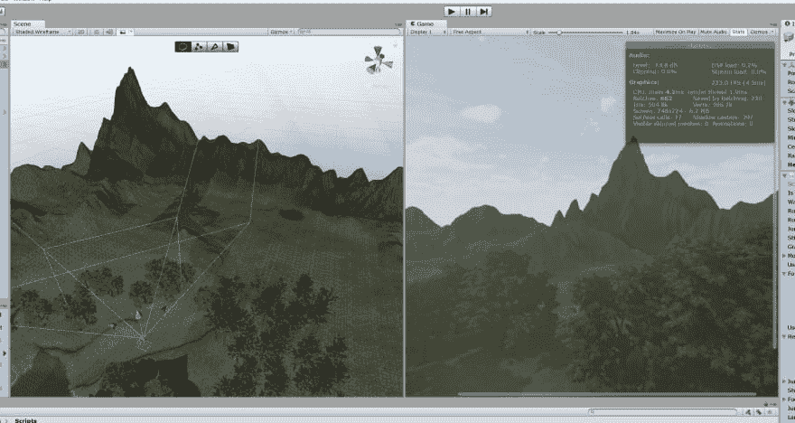T6】](https://res.cloudinary.com/practicaldev/image/fetch/s--PeTQxFRc--/c_limit%2Cf_auto%2Cfl_progressive%2Cq_auto%2Cw_880/https://thepracticaldev.s3.amazonaws.com/i/lrr1ggeezgsgjgarbhh5.png)

我决定乘坐虚幻引擎兜一圈。作为 UE4 的 100%新手，我从 Udemy 上的 [GameDev.tv](https://www.gamedev.tv/) 家伙那里抓了几门课程(他们为 UE、Unity、Godot、Blender 等制作了惊人的课程！).我真的爱上 UE 了。我可以使用令人惊奇的地形工具，灯光，体积雾。无需添加第三方支持即可打包的大量优秀功能。几个月后，我能够用他们的蓝图系统很快做出原型。我要说的一个缺点是，与 unity 庞大的社区相比，似乎没有那么多的社区帮助/教程/支持(尽管还是有很多！).

有的 UE4 投:
[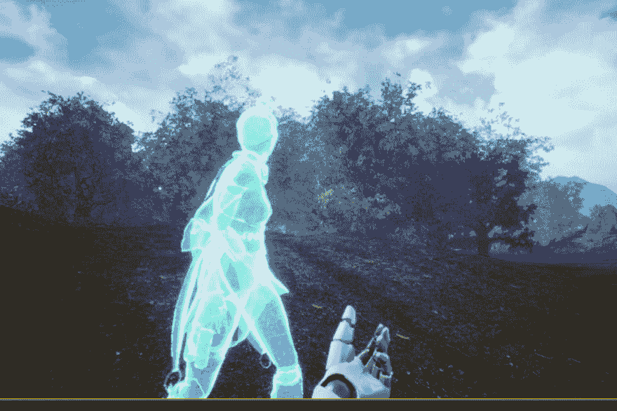](https://res.cloudinary.com/practicaldev/image/fetch/s--Fx-uKgg9--/c_limit%2Cf_auto%2Cfl_progressive%2Cq_auto%2Cw_880/https://thepracticaldev.s3.amazonaws.com/i/859d1yuisy0wsos6ngph.PNG)
[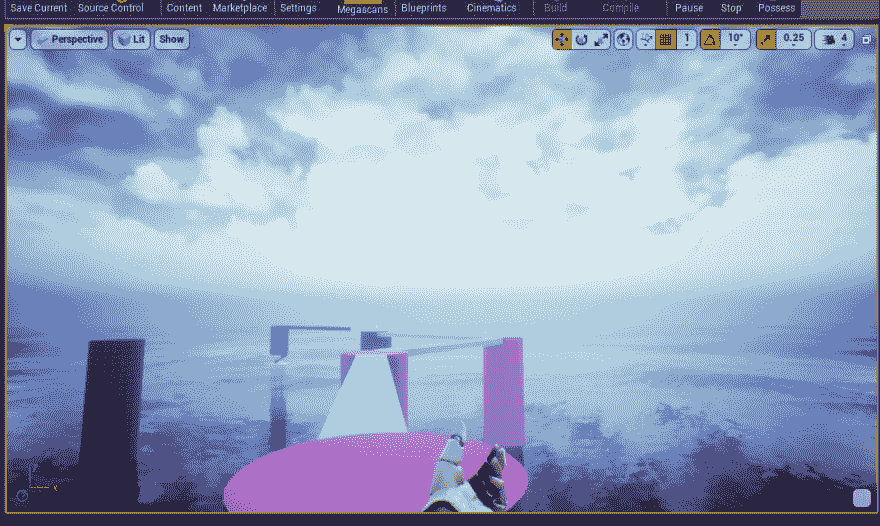](https://res.cloudinary.com/practicaldev/image/fetch/s--s_YhIkRa--/c_limit%2Cf_auto%2Cfl_progressive%2Cq_auto%2Cw_880/https://thepracticaldev.s3.amazonaws.com/i/fhg5yvx5kvf0s8k88f54.png)
[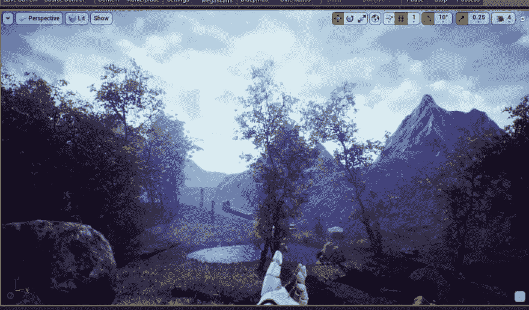](https://res.cloudinary.com/practicaldev/image/fetch/s--bfbwUxaE--/c_limit%2Cf_auto%2Cfl_progressive%2Cq_auto%2Cw_880/https://thepracticaldev.s3.amazonaws.com/i/syf6srbpmzg0nl9qstiy.png)
[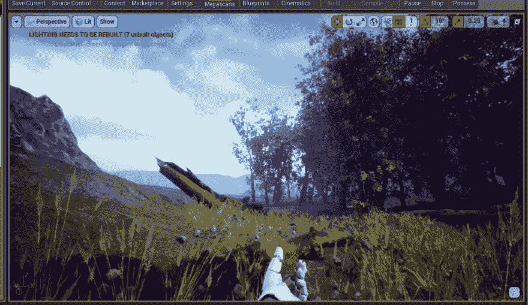](https://res.cloudinary.com/practicaldev/image/fetch/s--l4rxzXHl--/c_limit%2Cf_auto%2Cfl_progressive%2Cq_auto%2Cw_880/https://thepracticaldev.s3.amazonaws.com/i/h6eymvymzdwk3n9wyq0c.PNG)
[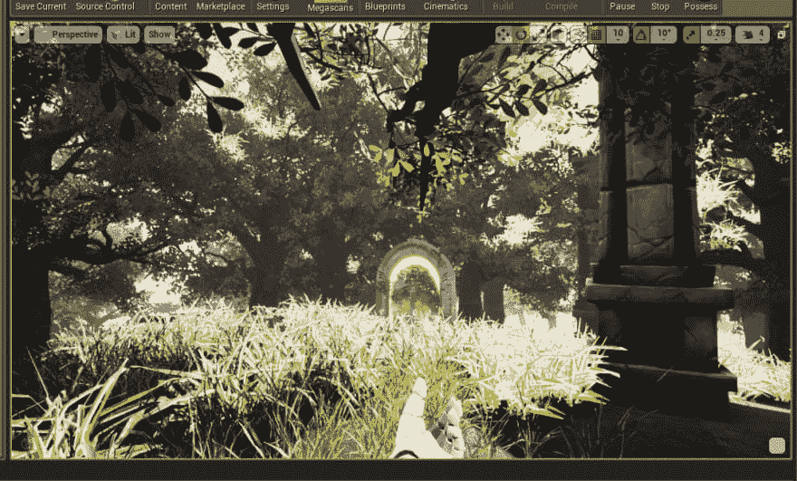](https://res.cloudinary.com/practicaldev/image/fetch/s--DWlaf6U_--/c_limit%2Cf_auto%2Cfl_progressive%2Cq_auto%2Cw_880/https://thepracticaldev.s3.amazonaws.com/i/i4pejaffexr4p7xdozak.PNG)

所以经过几个月的探索，我必须决定使用哪种引擎继续前进。UE 的一个主要症结是所有的脚本都是用 C++编写的。除了学习所有 UE4 的 c++宏之外，我发现习惯起来非常慢。已经很久了。NET 开发人员我非常熟悉 C#，这是 Unity 的基本脚本语言。结合 Unity 2019 中令人印象深刻的更新以及我更喜欢 C#而不是 C++的事实，我决定(再次)在 Unity 中开始原型制作。现在不要误会我，我喜欢虚幻引擎和它提供的一切，我会在某个时候回到它。但我在寻找熟悉度，以帮助加快开发过程，Unity 提供了这一点。

我很高兴回到曼联。我已经开始尝试设计一种风格和配色方案，并着手故事的早期部分。下面是一些较新的设计。你可以看到艺术是如何从现实主义走向更加风格化的。我目前使用的是 LWRP，它很棒，但也很新，有时让一些旧的着色器正常工作很麻烦。大部分模型都是在 Blender 中完成的，我用 Zbrush 给它们一些不同的外观。

[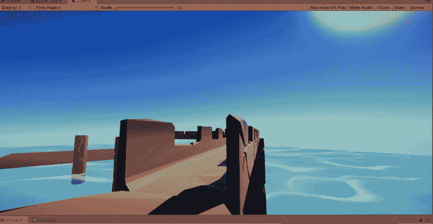](https://res.cloudinary.com/practicaldev/image/fetch/s--PohIykdc--/c_limit%2Cf_auto%2Cfl_progressive%2Cq_auto%2Cw_880/https://thepracticaldev.s3.amazonaws.com/i/ouwf66ho8onq44u7wa54.png)
[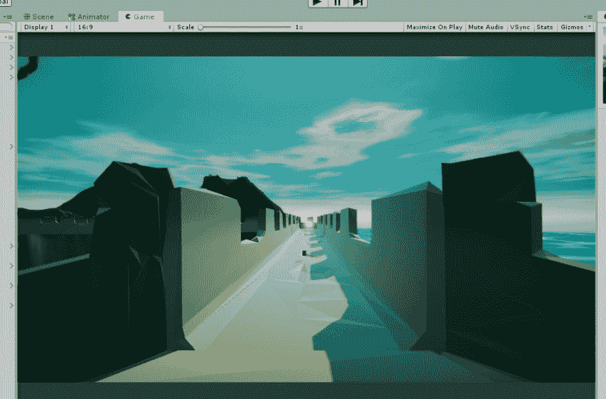](https://res.cloudinary.com/practicaldev/image/fetch/s--HpMw5x4Z--/c_limit%2Cf_auto%2Cfl_progressive%2Cq_auto%2Cw_880/https://thepracticaldev.s3.amazonaws.com/i/e4iukhprddm5l4uo28yy.png)
[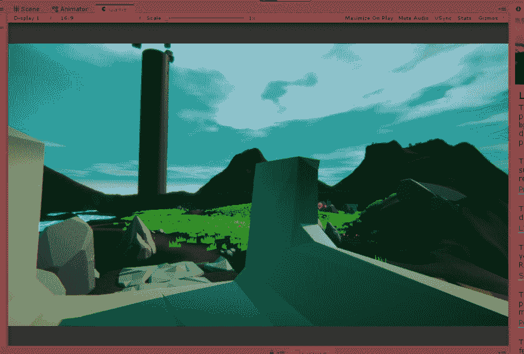](https://res.cloudinary.com/practicaldev/image/fetch/s--s1PKx9Yf--/c_limit%2Cf_auto%2Cfl_progressive%2Cq_auto%2Cw_880/https://thepracticaldev.s3.amazonaws.com/i/ktyc8khal2ocw1rd19d3.png)
[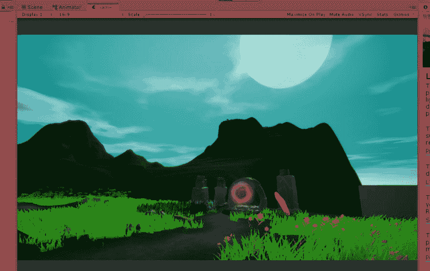](https://res.cloudinary.com/practicaldev/image/fetch/s--WY2BDKI---/c_limit%2Cf_auto%2Cfl_progressive%2Cq_auto%2Cw_880/https://thepracticaldev.s3.amazonaws.com/i/og503mavz4nrru5mzazv.png)
[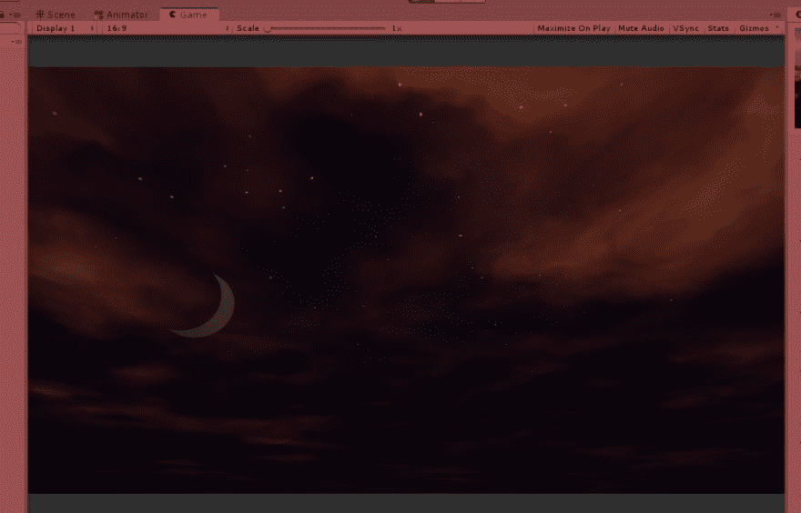](https://res.cloudinary.com/practicaldev/image/fetch/s--27nJNfVE--/c_limit%2Cf_auto%2Cfl_progressive%2Cq_auto%2Cw_880/https://thepracticaldev.s3.amazonaws.com/i/pxzzc012tixanu9w2bn1.png)