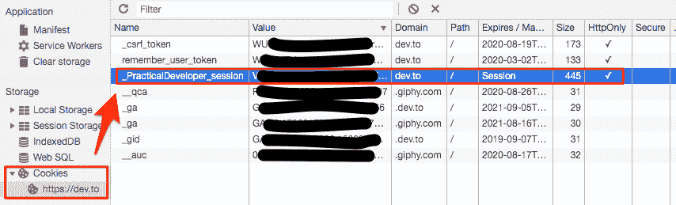

# Http Cookies🍪是一家有 25 年历史的简单串店。3 分钟内解释完毕。

> 原文:[https://dev . to/getd/http-cookies-is-a-a-25 岁-simple-string-store-explained-in-3 mins-2ih 5](https://dev.to/getd/http-cookies-is-a-25-year-old-simple-string-store-explained-in-3-mins-2ih5)

我喜欢❤️饼干。它们自 1994 年以来一直存在。如果我们没有 cookies，今天的互联网世界看起来会非常不同。

如果没有 cookies，网络将会是一个静态而无聊的地方，每个人都会在 dev.to 上阅读相同的新闻。

事实上，如果不是因为 cookies，这篇文章根本不会发表。

# [](#so-what-are-cookies)那么，什么是饼干呢？

Cookies 是浏览器存储的简单键值数据。例如，下面这条线是一个 cookie。

```
sessionId=123 
```

cookie 可以由以下人员创建/更新/删除

*   您的浏览器通过 Javascript 代码`document.cookie`，或
*   服务器通过`set-cookie`响应头

但是，**cookie 对于域**是私有的，这意味着只有在域中运行的客户端代码才能访问它。例如，当你在浏览器中打开`twitter.com`时，它的 javascript 看不到下面的 cookie。

```
// This cookie is only accessible by dev.to's javascript when running on the browser
sessionId=123; domain="dev.to"; 
```

浏览器自动将一个域的所有 cookies 作为请求的一部分发送到该域的服务器。例如，对于上面的例子，对`dev.to`的每个请求将包括该 cookie。这允许`dev.to`的服务器从请求中读取 cookie 值，并将请求与之前的访问者(又名`session`)相关联。

就像任何饼干一样🍪你可以在商店里买到。它们过期了。

```
// expires at time
sessionId=123; expires=Thur, 5 Sep 2019 12:34:56 UTC
// expires in a year
sessionId=123; max-age=31536000
// expires when browser closes
sessionId=123; 
```

有时候某个域要发送的 cookie 太多，我们可以使用`path`只发送匹配某个路径的 cookie。

```
// only send this cookie when current location is "/newsfeed/*"
sessionId=123; path="/newsfeed" 
```

# [](#why-cookies-rock)为什么饼干会摇滚？

虽然对大多数用户来说是不可见的，但它最出名的是支持`sessionId` s(或类似的名字)，这是在 web 上实现用户身份的基本构件。

以`dev.to`为例。我第一次访问`dev.to`时，他们的服务器给我的浏览器设置了一个名为`_PracticalDeveloper_session`的 cookie。从那以后，每次我去`dev.to`，我都在每个 http 请求中向他们的服务器提交`_PracticalDeveloper_session` cookie 值，这证明了我是`techbos`。这允许`dev.to`服务器向我发送我的个人新闻源和通知，而不是 [@ben](https://dev.to/ben) 的。

查看下图中我的`dev.to`cookie:

[T2】](https://res.cloudinary.com/practicaldev/image/fetch/s--LvGf4pAH--/c_limit%2Cf_auto%2Cfl_progressive%2Cq_auto%2Cw_880/https://thepracticaldev.s3.amazonaws.com/i/79af7j5moy66b5idwjmh.png)

# [](#what-are-cookies-not-so-great-for)饼干不怎么好用是为了什么？

首先，你不能吃它们🙃。

除此之外，cookies 对于在浏览器中存储任意数据是不利的，因为:

1.  它有一些严重的尺寸限制(见底部)。
2.  它们会自动包含在发送到服务器的每个请求中。cookies 中的数据越多，您的请求消耗的带宽就越多。

# [](#what-are-alternatives-to-cookies)饼干的替代品有哪些？

为了支持，在网络的世界里没有什么可以替代 cookies。

对于在本地浏览器中存储数据，有三种选择:

1.  LocalStorage:保持到用户清除缓存。
2.  会话存储:持续到浏览器或选项卡关闭。
3.  IndexedDB:适用于存储大量结构化数据。相当复杂的低级东西。

但是，不要存储敏感信息(例如，令牌、密码等。)使用上述选项，因为它们并不意味着安全的数据存储。

# [](#dont-touch-my-cookies)别碰我的饼干！

TL；DR 版就是用`Secure`和`HttpOnly`来保护你的 cookies。

```
sessionId=123; Secure; HttpOnly; 
```

`Secure`确保 cookie 仅在使用 https 访问网站时对服务器可用。从而防止中间人。

`HttpOnly`确保 javascript 无法访问 cookie。从而防止 XSS(跨站脚本)，也就是坏人在你的网页上运行他们难闻的 js。

# [](#how-big-a-cookie-can-i-make)我能做多大的饼干？

对于每个域一次可以存储多少 cookie，以及每个 cookie 的最大数据大小，每个浏览器的实现略有不同。一般的经验法则是每个 cookie 不应该超过 4KB 的数据，并且一个域的所有 cookie 的总大小也不应该超过 4KB。