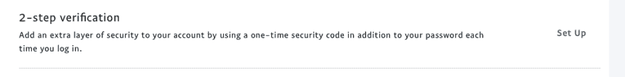
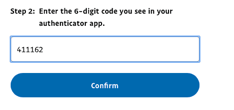

# PayPal 上的 MFA

> 原文：<https://dev.to/shehackspurple/mfa-on-paypal-29ld>

**#MFAally** 是一个标签，针对那些试图帮助他人在其所有重要应用上启用多重身份验证的人。要了解更多关于什么是 MFA 以及为什么它很重要的信息，[阅读这个](https://dev.to/azure/multi-factor-authentication-mfa-nm2)。

今天早上，我不得不在 PayPal 上给某人汇钱，然后我惊恐地发现，MFA 没有启用。我立即修复了那个错误。

您可以如此轻松地启用它！登录，进入“设置齿轮”，点击安全，然后找到“两步验证”。

当然我选择[微软认证器](https://www.microsoft.com/authenticator?WT.mc_id=devto-blog-tajanca)。我打开验证器，选择“新账户”，选择“其他类型的账户”，然后拍下屏幕上的二维码。

然后，我把我的代码从认证器输入到贝宝网站，我都设置好了！
[T3】](https://res.cloudinary.com/practicaldev/image/fetch/s--YWCQK52n--/c_limit%2Cf_auto%2Cfl_progressive%2Cq_auto%2Cw_880/https://thepracticaldev.s3.amazonaws.com/i/zki1cgl416nodt8nccqd.png)

看着我！用我的花式 2FA！你也可以！#MFAally

* * *

## **关于这个和更多，请查看我的书，[爱丽丝和鲍勃学习应用安全](https://aliceandboblearn.com/)和我的在线培训学院，[我们黑紫色](https://academy.wehackpurple.com)！**