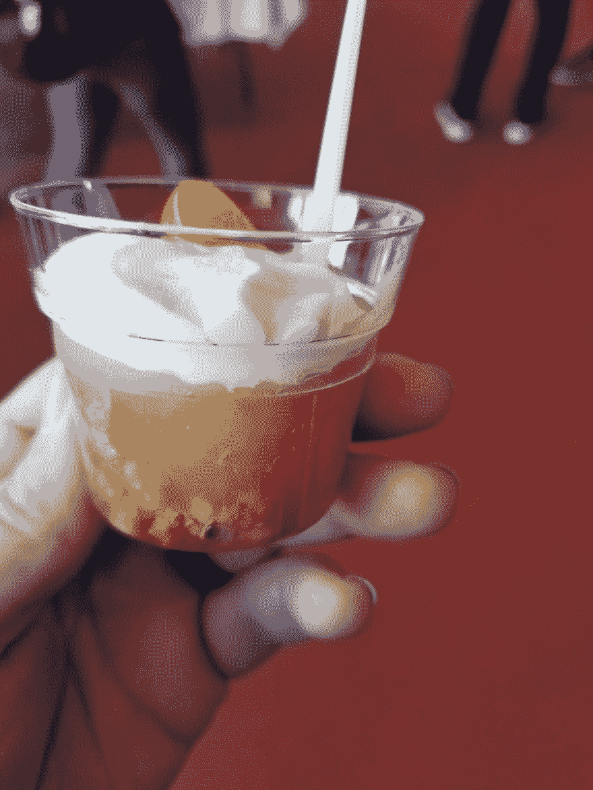
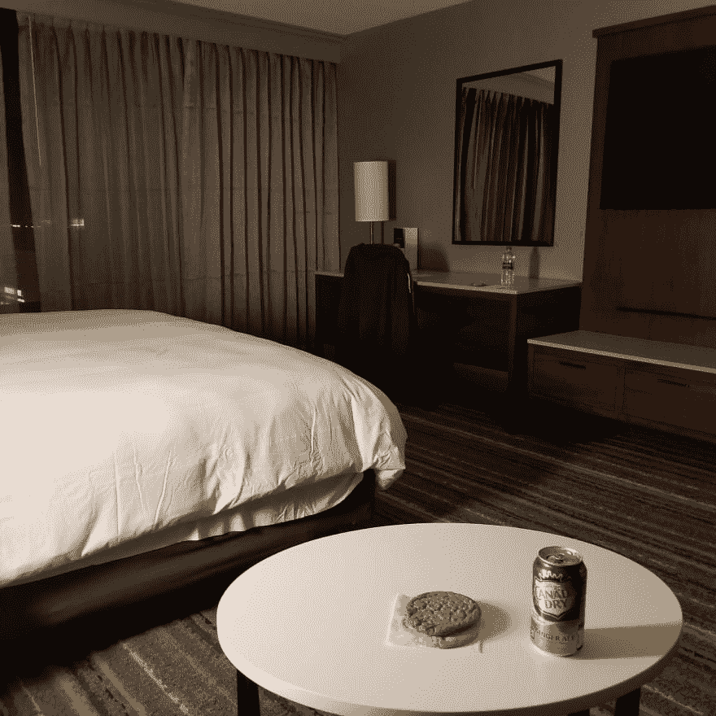
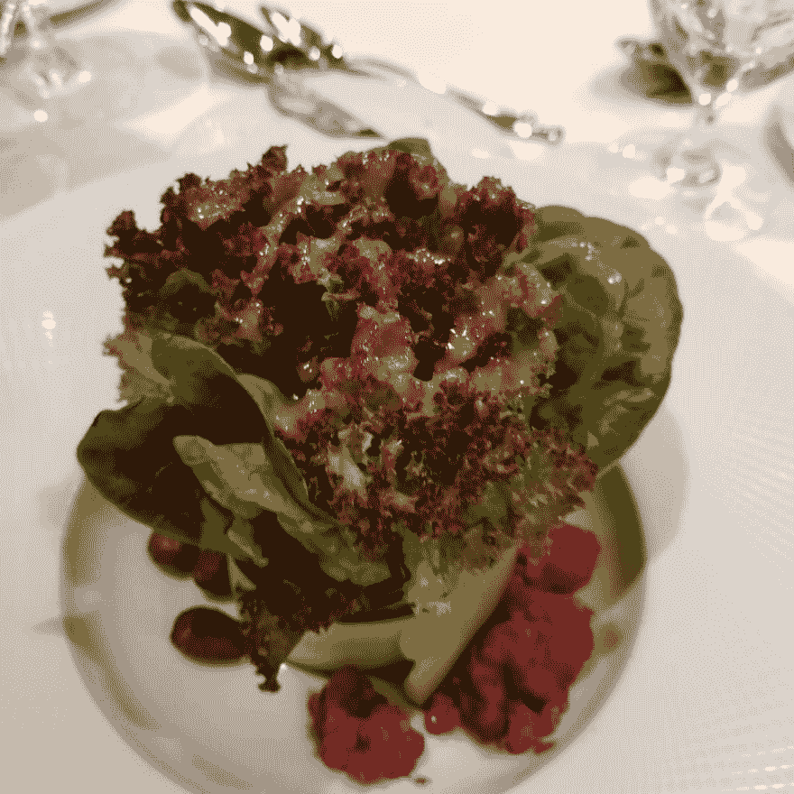

# 女会议发言人食物问题

> 原文:[https://dev . to/wired ferret/lady-conference-speaker-food-problems-3060](https://dev.to/wiredferret/lady-conference-speaker-food-problems-3060)

内容警告:我要说的是自愿和非自愿的食物限制或限量。

# 会议菜难做

可怜会议组织者！我是认真的。他们需要在相对较短的时间内获得整个会议的反馈。他们需要确保饮食多样化的人可以获得食物——素食者、纯素食者、乳糜泻患者和无麸质人群。他们需要确保为有过敏症的人张贴成分。素食者需要蛋白质。你需要订购和管理食物的可用性，这样杂食者就不会吃所有的素食餐。如果你提供犹太餐和清真餐，餐饮服务商需要做好适当处理的准备。太多了。

哦，你必须在预算内完成。很难，而且很贵。我不想让你认为我不知道那件事。

[T2】](https://res.cloudinary.com/practicaldev/image/fetch/s--1VzcMZ4x--/c_limit%2Cf_auto%2Cfl_progressive%2Cq_auto%2Cw_880/https://heidiwaterhouse.com/wp-content/uploads/2019/09/20190404_141024-2.jpg)

这种甜点被标为“苹果蛋糕”。它可能含有苹果。

# 在路上吃饭很难做到

这是我高旅行生活的一部分，我仍在努力纠正。我希望能够在会议上无所事事，边吃边想，但这并不容易。

我是一个超级味觉者，这意味着我实际上是一个挑食的人。用他们也许是伟人的话说，“当他吃一个梨时，就像吃了一百万个梨”。另外，我有芫荽叶突变，所以如果什么东西里有芫荽叶，我会感觉像在舔一百万块肥皂。我也有一些食物敏感性，所以如果我吃得太多，比如说火腿(我喜欢)，我会增加偏头痛的风险。基本上，烤奶酪棒是我最喜欢的自助餐。

成为一个挑食的人是最简单的模式。至少我不太可能因为我实际上过敏的东西而生病。我在一次北欧会议上看到一个家伙仔细检查以确保他没有得到鱼主菜，因为他过敏。谁也没想到鸡肉会有鱼基奶油酱！这就是他今天会议的结束。

然后是时机。你知道什么是新手行动吗？周五下午飞往以色列。即使在特拉维夫，也很难找到一家开门的餐馆或商店，因为安息日是如此普遍地被遵守，以至于人们不会去想它，就像交通繁忙的人不会告诉你他们的驾驶地点时间修正值是多少一样。我会经常在你能得到客房服务或送货的时间之后到达酒店。在纽约或伦敦这不是一个大问题，但盐湖城没有太多深夜送货的选择。

[T2】](https://res.cloudinary.com/practicaldev/image/fetch/s--tO6tO_Rx--/c_limit%2Cf_auto%2Cfl_progressive%2Cq_auto%2Cw_880/https://heidiwaterhouse.com/wp-content/uploads/2019/09/20190820_213133-3.jpg)

有些晚上，你吃饼干和姜汁汽水

此外，即使是好的会议食品尝起来也像会议食品，可以同时交付并保持完整，这很好，但也是可预测的。在我连续第三次或第四次参加会议后，我生活中想要的不是那样的东西。对于开胃菜多的地方尤其如此。你完全可以用牙签吃掉一顿饭的热量，但有时我只想用叉子！

在旅行中，我不会花太多精力去考虑我的微量或宏量营养素。学习是很辛苦的，需要热量。人们在会议中心走动或站立也是如此。我意识到，比起吃得太多以至于不舒服，我更有可能吃得太少。那是我的模式。如果我不弥补这一点，我会变得微妙，然后不那么微妙的 hangry，这不是一个好办法来代表我自己和我的公司。此外，冒着听起来像中世纪书籍中的人物的风险，很难获得足够的纤维。

 一个好的演说家的晚餐里有沙拉！

我在旅途中的一个非常坏的习惯是，我会不优先考虑自己吃饭，或者进入一个无序的地方，在那里我“没有做足够的事情来点一些昂贵的东西”。或者，如果我在会议结束后忘记自己吃饭，直接回到房间，我会拒绝穿好衣服去找吃的。我认为，如果你有饮食紊乱的倾向，那么现有的一天两顿大餐的暴饮暴食性质和无法控制容易获得的东西的触发因素会让你很快陷入困境。

# 我的技法

鉴于所有这些，我有一些变通办法，可能对其他人也有帮助。

*   带上食物！我包里总会有几块 Tonka/Epic 巧克力棒，以备不时之需。如果我要去一个我知道很难找到食物的地方，我也会带一些干果。如果你的酒店位于市中心，比如曼哈顿中城、旧金山的联合广场或西雅图的贝尔敦，那么我不会担心，但如果我在绍姆堡或瓦平或其他半郊区，可能很难在深夜找到任何东西。
*   买吃的。是的，会议提供食物。那是利益，不是义务。如果您无法获得您需要的健康和快乐，您可以订购送货到您的赞助商展位或酒店房间。你可以在午餐时间离开会议去吃一些你自己挑选的食物。我认为我们很难做到这一点，因为这感觉很浪费，但可能组织者或餐饮服务提供商对剩菜有一个计划。你参加会议的目的是学习、成长、演讲和闪耀。可以牺牲午餐或晚餐，或者两者都牺牲。
*   在你的行业或会议圈里找到其他和你有相同饮食需求的人。这样你们可以轮流寻找可以处理无麸质要求的拉面店，你们可以一起去。
*   拓展你对交付的理解！Postmates 或 Prime Now 可以为您的酒店房间提供一箱健怡可乐吗？很有可能。对于一些酒店，如 Residence Inns，你可以在预订时或入住前提出购买杂货的要求，当你走进房间时，你的冰箱里已经有一加仑牛奶或任何你需要的东西。这对我来说太不可思议了，因为我在一个小得连披萨外卖都没有的小镇长大。
*   当你不在路上时，尝试新口味或新风格的耐储存食物。打包了一些东西，然后当你伸手去拿的时候发现你讨厌它，这是很有压力的。
*   考虑你想服用的任何膳食补充剂，并像包装其他日常药物一样小心包装。现在你几乎可以买到任何成人剂量的软糖。维生素、纤维、益生菌、钙，所有这些都包含在美味的橡皮糖中。甚至有一种我在机场买的，有助于睡眠的配方，有褪黑激素和其他一些东西。
*   你有没有一种糖果或耐储存的食物让你觉得很舒服？打包吧。我曾经近乎歇斯底里地打电话给我的妻子，因为我在国外旅行了漫长而艰难的一天，我得到了一包 M & Ms 来安慰自己，当然，它们尝起来不一样，因此*没有安慰*。你的汽水、糖果、薯片，如果你在不同的国家购买，它们的味道可能会略有不同，因为它们适合那个国家的口味。

<figcaption>A French breakfast</figcaption>

# 总而言之

在路上吃东西对每个人来说都很困难，但尤其可能影响到那些过敏、饮食限制、既往饮食问题史或慢性挑食的人。感到食物不安全的不仅仅是那些买不起食品杂货的人，而是那些在工作场所无法控制自己能吃什么，不知道是否安全的人。如果有人告诉你他们需要从他们的食物中得到一些东西，相信他们。决定他们是否需要住宿不是你的工作，你的工作是把他们当作专业人士对待。