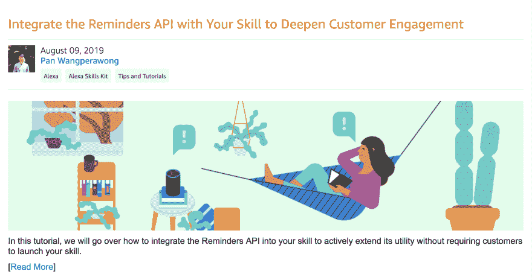

# 将提醒 API 与您的 Alexa 技能相结合，以加深客户参与度

> 原文：<https://dev.to/pan/integrate-the-reminders-api-with-your-alexa-skill-to-deepen-customer-engagement-208c>

将提醒 API 集成到您的技能中是一种很好的方式，可以在不要求客户启动您的技能的情况下，积极地扩展它的效用。使用提醒 API，您可以更频繁地与客户互动，成为他们日常生活的一部分。

## 点击下面的
了解更多信息👇

*如果你想了解更多类似的内容，请在 Twitter 上关注我 **[@ItsPanW](https://twitter.com/itspanw)***