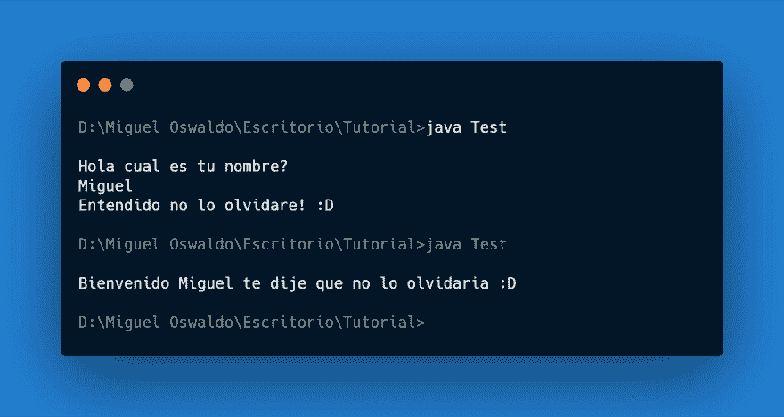
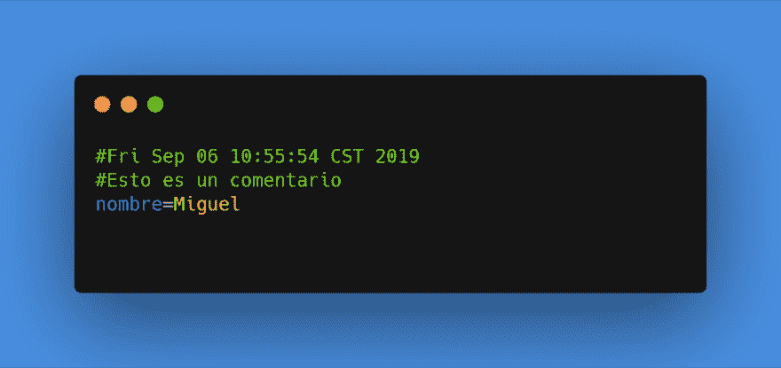

# Java 属性文件

> [https://dev . to/oswaldo _ d3v/Java-84i 中的属性文件](https://dev.to/oswaldo_d3v/archivos-de-propiedades-en-java-84i)

我们经常需要在程序执行后保留信息，而将数据库用于一个小型应用程序通常不是最好的选择，就像买法拉利去我们 2 公里以外的工作场所一样。

对于这些 Java 情况，我们可以将信息存储在属性文件或属性文件中，这些文件只是文本文件，也就是说，我们可以使用 notas 博客轻松地打开和编辑它们，而且由于它们是文件，因此在运行我们的应用程序后不会丢失这些文件中的信息。使用它们非常简单，我们只需要几个 2 个包的类

1.  java.util
    *   性能
2.  java.io
    *   文件输入流
    *   文件输出流
    *   输入流
    *   输出流
    *   IOException

为了开始执行此任务，我们将创建一个类，其中包含用于访问属性值以及添加新属性或更改属性值的方法。[

```
import java.util.Properties;
import java.io.FileInputStream;
import java.io.FileOutputStream;
import java.io.InputStream;
import java.io.OutputStream;
import java.io.IOException;

public class FicheroDePreferencias {

} 
```

<svg width="20px" height="20px" viewBox="0 0 24 24" class="highlight-action crayons-icon highlight-action--fullscreen-on"><title>Enter fullscreen mode</title></svg> <svg width="20px" height="20px" viewBox="0 0 24 24" class="highlight-action crayons-icon highlight-action--fullscreen-off"><title>Exit fullscreen mode</title></svg>

我们将创建四个私有对象，第一个将是类型为“`Sting`”的对象，在其中存储将用作我们属性文件的文件路径。

第二个对象将是类型为“`Properties`”的对象之一，因为此类包含设置和获取文件属性所需的方法。

第三个对象将是“`InputStream`”通过该对象 Properties 类可以读取该文件。

作为 InputStream 对象的对应对象，我们需要一个允许我们将信息保存到文件中的对象来执行此操作我们需要一个类型为“`OutputStream`”的对象。

```
import java.util.Properties;
import java.io.FileInputStream;
import java.io.FileOutputStream;
import java.io.InputStream;
import java.io.OutputStream;
import java.io.IOException;

public class FicheroDePreferencias {

    private String directorio = null;
    private Properties fichero = null;
    private InputStream leerFichero = null;
    private OutputStream escribirFichero = null;

} 
```

<svg width="20px" height="20px" viewBox="0 0 24 24" class="highlight-action crayons-icon highlight-action--fullscreen-on"><title>Enter fullscreen mode</title></svg> <svg width="20px" height="20px" viewBox="0 0 24 24" class="highlight-action crayons-icon highlight-action--fullscreen-off"><title>Exit fullscreen mode</title></svg>

为了向 Properties 类型的对象指示属性文件，我们将创建一种方法，在该方法中，我们将从文件读取

```
public class FicheroDePreferencias {

    private String directorio = null;
    private Properties fichero = null;
    private InputStream leerFichero = null;
    private OutputStream escribirFichero = null;

    private void leerDesde(String directorio) {
        try {
            leerFichero = new FileInputStream(directorio);
            fichero.load(leerFichero);
        } catch (IOException e) {
            System.err.println("No se pudo cargar el archivo.");
            e.printStackTrace();
        }
    }
} 
```

<svg width="20px" height="20px" viewBox="0 0 24 24" class="highlight-action crayons-icon highlight-action--fullscreen-on"><title>Enter fullscreen mode</title></svg> <svg width="20px" height="20px" viewBox="0 0 24 24" class="highlight-action crayons-icon highlight-action--fullscreen-off"><title>Exit fullscreen mode</title></svg>

read file 对象`InputStream`由类型为`FileInputStrem`的对象初始化，因为 IntputStream 类是抽象类，不能实例化这些类的唯一方法是通过非抽象的子类实例化，因此 FileInputStream 类的构造函数在运行时将属性文件的地址作为参数

`try/catch`结构可防止程式因找不到指定的档案而关闭。通过将属性放在文件对象中，我们将创建一种方法，使我们能够获取任何属性
的值

```
public class FicheroDePreferencias {

    private String directorio = null;
    private Properties fichero = null;
    private InputStream leerFichero = null;
    private OutputStream escribirFichero = null;

    public String getPropiedad(String propiedad) {
        String value = null;
        try {
            value = fichero.getProperty(propiedad);
        } catch (Exception e) {
            System.err.println("Error al acceder al archivo.");
            e.printStackTrace();
        }
        return value;
    }
} 
```

<svg width="20px" height="20px" viewBox="0 0 24 24" class="highlight-action crayons-icon highlight-action--fullscreen-on"><title>Enter fullscreen mode</title></svg> <svg width="20px" height="20px" viewBox="0 0 24 24" class="highlight-action crayons-icon highlight-action--fullscreen-off"><title>Exit fullscreen mode</title></svg>

执行此任务的方法非常简单我们创建了一个名为 values 的 String 类型的对象，该对象存储属性值，然后使用`getProperty`方法获取该值。此方法接收一个参数，该参数是属性的名称。

我们只剩下执行 setpropiedad 方法，因为对于此方法，我们要添加或更新信息，然后保存它，我们需要类型为‘t0’的 write-object，并且像 InputStream 一样，OutputStream 也是抽象类，因此我们创建了类型为‘t1’的对象和此 reception 的构造函数

```
public class FicheroDePreferencias {

    private String directorio = null;
    private Properties fichero = null;
    private InputStream leerFichero = null;
    private OutputStream escribirFichero = null;

    public void setPropiedad(String propiedad, String valor, String comentario) {
        try {
            escribirFichero = new FileOutputStream(directorio);
            fichero.setProperty(propiedad, valor);
            fichero.store(escribirFichero, comentario);
        } catch (IOException e) {
            System.err.println("Error al guardar cambios.");
            e.printStackTrace();
        }
    }

    public void setPropiedad(String propiedad, String valor) {
        setPropiedad(propiedad, valor, null);
    }

} 
```

<svg width="20px" height="20px" viewBox="0 0 24 24" class="highlight-action crayons-icon highlight-action--fullscreen-on"><title>Enter fullscreen mode</title></svg> <svg width="20px" height="20px" viewBox="0 0 24 24" class="highlight-action crayons-icon highlight-action--fullscreen-off"><title>Exit fullscreen mode</title></svg>

`setPropiedad`方法接收 3 个 String 类型的参数，第一个是要添加或更新的属性的名称，第二个是其值，第三个是文件中的注释。

为了将更改添加到文件中，我们使用 Properties 类的方法`store`，为了保存更改，我们使用同一类的方法`store`。`try/catch`结构确保如果出了问题，程序不会突然关闭。我们对方法做了超载以防我们不想发表意见。

最后，我们将创建一个构造函数，在该构造函数中初始化类型为`directorio`的对象和变量`directorio`也将运行方法`leerDesde`

```
public class FicheroDePreferencias {

    private String directorio = null;
    private Properties fichero = null;
    private InputStream leerFichero = null;
    private OutputStream escribirFichero = null;

    public FicheroDePreferencias(String directorio) {
        fichero = new Properties();
        this.directorio = directorio;

        leerDesde(directorio);
    }

} 
```

<svg width="20px" height="20px" viewBox="0 0 24 24" class="highlight-action crayons-icon highlight-action--fullscreen-on"><title>Enter fullscreen mode</title></svg> <svg width="20px" height="20px" viewBox="0 0 24 24" class="highlight-action crayons-icon highlight-action--fullscreen-off"><title>Exit fullscreen mode</title></svg>

在构造函数中运行此方法非常重要，因为如果在初始化对象所在的行之前不运行 Properties 类的方法`load`，则会丢失其内容，因为 OutputStream 类的构造函数会评估文件是否为空，如果不是空的，则会清除其内容 方法`setProperty`运行`store`方法时，我们将新信息添加到文件对象中，将重写保存在文件对象中的所有信息。 最后的代码如下:

```
import java.util.Properties;
import java.io.FileInputStream;
import java.io.FileOutputStream;
import java.io.InputStream;
import java.io.OutputStream;
import java.io.IOException;

public class FicheroDePreferencias {

    private String directorio = null;
    private Properties fichero = null;
    private InputStream leerFichero = null;
    private OutputStream escribirFichero = null;

    private void leerDesde(String directorio) {
        try {
            leerFichero = new FileInputStream(directorio);
            fichero.load(leerFichero);
        } catch (IOException e) {
            System.err.println("No se pudo cargar el archivo.");
            e.printStackTrace();
        }
    }

    public String getPropiedad(String propiedad) {
        String value = null;
        try {
            value = fichero.getProperty(propiedad);
        } catch (Exception e) {
            System.err.println("Propiedad no encontrada.");
            e.printStackTrace();
        }
        return value;
    }

    public void setPropiedad(String propiedad, String valor, String comentario) {
        try {
            escribirFichero = new FileOutputStream(directorio);
            fichero.setProperty(propiedad, valor);
            fichero.store(escribirFichero, comentario);
        } catch (IOException e) {
            System.err.println("Error al guardar cambios.");
            e.printStackTrace();
        }
    }

    public void setPropiedad(String propiedad, String valor) {
        setPropiedad(propiedad, valor, null);
    }    

    public FicheroDePreferencias(String directorio) {
        fichero = new Properties();
        this.directorio = directorio;

        leerDesde(directorio);
    }

} 
```

<svg width="20px" height="20px" viewBox="0 0 24 24" class="highlight-action crayons-icon highlight-action--fullscreen-on"><title>Enter fullscreen mode</title></svg> <svg width="20px" height="20px" viewBox="0 0 24 24" class="highlight-action crayons-icon highlight-action--fullscreen-off"><title>Exit fullscreen mode</title></svg>

□是否缺少测试类否？为此，请使用一个名为 Test 的类，该类将具有主要方法，并提供我们可以对 properties 文件执行的操作的示例。

```
import java.util.Scanner;

public class Test{

    public static void main(String[] args) {
        Scanner sc = new Scanner(System.in);
        FicheroDePreferencias miFichero = new FicheroDePreferencias("Test.properties");
        String nombre = miFichero.getPropiedad("nombre");
        if (nombre != null) {
            System.out.println("Bienvenido " + nombre + " te dije que no lo olvidaria :D");
        }
        else{
            System.out.println("Hola cual es tu nombre? ");
            nombre = sc.nextLine();
            miFichero.setPropiedad("nombre", nombre);
            System.out.println("Entendido no lo olvidare! :D");
        }
        sc.close();
    }
} 
```

<svg width="20px" height="20px" viewBox="0 0 24 24" class="highlight-action crayons-icon highlight-action--fullscreen-on"><title>Enter fullscreen mode</title></svg> <svg width="20px" height="20px" viewBox="0 0 24 24" class="highlight-action crayons-icon highlight-action--fullscreen-off"><title>Exit fullscreen mode</title></svg>

[](https://res.cloudinary.com/practicaldev/image/fetch/s--cKYfIdQQ--/c_limit%2Cf_auto%2Cfl_progressive%2Cq_auto%2Cw_880/https://thepracticaldev.s3.amazonaws.com/i/dgii55djznkfwg3atx6n.png)

第一次运行后，我们的 Test.Properties 文件如下所示:

[](https://res.cloudinary.com/practicaldev/image/fetch/s--LWwrjAZm--/c_limit%2Cf_auto%2Cfl_progressive%2Cq_auto%2Cw_880/https://thepracticaldev.s3.amazonaws.com/i/ht9998nyj3oxv4bdzlr7.png)

注:Test.java 文件、preferences . Java 文件和 Test.properties 文件都位于同一文件夹中；本练习是使用 Visual Studio 代码开发的；第一次运行程序时，Test.properties 文件存在，但为空