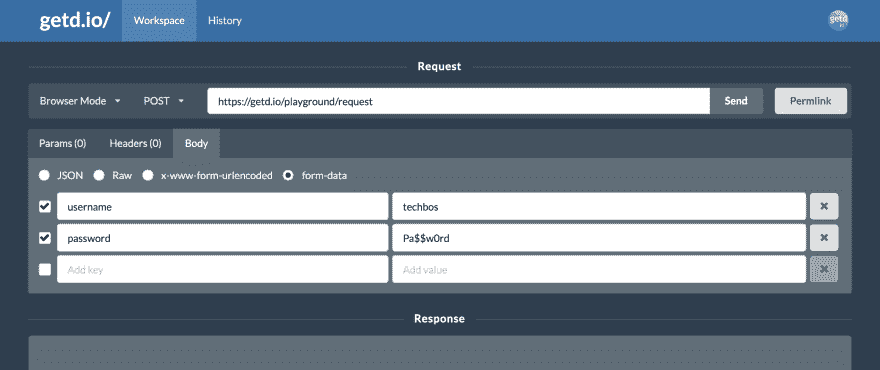

# 🆘开源 getd.io

> 原文:[https://dev . to/getd/looking-for-best-practice-open-sourcing-getd-io-s-back-end-4 MHC](https://dev.to/getd/looking-for-best-practice-for-open-sourcing-getd-io-s-back-end-4mhc)

我打算开源 [getd.io🚀](https://getd.io)，一个免费的在线 REST API 构建器，我在几周前构建的。你可以在本帖中了解更多关于[的信息。](https://dev.to/getd/getd-io-an-online-api-request-tester-builder-with-cors-support-3d3m)

[T2】](https://res.cloudinary.com/practicaldev/image/fetch/s--xCwQKuaP--/c_limit%2Cf_auto%2Cfl_progressive%2Cq_auto%2Cw_880/https://thepracticaldev.s3.amazonaws.com/i/p5oca7k10m5x9qkj4n10.png)

当*超级兴奋*😍作为一个从来没有开源过任何东西的人，我也想确保这个项目在开源之前处于良好的状态。

前端是琐碎的，所以我认为开源就像在 github 中开放代码访问一样简单。然而，后端有点棘手，我真的可以从棒极了的 dev.to community ❤️获得一些关于开源最佳实践的帮助。

对于不知道 [getd.io](https://getd.io) 的观众来说，与其他 Postman 替代方案相比，这个项目的独特之处在于，它使用后端服务器作为代理来发送和接收 API 请求，从而绕过浏览器上的 CORS(跨源资源共享)限制。我还计划添加更多功能，例如:

*   创建和保存个人/团队工作区。
*   API 浏览器，用于共享和播放其他人/公司的公共 API，例如 Spotify APIs 或 Twitter APIs。
*   更多...

您可以很快看出，后端在用户认证、数据库和其他方面有点复杂。所以我的问题如下:

# API 键

*更新:我做了一些研究，回答了[本帖](https://dev.to/getd/how-to-manage-secrets-and-configs-using-dotenv-in-node-js-and-docker-2214)* 中的这部分问题

我有(并将有)这个项目的几个 API 键。例如，存在用于用户登录的 Github API 密钥。将有 Spotify 等服务的 API 密钥供用户试用 Spotify APIs。目前，这些密钥存储在受版本控制的 json 中，在运行时通过`config` npm 包读取。问题:

1.  将这些键移出我的 repo，但仍然在运行时提供它们的最佳实践是什么？比如用 ENV + docker-compose？我应该把钥匙放在私人回购中吗？
2.  有没有一种方法可以共享一些开发 API 密钥(可能是个坏主意)，这样贡献者就不必经历申请和管理他们自己的密钥的麻烦了？

# 数据库

该项目使用 mongoDB。对于本地开发，它使用来自 Atlas 的自由层 mongoDB。对于 prod，它使用运行在我的服务器上的 docker mongo。问题:

1.  要求贡献者建立自己的 mongoDB 来进行回购开发，这种情况常见吗？
2.  我认为共享 dev mongoDB 实例是个糟糕的主意，因为人们会看到其他人的令牌。但是有没有一种方法可以共享一个 dev mongoDB，这样贡献者就不必建立他们自己的了？

# 执照

我听说麻省理工学院很棒。还有其他建议吗？

# 最后，

只是一般来说:

1.  对于第一次使用开源软件的人，有哪些建议？
2.  对一个仍有许多待定特性需要设计的项目进行开源是一个好主意吗，或者我应该等到项目更加成熟时再做？
3.  如何使贡献者的生活变得更容易，以便他们可以专注于编码，而不是花费数小时来设置环境？
4.  如何与贡献者合作开发特性，尤其是复杂的特性？例如，“创建个人工作空间”的特征将涉及许多复杂的数据库模式、API 模式、ui 等。这是怎么回事？

**提前感谢！我迫不及待地想打开源代码 [getd.io](https://getd.io) ，看到令人敬畏的事情发生！🎉🎉🎉**