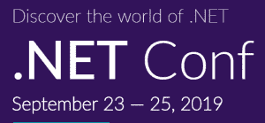

# 有什么值得期待的。NET Core 3.0 功能

> 原文:[https://dev . to/sync fusion/what-to-look-forward-to-in-net-core-3-0-features-3jl 9](https://dev.to/syncfusion/what-to-look-forward-to-in-net-core-3-0-features-3jl9)

的下一个重大更新。NET Core 即将推出，最终版本将在[期间发布给开发者。NET Conf](https://www.dotnetconf.net/) 虚拟开发者活动将于 9 月 23 日至 25 日举行。随着发布的临近，让我们看看我们可以期待新的。NET Core 3.0 功能基于自 2018 年 12 月以来几乎每个月都在推出的预览版。

## [T1。NET Core 3.0 预览版 1–8:新增内容](#net-core-30-previews-18-new-additions)

### 支持 Windows 桌面应用

[窗户。NET Core 3.0 SDK 将支持在。NET 核心框架。这不仅增加了有经验的 WPF 和 WinForms 开发人员对平台的访问，而且使移植成为可能。NET 框架应用程序。NET Core 是一个可行的解决方案。WPF 和 WinForms 应用程序也将能够充分利用提供的性能改进。网芯。但是，该功能仅在 Windows 上受支持。这在 Visual Studio for Mac 中是不可能的。](https://devblogs.microsoft.com/dotnet/net-core-3-and-support-for-windows-desktop-applications/)

### 针对 Windows 桌面的 MSIX 部署

另一个可爱的功能涉及 Windows 桌面。NET Core 3.0 支持 MSIX 包格式，可用于将应用部署到 Windows 10。如果你从未听说过 MSIX，你可以在微软的文档中很快了解它。Syncfusion 也可能很快出版一本关于它的简洁的*系列书。*

### [T1。网络标准 2.1](#net-standard-21)

虽然这还不是最终结果。网芯 3.0 将支持[。NET Standard](https://github.com/dotnet/standard) 2.1，了解对所有 API 标准集的最新改进。NET 平台。

### C# 8.0 支持

。NET Core 3.0 还将完全支持 C# 8.0，这为该语言带来了许多进步。新特性包括只读数字、更多用于数据和功能分离的模式表达式、使用变量声明、异步流等等。关于 C# 8.0 迄今为止的新特性的完整列表，请参见微软的文档。

### 单文件和默认可执行文件

为了简化应用程序的打包和交付，可以从 dotnet publish 命令构建单文件可执行文件，其中包括运行应用程序所需的所有依赖项。另外，[依赖于框架的可执行文件](https://docs.microsoft.com/en-us/dotnet/core/deploying/index#framework-dependent-executables-fde)，它通过依赖。NET 核心版本安装在目标计算机上，现在是默认构建的。

### 装配链接

中的另一个包优化特性。NET Core 3 是 IL 链接器工具，它扫描您的中间语言代码，然后删除未使用的程序集，这有助于避免您的应用程序膨胀。

### 面向物联网人群的改进

致力于物联网解决方案的开发者也会发现一些新的。NET Core 3.0 的特性很吸引人:NuGet 包正在发布，为 Raspberry Pi 设备提供 GPIO 编程支持，对 ARM64 for Linux 的支持即将到来。

### 和多、多、多

这篇博文只是即将到来的一些特性的一小部分摘录。网芯 3.0 终于发布的时候。我们建议仔细阅读 docs . Microsoft . com/en-us/dot net/core/whats-new/dot net-core-3-0 上的整个列表，这将引出它自己的一套相互关联的文档兔子洞，如果你不小心的话，它可以很容易地占用你一下午的时间。

当然，如果你是 Windows Insider 计划的成员，并且一直关注 Visual Studio 2019 的预览版本，那么当这些功能推出时，你就可以访问它们，这不会让你感到惊讶。如果你不是，那么，惊喜吧！

## [T1。网芯 3.0 预览版 9:最后的润色](#net-core-30-preview-9-the-final-polish)

的最终预览版本。网芯 3.09 月 4 日刚刚发布。据介绍，正如上一个预览版所预期的那样，大部分工作都致力于把新功能完善到最终状态。NET 团队项目经理理查德.兰德。

## [T1。NET Core 3.0 最终版即将到来。网络会议](#net-core-30-final-coming-to-net-conf)

正如开始提到的，最终版本的。NET Core 3.0 在[发布。NET Conf 虚拟开发者活动](https://www.dotnetconf.net/)将于 9 月 23 日至 25 日举行。就像去年一样，Syncfusion 产品经理 Chad Church 将在活动期间接受采访，Syncfusion 将赠送 500 美元的亚马逊礼品卡。有关 Syncfusion 参与。NET Conf 和其他即将到来的开发者教育活动，请看[这篇博文](https://dev.to/sureshmohan/syncfusion-supporting-developer-events-and-education-2h72-temp-slug-829868)。

[T2】](https://www.dotnetconf.net/)

如果你是一个. NET 核心爱好者，并且对即将到来的 3.0 版本感到兴奋，请在下面的评论中，或者在 [Twitter](https://twitter.com/Syncfusion) 和[脸书](https://www.facebook.com/Syncfusion)上让我们知道你最期待什么。

*如果你喜欢这篇文章，我们认为你也会喜欢:*

*   将 WPF 应用移植到的 9 个简单步骤。网络核心
*   [博客] [如何使用 Visual Studio 2019](https://dev.to/vijays/how-to-build-a-crud-application-with-asp-net-core-3-0-entity-framework-3-0-using-visual-studio-2019-a9p-temp-slug-7841084) 用 ASP.NET 核心 3.0 &实体框架 3.0 构建 CRUD 应用
*   【电子书】 [*使用。NET Core，Docker，和 Kubernetes 简洁地*T3】](https://www.syncfusion.com/ebooks/using-netcore-docker-and-kubernetes-succinctly)
*   【电子书】 [*Visual Studio 2019 简洁明了*](https://www.syncfusion.com/ebooks/visual-studio-2019-succinctly)

帖子[在期待什么。NET Core 3.0 特性](https://www.syncfusion.com/blogs/post/what-to-look-forward-to-in-net-core-3-0-features.aspx)首先出现在 [Syncfusion 博客](https://www.syncfusion.com/blogs)上。