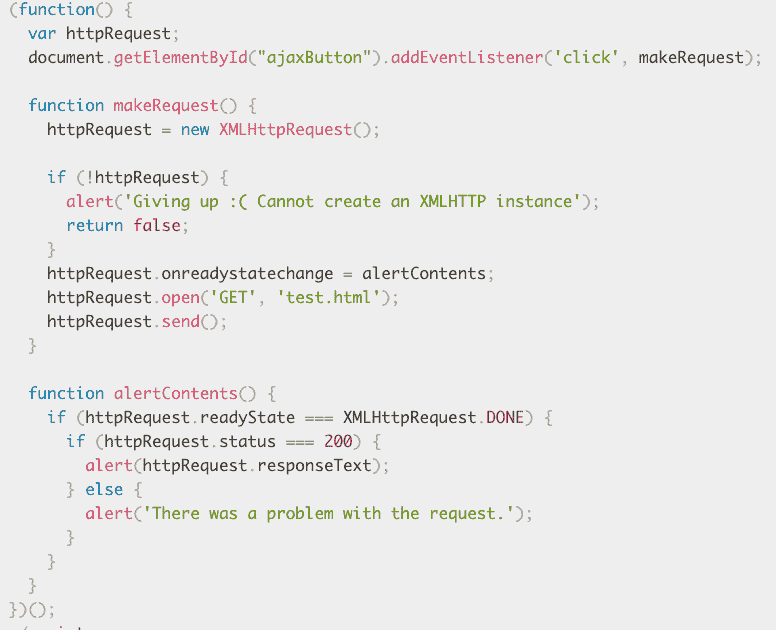

# 开始尝试获取发生

> 原文：<https://dev.to/iris/start-trying-to-make-fetch-happen-3hp8>

从前(1998 年)在 JavaScript 的土地上，聪明的程序员创建了 XMLHttpRequest 对象来在网站和服务器之间交换信息。这些特殊的对象允许异步请求，这意味着在发出请求时，浏览器可以继续运行并与服务器交互。无需重新加载页面！

查看 MDN 上的[优秀文档，了解更多关于异步 JavaScript 和 XML(又名 AJAX)的知识。](https://developer.mozilla.org/en-US/docs/Web/Guide/AJAX)

但是这是有代价的…

构造 XMLHttpRequest 对象并处理服务器请求和响应的代码并不简单。

是的，很复杂。

[](https://res.cloudinary.com/practicaldev/image/fetch/s--6NIxOOQI--/c_limit%2Cf_auto%2Cfl_progressive%2Cq_auto%2Cw_880/https://thepracticaldev.s3.amazonaws.com/i/89n0cr0yzwjratwm3s38.jpg)

请看 MDN 的 AJAX 资源指南中的这个简单示例:

[](https://res.cloudinary.com/practicaldev/image/fetch/s--vPcgExmG--/c_limit%2Cf_auto%2Cfl_progressive%2Cq_auto%2Cw_880/https://thepracticaldev.s3.amazonaws.com/i/zx8qogs91i5mkag9ozz7.png)

## 取(及其他东西)来救援！

排队一些小号和音乐膨胀，因为勇敢的图书馆从世界各地席卷而来，以挽救这一天。像 jQuery 这样的库使用助手函数来使 AJAX 变得不那么复杂。

[](https://res.cloudinary.com/practicaldev/image/fetch/s--U3h5-zp0--/c_limit%2Cf_auto%2Cfl_progressive%2Cq_auto%2Cw_880/https://thepracticaldev.s3.amazonaws.com/i/q06vj4mtummackbkgd5e.jpg)

然后，格雷琴如愿以偿，取了回来。Fetch API 爆红(Chrome 40 ~ 2015 年前后)。

除 IE 之外，大多数主流浏览器都支持 Fetch。

对 Fetch 的崇高追求:

> 统一全网平台抓取— [抓取生活标准](https://fetch.spec.whatwg.org/#goals)

Fetch 让事情简单多了。

[](https://res.cloudinary.com/practicaldev/image/fetch/s--21R3aA14--/c_limit%2Cf_auto%2Cfl_progressive%2Cq_auto%2Cw_880/https://thepracticaldev.s3.amazonaws.com/i/bt7nl6yoxlc8bzewogf0.jpg)

## 承诺

承诺是调用异步函数的结果。

> Promise 对象表示异步操作的最终完成(或失败)及其结果值。- MDN

因为程序不能肯定地说你的异步函数是否会成功，所以它返回一个你可以与之交互的承诺。

> 承诺就像一盒巧克力，你永远不知道你会得到什么。FGM

## 然后又接住

如果你见过 Fetch in the wild，你很可能见过两个与之相关的方法-。然后()和。catch()
then()方法通常用于处理成功解析的承诺。Catch()是处理失败的地方。

```
 fetch(URL)
    .then(response => response.json())  // parse response with json
    .then(jsonStuff => doStuff(jsonStuff)) 
//calling another function to do stuff with our json parsed response!
    .catch(errors => console.log(errors)) //handle your errors! 
```

<svg width="20px" height="20px" viewBox="0 0 24 24" class="highlight-action crayons-icon highlight-action--fullscreen-on"><title>Enter fullscreen mode</title></svg> <svg width="20px" height="20px" viewBox="0 0 24 24" class="highlight-action crayons-icon highlight-action--fullscreen-off"><title>Exit fullscreen mode</title></svg>

默认情况下，Fetch 使用 GET 方法(见上文)，对 Fetch 请求进行 POST、PATCH、DELETE 操作，添加一个对象，如下:

```
 fetch(URL, { 
    method: 'POST', 
    headers: {  "Content-Type": "application/json" }, 
    body: JSON.stringify({
      stuff: "hi",
      number: 0 
    })
   }) 
```

<svg width="20px" height="20px" viewBox="0 0 24 24" class="highlight-action crayons-icon highlight-action--fullscreen-on"><title>Enter fullscreen mode</title></svg> <svg width="20px" height="20px" viewBox="0 0 24 24" class="highlight-action crayons-icon highlight-action--fullscreen-off"><title>Exit fullscreen mode</title></svg>

*删除只需要请求对象中的“方法”。*

## 异步，等待，结束…

等等，还有更多！2017 年，ES2017 引入了 Async 和 Await。他们简化承诺并与之互动。但那是以后的事了...

```
const theEnd = () => {
return Promise.resolve("And they lived") } 
const theEnd2 = async () => { const phrase = await theEnd() 
    return phrase + " happily ever"  }
theEnd2().then(response => console.log(response + " after."))
// "And they lived happily ever after." 
```

<svg width="20px" height="20px" viewBox="0 0 24 24" class="highlight-action crayons-icon highlight-action--fullscreen-on"><title>Enter fullscreen mode</title></svg> <svg width="20px" height="20px" viewBox="0 0 24 24" class="highlight-action crayons-icon highlight-action--fullscreen-off"><title>Exit fullscreen mode</title></svg>

制作此帖子时使用的资源:

*   [MDN:使用 Fetch](https://developer.mozilla.org/en-US/docs/Web/API/Fetch_API/Using_Fetch)
*   萨拉·维埃拉的获取教程
*   [Flaviocopes.com 取物篇](https://flaviocopes.com/fetch-api/)
*   [马特·冈特的谷歌开发者文章](https://developers.google.com/web/updates/2015/03/introduction-to-fetch)