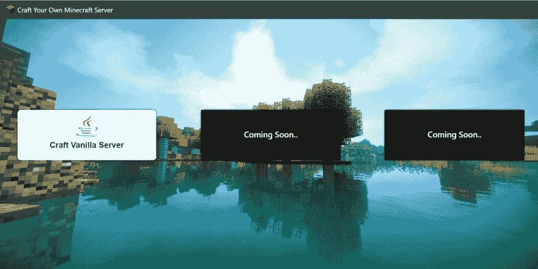
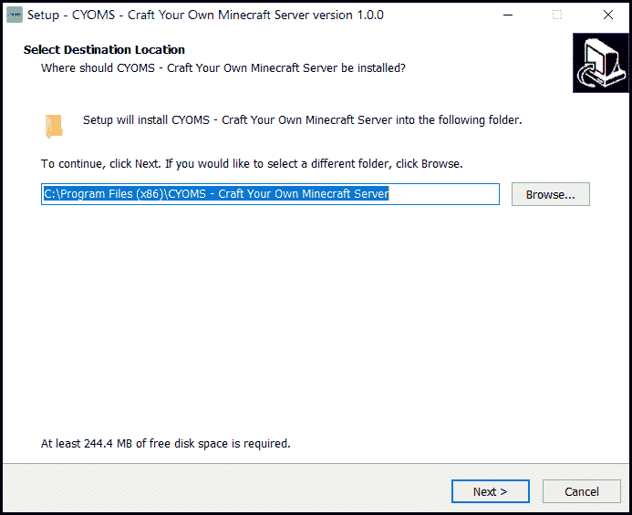
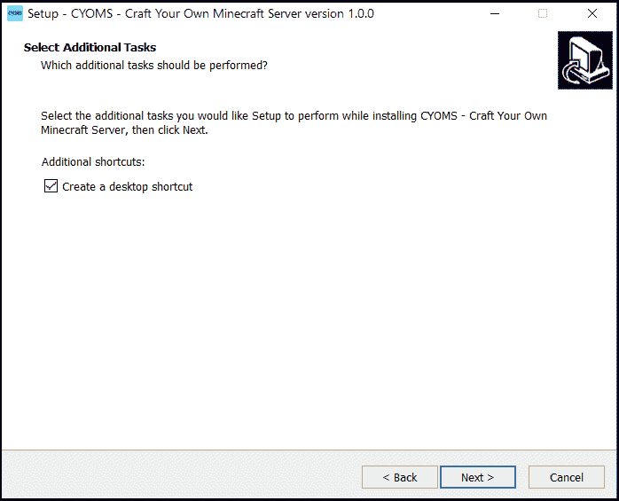
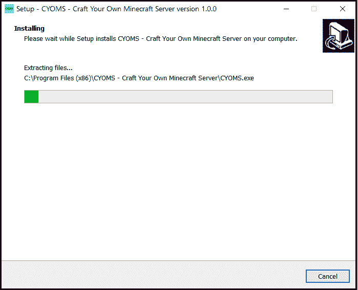

# 打造你自己的《我的世界》服务器

> 原文:[https://dev . to/pika 1998/cyoms-craft-your-own-minecraft-server-2 kbp](https://dev.to/pika1998/cyoms-craft-your-own-minecraft-server-2kbp)

# [CYOMS——打造自己的《我的世界》服务器](https://github.com/Pika1998/CYOMS/releases/tag/v1.0.0)

下载 CYOMS v 1 . 0 . 0:
[https://github.com/Pika1998/CYOMS/releases/tag/v1.0.0](https://github.com/Pika1998/CYOMS/releases/tag/v1.0.0)

CYOMS 是一个桌面应用程序，允许用户轻松设置任何版本的 Minecraft 服务器。

* * *

## 预览

CYOMS 允许创建**普通**服务器，并将很快支持 **Craft-bukkit** 和 **Spigot** 服务器。

[T2】](https://res.cloudinary.com/practicaldev/image/fetch/s--o9WHZDr2--/c_limit%2Cf_auto%2Cfl_progressive%2Cq_auto%2Cw_880/https://thepracticaldev.s3.amazonaws.com/i/c8q2pxst6he0lfj11szb.png)

CYOMS 允许配置基本的服务器设置，默认情况下，它在本地 IP 地址上创建最新版本的服务器。

## T2】

## 安装

1.  使用 **CYOMS_setup.exe** 文件安装
2.  安装程序将指导您完成以下安装步骤:
    *   选择要安装 CYOMS 的文件夹
    *   如果您想为应用程序创建桌面图标，勾选*“创建桌面图标”*。然后点击**下一个** 
    *   点击**安装**
    *   等待安装程序安装完 CYOMS 
    *   安装完成后，系统会询问您是否要启动 CYOMS 
3.  如果你看到上面的屏幕，你已经**成功地**安装了 CYOMS