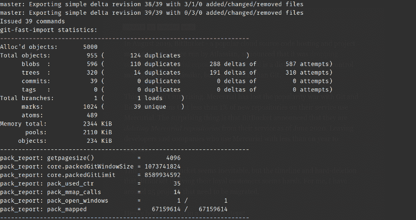

# 将 Mercurial Repos 迁移到 Git

> 原文:[https://dev . to/syntax seed/migrating-mercurial-repos-to-git-23ee](https://dev.to/syntaxseed/migrating-mercurial-repos-to-git-23ee)

2019 年 8 月，由 Atlassian 运营的流行云源代码托管和项目管理服务 BitBucket 宣布[停止对 Mercurial 存储库](https://bitbucket.org/blog/sunsetting-mercurial-support-in-bitbucket)的支持。 [Mercurial](https://www.mercurial-scm.org/) 是一个分布式源代码控制管理工具，类似于 Git，但不如 Git 流行。

这一举动并不令人惊讶。Mercurial 已经输掉了与 Git 和 BitBucket 的流行战争，声称他们服务中不到 1%的新存储库使用 Mercurial。令人惊讶的是，BitBucket 宣布他们将于 2020 年 6 月从服务中删除 Mercurial 库。使得使用 Mercurial 的开发者和公司只有不到一年的时间进行迁移。

BitBucket 的这一举动似乎是不可避免的，但 BitBucket 给他们忠诚客户的时间表和硬删除似乎很苛刻。对我来说，我有大约 25 个项目需要迁移。

这里是如何做到这一点，在几个简单的步骤！

## [](#1-decide-where-to-go)1。决定去哪里

选择很多！如果你想把你的 repos 放在 Mercurial 上，那么你有其他的托管选择，包括 SourceHug，SourceForge，CodeBase 等等。Mercurial 网站上有一个完整的用于 Mercurial 托管的[选项列表。](https://www.mercurial-scm.org/wiki/MercurialHosting)

您可能需要认真考虑转而使用 Git。网上到处都有详细的 Git 教程，学习基础知识并不太难。对我来说，我已经在学习和使用 Git 了，所以这种转变是显而易见的。由于我总体上对 BitBucket 不满意，而且这个新问题没有帮助，我决定将我的项目从 BitBucket 中移走。目前，我将我的开源项目放在 [GitHub](https://github.com/) 上，而我的私人项目将放在 [GitLab](https://about.gitlab.com/) 上。

出于本教程的目的，我将教你如何切换到 Git。T3】

## [](#2-create-a-new-git-repo)2。创建新的 Git Repo

首先，使用您将托管 Git 回购的云服务上的工具，创建一个新的空回购。如果提供了这个选项，不要用自述文件初始化它。考虑一下你想如何组织和命名你的项目，因为这可能是以后改变的痛苦。有些服务可以让您将 repos 分类到组、项目或工作区中。现在是一个好时机，当你将来有一大堆项目时，你可以考虑如何对它们进行排序。不要只是把他们都放在根组里。

记下指向回购的 SSL url。对于 GitLab，这看起来像:

```
git@gitlab.com:username/repo-name.git 
```

## [](#3-install-fast-export)3。安装快速导出

有一个很棒的工具叫做[快速导出](https://github.com/frej/fast-export)，用于将 Mercurial 库转换成 Git。在您的开发计算机上创建一个要安装快速导出的目录。如`/home/tools/fast-export/`。从该目录中的终端，使用
克隆快速导出工具

```
git clone https://github.com/frej/fast-export.git . 
```

> **注意:**如果您使用的是 Mercurial 版本< 4.6，并且出现“revsymbol not found”错误，请更新 Mercurial，或者通过在`fast-export`目录中运行以下命令来使用旧版本的快速导出: `git checkout tags/v180317`

## [](#4-prepare-new-local-repo)4。准备新的本地回购

创建一个本地目录，用于保存我们将使用快速导出创建的新 Git repo。在那里初始化一个新的 Git repo。请注意，如果您使用的是 Windows，终端命令可能会有所不同。

```
mkdir /home/repos/git/my-project/
cd $_
git init 
```

## [](#5-use-fast-export-to-convert)5。使用快速导出进行转换

首先，请确保您已经将所有最新的更改加载到 Mercurial repo 的本地副本中。然后，在新初始化的 Git 目录中:

```
/home/tools/fast-export/hg-fast-export.sh -r /home/repos/mercurial/my-project/ 
```

这将在 Mercurial repo 上运行快速导出 shell 脚本。您将看到快速导出的一些漂亮输出，如下所示:

[T2】](https://res.cloudinary.com/practicaldev/image/fetch/s--clF3ocY2--/c_limit%2Cf_auto%2Cfl_progressive%2Cq_auto%2Cw_880/https://thepracticaldev.s3.amazonaws.com/i/dvt190e8k2i1ef3ekd28.png)

接下来，像这样检查头部提交:

```
git checkout HEAD 
```

完成后，确保查看隐藏的文件，并删除任何 Mercurial 特有的文件，如`.hgignore`。

### [](#6-connect-to-remote)6。连接到遥控器

通过设置前面提到的上游 SSH URL，将本地 Git repo 连接到新的云托管 Git repo。在我的例子中，这看起来像:

```
git remote add origin git@gitlab.com:username/repo-name.git 
```

如果你还没有，设置一个 SSH 密钥来连接到你的主机服务。比起用户名/密码认证，我强烈推荐这样做。 [GitLab 关于 SSH 密钥](https://docs.gitlab.com/ee/ssh/)的文档非常完整。

## [](#7-push-the-new-repo-to-the-remote-repository)7。将新的存储库推送到远程存储库

将本地 Git repo 推送到远程。如果您在 SSH 密钥上设置了密码(推荐)，那么系统会提示您输入密码。为了确保你得到了所有的东西，做:

```
git push -u origin --all
git push -u origin --tags 
```

完成这些后，通过您的 web 浏览器访问 GitLab 上的远程 repo 或您选择的任何服务。确认代码和提交历史存在。您可能想做一个小的本地编辑，然后提交并推送它来测试它是否工作正常。

这些步骤应该适用于一个简单的 Mercurial 存储库。如果您的分支名称没有转换成 Git，或者如果您想要转换作者信息，有一些方法可以做到这一点，只需查看[快速导出文档](https://github.com/frej/fast-export#readme)。

## [](#bonus-fix-line-endings)奖金！修复行尾

如果像我一样，您收到一堆警告，说您的项目有 Windows 风格的行尾(CRLF)，Git 正在用 Linux 风格的行尾(LF)替换它们，您可能希望确保您的本地副本也有正确的结尾。我的许多项目最初是在 Windows 机器上创建的，但我现在在 Linux 上工作，所以这些混合结局无处不在。为了确保您的本地与远程匹配，您可以将您的本地重置为 Git 中现在的内容。首先确保所有内容都已成功推送到遥控器，然后执行:

```
git rm --cached -r .
git reset --hard 
```

这将删除本地的所有内容，然后将工作树重置为最后一次提交。您将失去现有的工作树和临时区域。如果没有指定提交，则假定为 HEAD。确保你的编辑器使用正确的行尾。

## [](#wrap-up)总结起来

就是这样！一旦完成这个过程，迁移 Mercurial repo 只需 10 分钟。如果您是 Git 新手，那么创建一个沙盒存储库是个好主意，您可以在这里试验和尝试 Git 的命令。许多人也喜欢为 Git 使用 GUI 界面。

对我来说，这是对 Mercurial 的告别。它为我提供了 10 多年的发展，我会怀念它的简单。❤

祝你自己的迁移好运！

——
[原载于 Blog.SyntaxSeed.com](https://blog.syntaxseed.com/migrating-mercurial-repos-to-git/)