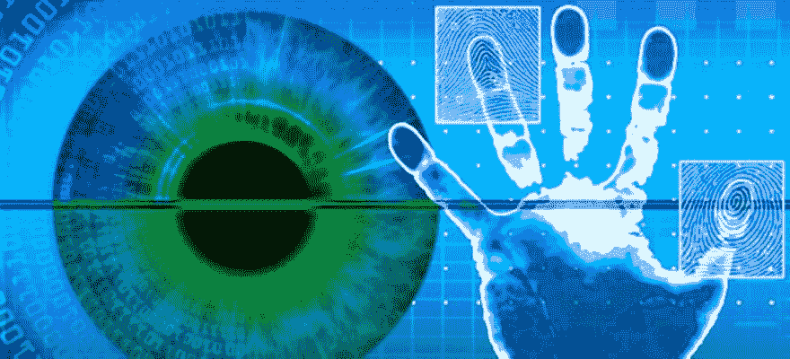

# 比特币不在乎你的身份，只在乎你的知识

> 原文:[https://dev . to/wags lane/bit coin-t-care-on-your-identity-only-your-knowledge-42n 6](https://dev.to/wagslane/bitcoin-doesn-t-care-about-your-identity-only-your-knowledge-42n6)

当你在银行提款、缴税或领执照时，你必须证明你是谁。证明自己是谁的过程是一个很“人”的过程。当局检查你的身份证，并确保照片看起来像你，这使他们相信你是身份证上的人。

另一方面，比特币不关心谁持有钱包的私钥。谁知道那些钥匙，只是一些数字，从技术上来说，他就是那些硬币的所有者。为此，我们竭尽全力确保只有我们知道我们的密钥。

[T2】](https://res.cloudinary.com/practicaldev/image/fetch/s--xijNgUM---/c_limit%2Cf_auto%2Cfl_progressive%2Cq_auto%2Cw_880/https://qvault.io/wp-content/uploads/2019/09/C3hzoDiUcAAMvb3.jpg)

对于比特币，许多人不习惯于这样一个事实，即如果密钥丢失，没有任何机构可以帮助找回密钥。如果你丢失了网上银行账户密码，你可以去银行让他们重新设置。如果你丢失了你的比特币钥匙，你就不再拥有那些比特币。

## 为什么不用生物识别？

有人问我，为什么我们不能用指纹或眼睛扫描仪作为钥匙？这将解决人们忘记带钥匙的问题。

[T2】](https://res.cloudinary.com/practicaldev/image/fetch/s--f4Hd77ca--/c_limit%2Cf_auto%2Cfl_progressive%2Cq_auto%2Cw_880/https://qvault.io/wp-content/uploads/2019/09/multimodal-biometrics.jpg)

这里最大的问题是，如果它可以被数字化，那么它就可以被复制。通过将指纹转化为数字永久比特币密钥，如果其他人拍下你的手指，他们不仅可以窃取你的比特币，还可能窃取你未来赚到的每一枚比特币。

## 现在最好的答案是教育和工具

就目前而言，我们能做的最好的事情就是教育每个人良好的密钥存储技术，并开发工具使安全存储变得更容易。这是我们对 Qvault 的首要目标，这个项目每天都变得更加安全和易于使用。

由莱恩·瓦格纳 [@wagslane](https://twitter.com/wagslane)

下载 q vault:[https://q vault . io](https://qvault.io/)

星我们的 Github:[https://github.com/q-vault/qvault](https://github.com/q-vault/qvault)

帖子[比特币不在乎你的身份，只在乎你的知识](https://qvault.io/2019/09/06/bitcoin-doesnt-care-about-your-identity-only-your-knowledge/)最先出现在 [Qvault](https://qvault.io) 上。