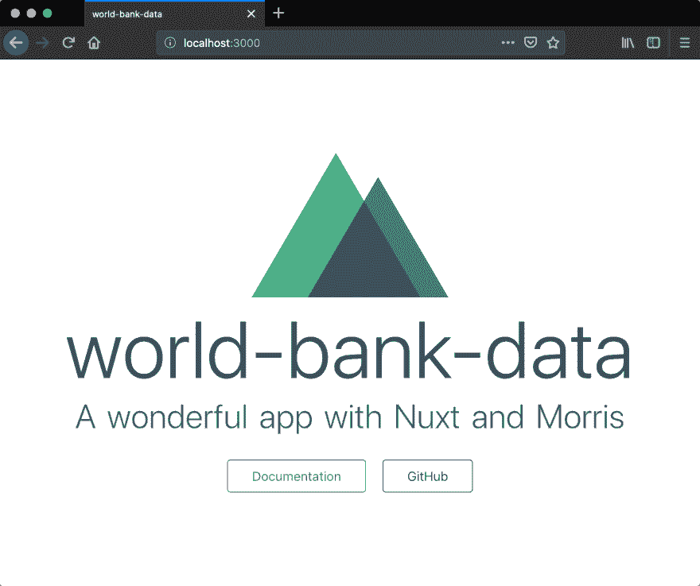
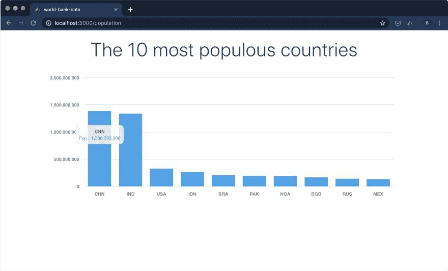

# 用 Nuxt 和 Morris 构建一个简单的应用程序来显示图表

> 原文：<https://dev.to/bbonnin/building-a-simple-app-with-nuxt-and-morris-for-displaying-charts-1a8>

*本帖最初发布于[媒体](https://medium.com/@brunobonnin/building-a-simple-app-with-nuxt-and-morris-js-for-displaying-chart-b6b33b14ffff)。*

本文旨在描述(非常简短地)如何创建一个应用程序来显示来自 API 的数据的图表。

# 第一步，用 Nuxt 创建 app

[Nuxt](https://nuxtjs.org/) 是我目前最喜欢的框架之一:如果你熟悉 [Vue.js](https://vuejs.org/) ，用 Nuxt 构建一个应用程序是通向更简单、更美好世界的下一步😀
那么，让我们从使用命令`npx create-nuxt-app`
创建应用程序开始

```
$ npx create-nuxt-app
npx : 379 installé(s) en 16.616s

> Generating Nuxt.js project in /Dev/world-bank-data
? Project name: world-bank-data
? Project description: A wonderful app with Nuxt and Morris
? Use a custom server framework: none
? Choose features to install: Axios
? Use a custom UI framework: none
? Use a custom test framework: none
? Choose rendering mode: Single Page App
? Author name: Bruno
? Choose a package manager: npm

  To get started:

        npm run dev

  To build & start for production:

        npm run build
        npm start 
```

Enter fullscreen mode Exit fullscreen mode

> **重要**:选择`axios`作为要安装的特性，选择`Single Page App`作为渲染模式。

现在，您可以用`npm run dev`启动您的应用程序并打开`http://localhost:3000`。您应该得到这样的结果:

[](https://res.cloudinary.com/practicaldev/image/fetch/s--HTb0u6f6--/c_limit%2Cf_auto%2Cfl_progressive%2Cq_auto%2Cw_880/https://thepracticaldev.s3.amazonaws.com/i/ebrxw45piltovu2718j2.png)

# 下一步，添加依赖项、插件等

我们的应用程序还需要另外两个依赖项:

*   `vue-lodash`:提供实用函数的[库](https://github.com/Ewocker/vue-lodash)(将用于解析 API 的结果
*   `vue-morris`:一个用于 Vue.js 的 Morris.js 的[包装器(有点旧，但是非常高效)](https://github.com/bbonnin/vue-morris)

让我们添加这些必需的依赖项:

```
npm i vue-lodash vue-morris --save 
```

Enter fullscreen mode Exit fullscreen mode

为了更简单地使用某些依赖项，Nuxt 可以用插件来丰富。让我们用 vue-lodash 和 vue-morris 来做吧。

创建两个文件:`plugins/vue-lodash.js`和`plugins/vue-morris.js`并更新`nuxt.config.js`来声明这些插件。

*   nuxt.config.js

```
export default {

  /*
  ** Plugins to load before mounting the App
  */
  plugins: [
    '~/plugins/vue-lodash',
    '~/plugins/vue-morris'
  ],
} 
```

Enter fullscreen mode Exit fullscreen mode

*   vu-lodash.js-检视-LOD ash . js

```
import Vue from 'vue'
import VueLodash from 'vue-lodash'

// To be able to use this._ or Vue._ in the components without including lodash
Vue.use(VueLodash) 
```

Enter fullscreen mode Exit fullscreen mode

*   vista 莫里斯. js

```
import Raphael from 'raphael/raphael'
import jQuery from 'jquery'

// This is needed by Morris
global.Raphael = Raphael
global.jQuery = jQuery 
```

Enter fullscreen mode Exit fullscreen mode

# 最后一步，用图表添加新页面

现在，我们将创建一个页面，以条形图的形式显示人口最多的 10 个国家。

> 本例中使用的服务是世界银行的 [API。他们提供了很多数据，非常有趣！有关 API 的更多信息，请查看](https://data.worldbank.org/)[本页](https://datahelpdesk.worldbank.org/knowledgebase/articles/889392-about-the-indicators-api-documentation)。

在我们的例子中，我们使用这个 URL: `http://api.worldbank.org/v2/country/all/indicator/SP.POP.TOTL?date=2018&format=json&per_page=300&mrv=1`

参数:

*   *SP。流行 TOTL* :指标的名称(在我们的例子中，是人口)
*   *日期*:日期范围(我只设置了去年，不要历史数据)
*   *格式*:结果的格式(可以是 XML、JSON、…)
*   *per_page* :每个查询的结果数(我将其设置为 300，以便在单个查询中获得所有结果，不分页)
*   mrv :根据指定的数字获取最近的值(我把它设置为 1，只获取最近的值)

要查询这个 API 并获得人口最多的国家，代码应该是这样的(在这个方法中，我们过滤值，根据`value`字段排序并只保留 10 个值):

```
this.$axios.$get('http://api.worldbank.org/v2/country/all/indicator/SP.POP.TOTL?date=2018&format=json&per_page=300&mrv=1')
      .then(data => {
        this.countries = this._.chain(data[1])
          .filter(d => d.value && d.countryiso3code)
          .sortBy('value')
          .value()
          .slice(-10)
          .reverse()
      }) 
```

Enter fullscreen mode Exit fullscreen mode

让我们添加一个新文件:`pages/population.vue`

*   `<script>`部分:我们从`vue-morris`导入`BarChart`并添加一个调用 API 的`mounted`函数(见上文)
*   `<template>`部分:我们使用`bar-chart`标签来显示 API 调用的结果。

```
<template>
  <section class="container">
    <h1 class="title">The 10 most populous countries</h1>
    <bar-chart id="bar" 
      :data="countries" 
      xkey="countryiso3code" 
      ykeys='["value"]' 
      labels='["Pop."]'
      resize="true" 
      bar-colors='[ "#36A2EB" ]'
      grid="true" 
      grid-text-weight="bold">
    </bar-chart>
  </section>
</template>

<script>
import { BarChart } from 'vue-morris'
export default {
  components: {
    BarChart
  },
  data() {
    return {
      countries: []
    }
  },
  mounted() {
    this.$axios.$get('http://api.worldbank.org/v2/country/all/indicator/SP.POP.TOTL?date=2018&format=json&per_page=300&mrv=1')
      .then(data => {
        this.countries = this._.chain(data[1])
          .filter(d => d.value && d.countryiso3code)
          .sortBy('value')
          .value()
          .slice(-10)
          .reverse()
      })
  }
}
</script> 
```

Enter fullscreen mode Exit fullscreen mode

现在，如果您打开 URL `http://localhost:3000/population`，您应该会看到类似这样的内容:

[](https://res.cloudinary.com/practicaldev/image/fetch/s--SMBEMJQt--/c_limit%2Cf_auto%2Cfl_progressive%2Cq_auto%2Cw_880/https://thepracticaldev.s3.amazonaws.com/i/yk32renxni8zc1nzq7ga.png)

最后，我们将创建一个从主页导航到人口页面的链接:更新文件`pages/index.vue`，用一个`<nuxt-link>`替换两个按钮(您也可以删除徽标)。

```
<template>
  ...
  <nuxt-link to="/population" class="button--grey">World population</nuxt-link>
  ...
</template> 
```

Enter fullscreen mode Exit fullscreen mode

# 结论

如您所见，使用 Nuxt 创建一个应用程序并添加一个简单的图表框架来获得丰富的交互式页面非常容易。
github 上有源代码:[https://github.com/bbonnin/medium-nuxt-morris](https://github.com/bbonnin/medium-nuxt-morris)。尽情享受吧！

威廉·艾文的封面图片