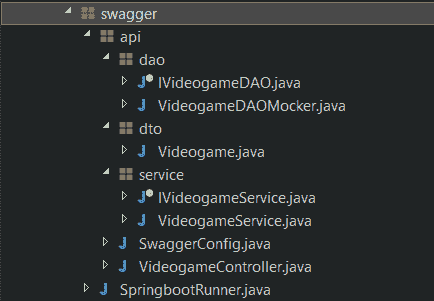
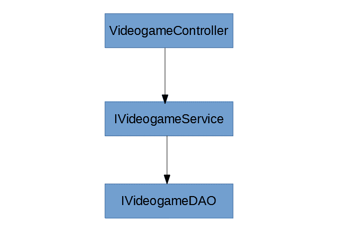
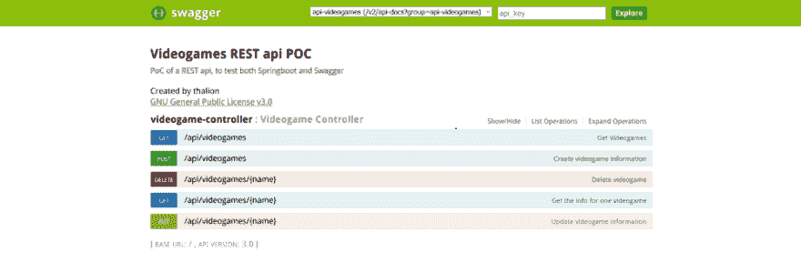

# 用 swagger 引导 REST API

> 原文:[https://dev . to/angelesbroullon/booting-a-rest-API-with-swagger-6 C4](https://dev.to/angelesbroullon/booting-a-rest-api-with-swagger-6c4)

# [](#introduction)简介

后端开发人员最常见的任务之一是生成面向微服务的 API。当我们谈论微服务时，我们指的是一小组端点，每个端点解决一个不同的问题，可以以快速简单的方式单独部署，因此如果我们需要处理某个区域的大量请求，它们很容易升级。与传统的整体架构相比，这是一个很大的优势，传统的整体架构需要一次部署所有的服务，需要更多的时间和资源。

REST 服务比 SOAP 服务更有效，也更容易保护，所以它们变得如此流行并不奇怪，但是部署和测试服务可能会很麻烦。幸运的是，有一些框架为我们提供了一些易于使用的工具。

让我们将这个问题分成 3 个步骤:

1.  使用 JSON 生成 REST 服务。
2.  用 Spring boot 启动服务。
3.  用 Swagger 编写文档并获得一个用户友好的测试界面。

在我们的示例代码中，我们将模拟一个通过 REST 处理视频游戏数据库的小系统。代码包的定义如下:

*   API 包将包含所有的 REST API，按层划分(服务、数据访问和数据传输对象)，并为控制器提供端点。
*   要设置 swagger 系统，我们需要一个配置文件，加上 API 包类应该获得新的注释来记录其内容。
*   最后，我们将添加通用的 Spring boot runner，它可以用于任何包，只需要很少的调整。

[T2】](https://res.cloudinary.com/practicaldev/image/fetch/s--NYPMTf87--/c_limit%2Cf_auto%2Cfl_progressive%2Cq_auto%2Cw_880/https://thepracticaldev.s3.amazonaws.com/i/nao6wu27lrbow3ee9e88.png)

* * *

# [](#process)流程

## [](#1-designing-a-dummy-restful-web-service)1。设计一个虚拟的 RESTful web 服务

第一步是为 REST 服务创建一个基本结构。我们将把它分成不同的层:

*   控制器将是 VideogameController，并将包含所有的端点，我们将把它留到后面，我们将讨论如何用 swagger 设置它。
*   接口 IVideogameService 将定义服务层，它将具有“普通”端点。
*   IVideogameDAO 给出了通过数据访问层可用的方法的概念。为了避免建立一个数据库连接或一个真正的存储库的麻烦，我们将模仿它。

一个好的实践是通过使用接口来分离设计和实现。这不是真正必要的，但它将使代码更具可重用性。

[T2】](https://res.cloudinary.com/practicaldev/image/fetch/s--mwxMnVBh--/c_limit%2Cf_auto%2Cfl_progressive%2Cq_auto%2Cw_880/https://thepracticaldev.s3.amazonaws.com/i/a6zvffnis16jidxcwgvx.png)

因此，该服务将模拟通常称为 CRUD 的操作:get(查找)、set(更新)、add(保存)和 remove(删除)。

```
import org.thalion.snippet.swagger.api.dto.Videogame;

public interface IVideogameService {
  Collection<Videogame> findAll();
  Videogame findOne(String name);
  String save(Videogame videogame);
  void update(Videogame setName);
  void delete(String name);
} 
```

该服务今天不会有太多事情要做，它只会连接到数据访问层，并让它处理所有的数据库工作。

```
import java.util.Collection;

import org.springframework.beans.factory.annotation.Autowired;
import org.springframework.stereotype.Service;
import org.thalion.snippet.swagger.api.dao.IVideogameDAO;
import org.thalion.snippet.swagger.api.dto.Videogame;

@Service
public class VideogameService implements IVideogameService {

  @Autowired
  private IVideogameDAO dao;

  @Override
  public Collection<Videogame> findAll() {
    return dao.findAll();
  }

  @Override
  public Videogame findOne(String name) {
    return dao.findOne(name);
  }

  @Override
  public String save(Videogame videogame) {
    return dao.save(videogame);
  }

  @Override
  public void update(Videogame videogame) {
    update(videogame);
  }

  @Override
  public void delete(String name) {
    dao.delete(name);
  }
} 
```

数据访问对象或 DAO 将真正完成这项艰巨的工作，它将连接到数据库。

```
import java.util.Collection;
import org.thalion.snippet.swagger.api.dto.Videogame;

public interface IVideogameDAO {
  Collection<Videogame> findAll();
  Videogame findOne(String name);
  String save(Videogame videogame);
  void update(Videogame videogame);
  void delete(String name);
} 
```

但是在这种情况下，我们希望保持简单，因为我们关注的是服务层。，所以我们不用配置数据库连接和编写一些查询，而是用一个简单的映射结构来模拟它。

```
import java.util.Collection;
import java.util.Map;

import org.springframework.stereotype.Repository;
import org.thalion.snippet.swagger.api.dto.Videogame;

@Repository
public class VideogameDAOMocker implements IVideogameDAO {

  private Map<String, Videogame> storage;

  @Override
  public Collection<Videogame> findAll() {
    return storage.values();
  }

@Override
public Videogame findOne(String name) {
  return storage.get(name);
}

  @Override
  public String save(Videogame videogame) {
    storage.put(videogame.getName(), videogame);
    return videogame.getName();
  }

  @Override
  public void update(Videogame videogame) {
    storage.put(videogame.getName(), videogame);
  }

  @Override
  public void delete(String name) {
    storage.remove(name);
  }
} 
```

数据传输对象或 DTO 现在并不真正有趣，因为它只是一个简单的类，用几个字符串来定义它的属性。所以我们现在跳过它的内容。

最后，我们将端点称为控制器，因为我们将使用 JSON 的 REST 服务，所以我们需要添加它的 maven 依赖项。

```
<dependency>
  <groupId>com.sun.jersey</groupId>
  <artifactId>jersey-json</artifactId>
</dependency> 
```

Spring MVC 的控制器将是一个额外的层，我们今天学习的大多数有趣的事情都将在这里发生。首先，我们将把它与服务连接起来，并通过 spring JAX-RS 注释设置其余部分:

*   `RequestMapping`配置路径。
*   `RequestMapping`声明该方法需要一个 HTTP 请求。
*   `RequestBody`从 HTTP 主体获取信息。
*   `PathVariable`从 URL 获取一个值。
*   `ResponseStatus`将存储的状态码发送回去。
*   `ResponseBody`从 HTTP 主体获取信息

```
import java.util.Collection;

import org.springframework.beans.factory.annotation.Autowired;
import org.springframework.http.HttpStatus;
import org.springframework.http.MediaType;
import org.springframework.http.ResponseEntity;
import org.springframework.web.bind.annotation.PathVariable;
import org.springframework.web.bind.annotation.RequestBody;
import org.springframework.web.bind.annotation.RequestMapping;
import org.springframework.web.bind.annotation.RequestMethod;
import org.springframework.web.bind.annotation.ResponseStatus;
import org.springframework.web.bind.annotation.RestController;
import org.thalion.snippet.swagger.api.dto.Videogame;
import org.thalion.snippet.swagger.api.service.IVideogameService;

@RestController
@RequestMapping("/api/videogames")
public class VideogameControllerBeta {

  @Autowired
  private IVideogameService service;

  @ResponseStatus(HttpStatus.OK)
  @RequestMapping(method = RequestMethod.GET,
   produces = MediaType.APPLICATION_JSON_VALUE)
  public Collection<Videogame> getAllVideogames() {
    return service.findAll();
  }

  @ResponseStatus(HttpStatus.OK)
  @RequestMapping(method = RequestMethod.GET, value = "{name}",
   produces = MediaType.APPLICATION_JSON_VALUE)
  public Videogame getVideogameByName(@PathVariable String name) {
    return service.findOne(name);
  }

  @RequestMapping(method = RequestMethod.POST,
   produces = MediaType.APPLICATION_JSON_VALUE)
  public ResponseEntity<String> createVideogame(@RequestBody Videogame videogame) {
    String videogameCreatedId = service.save(videogame);
    return new ResponseEntity<String>(videogameCreatedId, HttpStatus.CREATED);
  }

  @ResponseStatus(HttpStatus.NO_CONTENT)
  @RequestMapping(method = RequestMethod.PUT, value = "{name}")
  public void updateVideogame(@PathVariable String name,
   @RequestBody Videogame videogame) {
    videogame.setName(name);
    service.update(videogame);
  }

  @ResponseStatus(HttpStatus.NO_CONTENT)
  @RequestMapping(method = RequestMethod.DELETE, value = "{name}")
  public void deleteInfo( @PathVariable String name) {
    service.delete(name);
  }
} 
```

至此，我们已经准备好了，所以让我们找个地方运行这段代码。

## [](#2-lets-boot-it)2。让我们启动它！

Spring boot 是一个生成“只需运行”应用程序的工具，只需几行代码和注释，无需任何 xml 配置就可以完成。这使得快速运行和测试 Java 微服务变得非常有趣。

让我们从添加它的 maven 依赖项和设置它的 just run 配置开始:

```
<dependencies>
  <!-- spring boot setup ability -->
  <dependency>
    <groupId>org.springframework.boot>/groupId>
    <artifactId>spring-boot-starter-web</artifactId>
  </dependency>
</dependencies>

<!-- Just run configuration -->
<build>
  <plugins>
    <plugin>
      <groupId>org.springframework.boot</groupId>
      <artifactId>spring-boot-maven-plugin</artifactId>
    </plugin>
  </plugins>
</build> 
```

然后，我们需要在 Java 代码本身中设置它。配置它的最长方法是使用以下注释:

*   这是一个 Spring-MVC，它将这个类设置为 REST 服务的控制器
*   `EnableAutoConfiguration`，这将根据我们包含的依赖项配置引导服务。既然我们用了 TesController，系统就会考虑加入 Spring MVC 和 Tomcat。
*   `ComponentScan`，扫描包及其子包的组件。

但是所有这 3 个注释都可以简化为一个:`SpringBootApplication (scanBasePackages = { “replace_with_main_package” })`，就是示例中使用的那个。

```
import org.springframework.boot.SpringApplication;
import org.springframework.boot.autoconfigure.SpringBootApplication;

/**
* Generic SpringBoot, only configured by setting the scanBasePackages
* restricts the scanned packages
*/
@SpringBootApplication(scanBasePackages = { "org.thalion.snippet.swagger" })
public class SpringbootRunner {

  public static void main(String[] args) {
SpringApplication.run(SpringbootRunner.class, args);
  }
} 
```

因此，只要运行这个类，就会部署一个本地服务器，我们就可以测试服务了…但这并不直观。让我们做得更好。

## [](#3-making-it-pretty-and-easy-to-test-plus-avoiding-setting-up-the-client-side)3。使它变得漂亮和易于测试，并避免设置客户端

记录一个 API 以使它易于被其他开发人员理解，并使它对测试人员友好不是一件容易的事情。Swagger 是一个框架，它使用一些额外的注释，能够使用可用的元数据生成一个简单的 web 用户界面，其中记录了对 API 的 REST 调用。我们将使用 springfox 版本，因为它已经捆绑了正确的注释。

最初写这篇文章时，❕This 是稳定版本。

```
<dependencies>
  <!-- Swagger -->
  <dependency>
    <groupId>io.springfox</groupId>
    <artifactId>springfox-swagger-ui</artifactId>
    <version>2.3.0</version>
  </dependency>
  <dependency>
    <groupId>io.springfox</groupId>
    <artifactId>springfox-swagger2</artifactId>
    <version>2.3.0</version>
  </dependency>
</dependencies> 
```

最常见的注释是:

*   `Api`:对于控制器类，设置 API 端点文档。
*   `Apimodel`:用于数据传输对象类名。
*   `ApiModelProperty`:用于数据传输对象属性。
*   他们超越了端点上可用的方法或服务。
*   `ApiParam`:用于方法的输入参数。
*   `ApiResponse`:输出参数。一组 ApiResponses 可以有多个(例如，还要添加 404 错误等)。

然后，为了完全设置它，有两个重要的点需要重新检查:DTO 和控制器。

让我们从 DTO 开始，因为它是最直接的部分:我们只需要记录关于类定义本身和属性的信息。

```
package org.thalion.snippet.swagger.api.dto;

import io.swagger.annotations.ApiModel;
import io.swagger.annotations.ApiModelProperty;

@ApiModel(value = "Videogame entity", description = "Complete data of an entity
 videogame")
public class Videogame {

  @ApiModelProperty(value = "The name of the videogame", required = true)
  private String name;
  @ApiModelProperty(value = "The developer of the videogame", required = false)
  private String developer;

  public String getName() {
    return name;
  }

  public void setName(String name) {
    this.name = name;
  }

  public String getDeveloper() {
    return developer;
  }

  public void setDeveloper(String developer) {
    this.developer = developer;
  }
} 
```

控制器有点难，因为我们需要记录每一个端点。

```
import java.util.Collection;

import org.springframework.beans.factory.annotation.Autowired;
import org.springframework.http.HttpStatus;
import org.springframework.http.MediaType;
import org.springframework.http.ResponseEntity;
import org.springframework.web.bind.annotation.PathVariable;
import org.springframework.web.bind.annotation.RequestBody;
import org.springframework.web.bind.annotation.RequestMapping;
import org.springframework.web.bind.annotation.RequestMethod;
import org.springframework.web.bind.annotation.ResponseStatus;
import org.springframework.web.bind.annotation.RestController;
import org.thalion.snippet.swagger.api.dto.Videogame;
import org.thalion.snippet.swagger.api.service.IVideogameService;

import io.swagger.annotations.ApiOperation;
import io.swagger.annotations.ApiParam;
import io.swagger.annotations.ApiResponse;
import io.swagger.annotations.ApiResponses;

@RestController
@RequestMapping("/api/videogames")
public class VideogameController {

  @Autowired
  private IVideogameService service;

  @ResponseStatus(HttpStatus.OK)
  @RequestMapping(method = RequestMethod.GET, produces = 
  MediaType.APPLICATION_JSON_VALUE)
  @ApiOperation(value = "Get Videogames", notes = "Returns all the videogame data")
  @ApiResponses({ @ApiResponse(code = 200, message = "Returns this information") })
  public Collection<Videogame> getAllVideogames() {
    return service.findAll();
  }

  @ResponseStatus(HttpStatus.OK)
  @RequestMapping(method = RequestMethod.GET, value = "{name}", produces = 
  MediaType.APPLICATION_JSON_VALUE)
  @ApiOperation(value = "Get the info for one videogame", notes = "Returns the info
   from one videogame")
  @ApiResponses({ @ApiResponse(code = 200, message = "Exists this information") })
  public Videogame getVideogameByName(
@ApiParam(defaultValue = "default", value = "The name of the videogame to return")
 @PathVariable String name) {
    return service.findOne(name);
  }

  @RequestMapping(method = RequestMethod.POST, produces =
   MediaType.APPLICATION_JSON_VALUE)
  @ApiOperation(value = "Create videogame information", notes = "Create a videogame
   entry")
  @ApiResponses({ @ApiResponse(code = 201, message = "The videgame entry was created
   successfully") })
  public ResponseEntity<String> createVideogame(@RequestBody Videogame videogame) {
    String videogameCreatedId = service.save(videogame);
    return new ResponseEntity<String>(videogameCreatedId, HttpStatus.CREATED);
  }

  @ResponseStatus(HttpStatus.NO_CONTENT)
  @RequestMapping(method = RequestMethod.PUT, value = "{name}")
  @ApiOperation(value = "Update videogame information", notes = "Update a videogame
   information entry")
  @ApiResponses({ @ApiResponse(code = 204, message = "The videgame entry was updated
   successfully") })
  public void updateVideogame(
@ApiParam(defaultValue = "Default", value = "The name of the videogame to update")
 @PathVariable String name,
@RequestBody Videogame videogame) {
    videogame.setName(name);
    service.update(videogame);
  }

@ResponseStatus(HttpStatus.NO_CONTENT)
@RequestMapping(method = RequestMethod.DELETE, value = "{name}")
@ApiOperation(value = "Delete videogame", notes = "Deletes a videogame entry")
@ApiResponses({ @ApiResponse(code = 204, message = "The videgame entry was deleted
 successfully") })
public void deleteInfo(
@ApiParam(defaultValue = "Default", value = "The name of the videogame to delete")
 @PathVariable String name) {
    service.delete(name);
  }
} 
```

一旦所有的文档注释都写下来，我们只需要在 Docket builder 的帮助下配置 API 页面，Docket builder 为我们的 swagger 实现提供了主要的图形界面。

因为我们使用的是 API，所以我们只担心`/api/`模式下的 URL，我们可以借助正则表达式来选择这些 URL。

```
import org.springframework.context.annotation.Bean;
import org.springframework.context.annotation.Configuration;

import springfox.documentation.builders.ApiInfoBuilder;
import springfox.documentation.builders.PathSelectors;
import springfox.documentation.service.ApiInfo;
import springfox.documentation.spi.DocumentationType;
import springfox.documentation.spring.web.plugins.Docket;
import springfox.documentation.swagger2.annotations.EnableSwagger2;

@Configuration
@EnableSwagger2
public class SwaggerConfig {

  @Bean
  public Docket newsApi() {
    return new Docket(DocumentationType.SWAGGER_2).groupName("api-videogames")
    .apiInfo(apiVideogames()).select().paths(PathSelectors.regex("/api.*")).build();
  }

  private ApiInfo apiVideogames() {
    return new ApiInfoBuilder().title("Videogames REST api POC")
.description("PoC of a REST api, to test both Springboot and Swagger")
.termsOfServiceUrl("https://creativecommons.org/licenses/by/4.0/")
.contact("abcd@mail.com")
.license("GNU General Public License v3.0").licenseUrl(
    "https://www.gnu.org/licenses/gpl-3.0.en.html").version("3.0").build();
  }
} 
```

我们最终得到了这个包含所有端点的漂亮网页，我们可以在`localhost:8080/swagger-ui.html`上轻松地与之交互。我们可以与不同的方法进行交互，并设置参数来进行快速测试，避免编写客户端或使用 SoapUI 之类的 REST 请求生成器。

恭喜你！您的演示已经完全设置好了，可以开始了。

[T2】](https://res.cloudinary.com/practicaldev/image/fetch/s--tJ5yMbVU--/c_limit%2Cf_auto%2Cfl_progressive%2Cq_auto%2Cw_880/https://thepracticaldev.s3.amazonaws.com/i/ar6ve1szawvk5as53hxk.png)