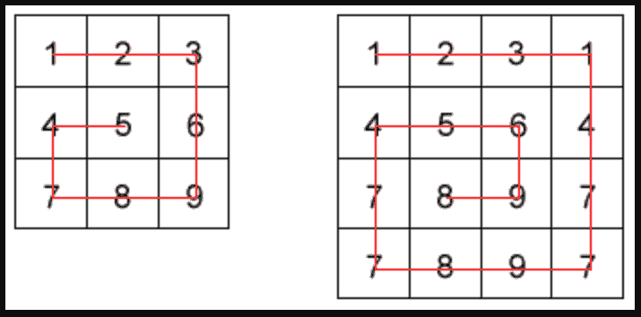

# 每日挑战#59 -蜗牛分类

> 原文：<https://dev.to/thepracticaldev/daily-challenge-59-snail-sort-1a6n>

```
array = [[1,2,3],
         [4,5,6],
         [7,8,9]]
snail(array) #=> [1,2,3,6,9,8,7,4,5]

```

给定一个数组`n * x`，返回从最外层元素到中间元素排列的数组元素，顺时针方向移动。不要按照从低到高的顺序对元素进行排序，而是以顺时针的螺旋模式遍历二维数组。

这些例子将阐明挑战:

```
array = [[1,2,3],
         [8,9,4],
         [7,6,5]]
snail(array) #=> [1,2,3,4,5,6,7,8,9]

```

[](https://res.cloudinary.com/practicaldev/image/fetch/s--QFeBwS-x--/c_limit%2Cf_auto%2Cfl_progressive%2Cq_auto%2Cw_880/https://i.imgur.com/n52ozXn.png)

空矩阵将被表示为[[]]。

下面是一些测试代码的矩阵。祝你好运，玩得开心！

```
(snail([[]]));

(snail([[1]]));

(snail([[1, 2, 3], 
        [4, 5, 6], 
        [7, 8, 9]));

(snail([[1, 2, 3, 4, 5], 
        [6, 7, 8, 9, 10], 
        [11, 12, 13, 14, 15], 
        [16, 17, 18, 19, 20], 
        [21, 22, 23, 24, 25]]));

(snail([[1, 2, 3, 4, 5, 6],
        [20, 21, 22, 23, 24, 7], 
        [19, 32, 33, 34, 25, 8], 
        [18, 31, 36, 35, 26, 9], 
        [17, 30, 29, 28, 27, 10], 
        [16, 15, 14, 13, 12, 11]]));

```

* * *

今天的挑战来自 CodeWars 的 stevenbarragan。感谢 [CodeWars](https://codewars.com/) ，他在 [2 条款 BSD 许可](https://opensource.org/licenses/BSD-2-Clause)下许可了这个挑战的再分发！

想为未来的帖子提出一个挑战性的想法吗？发送电子邮件给**[yo+challenge @ dev . to](mailto:yo+challenge@dev.to)**提出您的建议！