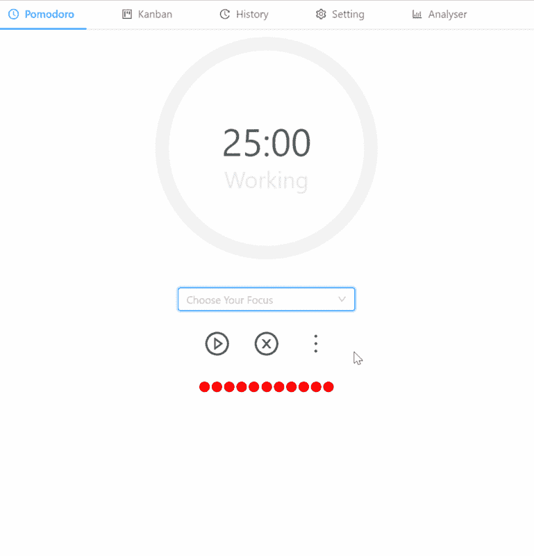
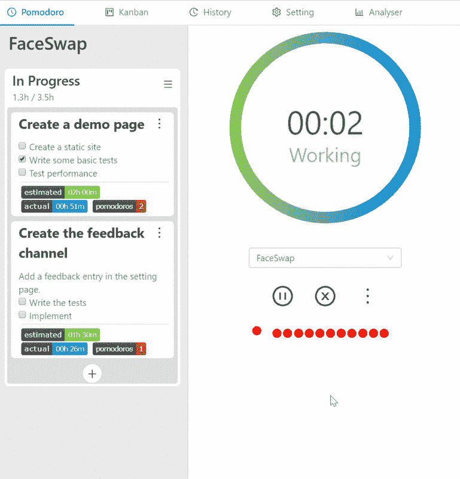
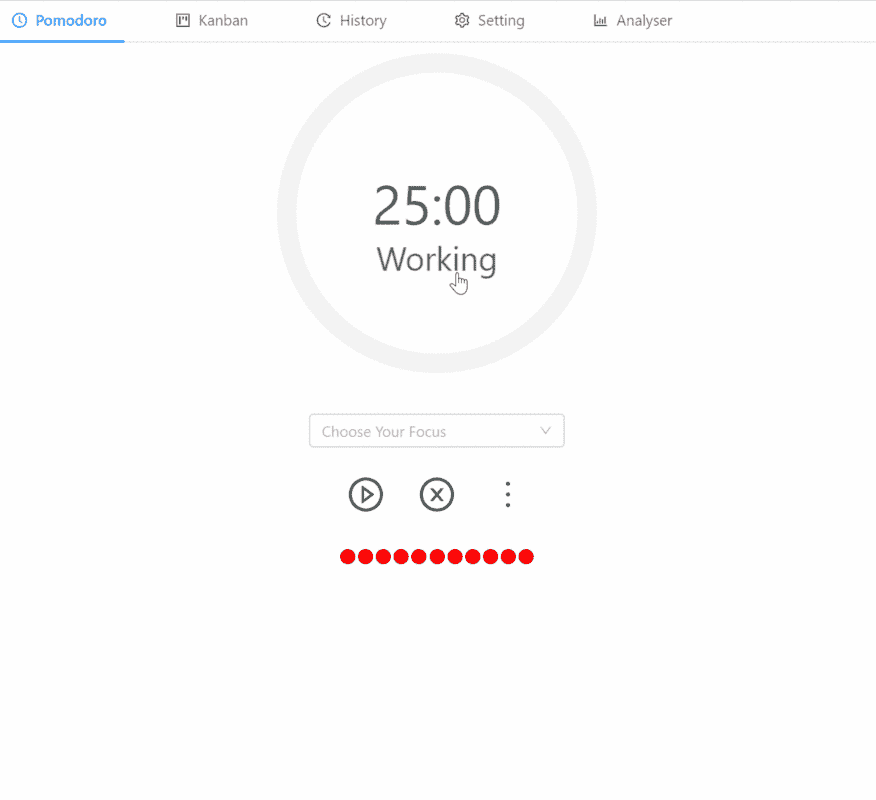
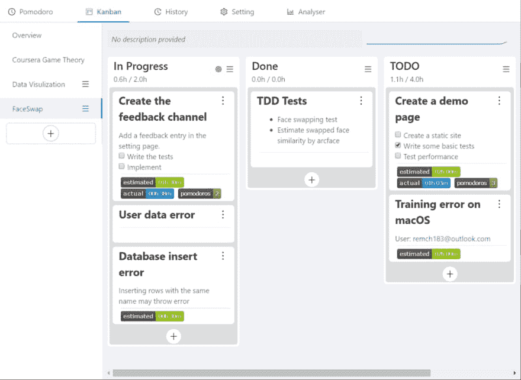
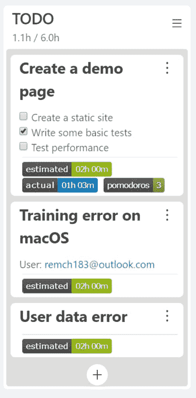
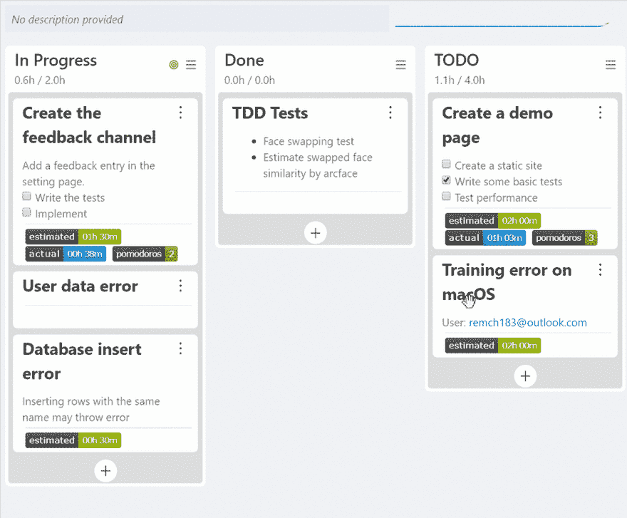
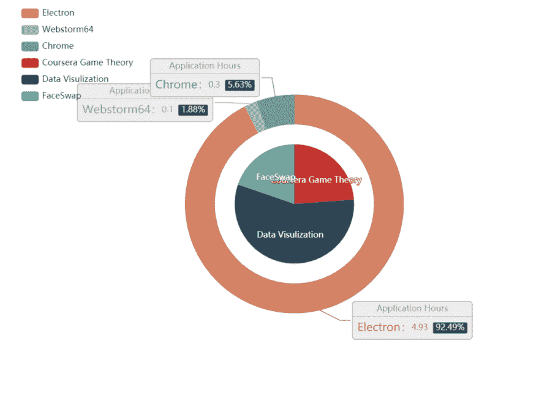
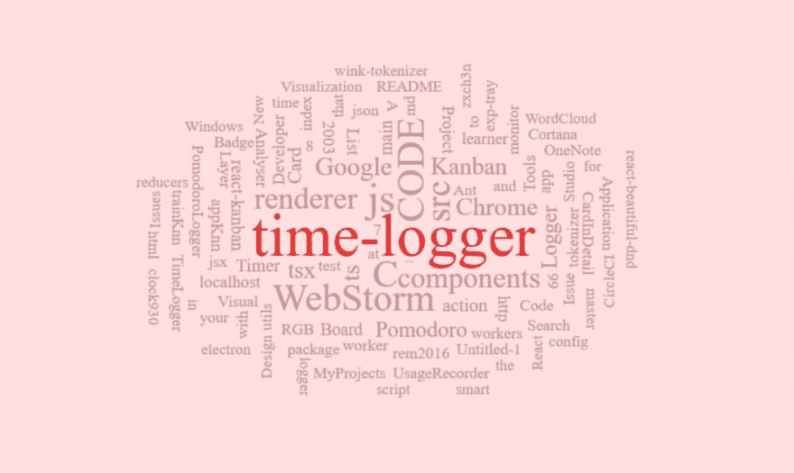

# PomodoroLogger:一个智能时间记录器，帮助你安排你的桌面项目

> 原文:[https://dev . to/zxch3n/pomodorologger-a-smart-time-logger-that-help-you-schedule-your-desktop-projects-431 f](https://dev.to/zxch3n/pomodorologger-a-smart-time-logger-that-helps-you-schedule-your-desktop-projects-431f)

[链接到回购](https://github.com/zxch3n/PomodoroLogger)

> **轻松投资您的时间**

*   使用[番茄工作法](https://en.wikipedia.org/wiki/Pomodoro_Technique)管理你的时间
*   在本地**收集并可视化您的桌面工作活动，即使用应用程序的名称和标题**
*   使用集成看板板使您的进度控制更容易

| **番茄** | **在托盘中显示倒计时** |
| --- | --- |
|  |  |
| **会话结束** | **切换模式** |
|  |  |

| **看板板** | **可拖卡** |
| --- | --- |
|  |  |
| **估计你花费的时间** | **搜索您的卡** |
|  |  |

| **可视化** |
| --- |
|  |
|  |

## 番茄工作法🍅

番茄工作法的工作循环分为 25 分钟的专注时间和 5 分钟的休息时间。在工作会话期间，用户专注于一个待办事项，不应该做任何不相关的事情。番茄工作法可以大大提高工作和学习效率，缓解工作疲劳。

在 Pomodoro Logger 中，该应用程序将记录您在工作会议期间在 PC 上使用的应用程序的名称和标题。应用程序的标题包含丰富的语义信息。例如，浏览器标题包括正在查看的网站的标题，IDE 通常会提供项目路径或项目名称。

*   `Pomodoro Technique - Wikipedia - Google Chrome`
*   `DeepMind (@DeepMindAI) | Twitter - Google Chrome`
*   `pomodoro-logger [C:\code\pomodoro-logger] .\src\renderer\components\src\Application.tsx - WebStorm`

通过将您的 todo 项目与相应的 Pomodoro 记录会话连接，您可以分析您被电子邮件和社交软件打断的频率，应用程序的时间分布以及用于完成任务的应用程序标题。它将帮助你更全面地了解你在 PC 上的工作时间。

# 数据📈

Pomodoro Logger 记录您在 Pomodoro 工作会话时的桌面活动。

它只记录你的应用活动，包括焦点应用的名称和标题，低分辨率(30 x 30)截图。您可以在设置中禁用显示器功能。

您可以导入/导出/删除设置中的所有数据。

所有数据都在本地保存和处理**。**

# 看板板

番茄工作狂已经整合了[看板](https://en.wikipedia.org/wiki/Kanban_board)来帮助你轻松自信地组织和估计你的待办事项所花费的时间。

看板中的清单分为`Todo`、`In Progress`和`Done`。虽然清单定制是可能的，你需要保存`In Progress`清单和`Done`清单，以便跟踪，估计和分析你的项目时间花费。您可以在每张待办事项卡上设置预计时间成本。番茄记录器将帮助你记录相应的实际花费时间。也就是说，当您关注看板时，它会自动将您的 Pomodoro 会话与看板中`In Progress`列表的待办事项卡相关联，这使得进一步的分析成为可能。

为了使统计更加准确，你可以尽可能少地保留`In Progress`列表中的卡片，以准确反映你所关注的任务。

# 下载

这个项目目前支持 Windows 和 macOS。

要下载，请前往[发布页面](https://github.com/rem2016/PomodoroLogger/releases)。

感谢阅读！欢迎反馈。