# 🤯超列表:一个列表来统治他们所有人。19 年 8 月

> 原文：<https://dev.to/xenoxdev/ultra-list-one-list-to-rule-them-all-aug-19-ne2>

嘿嘿嘿，我回来了，我带来了《终极名单》的第六集！上个月太忙了，但我无论如何也不会错过这个。我知道你们喜欢这些资源。😉

让我先从常规的东西开始。这个月有很多东西可以展示。我有一个我们在八月份发布的开源项目，我也想给你们看看，所以请坚持到最后！

### 赠品🎁

重要的事情先来！让我们探索免费的东西。享受吧，别忘了感谢制作者！💝

#### *Fonts*

字体是设计中如此重要的一部分，比大多数人意识到的要多得多。所以让我分享一些我在八月份发现的很酷的免费字体。

**1。奥利弗**由 Freebiesbug👉🏼[链接](https://freebiesbug.com/free-fonts/oliver/)

[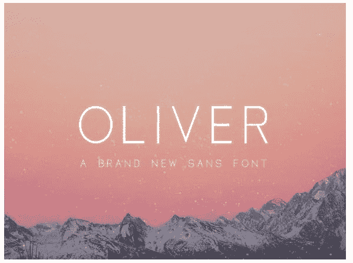](https://res.cloudinary.com/practicaldev/image/fetch/s--3L75w_fG--/c_limit%2Cf_auto%2Cfl_progressive%2Cq_auto%2Cw_880/https://thepracticaldev.s3.amazonaws.com/i/cdncldklt5iw0djwbdra.png)

**2。Suthi Sri FFA 的整体叶盘节奏**👉🏼[链接](https://www.dafont.com/blisk-rhythm.font)

[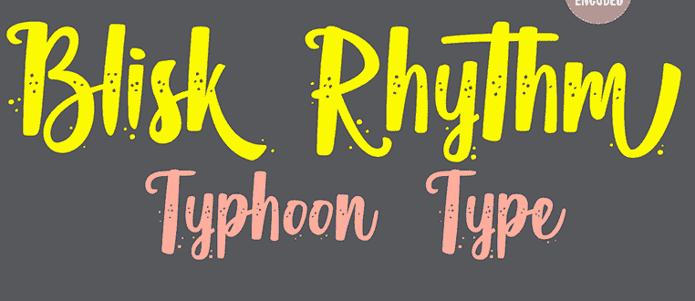](https://res.cloudinary.com/practicaldev/image/fetch/s--GYYwZX2J--/c_limit%2Cf_auto%2Cfl_progressive%2Cq_auto%2Cw_880/https://thepracticaldev.s3.amazonaws.com/i/luhuv1utg2rt11ps5cb7.png)

**3。Shohail Bhuian 的 Mobstex** 👉🏼[链接](https://www.dafont.com/mobstex.font)

[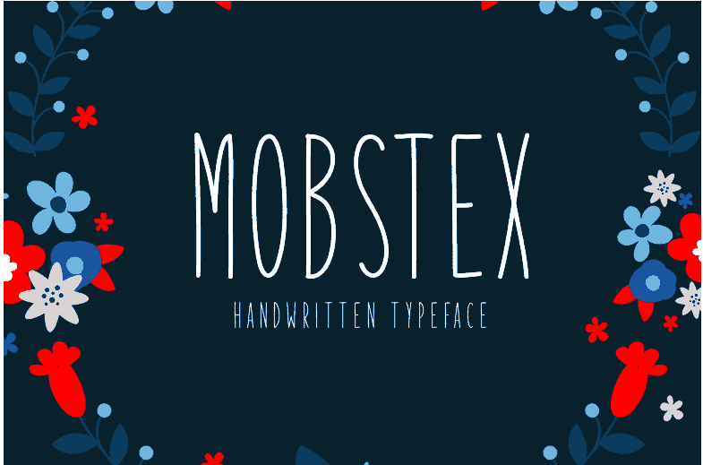](https://res.cloudinary.com/practicaldev/image/fetch/s--O8bQ-EZc--/c_limit%2Cf_auto%2Cfl_progressive%2Cq_auto%2Cw_880/https://thepracticaldev.s3.amazonaws.com/i/4xklrk7act4d2ir9eczy.png)

**4。像素佛的卡玛复古**👉🏼[链接](https://pixelbuddha.net/freebie/free-camar-vintage-font)

* * *

#### *图标*

图标有它们自己的个性，它们经常可以成就或破坏你的设计，所以选择正确的图标是非常重要的。这里有一些很棒的图标包供你探索！

**1。像素佛设置的货币矢量图标**👉🏼[链接](https://freebiesbug.com/free-fonts/oliver/)

[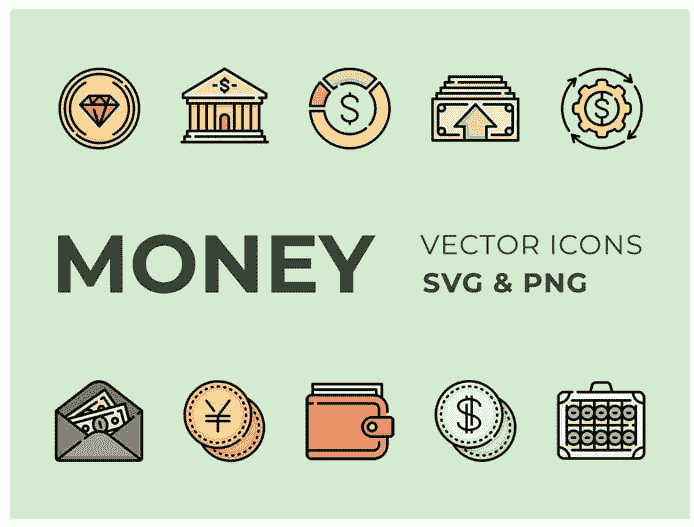](https://res.cloudinary.com/practicaldev/image/fetch/s--ZcSQmlW9--/c_limit%2Cf_auto%2Cfl_progressive%2Cq_auto%2Cw_880/https://thepracticaldev.s3.amazonaws.com/i/jabjh5fcv4307nbfkqzw.png)

**2。Photo3idea 工作室
制作的未来商业图标包**👉🏼[链接](https://www.flaticon.com/packs/future-business-4)

[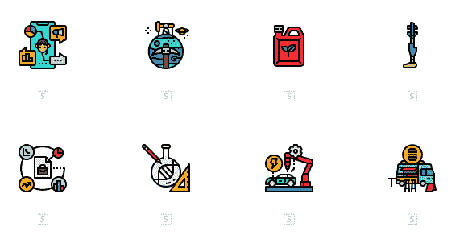](https://res.cloudinary.com/practicaldev/image/fetch/s--bwp6ElFe--/c_limit%2Cf_auto%2Cfl_progressive%2Cq_auto%2Cw_880/https://thepracticaldev.s3.amazonaws.com/i/64hiczhmo9msc9wk2hx4.png)

**3。贝克里斯
的金融科技图标包**👉🏼[链接](https://www.flaticon.com/packs/fintech-24)

[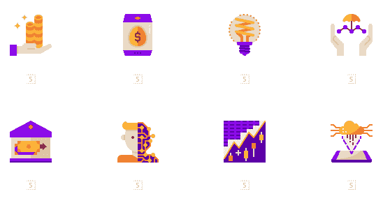](https://res.cloudinary.com/practicaldev/image/fetch/s--qFqeECzk--/c_limit%2Cf_auto%2Cfl_progressive%2Cq_auto%2Cw_880/https://thepracticaldev.s3.amazonaws.com/i/8a39gu9myco5q49r84y3.png)

* * *

#### *杂项*

这里有一些我不能放在其他地方的更好的资源。第二个是我最喜欢的；这么有用！

**1。免费的&开源盖茨比主题**👉🏼[链接](https://themes.lekoarts.de)

[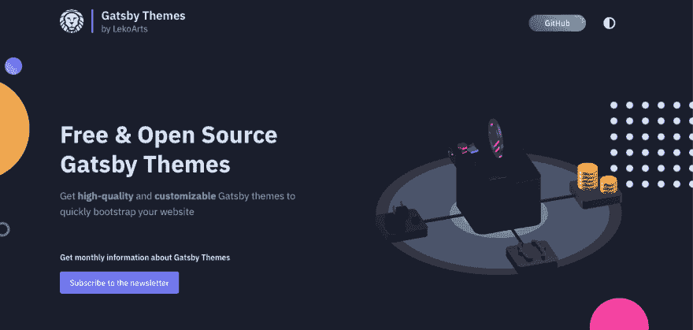](https://res.cloudinary.com/practicaldev/image/fetch/s--OXCW2wCC--/c_limit%2Cf_auto%2Cfl_progressive%2Cq_auto%2Cw_880/https://thepracticaldev.s3.amazonaws.com/i/f3huim0mwjeb6esyjhhl.png)

**2。20 个免费生成器**面向网页设计者和开发者的免费生成器👉🏼[链接](https://designmodo.com/free-generators/)

**3。葡萄牙几何图案**由像素佛👉🏼[链接](https://pixelbuddha.net/freebie/free-portuguese-geometric-patterns/)

[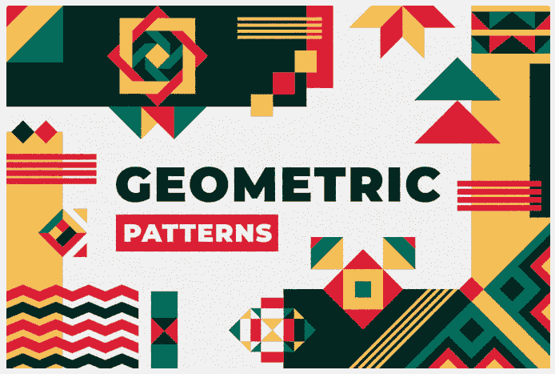](https://res.cloudinary.com/practicaldev/image/fetch/s--y22r2iyR--/c_limit%2Cf_auto%2Cfl_progressive%2Cq_auto%2Cw_880/https://thepracticaldev.s3.amazonaws.com/i/p41gg4hsse65s5owes8n.png)

**4。Avant UI** Avant UI 是一个基于 Bootstrap 框架的开发工具包。👉🏼[链接](https://www.avantui.com)

[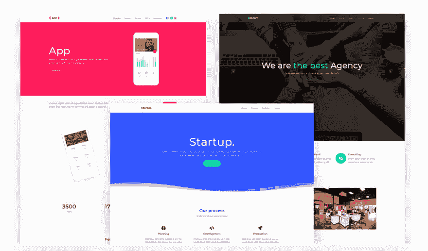](https://res.cloudinary.com/practicaldev/image/fetch/s--4BAt5EHH--/c_limit%2Cf_auto%2Cfl_progressive%2Cq_auto%2Cw_880/https://thepracticaldev.s3.amazonaws.com/i/zoxmef31c7x9gdm8zy9s.png)

**5。Lazy Kit** 一个新的设计系统，开发起来更省力。👉🏼[链接](https://bootstrapbay.github.io/lazy-kit/)

[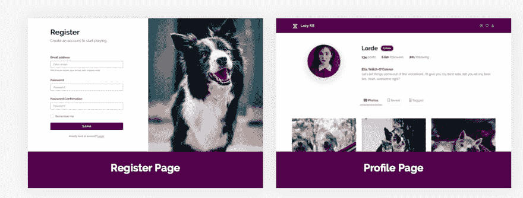](https://res.cloudinary.com/practicaldev/image/fetch/s--XrhVyNgm--/c_limit%2Cf_auto%2Cfl_progressive%2Cq_auto%2Cw_880/https://thepracticaldev.s3.amazonaws.com/i/jjrtburznzuw4q3gmdoq.png)

* * *

### VS 代码素材👩🏻‍💻

是的，不能跳过这一部分。我对 VS 代码的热爱是无止境的。这里有一些你可以用 VS 代码做的很酷的事情！

**1。颜色管理器**颜色选择器和调色板👉🏼[链接](https://marketplace.visualstudio.com/items?itemName=RoyAction.color-manager)

**2。CSS 到 MDN** 👉🏼[链接](https://marketplace.visualstudio.com/items?itemName=dzhavat.css-to-mdn)

**3。蓝莓香蕉**👉🏼[链接](https://marketplace.visualstudio.com/items?itemName=pshershov.blueberry-banana)

[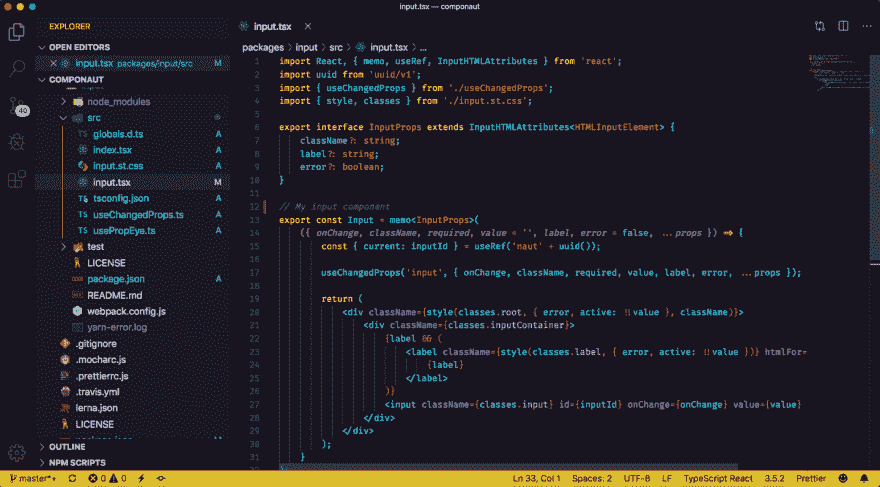](https://res.cloudinary.com/practicaldev/image/fetch/s--FsJDvgZJ--/c_limit%2Cf_auto%2Cfl_progressive%2Cq_auto%2Cw_880/https://user-images.githubusercontent.com/16524839/63062581-2437fe80-bf02-11e9-90ef-2024f2f7992e.png)

* * *

#### *产品*

这里有一些我最近发现的独立产品，我觉得非常酷。

**1。免费文本到语音转换器。👉🏼[链接](https://www.verby.co)**

[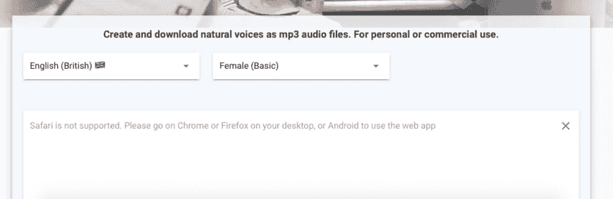](https://res.cloudinary.com/practicaldev/image/fetch/s--UUL4qIrv--/c_limit%2Cf_auto%2Cfl_progressive%2Cq_auto%2Cw_880/https://thepracticaldev.s3.amazonaws.com/i/aid54lwtjyfkmgey4c8o.png)

**2。等距图**为设计师、
初创公司和公司提供免费等距图。👉🏼[链接](https://isometric.online/)

**3。女邮递员** API 请求生成器👉🏼[链接](https://postwoman.io)
这是最近推出的，在 [ProductHunt](https://www.producthunt.com/posts/postwoman-2) 上也得到了很多关注！

[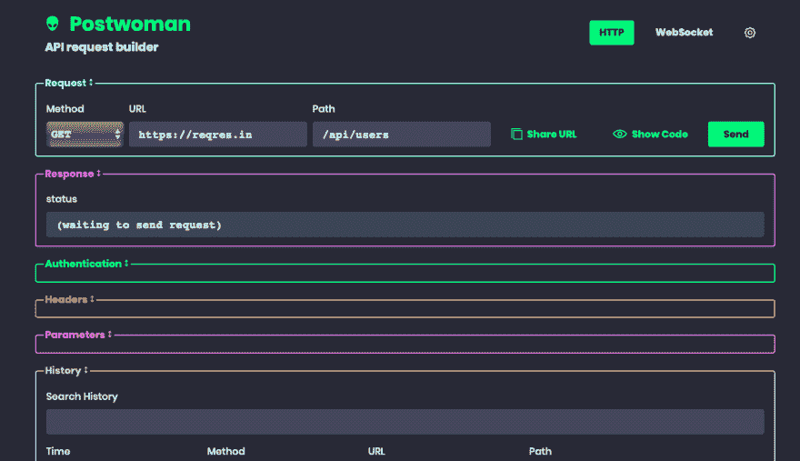](https://res.cloudinary.com/practicaldev/image/fetch/s--wfLbGg9L--/c_limit%2Cf_auto%2Cfl_progressive%2Cq_auto%2Cw_880/https://thepracticaldev.s3.amazonaws.com/i/gkxjz0ojvyj0vqjr1yy9.png)

**4。调色板生成器**创建漂亮的工作配色方案。
👉🏼[链接](https://colors.muz.li)

[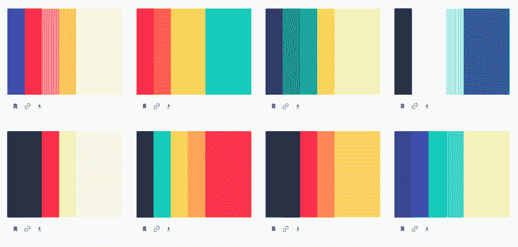](https://res.cloudinary.com/practicaldev/image/fetch/s--jnBoYtxH--/c_limit%2Cf_auto%2Cfl_progressive%2Cq_auto%2Cw_880/https://thepracticaldev.s3.amazonaws.com/i/bat3hruqrkb777j67xzl.png)

* * *

### 图书馆🗃

现在这里有一些东西可以给你的项目增加一点魔力！✨

**1。一个 CSS Houdini 库，让你的网站更加#extra。👉🏼[链接](https://extra-css.netlify.com)**

**2。Lottie** Lottie 是一个适用于 Android、iOS、web 和 Windows 的库，它解析 Adobe After Effects 动画，用 Bodymovin 导出为 json，并在移动设备和 Web 上本地渲染它们！👉🏼[链接](https://github.com/airbnb/lottie)

[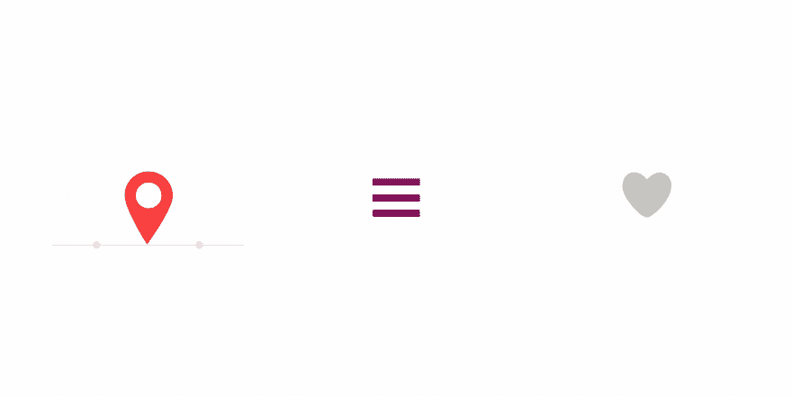](https://res.cloudinary.com/practicaldev/image/fetch/s--xfASQDGd--/c_limit%2Cf_auto%2Cfl_progressive%2Cq_66%2Cw_880/https://thepracticaldev.s3.amazonaws.com/i/7guqbbkumnlyb6czf9fy.gif)

**3。标记为**的降价解析器和编译器。专为速度打造。👉🏼[链接](https://github.com/markedjs/marked)

[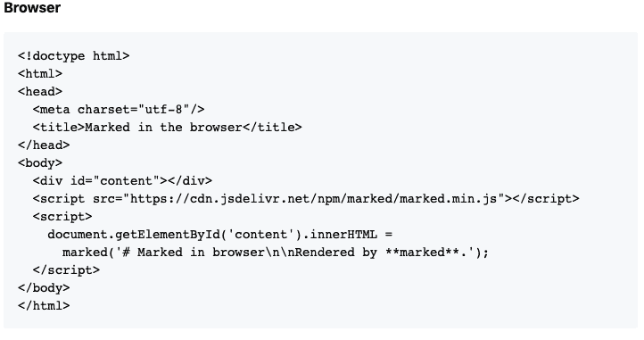](https://res.cloudinary.com/practicaldev/image/fetch/s--_G0ev0hB--/c_limit%2Cf_auto%2Cfl_progressive%2Cq_auto%2Cw_880/https://thepracticaldev.s3.amazonaws.com/i/914o068nbbbegvb9gxhy.png)

* * *

### 指南/备忘单📓

最后，这里有一些指南和备忘单，让你的生活变得轻松。

**1。用普通的 JavaScript 编写一个简单的 MVC 应用程序**👉🏼[链接](https://www.taniarascia.com/javascript-mvc-todo-app/)

[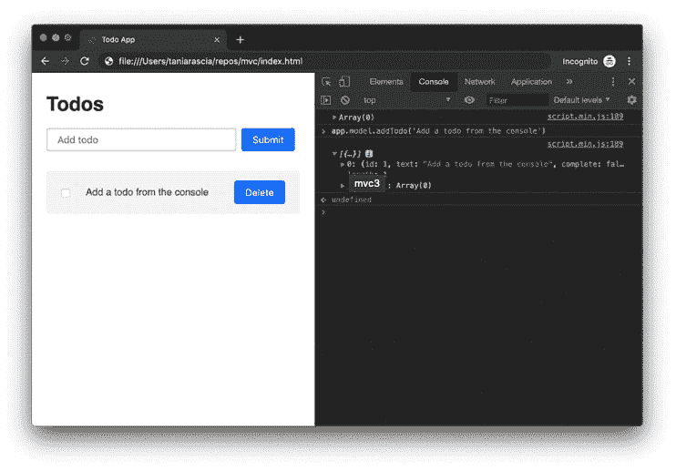](https://res.cloudinary.com/practicaldev/image/fetch/s--1RJ501kv--/c_limit%2Cf_auto%2Cfl_progressive%2Cq_auto%2Cw_880/https://thepracticaldev.s3.amazonaws.com/i/syn6nbvprcdbpayngc1a.png)

**2。JavaScript 中的作用域**

[https://www.youtube.com/embed/5LEuJNLfLN0](https://www.youtube.com/embed/5LEuJNLfLN0)

**3。Noobs 的正则表达式**👉🏼[链接](https://www.janmeppe.com/blog/regex-for-noobs/)

### 来自 XenoX 团队🔥

**1。Brogrammer** 我们最近发布了 Brogrammer。长时间的工作让人们很难摆脱久坐不动的生活方式并保持健康。我能理解那些做大量久坐工作、日常日程中很少有时间锻炼的人。我自己也经历过，很容易陷入非常不健康的模式🙇🏻‍♂️.

Brogrammer 旨在帮助您打破这些模式，将迷你锻炼融入您繁忙的日常工作中。🏃‍♂️:就像点击一个按钮一样简单，这个网络应用程序会不断给你发送提醒📢每隔一段时间进行一次随机锻炼，持续时间为 x，重复次数为 y。如果你想要更多的控制，只需创建自己的挑战，并设置参数，如运动类型、难度、警报频率等。最棒的是。这是开源的🥳🎉🎉就像 Xenox 团队的其他成员一样🔥今年到目前为止已经发行了。

因此，如果你有任何很酷的功能想法，不要等待别人来添加它们。自己造就好！🛠

你可以在这里查看网络应用。👉🏼[链接](http://bit.ly/brogrammer1)

**注:**我想非常明确地声明，这不能代替健康的工作生活平衡和不会让你发疯的日常生活。吃好，保持良好的睡眠习惯，定期锻炼。当你不能去健身房的时候，使用这个应用程序。

#### 但是我们没有忘记反馈！

当产品上线时，我们也在 DEV 上发表了一篇关于它的短文。

## 文章不再可用

我们收到了很多关于产品反响的反馈。你们中的许多人告诉我们，虽然这个想法很好，但它的形象和名称让它看起来只适合男性，这根本不是我们的意图。我们想纠正这一点。因此，我们决定将它的名字改为**brogrammer**。你们对此有什么看法？可以在评论里让我知道。

您也可以在我们的电报频道对此进行投票！快来加入我们，享受每日为您直接提供的精彩开发内容！👉🏼[链接](http://bit.ly/devtg)

[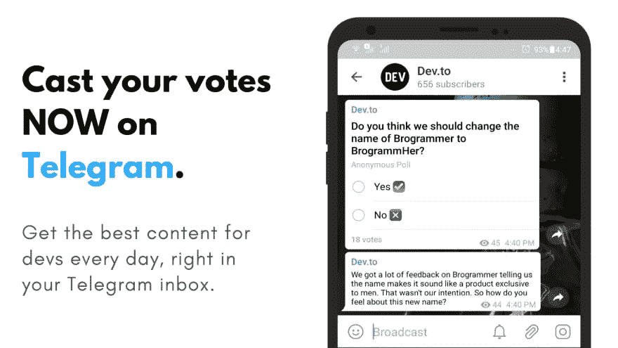](https://res.cloudinary.com/practicaldev/image/fetch/s--kUj4EUcp--/c_limit%2Cf_auto%2Cfl_progressive%2Cq_auto%2Cw_880/https://thepracticaldev.s3.amazonaws.com/i/hxd3v941dmgi6fnpiz6t.png)

### 还有一件事！

你们看过 XenoX 多元宇宙了吗？如果你喜欢我们的工作，加入我们的团队，和我们一起释放开源开发的力量。💪不管你是初学者还是老手，每个人都受欢迎。查看下面如何加入！

##  [【团队异种】](https://github.com/teamxenox) / [异种多篇](https://github.com/teamxenox/XenoXMultiverse)

### 🔥🚀XenoX 集合！！

<article class="markdown-body entry-content container-lg" itemprop="text">

# XenoX 多元宇宙

随着 XenoX 多元宇宙的开始，我们正在使事情正式化。XenoX 团队最初是我的梦想，只是一个开发人员的小团队，为了好玩而从事开源项目。但几个月来，它变得越来越大，越来越强。因此，我想正式宣布团队 XenoX 开源计划。这是 XenoX 上所有项目和所有合作开发人员的主列表。

如果你也想成为开源英雄，只需写下你的名字，你就可以加入并开始贡献自己的力量！

## 如何加入团队？💪🏼

1.  叉回购。
2.  把你的名字加到这个文件上。
3.  提交拉取请求。

就是这样。你都准备好了。团队中会有人联系你，正式欢迎你加入团队。干杯！

## 接缝

*   萨尔萨克·夏尔马 <g-emoji class="g-emoji" alias="fire" fallback-src="https://github.githubassets.cimg/icons/emoji/unicode/1f525.png">🔥</g-emoji>
*   [乌特卡什塔尔瓦尔](https://github.com/sarthology)🎸
*   [拉杰特·夏尔马](https://github.com/sharmarajat01) <g-emoji class="g-emoji" alias="headphones" fallback-src="https://github.githubassets.cimg/icons/emoji/unicode/1f3a7.png">🎧</g-emoji>
*   [rajesh main Ali](https://github.com/Stereoraj)
*   帕万 …

</article>

[View on GitHub](https://github.com/teamxenox/XenoXMultiverse)

## 感谢

好了，这次到此为止，伙计们。希望你喜欢这个。下期帖子再见！如果你喜欢这篇文章，把它分享给你的朋友和家人，他们会从中受益。如果你想在下一篇文章中加入一些你自己的东西，请在 Twitter 上发消息给我。或者有什么建议，欢迎在下面评论。