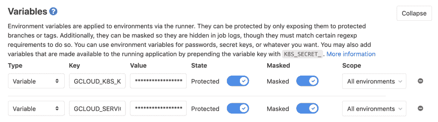
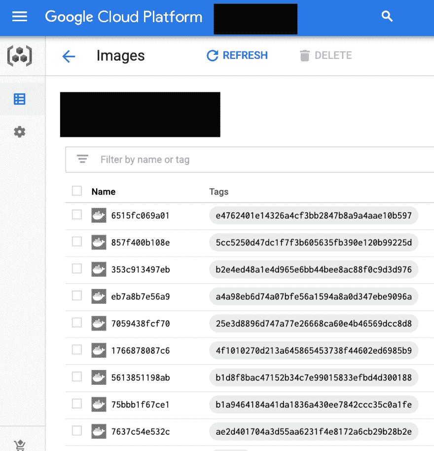

# 在 gitlab ci 上构建 docker 映像，并将其发布到 google 容器注册表

> 原文:[https://dev . to/rhanarion/build-a-docker-image-on-git lab-ci-and-publish-it-to-Google-container-registry-6 h8](https://dev.to/rhanarion/build-a-docker-image-on-gitlab-ci-and-publish-it-to-google-container-registry-6h8)

在之前的博客文章中，我解释了我自己项目的个人云概念([Kubernetes for side projects](https://rhazn.com/posts/kubernetes-for-sideprojects-hardware-is-dead/))以及我如何设置它([用 Traefik、Let's encrypt 和 Zookeeper](https://rhazn.com/posts/run-a-personal-cloud-with-traefik-lets-encrypt-and-zookeeper/) 运行个人云)。我还展示了我如何用 docker 打包一个 PWA 项目([在 docker](https://rhazn.com/posts/build-a-progressive-web-app-in-docker-with-nginx-to-deploy-to-kubernetes-or-docker-swarm/) 中构建一个 PWA)。

所有这些要素都已准备就绪，要解决的最后一个障碍是自动构建 docker 映像，并将其发布到私有容器注册中心，这样我就可以从那里将它部署到我的云中。

# [](#overview)概述

该设置的目标是:

*   使用 gitlab ci 从任何 git 散列构建 docker 映像
*   将 docker 映像推送到用 git hash 标记的 google 容器注册中心
*   更新 personal cloud 项目中的 kubernetes 服务描述，以获取新的 docker 映像

# [](#permissions)权限

为了让 gitlab 代表我们执行这些操作，我们需要设置服务帐户。我们需要

*   一个允许 gitlab 上传一个新的 docker 图像到容器注册表的帐户
*   允许 it 在 personal cloud registry 中更改我们的 kubernetes 设置的帐户

你可以在谷歌云的“IAM & admin”->“服务账户”部分创建这些服务账户。确保下载并保存生成的 json 文件。

我们还需要允许 personal cloud 项目从不同项目的容器注册表中提取 docker 映像。为此，我关注了 Alexey Timanovskiy 的这篇出色的博客文章([使用单个 Docker 库和多个 GKE 项目](https://medium.com/google-cloud/using-single-docker-repository-with-multiple-gke-projects-1672689f780c))。

# [](#publish-a-docker-image-with-gitlab-ci)用 gitlab ci 发布 docker 镜像

要允许 gitlab ci 使用您的服务帐户，您需要在后端将 json 文件的内容保存为 base64 编码的变量。您可以在“设置”->“CI/CD”->“变量”下找到设置。请小心使用这些数据，因为它与安全相关。此处的变量将在作业过程中作为环境变量使用。

[T2】](https://res.cloudinary.com/practicaldev/image/fetch/s--enBgINx4--/c_limit%2Cf_auto%2Cfl_progressive%2Cq_auto%2Cw_880/https://rhazn.com/img/posts/build-a-docker-image-on-gitlab-ci-and-publish-it-to-google-container-registry/gitlab-ci-variables.png)

我使用下面的 gitlab ci 阶段来构建和发布一个项目。请注意，它仅手动运行，并用于主服务器。在这种情况下，它使用保存在 GCLOUD_SERVICE_KEY:
中的服务帐户

```
publish:
  stage: publish
  image: docker:19.03.1
  services:
    - docker:dind
  variables:
    DOCKER_DRIVER: overlay
  script:
    - echo $GCLOUD_SERVICE_KEY | base64 -d > ${HOME}/gcloud-service-key.json
    - docker login -u _json_key --password-stdin https://eu.gcr.io < ${HOME}/gcloud-service-key.json
    - docker build -t eu.gcr.io/projectid/app:${CI_COMMIT_SHA} .
    - docker push "eu.gcr.io/projectid/app:${CI_COMMIT_SHA}"
  only:
    - master
  when: manual 
```

<svg width="20px" height="20px" viewBox="0 0 24 24" class="highlight-action crayons-icon highlight-action--fullscreen-on"><title>Enter fullscreen mode</title></svg> <svg width="20px" height="20px" viewBox="0 0 24 24" class="highlight-action crayons-icon highlight-action--fullscreen-off"><title>Exit fullscreen mode</title></svg>

最后一步，您可以更新 kubernetes 对服务的描述来部署它。我在这里写了这个过程:[https://rhazn . com/posts/deploy-to-Google-kubernetes-engine-using-git lab-ci/](https://rhazn.com/posts/deploy-to-google-kubernetes-engine-using-gitlab-ci/)

[T2】](https://res.cloudinary.com/practicaldev/image/fetch/s--X-CLUv2m--/c_limit%2Cf_auto%2Cfl_progressive%2Cq_auto%2Cw_880/https://rhazn.com/img/posts/build-a-docker-image-on-gitlab-ci-and-publish-it-to-google-container-registry/tagged-images.png)

# [](#about-me)关于我

我是一个全栈开发者和数字产品爱好者，我可以自由工作，并总是在寻找下一个令人兴奋的项目:)。

你可以通过电子邮件(pheltweg@gmail.com 或者推特 https://twitter.com/rhanarion T2 联系我。