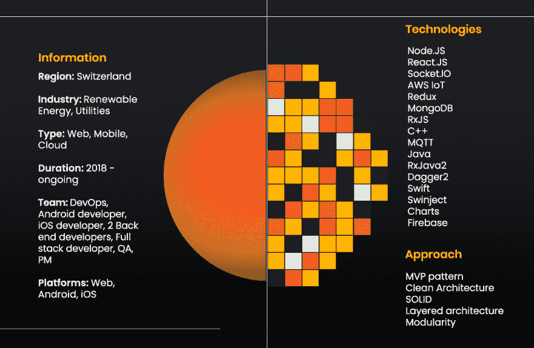
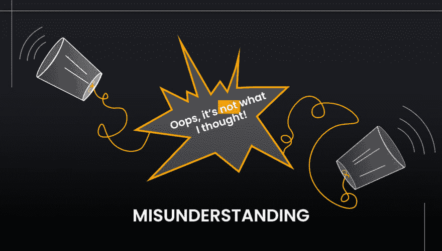
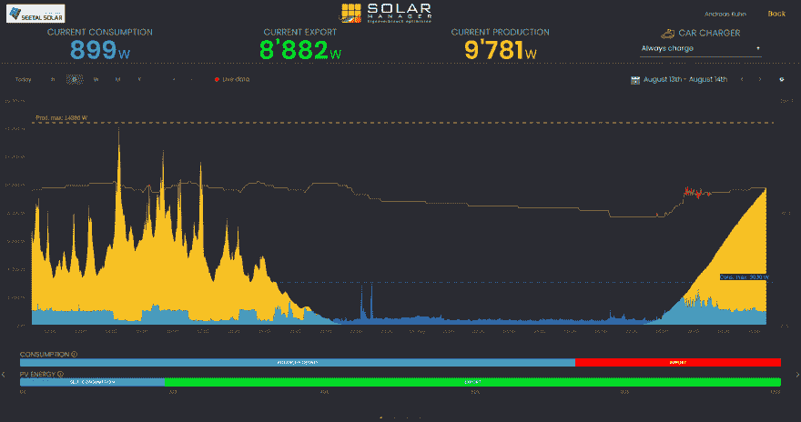

# 我们如何创建物联网系统来管理太阳能使用

> 原文:[https://dev . to/indeem software/how-we-created-IOT-system-for-managing-solar-energy-usage-5ale](https://dev.to/indeemasoftware/how-we-created-iot-system-for-managing-solar-energy-usage-5ale)

如果你对物联网解决方案背后的开发架构和机械/电气设计一无所知，它们可能看起来“似乎具有超自然的品质或力量”。例如，如果你向 18 世纪的人展示一个正在工作的物联网系统，他们会觉得这很神奇。这篇文章打破了这样的神话。或者，更专业地说，是关于为太阳能管理领域的一个令人敬畏的项目微调物联网开发的提示。

**剧透**:没有咒语，只有开发快速便捷服务的分析思路。

免责声明:我们不提供万能的解决方案(它根本不存在)，只分享我们认为重要的东西。这些点可能是致命的特征，相反，它们的忽视可能会杀死它。双关有意；)

## 引入物联网系统，用于可视化和优化太阳能消耗

我们有幸参与了一个改善自生能源使用的项目。核心在于为安装公司和终端客户可视化和优化光伏(PV)系统的使用。因此，当[太阳能管理器](https://www.solarmanager.ch/)被安装成一个中央枢纽，用于在家用设备之间分配产生的太阳能时，您使用了最大限度的自产能源。

[T2】](https://res.cloudinary.com/practicaldev/image/fetch/s--gAYn0I3K--/c_limit%2Cf_auto%2Cfl_progressive%2Cq_auto%2Cw_880/https://indeema.cimg/articles/How-we-created-IoT-system-for-managing-solar-energy-usage/1.png)

我们已经写了关于使用太阳能的商业前景，现在让我们深入研究技术挑战和发展的暗示。

## 绝对先决条件

在我们开始之前，让我们弄清楚。有一点**适用于每一个项目，无论是物联网系统还是简单的落地。**

 **在你完全了解你想要达到的目标之前，不要开始实施(每个人都了解)。

没有什么是显而易见的。不，没有心灵感应，也没有人能读懂你的想法。澄清、讨论，确保你们在同一页上。

[T2】](https://res.cloudinary.com/practicaldev/image/fetch/s--PJjpql06--/c_limit%2Cf_auto%2Cfl_progressive%2Cq_auto%2Cw_880/https://indeema.cimg/articles/How-we-created-IoT-system-for-managing-solar-energy-usage/2.png)

当然，如果你不想花两倍的时间和金钱。

## 使命

那么，我们有什么输入呢？灵活的连接和集中的远程固件，具有不同 UX 和权限集的 5 个用户角色，转换和分析数据，大量的请求，以及锦上添花的是，在图表上绘制大量的时间价值数据。

## 实施能源消耗物联网系统的挑战和细节

说到开发，有三件事最重要:稳定性、相关性和速度。尤其是当项目需要一个整体架构的时候。这就是为什么整体逻辑、所有用户流和数据库设计应该尽可能简单和优化。老实说，在 2019 年，没有人愿意因为“你的数据正在处理中”而等待 40 秒。因此，以下是我们参考的物联网平台问答列表:

*   架构符合需求和规范吗？
*   你将如何转换、处理和分析收集到的数据？
*   父子 MVC/MVP 层之间的最优关系是什么？那么，它们能在不被中断的情况下进行缩放吗？
*   是否有执行类似/相邻功能的模块？它们能组合成一个单一的多用途模块吗？这会引入或降低复杂性吗？
*   阶段之间的沟通是最优的吗？
*   如何在可视化之前缓存数据？
*   对于每个用户角色，用户体验(UX)是否简单明了？

分裂需要分配的，联合相似的。但是，不要将这与创建解决几个任务的大型类混淆。相反，为一个单一的任务创建小的。对于复杂任务，创建几个类，每个类解决一个子任务，另一个类将使用这些子任务。

*   ###智能构建物联网解决方案

这里的 Smart 指的是创建快速的、可伸缩的、优化的和可持续的、符合项目需求的项目架构。此时出现的基本问题是:

1.  最简单直接的架构流程是什么？
2.  如何让每个角色的用户体验最简单？
3.  我们能否修改初始架构以获得更好的可扩展性和性能优化？

对于 web 应用程序，这涉及到分层模型视图控制器(HMVC)的设计。例如，为了更好地分配资源和提供更快的响应，需要处理 API、后端、前端和边缘之间的连接。配置云-本地通信，存储和传输数据，以便快速获得正确的响应(你好，明显队长！).

[T2】](https://res.cloudinary.com/practicaldev/image/fetch/s--bHO6u-Cl--/c_limit%2Cf_auto%2Cfl_progressive%2Cq_auto%2Cw_880/https://indeema.cimg/articles/How-we-created-IoT-system-for-managing-solar-energy-usage/3.png)

*   ###设计数据库时考虑性能

永远不要低估考虑数据库(DB)设计的重要性。这也适用于数据库中集合之间的关系。您有许多实体，它们以各种方式交互，因此将所有相关的逻辑连接放在一个地方是至关重要的。

因此，当您手头有了初始结构时，请确定:

1.  这是该集合的最佳关系类型(一对一、一对多、多对多)吗？它解决任务的效率最高吗？
2.  它与特定屏幕上的任务的对应程度如何？
3.  它是否适合项目的总体架构？

优化每个模块背后的逻辑，并确保保留总体架构。仔细考虑权限集。然后再思考优化。记住要设置连接类型，这样对于每个任务，你都可以在一个地方获得所有需要的信息，并正确处理请求。

例如，假设您的数据库是一家快餐店。你有很多客户，你需要快速准确地提供他们点的食物。否则你的生意就完了。DBs 也是如此。是的，有几十个集合，你需要同时从其中的 7-8 个收集数据。因此，设计关系，使它们在逻辑上相互关联，并快速返回响应。

物联网系统就像一个餐厅。不要让顾客等着。

[T2】](https://res.cloudinary.com/practicaldev/image/fetch/s--76fciEc2--/c_limit%2Cf_auto%2Cfl_progressive%2Cq_auto%2Cw_880/https://indeema.cimg/articles/How-we-created-IoT-system-for-managing-solar-energy-usage/4.jpg)

照片由[德鲁·乔里安](https://unsplash.com/@dgilliam?utm_source=unsplash&utm_medium=referral&utm_content=creditCopyText)在 [Unsplash](https://unsplash.com/search/photos/kitchen?utm_source=unsplash&utm_medium=referral&utm_content=creditCopyText) 上拍摄

*   ###如何绘制海量数据

还记得网站加载几分钟的时候吗？我们已经看到一些应用程序的仪表盘加载速度更慢。这是不允许的。

图表是一种新常态。数据可视化通常用于 SCADA、IoT 和任何分析项目，这是有原因的。看到能源消耗、市场趋势、空气中的二氧化碳以及任何其他可以测量的东西(通常是随着时间的推移)的峰值会给人留下生动的印象。你看，你理解，你行动。借助大规模数据阵列的文本呈现，您的眼睛将很快变得模糊。

因此，挑战在于如何快速绘制具有大量价值-时间对的图表。在用户看到图表上的数据之前，系统必须确定绘制图表的所有点。我们进行了大量的头脑风暴来确定如何缓存数据，以便绘制一个包含 50K+数据-值对的图表花费不到 2 秒钟。

[T2】](https://res.cloudinary.com/practicaldev/image/fetch/s--fDqxxR23--/c_limit%2Cf_auto%2Cfl_progressive%2Cq_auto%2Cw_880/https://indeema.cimg/articles/How-we-created-IoT-system-for-managing-solar-energy-usage/5.png)

## 从无到有，再到生产，再到超越

除了 web 应用程序，我们还开发 iOS 和 Android 应用程序，用于移动安装、监控和访问。

在物联网系统上工作时，要记住的重要事情是保持简单性和可扩展性。典型的 5 阶段物联网架构应该经过深思熟虑，不会带来任何多余的复杂性。

随着每个产品的发展，您必须考虑在不中断现有功能的情况下分层新功能的方法。当然，永远不要忘记单元测试。

## 离下水不到一年

自 2018 年 10 月推出以来，太阳能管理器已被瑞士领先的光伏批发商和安装公司采用和使用。

通过审查和优化能源使用习惯，消费者可以充分利用他们的 PV，从而节省成本。根据德勤公司的说法，在更大的全球范围内，这种解决方案使太阳能与传统能源相比更具竞争力。这反过来又使它对其他住宅消费者和企业具有吸引力。最后，这难道不是我们期待的智能城市的基础吗？

## 任何物联网项目成功的背后

创造成功的产品没有“终极指南”。首先，每个项目都是独一无二的，都有自己的挑战。第二，即使你已经在这个领域做了很多项目，技术和市场需求也在变化。所以你两年前甚至半年前的经历可能与现在不相关。

尽管如此，我们还是不厌其烦地说预先警告就是预先武装。所以这里有一些我们的经验，可能会有用:

*   [调查如何节省您的时间并降低风险](https://indeema.com/blog/internet-of-things-development--5-steps-to-creating-your-project)
*   [如何根据您要到达的市场定制开发](https://indeema.com/blog/b2c--b2b-specifics-of-developing-iot-products)
*   [游戏](https://indeema.com/blog/how-can-you-use-iot-in-game-industry)、[汽车](https://indeema.com/blog/how-can-you-use-iot-in-automotive)、[零售](https://indeema.com/blog/how-can-you-use-internet-of-things-in-retail---5-examples)、[农业](https://indeema.com/blog/iot-application-in-agriculture--5-real-examples)、[工业](https://indeema.com/blog/6-promissing-applications-for-the-industrial-iot)等物联网机会。
*   [物联网的十大传感器是什么](https://indeema.com/blog/top-10-iot-sensors)

您还可以查看我们的 GitHub，获取大量用于物联网开发的免费[开源工具。](https://github.com/IndeemaSoftware)

心中有想法，并希望深入了解技术细节？[与我们的专家取得联系](https://indeema.com/contact-us)，这样我们就可以找到开发的最佳方法和工具。**