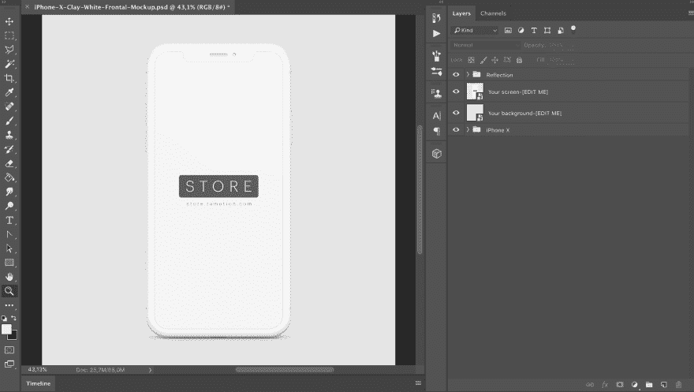
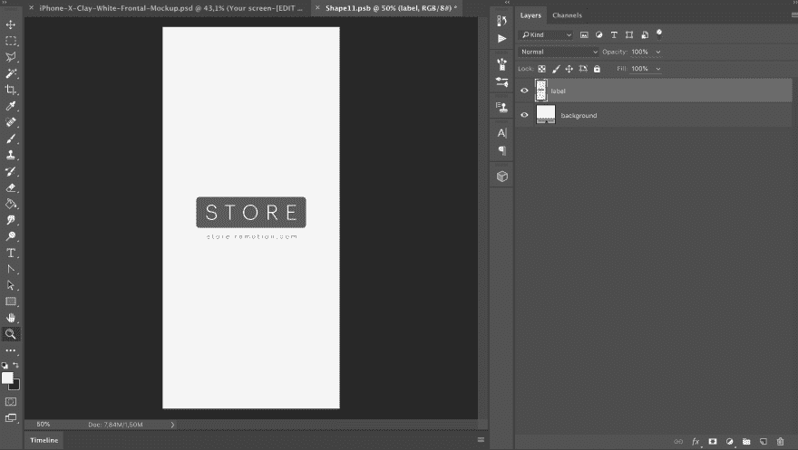
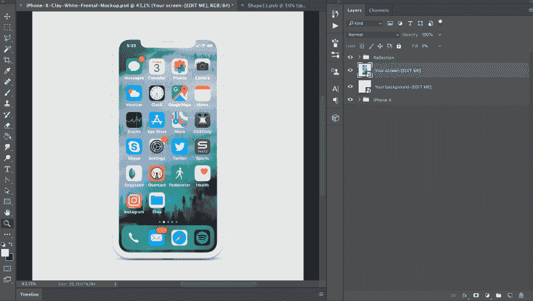

# 什么是 iPhone 设备模型模板？(以及如何使用一个)

> 原文：<https://dev.to/ramotiondev/what-is-an-iphone-device-mockup-template-and-how-to-use-one-ogd>

如果客户能够想象出一个设计在现实生活中的样子，他们就更有可能认可或购买这个设计。在一个快节奏的商业决策成为常态的世界里，设计师能够快速展示真实的模型比以往任何时候都更加重要。

由于这些模型可能是批准和犹豫不决的区别，所以最好的做法是准备好大量的模型，以备不时之需。

在这个简短的指南中，我们将带你通过一个三步的过程，了解如何找到，理解和使用你的优势模型文件。

## 步骤#1:识别和下载

你可以在网上找到几乎所有你需要的东西，对于模型文件也是如此。有大量的免费和付费文件，我们建议查看这两个选项，看看哪一个最适合你。

一旦你找到你想要的，下载文件。大多数模型文件都包含一个带有. psd 的文件夹。jpg 和 a .txt 或者。pdf 文件。让我们来分解一下他们的目的:

*   的。psd 文件是源文件，您将在其中编辑内容并使其成为您自己的内容
*   的。jpg 文件是最终模板的预览，看看它完成后会是什么样子
*   的。txt 或者。pdf 概述了文件的详细信息，如谁制作了它，许可信息和它所代表的内容

让我们以 iPhone 样机为例来看看:

在这个解压缩后的文件中，我们看到了前面提到的多种文件格式。

## 第 2 步:打开文件并找到智能对象

现在你已经下载并解压了文件，是时候在 Adobe Photoshop 中打开它并熟悉图层了。

了解如何编辑图层非常重要，因为您很快就会用模板中的元素替换自己的设计。

大多数实体模型至少由三层组成:背景颜色、对象本身以及用于标记或徽标的空间。当然，这些层可以根据模板中对象的数量以及您希望演示文稿的简单或复杂程度而有所不同。

找到不同图层的一个简单方法是在 Photoshop 中单击眼睛图标来切换显示。

要编辑您的智能对象，请单击它，使它充满整个窗口。

## 智能对象

智能对象是一种永远不会失去其质量的对象，无论您对其进行多大的调整或更改。它由矢量或光栅图像组成，是以 Illustrator 或 Photoshop 文件格式创建的图像数据层。它旨在安全地存储图像特征，而不管所做的编辑，因此有“智能”一词。

智能对象是非栅格化文件。这是什么意思？

栅格化是将充满点和曲线的矢量图像(Illustrator 文件)转换为计算机或打印友好的像素化版本以供显示的操作。某些工具，如橡皮擦、油漆桶和滤镜，只适用于栅格化文件。

智能对象没有栅格化，因为栅格化的过程意味着您无法在不损失质量的情况下缩放图像，并且您也失去了编辑文字或字体的能力；设计师编辑实体模型模板的一项重要任务。

要定位智能对象，请在图层上寻找一个小图标，通常位于右下角。当您将鼠标悬停在它上面时，将弹出显示文本，表明您在智能对象上。

## 第三步:放置你的内容

最后一步是将您的定制设计变成现实。

在包含智能对象的编辑窗口中，只需将您的设计拖到框架中，用您自己的作品取代模型内容。

点击保存并返回到原来的 PSD 文件查看您的修改。

更新后的文件将如下所示:

如果您有任何自定义副本要添加，现在是时候了。一旦完成，准备好用你设计的真实复制品让你的客户惊叹吧！

在这个例子中，我们使用的是 [iPhone X 样机](https://store.ramotion.com/product/iphone-x-clay-mockups)

## 最后的想法

原型模板帮助你的客户想象他们的设计在现实世界中会是什么样子。它们非常容易找到和使用，并能改变你的设计被接受的方式。

你觉得样板对你的客户关系有帮助吗？请联系我们的团队让我们知道。