# 用 GraphQL 和 Hasura 构建 Instagram 克隆——第一部分

> 原文:[https://dev . to/hasura HQ/building-a-insta gram-clone-in-react-with-graph QL-and-hasura-part-I-1deb](https://dev.to/hasurahq/building-a-instagram-clone-in-react-with-graphql-and-hasura-part-i-1deb)

[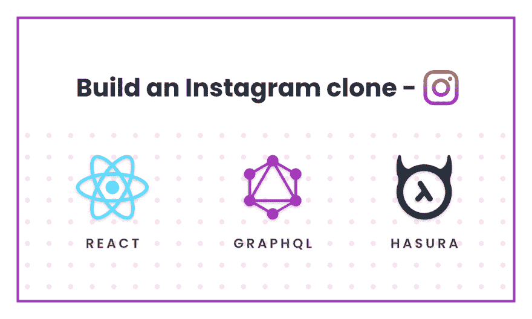T2】](https://res.cloudinary.com/practicaldev/image/fetch/s--CrRNGIsz--/c_limit%2Cf_auto%2Cfl_progressive%2Cq_auto%2Cw_880/https://blog.hasura.io/conteimg/2019/09/Instagram-clone.png)

*本教程由 [Abhijeet Singh](https://github.com/abhi40308) 撰写，并作为 [Hasura 技术作者计划](https://blog.hasura.io/the-hasura-technical-writer-program/)的一部分发布，该计划旨在支持为开源 Hasura GraphQL 引擎编写指南和教程的作者。*

# [](#introduction)简介

在本教程中，我将向你展示如何使用 **Hasura GraphQL 引擎**和 **React** 来构建 Instagram web 应用的克隆。最终代码在[这里](https://github.com/abhi40308/instagram-clone)托管。点击查看应用[的现场演示。](https://instagram-1919.herokuapp.com/)

该应用程序将具有以下功能:

*   用户可以创建帐户(使用 Auth0 身份验证)
*   经过身份验证的用户可以上传新帖子
*   经过验证的用户可以喜欢帖子
*   经过身份验证的用户可以跟踪用户帐户
*   在订阅源中显示帖子
*   当其他用户投票支持一个帖子、创建一个新帖子或关注用户配置文件时进行实时更新(使用 react 状态管理和更新 apollo 缓存)

## [](#initial-setup)初始设置

让我们从使用 React 构建应用程序的前端开始。

为了快速入门，我们将使用 [**create-react-app**](https://github.com/facebook/create-react-app) 创建一个没有构建配置的基本 react 应用。在终端中运行以下命令:

```
$ npx create-react-app instagram-clone
$ cd instagram-clone
$ npm start 
```

<svg width="20px" height="20px" viewBox="0 0 24 24" class="highlight-action crayons-icon highlight-action--fullscreen-on"><title>Enter fullscreen mode</title></svg> <svg width="20px" height="20px" viewBox="0 0 24 24" class="highlight-action crayons-icon highlight-action--fullscreen-off"><title>Exit fullscreen mode</title></svg>

> **注:npx** 是一个 **npm** 包裹运送者。典型的用途是暂时下载并运行一个包**或**进行试用。create-react-app 是一个 **npm** 包，预计在项目的生命周期中只运行一次。因此，最好使用 **npx** 在一个步骤中安装并运行它。([来源](https://stackoverflow.com/questions/50605219/difference-between-npx-and-npm))

服务器将启动，您应该能够在 [http://localhost:3000](http://localhost:3000/) 上看到一个欢迎反应屏幕(*如下图*)。

[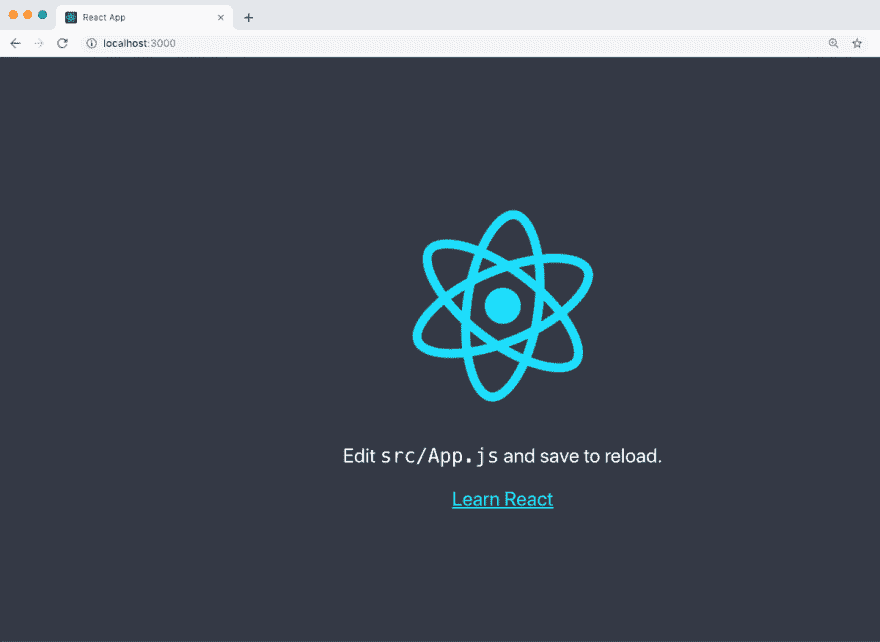T2】](https://res.cloudinary.com/practicaldev/image/fetch/s--yOi8NojX--/c_limit%2Cf_auto%2Cfl_progressive%2Cq_auto%2Cw_880/https://blog.hasura.io/conteimg/2019/09/image.png)

为了改进项目结构，让我们创建两个目录，都在 src 文件夹中。第一个名为`components`，将包含我们所有的 React 组件。第二个`styles`，是所有你要使用的 CSS 文件。

将所需的`jsx`和`css`文件移动到适当的目录中，并相应地更改`index.js`和`App.js`中对这些文件的引用。你的目录结构应该是这样的:

```
├── node_modules
├── package.json
├── public
│ ├── favicon.ico
│ ├── index.html
│ └── manifest.json
├── src
│ ├── App.test.js
│ ├── components
│ │ └── App.js
│ ├── index.js
│ ├── logo.svg
│ ├── serviceWorker.js
│ └── styles
│ ├── App.css
│ └── index.css
└── README.md 
```

<svg width="20px" height="20px" viewBox="0 0 24 24" class="highlight-action crayons-icon highlight-action--fullscreen-on"><title>Enter fullscreen mode</title></svg> <svg width="20px" height="20px" viewBox="0 0 24 24" class="highlight-action crayons-icon highlight-action--fullscreen-off"><title>Exit fullscreen mode</title></svg>

我将使用 [**react-bootstrap**](https://react-bootstrap.github.io/getting-started/introduction/) 包进行造型。使用
安装软件包

```
$ npm install react-bootstrap bootstrap 
```

<svg width="20px" height="20px" viewBox="0 0 24 24" class="highlight-action crayons-icon highlight-action--fullscreen-on"><title>Enter fullscreen mode</title></svg> <svg width="20px" height="20px" viewBox="0 0 24 24" class="highlight-action crayons-icon highlight-action--fullscreen-off"><title>Exit fullscreen mode</title></svg>

确保将 CDN 链接添加到`/public/index.html`中的样式表。从[T2 复制链接到这里 T4。](https://react-bootstrap.github.io/getting-started/introduction/)

同样使用以下命令安装[**react-Apollo**](https://github.com/apollographql/react-apollo)graph QL 客户端:

```
$ npm install apollo-boost apollo-link-context @apollo/react-hooks @apollo/react-hoc graphql 
```

<svg width="20px" height="20px" viewBox="0 0 24 24" class="highlight-action crayons-icon highlight-action--fullscreen-on"><title>Enter fullscreen mode</title></svg> <svg width="20px" height="20px" viewBox="0 0 24 24" class="highlight-action crayons-icon highlight-action--fullscreen-off"><title>Exit fullscreen mode</title></svg>

**Apollo Client** 帮助你从前端消费一个 **GraphQL API** 。

接下来，我们将使用 **Hasura GraphQL 引擎**和 **Postgres** 设置后端。

参见[本](https://docs.hasura.io/1.0/graphql/manual/getting-started/heroku-simple.html)指南，通过一键部署快速入门运行在 Heroku 上的 Hasura GraphQL 引擎和 Postgres。

# [](#setting-up-the-backend)设置后端

我们的 Postgres 数据库结构:

```
type Post {
    id - integer, primary key
    caption - text
    url - text
    created_at - timestamp with time zone
    user_id - text
}

type User {
    name - text
    last_seen - timestamp with time zone
    avatar - text
    email - text
    id - text, primary key
}

type Like {
    id - integer, primary key
    user_id - text
    post_id - integer
}

type Follow {
    id - integer, primary key
     follower_id - text
    following_id - text
} 
```

<svg width="20px" height="20px" viewBox="0 0 24 24" class="highlight-action crayons-icon highlight-action--fullscreen-on"><title>Enter fullscreen mode</title></svg> <svg width="20px" height="20px" viewBox="0 0 24 24" class="highlight-action crayons-icon highlight-action--fullscreen-off"><title>Exit fullscreen mode</title></svg>

<figure>[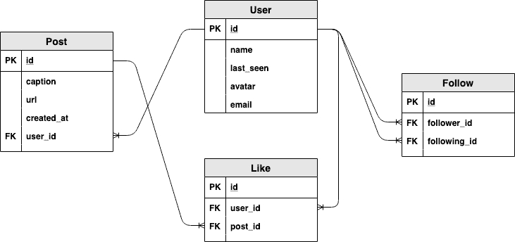](https://res.cloudinary.com/practicaldev/image/fetch/s--XFzsl9IP--/c_limit%2Cf_auto%2Cfl_progressive%2Cq_auto%2Cw_880/https://blog.hasura.io/conteimg/2019/09/image-1.png) 

<figcaption>数据库结构</figcaption>

</figure>

### [](#creating-tables)创建表格

创建以下表格:`User`表格

<figure>[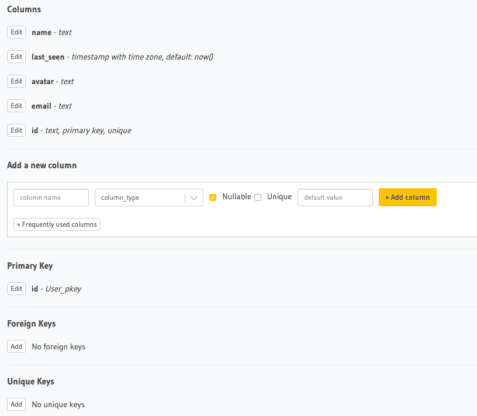](https://res.cloudinary.com/practicaldev/image/fetch/s--q6249p2v--/c_limit%2Cf_auto%2Cfl_progressive%2Cq_auto%2Cw_880/https://blog.hasura.io/conteimg/2019/08/user-table_1.png) 

<figcaption>用户表</figcaption>

</figure>

`Post`表(`id`有类型`integer(autoincrement)`):

<figure>[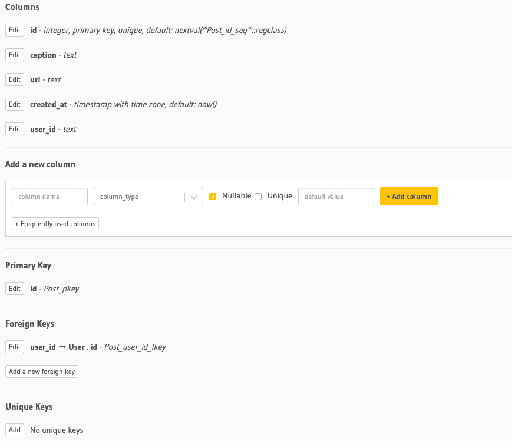](https://res.cloudinary.com/practicaldev/image/fetch/s--5fyYr6AF--/c_limit%2Cf_auto%2Cfl_progressive%2Cq_auto%2Cw_880/https://blog.hasura.io/conteimg/2019/08/post-table_1.png) 

<figcaption>岗位表</figcaption>

</figure>

将外键约束从`user_id`列添加到`User.id`。将`Update`和`Delete`违例设为`restrict`。

`Like`表(`id`有类型`integer(autoincrement)`):

<figure>[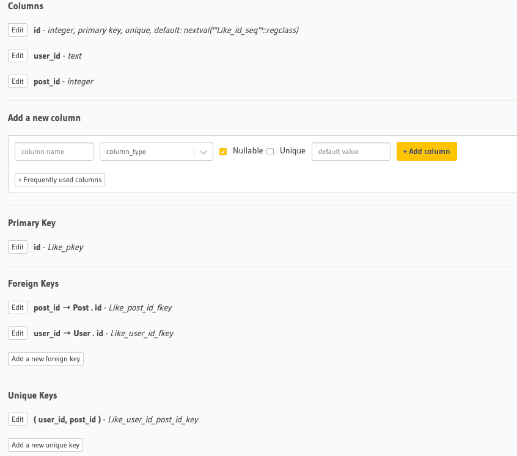](https://res.cloudinary.com/practicaldev/image/fetch/s--oSs6W_VN--/c_limit%2Cf_auto%2Cfl_progressive%2Cq_auto%2Cw_880/https://blog.hasura.io/conteimg/2019/08/like-table_1.png) 

<figcaption>像表</figcaption>

</figure>

`Follow`表(`id`有类型`integer(autoincrement)`):

<figure>[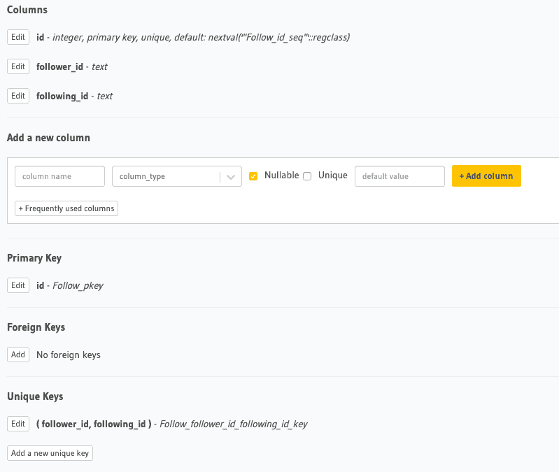](https://res.cloudinary.com/practicaldev/image/fetch/s--7q7EnJKz--/c_limit%2Cf_auto%2Cfl_progressive%2Cq_auto%2Cw_880/https://blog.hasura.io/conteimg/2019/08/follow-table_1.png) 

<figcaption>跟表</figcaption>

</figure>

通过跳转到表的关系部分来创建一个`object`关系。这些关系将帮助我们在单个查询中查询数据，并执行各种聚合功能，如获取每个用户的帖子数量。参见[此](https://docs.hasura.io/1.0/graphql/manual/schema/relationships/create.html#step-1-add-foreign-key-constraint)链接，通过 hasura 中的外键创建关系。我们只需要以下关系。

<figure>[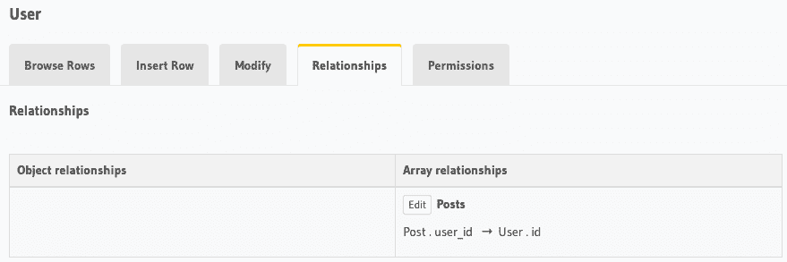](https://res.cloudinary.com/practicaldev/image/fetch/s--ohi5v2fb--/c_limit%2Cf_auto%2Cfl_progressive%2Cq_auto%2Cw_880/https://blog.hasura.io/conteimg/2019/08/user-table_2.png) 

<figcaption>用户表</figcaption>

</figure>

<figure>[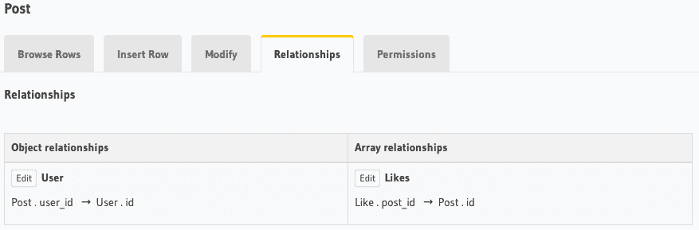](https://res.cloudinary.com/practicaldev/image/fetch/s--7wwc71xy--/c_limit%2Cf_auto%2Cfl_progressive%2Cq_auto%2Cw_880/https://blog.hasura.io/conteimg/2019/08/post-table_2.png) 

<figcaption>岗位表</figcaption>

</figure>

现在，我们将设置表的权限，以便只有登录的用户才能执行某些操作。如下所示设置权限:

<figure>[](https://res.cloudinary.com/practicaldev/image/fetch/s--Jlb8ptpC--/c_limit%2Cf_auto%2Cfl_progressive%2Cq_auto%2Cw_880/https://blog.hasura.io/conteimg/2019/08/user-table_2-1.png) 

<figcaption>用户表</figcaption>

</figure>

<figure>[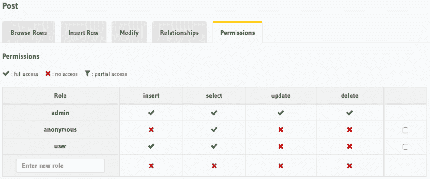](https://res.cloudinary.com/practicaldev/image/fetch/s--zLPTMhp7--/c_limit%2Cf_auto%2Cfl_progressive%2Cq_auto%2Cw_880/https://blog.hasura.io/conteimg/2019/08/post-table_3.png) 

<figcaption>岗位表</figcaption>

</figure>

<figure>[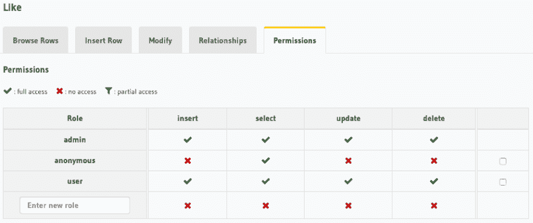](https://res.cloudinary.com/practicaldev/image/fetch/s--0nCQGhZS--/c_limit%2Cf_auto%2Cfl_progressive%2Cq_auto%2Cw_880/https://blog.hasura.io/conteimg/2019/08/like-table_3.png) 

<figcaption>像表</figcaption>

</figure>

<figure>[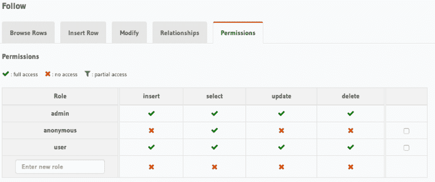](https://res.cloudinary.com/practicaldev/image/fetch/s--QTWjPXKD--/c_limit%2Cf_auto%2Cfl_progressive%2Cq_auto%2Cw_880/https://blog.hasura.io/conteimg/2019/08/follow_table2.png) 

<figcaption>跟表</figcaption>

</figure>

如果你不太熟悉 hasura 中的访问控制及其工作原理，请参见[访问控制基础知识](https://docs.hasura.io/1.0/graphql/manual/auth/authorization/basics.html)。

[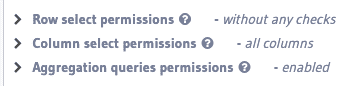T2】](https://res.cloudinary.com/practicaldev/image/fetch/s--vsksigGr--/c_limit%2Cf_auto%2Cfl_progressive%2Cq_auto%2Cw_880/https://blog.hasura.io/conteimg/2019/08/permissions-1.png)

为了使它不那么复杂，我将所有行级别的权限设置为没有任何检查，将列级别的权限设置为所有列和聚合查询(用于计算一篇文章的点数)。

# [](#using-auth0-jwt-for-authentication)使用 Auth0 JWT 进行认证

下图快速解释了`JWT`认证是如何工作的。这里，需要配置应用服务器(我们的后端)来验证传入的`JWT`是由认证服务器(Auth0)创建的。( [*来源*](https://medium.com/vandium-software/5-easy-steps-to-understanding-json-web-tokens-jwt-1164c0adfcec) )

[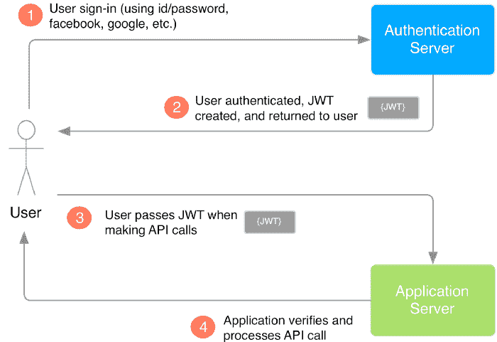T2】](https://res.cloudinary.com/practicaldev/image/fetch/s--qOJPwjJz--/c_limit%2Cf_auto%2Cfl_progressive%2Cq_auto%2Cw_880/https://blog.hasura.io/conteimg/2019/09/image-2.png)

我们使用 Auth0 作为认证服务器。它将创建一个`JWT`并传递给我们的 react 应用程序。然后，使用 apollo 客户端，我们将把`auth_token`(在我们的例子中是`access_token`)发送到我们的后端(应用服务器)，即 Hasura GraphQL 引擎。需要配置 Hasura 来验证传入的 JWT 是由 Auth0 身份验证服务器创建的。

让我们从 Auth0 开始，使用`@apollo/react-hooks`和`@auth0/auth0-spa-js`。我们必须遵循以下步骤:

**Auth0 JWT 与哈苏拉**集成:参见[本](https://docs.hasura.io/1.0/graphql/manual/guides/integrations/auth0-jwt.html)指南，了解 Auth0 JWT 与哈苏拉的集成，并获取 JWK(用于验证传入 JWT 的密钥)。在 Auth0 dashboard 中，将`Allowed Callback URLs`、`Allowed Web Origins`、`Allowed Logout URLs`设置为 [http://localhost:3000](http://localhost:3000/) 并保存更改。

您可能还需要在`Auth0 > Applications > Your_app > Settings > Advanced Settings`中禁用 OIDC 一致性。一旦你有了钥匙，下一步就是激活哈苏拉的 JWT 模式。进入 heroku 仪表盘，选择我们的应用程序，然后进入设置。在这里，您可以看到一些我们现在要设置的`Config Vars`。添加配置变量，如下所示:

[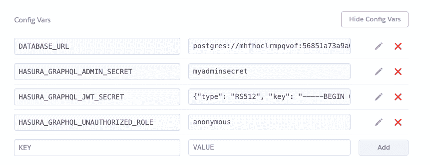T2】](https://res.cloudinary.com/practicaldev/image/fetch/s--D97FhEI8--/c_limit%2Cf_auto%2Cfl_progressive%2Cq_auto%2Cw_880/https://blog.hasura.io/conteimg/2019/09/image-3.png)

这里，`HASURA_GRAPHQL_ADMIN_SECRET`键为 JWT 模式工作。将密钥放在`HASURA_GRAPHQL_JWT_SECRET`环境变量中。一旦添加了这个，GraphQL 端点只能使用`Authorization`头或`X-Hasura-Admin-Secret`头来查询。

最后，将`HASURA_GRAPHQL_UNAUTHORIZED_ROLE`设置为`anonymous`,因为我们确实允许未经认证的用户读取一些数据。

> ***未授权角色:*** *在仅访问密钥模式下不发送访问密钥或在 JWT 模式下没有“授权”报头时使用。例如:* `anonymous` *。现在，每当“授权”头缺失时，请求的角色将默认为“匿名”。*

下一步是在我们的 Auth0 应用程序中添加规则。我们将向 Auth0 应用程序添加 2 条规则，如下所示: